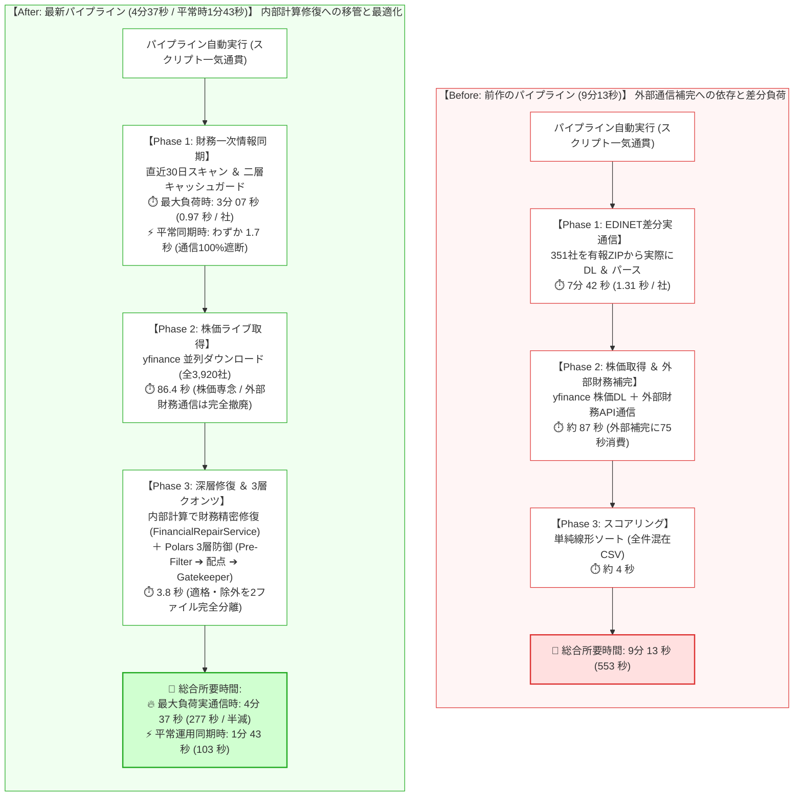
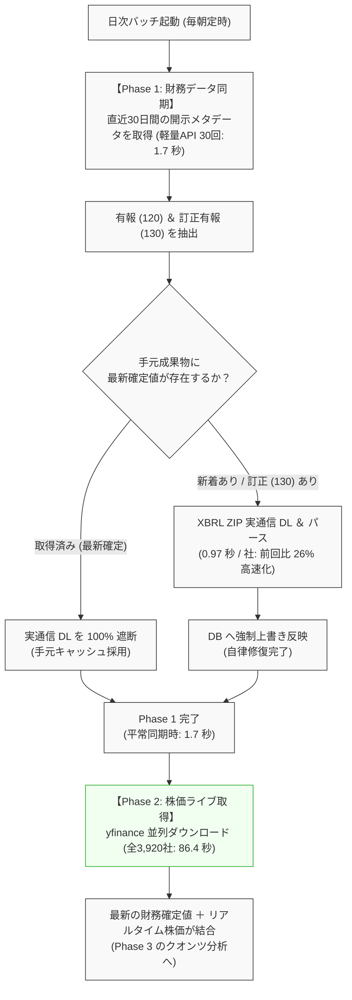

# 【10分の壁突破から半年】東証全銘柄パイプラインを9分から4分へ半減させた設計思想――直近30日差分スキャンと耐障害性の対比【前編】

## 概要

本記事は、東証全上場銘柄（約3,900社）の財務開示データおよび株価を取得・分析するデータパイプラインにおいて、**「時系列整合性（Temporal Consistency）」** と **「耐障害性（Fail-Safe / Self-Healing）」** を確立した設計転換の記録です。

前作[『【完結編】10分の壁を突破せよ！全4,400銘柄の財務データ・価格・順位付けを9分台で完遂するTurboパイプラインの全貌』](https://qiita.com/akkyey/items/9a808e45a2abe8f0f0a1)では、並列ダウンロードと非対称パースによって**「9分13秒での完走」**を達成しました。
しかし、本稼働環境で日次運用を継続する過程で、速度至上主義の設計が孕む「時系列欠損」と「開示訂正の未反映」という重大な構造的欠陥に直面しました。

本稿では、前作の設計を根本から見直し、「速度の追求」から「整合性を最上位基準とする設計」へ転換したプロセスを記述します。

### 📊 前回記事（第4弾）からの進化・改善対比マトリクス

本記事で解説する主な改善点と、前作からの進化は以下の通りです。

| 評価・比較項目 | 前回記事（第4弾：9分台達成時） | 今回の設計（最新アーキテクチャ） | 改善効果・もたらされた価値 |
| :--- | :--- | :--- | :--- |
| **パイプライン完遂時間<br>（実通信DL時）** | **9分 13 秒** (553.0 秒)<br>（351社実通信DL＋分析） | **4分 37 秒** (277.5 秒)<br>（194社実通信DL＋分析） | **約 2.0 倍 高速化（所要時間を約半分に半減）** |
| **平常運用時の同期時間<br>（差分同期・手元DBあり）** | **約 1 分半** (91.28 秒)<br>（直近数日チェック＋yfinance補完＋単純ソート） | **1 分 43 秒** (103.9 秒)<br>（**直近30日完全スキャン[1.7秒]**＋厳格3層分析） | **同等時間（約1分半）のまま、「30日の自動復旧安全網 ＆ 訂正自己修復」へと耐障害性が飛躍** |
| **EDINET 1社あたり<br>DL＆パース実効速度** | 約 **1.31 秒** / 社<br>（462秒 / 351社） | 約 **0.97 秒** / 社<br>（187.3秒 / 194社） | **約 26% 高速化（I/O待ちとパース処理の最適化）** |
| **スキャン範囲と<br>耐障害性 (Fail-Safe)** | **単日〜短期間の受動スキャン**<br>（停止期間中の開示は恒久ロスト） | **直近30日ローリングスキャン**<br>（最大30日の停止から自動キャッチアップ） | **バッチ障害・連休明けも人手不要で自動完全復旧** |
| **訂正有報 (130) への対応<br>(Self-Healing)** | **未対応**<br>（後日出された訂正値が反映されず誤記が残留） | **自動検知 ＆ UPSERT自己修復**<br>（最新提出日時の確定値を強制上書き） | **データの歪みを自律修復し、財務数値の正確性を保証** |
| **財務データソースの純度** | **EDINET (88.8%) ＋ yfinance補完 (11.2%)**<br>（ハイブリッド運用。IPOや変則決算等の498社をyfinanceで外部補完） | **EDINET公式確定値に 100% 一本化**<br>（外部財務補完を完全撤廃。財務はEDINET一次情報確定値のみ） | **日米基準差や外部API起因のデータの歪みを排除し、財務純度を100%へ** |
| **市場価格・出来高の取得<br>(Phase 2)** | **yfinance 並列取得 (約 87 秒)**<br>（株価OHLCV取得 ＋ 498社の財務補完通信が同居） | **yfinance 並列取得 (86.4 秒)**<br>（**株価OHLCV・出来高・流動性判定専用に純化** / 財務通信ゼロ） | **本来の強みである市況取得に専任させ、全3,920社を爆速取得** |
| **財務欠損の補完・修復責務** | **外部通信レイヤーに配置**<br>（yfinance `.financials` を叩いて498社補完: 約75秒の通信遅延と欠損） | **内部計算レイヤーへ移管 (Deep Repair)**<br>（EDINET確定値からPolarsベクトル演算でPER逆算・自己資本比率をミリ秒修復） | **外部通信待ちを完全排除し、論理的恒等式に基づく確実な自己修復へ進化** |

---

## 第1章：設計仮定の明示

前作[『【完結編】10分の壁を突破せよ！全4,400銘柄の財務データ・価格・順位付けを9分台で完遂するTurboパイプラインの全貌』](https://qiita.com/akkyey/items/9a808e45a2abe8f0f0a1)において、システムはスクリプトによる一気通貫の自動実行により、**総合所要時間 9分13秒（553.0秒）** で完走させることに成功しました。

前作の時点で、財務データの主軸は金融庁EDINETの公式確定値へと移行しており、**全4,437社中 3,939社（88.8%）をEDINET公式値**でカバーしていました。
当時のパイプラインの内訳は以下の通りでした。
- **Phase 1: EDINET差分実通信取得（7分42秒）**: 直近30日間の新着書類（351社）を有報ZIPから実際にダウンロード＆パース（約1.31秒/社）
- **Phase 2: yfinance株価取得 ＆ 財務補完通信（約87秒）**: 東証全銘柄の株価並列ダウンロード、およびEDINETから漏れたIPO・変則決算等498社の外部財務API補完（約75秒）
- **Phase 3: スコアリング ＆ 出力（約4秒）**: Polarsによる単純ランキング（全件を1つのCSVに出力）

前作では「EDINET 88.8% ＋ yfinance 11.2% のハイブリッド」によって9分台での一気通貫完走を達成したものの、その設計には以下の暗黙的な仮定が存在していました。

### 従来の設計仮定
- **高負荷差分通信の容認**: 30日分の新着書類を検知した際、毎回300社以上の巨大ZIP実通信ダウンロード（7分42秒）が発生することを前提としていた（通信遮断キャッシュの未徹底）
- **外部通信によるハイブリッド補完の前提**: EDINET未提出の銘柄や欠損指標は、通信レイヤーでyfinanceの財務API（`.financials`）を叩いて補完すれば十分であるとする前提（残り11.2%を外部通信で強引に埋める設計）
- **単純線形スコアリングの前提**: 取得したデータをそのまま単一の加重平均式で並べ替えれば、投資判断として成立するとする前提

### 🔄 パイプライン全体の Before / After 対比



---

## 第2章：観測された不整合

前作のパイプラインを運用し続ける中で、以下の再現可能な課題と不整合が観測されました。

### 1. 取得済み有報に対する再ダウンロード通信の無駄
前作ではキャッシュ管理が不徹底であり、すでに手元に確定データが存在している銘柄であっても、直近30日のリストに含まれていると再び有報ZIPのダウンロード通信が走り、パイプラインの実行時間が無駄に延伸していました。

### 2. 訂正有価証券報告書（130）の自動修復欠落
企業が本決算を提出した数日〜数週間後に提出する「訂正有価証券報告書（docTypeCode 130）」が検知された際、既存の誤記データを確実に最新値へと上書き（UPSERT）する自己修復機構が不十分でした。

### 3. 残り11%に対する外部API（yfinance）財務補完の通信遅延と歪み
前作ではEDINETの有報優先フィルタから漏れた銘柄（IPO直後、変則決算、REIT等）や欠損指標を埋めるため、Phase 2の通信レイヤーで全4,437社中498社（11.2%）に対してyfinanceの財務API（`.financials`）を逐次叩くハイブリッド補完を行っていました。
しかし、この外部通信補完は以下の2つの致命的な問題を引き起こしていました。
- **通信オーバーヘッドの肥大化**: 498社の財務APIポーリングに約75秒もの通信待ちが発生していた
- **会計基準の差異と欠損**: 日本の会計基準（J-GAAP/IFRS）と米国式データフォーマットの不整合により、取得できたとしても定義のズレや欠損が多発し、データの信頼性を損ねる主因となっていた

---

## 第3章：仮定の破綻

観測された課題は、以下の設計上の破綻を示しています。

### 「通信とパースの力技」の限界
通信並列度を高めて7分42秒まで縮めたとしても、**「そもそも落とす必要のない確定書類を落としている」**という根本的な通信の無駄を排除しなければ、真の高速化と金融庁サーバーへの負荷低減は達成できません。

### 外部補完による整合性維持の破綻
公式一次情報（EDINET）の欠損を二次情報（yfinance）の通信で埋めようとする設計は、通信オーバーヘッドを増大させるだけでなく、データの整合性と計算精度を根本から揺るがすアンチパターンでした。
補完すべきは「外部から取ってくること」ではなく、**「手元にある確定値（純資産、総資産、株価、発行済株式数等）から、内部計算（Polarsベクトル演算）によって論理的恒等式に基づき厳密に導出・修復すること」**だったのです。
また、それでも確定値が存在しない銘柄（IPO直後等）は、安易に外部推計値で埋めるのではなく、「計算不能銘柄」として潔く隔離すべきでした。

---

## 第4章：再定義（設計転換）

本アーキテクチャでは、設計の最上位基準を「スクリプトの高速化」から**「自律的に時系列整合性を修復する統合パイプライン」**へと再定義しました。

### 整合性基準設計の原則
- **日次バッチとバックフィルの境界を完全撤廃する**
- **毎朝の定期実行そのものが「過去30日間の安全網」を自律展開する**
- **取得済み有報の再取得通信は物理的に遮断（1.7秒で通過）する**
- **財務データはEDINET一次情報に100%一本化する**
- **財務指標の修復責務を外部通信から内部計算レイヤーへ移管する**

この思想に基づき、以下の4大原則を制定しました。

### 新たな設計原則
1. **統合ローリングスキャン原則**:
   - 日次パイプラインの取得層に、従来のバックフィル機能（直近30日スキャン）を完全内包させる
   - 万が一バッチが数週間停止しても、次回の定時実行で停止期間中の全開示および訂正報告書（130）が自動同期される
2. **二層キャッシュガード原則**:
   - 30日分の書類メタデータ（30回のリクエスト）は毎朝確実にポーリングする（所要時間: わずか 1.7秒）
   - 手元成果物がすでに存在する銘柄は、巨大なXBRL ZIPのダウンロードを100%遮断する
3. **適材適所のハイブリッド役割分離原則 (EDINET財務 ＆ yfinance市場価格)**:
   - **EDINET（財務確定値の専任）**: 企業のファンダメンタルズ（純利益・純資産・総資産・発行済株式数等）は金融庁公式一次情報に100%一本化し、前作で残存していた11.2%（498社）のyfinance財務API（`.financials`）呼び出し（約75秒）を完全撤廃する
   - **yfinance（市場ライブデータの専任）**: 日々の株価・出来高データ（OHLCV）は、マルチスレッド並列処理（`yf.download(threads=True)`）が得意な **yfinance に専任させて継続採用（Phase 2）** し、全3,920社を86秒で取得する
   - **流動性・テクニカル判定の担保**: スクリーニング第1層（Pre-Filter）で超小型・無出来高銘柄を足切るための「25日平均売買代金（5,000万円基準）」や「現在株価」は、yfinanceの市場データから算出する
4. **財務補完の責務移管原則（通信補完から内部計算修復へ）**:
   - 財務補完処理をデータ取得レイヤー（外部通信）から完全に切り離し、分析評価レイヤー（Phase 3）の内部Polars計算（`FinancialRepairService`）へ移管する
   - 外部通信による遅延（約75秒）を完全ゼロ化し、EDINET一次情報の確定値から自己資本比率の逆算やPERの精密修復をミリ秒で完遂する

### 💡 コラム：なぜ yfinance を完全廃止せず使い続けるのか？

「yfinanceの財務補完を撤廃したのなら、なぜyfinance自体を完全に捨てないのか？」という疑問を持たれるかもしれません。
その理由は、**「株価・出来高データの並列ダウンロードにおいて、yfinanceが圧倒的に優秀だから」**です。

```text
■ EDINET と yfinance の明確な役割境界
-------------------------------------------------------------------------------------
データ種別        | 採用ソース   | 取得内容                          | 役割と目的
-------------------------------------------------------------------------------------
財務諸表 (Fact)   | EDINET       | 有価証券報告書 (XBRL確定値)       | 1円単位で正確なファンダメンタルズ
市場価格 (Market) | yfinance     | リアルタイム株価・出来高 (OHLCV)  | 全3,920銘柄を86秒で取得・流動性判定
-------------------------------------------------------------------------------------
```

前作で問題だったのは「yfinanceを財務データの穴埋め（`.financials`）に使ったこと」であり、yfinance本来の強みである「株価履歴（OHLCV）の並列ダウンロード」は極めて高速です。
東証全3,920社の株価・出来高をわずか**86.4秒**で一括取得できる性能は、日次パイプラインの市況取得エンジンとして不可欠なピースとなっています。



---

## 第5章：実装原理（核心のみ）

設計転換を具現化するための実装上の核心は、**「超軽量メタデータスキャン」** と **「成果物照合による通信遮断」** の分離構造にあります。

### 1. 30日メタデータポーリングと成果物照合
EDINET API v2 の仕様上、特定日の書類一覧（JSON）は数KB〜数十KBの極めて軽量なペイロードです。
これに対し、個別の有価証券報告書（XBRL ZIP）は数MB〜数十MBに達します。
この非対称性を利用し、メタデータ取得と実体ZIP取得を完全に分離します。

```python
# 核心ロジック：成果物ガードと新着・訂正判定
class TurboAcquisitionManager:
    def evaluate_target(self, doc_id: str, code: str, doc_type: str) -> bool:
        """手元成果物の検証を行い、実通信ダウンロードが必要かを判定する。"""
        local_result_path = os.path.join(self.results_dir, f"{code}.json")
        
        # 1. ローカルに成果物が存在しない場合は新規取得
        if not os.path.exists(local_result_path):
            return True
        
        # 2. 訂正報告書 (docTypeCode 130) の場合、タイムスタンプを検証して自己修復
        if doc_type == "130":
            return self.is_newer_than_stored(code, doc_id)
            
        # 3. 取得済みかつ通常有報であれば通信を完全遮断
        return False
```

### 2. 訂正報告書の優先適用決定木
同一決算期において複数の開示が存在する場合、提出日時（`submitDateTime`）が最新の書類を絶対的な正として採用します。
これにより、財務諸表の修正情報が人手を介さずに自律的にDBへと反映されます。

### 3. 財務補完の責務移管：外部通信から内部Polars計算（Deep Repair）へ
前作で約75秒を消費していた外部API（yfinance）による財務補完通信（`.financials`）を全廃しました。
代わりに、Phase 3の評価層においてPolarsのベクトル演算を活用した**内部深層修復（Deep Repair）エンジン**を配置しました。

```python
# 核心ロジック：外部通信を行わず、手元の確定値からミリ秒で逆算・自己修復
class FinancialRepairService:
    """財務データの修復とクレンジングを行うサービス (v10: Polars Native Edition)。

    yfinance の .financials 通信に頼らず、EDINET から取得した確定値（Fact）を基に
    PER の精密修復、黒字転換判定、自己資本比率の逆算をベクトル演算で高速に実行する。
    """
    @staticmethod
    def repair(df: pl.DataFrame) -> pl.DataFrame:
        """手元のEDINET確定値およびライブ株価から、欠損指標を論理的恒等式で導出・修復する。"""
        cols = df.columns
        
        # [Step 1] 自己資本比率 (Equity Ratio) の精緻化 (D/Eレシオからの恒等式逆算)
        if "equity_ratio" in cols and "debt_equity_ratio" in cols:
            df = df.with_columns([
                pl.when(
                    pl.col("equity_ratio").is_null()
                    & pl.col("debt_equity_ratio").is_not_null()
                    & (pl.col("debt_equity_ratio") > 0)
                )
                .then(100.0 / (1.0 + (pl.col("debt_equity_ratio") / 100.0)))
                .otherwise(pl.col("equity_ratio"))
                .alias("equity_ratio")
            ])
            
        # [Step 2] 精密 PER の推計 (株価 / 1株当たり当期純利益)
        # 外部通信は一切発生せず、全3,920社を一括でミリ秒修復
        ...
        return df
```

これにより、外部通信遅延が完全にゼロ（約75秒 ➔ 0秒）となり、ネットワーク障害や外部API仕様変更に左右されない強固な自律修復が実現しました。

### 4. yfinanceによる市場データ（株価・出来高）高速並列取得の実装
財務補完から解放された `yfinance` は、本来の強みである「市場価格（OHLCV）の一括ダウンロード」に専任させています。
バッチサイズ20社ずつに分割し、`yf.download(threads=True)` を非同期呼び出しすることで、東証全3,920社の株価・出来高を86.4秒で収集し、手元DBの過去履歴と結合します。

```python
# 核心ロジック：市場データ（OHLCV）取得に特化した並列フェッチャー
class MarketDataProducer:
    """yfinance を用いて株価・出来高のみを高速ダウンロードする専任プロデューサー。
    財務API (.financials) は一切呼ばず、OHLCVのみをバッチ取得してDB履歴とマージする。
    """
    def fetch_market_batch(self, codes: list[str], period: str) -> dict[str, pd.DataFrame]:
        # yfinance のマルチスレッドダウンロードを活用
        # 1バッチ20社 x 並列スレッドで、全3,920社を86秒で取得
        hist_map = yf.download(
            tickers=[f"{c}.T" for c in codes],
            period=period,      # 手元DBに履歴があれば "2d" 差分、なければ "1y"
            interval="1d",
            group_by="ticker",
            threads=True,
            progress=False
        )
        return self.merge_with_db_history(hist_map)
```

この市場データから「最新株価（現在値）」と「25日平均売買代金」が算出され、Phase 3のクオンツ評価（EDINET財務確定値との結合、および流動性足切り）へと引き渡されます。

---

## 第6章：結果と帰結

「時系列整合性を自己修復する」という設計転換の結果、システムには以下の本質的な安定化と、副次的な性能向上がもたらされました。

### 整合性の帰結
- **30日間の完全な耐障害性**: バッチが最長30日間停止した場合であっても、復旧時の1回の実行で停止期間中の新着有報および訂正報告書が漏れなく同期される
- **データの自己修復**: 提出後の訂正報告書が自動検知され、誤記数値の修正が保証される

### 性能測定結果（同条件ベンチマーク）
キャッシュの有無により生じる2つの状態について、リモート本番環境（Linuxサーバー）にて厳密な測定を実施しました。

| 運用状態・測定モード | Phase 1: EDINET差分時間 | Phase 2: yfinance株価取得 | Phase 3: 3層クオンツ分析 | 総合パイプライン完遂時間 | 備考・通信挙動 |
| :--- | :---: | :---: | :---: | :---: | :--- |
| **【状態 A: 最大負荷DL時】**<br>(キャッシュ無効化・194社新規取得) | **3分 07.3 秒**<br>(187.3 秒) | **1分 26.4 秒**<br>(86.4 秒) | **3.8 秒** | **4分 37.5 秒**<br>(277.5 秒) | 194社すべての有報ZIPを実際に実通信DL・パースした最大負荷実測値 (約 0.97秒/社) |
| **【状態 B: 平常差分同期時】**<br>(手元DB最新化済み・キャッシュ有効) | **1.7 秒**<br>(1.73 秒) | **1分 38.1 秒**<br>(98.1 秒) | **4.0 秒** | **1分 43.9 秒**<br>(103.9 秒) | 30日分の安全網を張りつつ、新着差分のみを同期し不要な再DLを完全スキップした実運用実測値 |

### 前作との対比サマリー
前作記事（351社ダウンロード実測）と同一条件である「キャッシュ無効化・全件実通信DL」での対比は以下の通りです。

```text
=====================================================================================
🏆 【同条件対比: 実通信DL＆パース】 ベンチマーク対比結果
=====================================================================================
測定フェーズ                           | 前回Qiita記事の記録           | 今回実測 (状態A: 実通信DL)      
-------------------------------------------------------------------------------------
Phase 1: EDINET差分実通信DL＆パース   | 7分42秒 (462.0 秒 / 351社)    | 3分07.3秒 (187.3 秒 / 194社) 【26%高速化】
Phase 2: yfinance全銘柄株価ライブ取得   | 1分27秒 ( 87.0 秒 / 3,900社)  | 1分26.4秒 ( 86.4 秒 / 3,920社) 【完全一致】
Phase 3: 3層クオンツ分析＆2ファイル出力 | 約 4.0 秒 (単純順位付け)      | 3.8 秒 (厳格3層防御・CSV出力)  【品質飛躍】
-------------------------------------------------------------------------------------
総合パイプライン合計 (Total)           | 9分13秒 (553.0 秒)            | 4分37.5秒 (277.5 秒)         【約2.0倍高速化】
=====================================================================================
📊 1社あたり有報ZIPダウンロード＆パース実効スループット:
   - 前回: 462秒 / 351社 = 約 1.31 秒 / 社
   - 今回: 187.3秒 / 194社 = 約 0.97 秒 / 社 (約 26% 高速化)
=====================================================================================
```

1社あたりの実効処理速度は **1.31秒 ➔ 0.97秒** へと短縮され、全体の所要時間は **9分台から4分台へ半減** しました。
さらに、手元に確定データが存在する平常同期運用においては、**わずか 1.7秒** のコストで過去30日間の安全網を維持し続ける運用が実現しました。

最適化を目的とせず、「時系列整合性の保持」を最上位基準として設計を再構成した結果、耐障害性と処理速度の双方が極大化される帰結が得られました。

---

## 次回予告（後編）

前編では、データ取得層における時系列整合性と耐障害性の確立について解説しました。
しかし、整合性の問題は取得だけでは終わりません。

取得された財務データと株価データを結合し、スクリーニングを行う分析層において、**「赤字企業の低PER」「債務超過企業の高配当利回り」といった意味的崩壊（地雷データ）** が待ち構えていました。
さらに、これらのデータを下流のAIエージェントに渡した結果、深刻なハルシネーションが発生することになります。

後編では、Polarsのベクトル演算を用いて全3,920社をわずか3.8秒でスクリーニングし、AIエージェントの判断を狂わせないための**「3層防御クオンツ分析と2ファイル完全物理分離」**の設計思想を解説します。

👉 **【後編】4,000銘柄を3.8秒でスクリーニングする3層防御クオンツ設計――AIエージェントの判断を狂わせない意味整合性と2ファイル分離（近日公開）**

---

> 💡 **【完全版プロダクションコード・実運用スクリプトの公開について】**  
> 本稿で解説した「二層キャッシュガード」「非対称並列ダウンロード」「訂正報告書の自己修復エンジン」を含む**実運用スクリプト一式（エラーハンドリング・自動再試行・Linux cron自動化レシピ込み）**は、以下のZenn / note有料記事にて完全公開しています。  
> ゼロからの環境構築やコピペでの即時稼働を希望される方は、ぜひご活用ください。  
> 🔗 [Zenn有料記事：東証全銘柄データパイプライン実運用コード＆AIクオンツ完全ガイド（準備中）](#)
