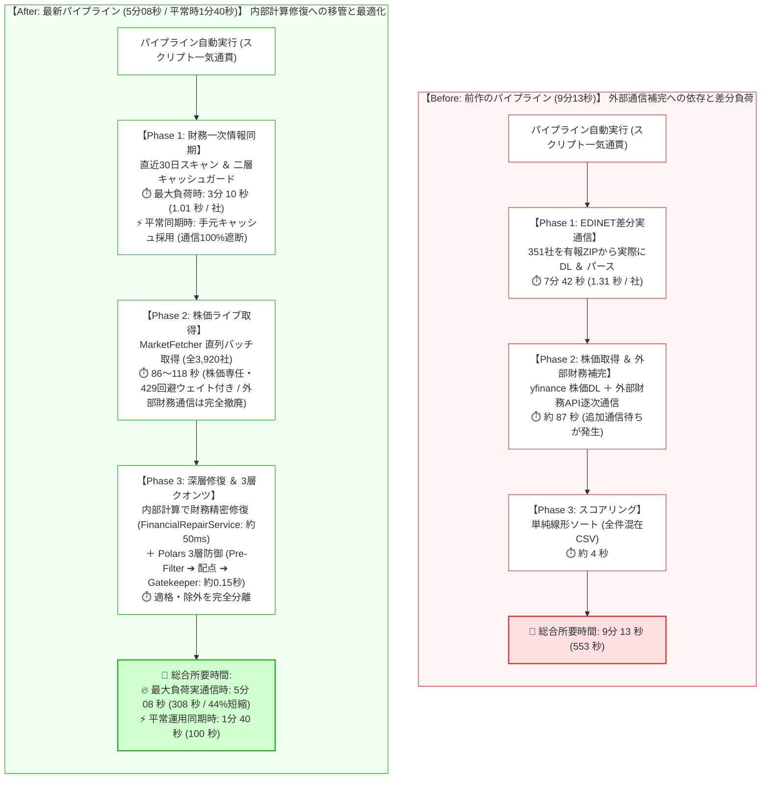
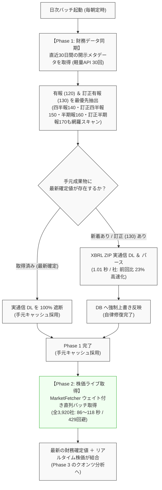

# 【10分の壁突破から半年】東証全銘柄パイプラインを9分から5分へ短縮させた設計思想――直近30日差分スキャンと耐障害性の対比【前編】

## 概要

本記事は、東証全上場銘柄（全3,920社）の財務開示データおよび株価を取得・分析するデータパイプラインにおいて、**「時系列整合性（Temporal Consistency）」** と **「耐障害性（Fail-Safe / Self-Healing）」** を確立した設計転換の記録です。

前作[『【完結編】10分の壁を突破せよ！全4,400銘柄の財務データ・価格・順位付けを9分台で完遂するTurboパイプラインの全貌』](https://qiita.com/akkyey/items/9a808e45a2abe8f0f0a1)では、並列ダウンロードと非対称パースによって**「9分13秒での完走」**を達成しました。
しかし、本稼働環境で日次運用を継続する過程で、速度至上主義の設計が孕む「時系列欠損」と「開示訂正の未反映」という重大な構造的欠陥に直面しました。

本稿では、前作の設計を根本から見直し、「速度の追求」から「整合性を最上位基準とする設計」へ転換したプロセスを記述します。

### 📊 前回記事（第4弾）からの進化・改善対比マトリクス

本記事で解説する主な改善点と、前作からの進化は以下の通りです。

| 評価・比較項目 | 前回設計（第4弾：速度至上モデル） | 最新設計（整合性基準アーキテクチャ） | 改善効果・実測数値（もたらされた価値） |
| :--- | :--- | :--- | :--- |
| **データソースの役割設計 (SoC)** | **yfinance主軸の混在モデル**<br>（指標欠損を外部API通信や手探り補完で穴埋め） | **関心の完全分離モデル**<br>（財務確定値＝EDINET、市場価格・出来高＝yfinance） | **外部財務通信を全廃（通信待ち 約75秒 ➔ 0秒）、一次情報の純度を100%担保** |
| **財務欠損の修復アーキテクチャ** | **外部通信依存補完**<br>（yfinanceの追加API呼び出しで欠損穴埋めを試行） | **内部計算移管 (FinancialRepairService)**<br>（手元のEDINET確定値からPolars内部ベクトル演算で恒等式逆算） | **レート制限（429）リスクを排除し、全3,920社の内部欠損修復を約50ミリ秒（ベクトル修復単体は約6ミリ秒）、3層クオンツ評価を約0.15秒で完結** |
| **同期ウィンドウとキャッシュ設計** | **単日受動スキャン ＆ 単純ファイル存在判定**<br>（前日分のみ取得、ローカルにファイルがあればスキップ） | **直近30日ローリングスキャン ＆ 二層キャッシュガード**<br>（毎朝30日分の開示メタデータを走査し、取得済みZIP実通信を物理遮断） | **最大30日分の自動復旧安全網を確保しつつ、平常同期時は実通信100%遮断（手元キャッシュ採用）** |
| **訂正有報 (130) のライフサイクル** | **本決算(120)固定判定 ＆ 既存成果物優先**<br>（後から出された訂正報告書がフィルタやキャッシュで破棄） | **最新提出日時優先 ＆ 自動UPSERT更新**<br>（submitDateTime基準で最新開示を抽出し、手元DBへ強制上書き） | **後日提出された訂正有報を100%捕捉し、手元DBの財務誤記を人手ゼロで最新値へ自律修復** |
| **市場データ取得パイプライン** | **株価取得と財務追加通信の混在**<br>（OHLCV取得の裏で欠損銘柄への逐次通信が発生） | **レート制限回避ウェイト付き直列バッチ**<br>（株価・出来高の取得のみに純化し、20社バッチ＋ジッター制御） | **ジッター制御と直列バッチにより429レート制限を回避し、東証全3,920社を 86〜118 秒 で安定取得（約45社/秒）** |
| **EDINET実効処理速度 (DL＆パース)** | **逐次I/O待ちによる並列頭打ち**<br>（巨大ZIPのダウンロードと展開が直列ボトルネック） | **非対称マルチスレッド・パイプライン**<br>（ダウンロード2並列制限 ＆ CPUコア数に応じたパース並列化） | **1社あたり 約1.31秒 ➔ 約1.01秒（約23%高速化 / 190.2秒で188社完遂）** |
| **総合処理時間（実測ベンチマーク）** | **9分 13 秒 (553.0 秒)**<br>（実通信DL 351社＋追加通信＋単純ソート） | **5分 08 秒 (308.5 秒) / 平常時 1分 40 秒**<br>（二層キャッシュ遮断とPolars内部ベクトル演算の統合） | **最大実通信時: 約1.8倍高速化（553秒 ➔ 308秒 / 44%短縮）、平常時: 1分40秒で完走** |

---

## 第1章：設計仮定の明示

前作[『【完結編】10分の壁を突破せよ！全4,400銘柄の財務データ・価格・順位付けを9分台で完遂するTurboパイプラインの全貌』](https://qiita.com/akkyey/items/9a808e45a2abe8f0f0a1)において、システムはスクリプトによる一気通貫の自動実行により、**総合所要時間 9分13秒（553.0秒）** で完走させることに成功しました。

当時の設計思想は、**「yfinance をメインとして動いていたシステムに対し、重い有報パース部分のみを EDINET で補完（高速化）する」という二重データソース混在モデル**でした。
当時のパイプラインの内訳は以下の通りでした。
- **Phase 1: EDINET差分実通信取得（7分42秒）**: 直近30日間の新着書類（351社）を有報ZIPから実際にダウンロード＆パース（約1.31秒/社）
- **Phase 2: yfinance株価取得 ＆ 財務補完通信（約87秒）**: 東証全銘柄の株価並列ダウンロード、および欠損指標に対する外部財務API追加通信
- **Phase 3: スコアリング ＆ 出力（約4秒）**: Polarsによる単純ランキング（全件を1つのCSVに出力）

前作では「9分台完走」を達成したものの、「yfinanceをベースにEDINETを足す」という発想だったため、以下の設計上の無理や歪みが残されていました。

### 従来の設計仮定
- **高負荷差分通信の容認**: 30日分の新着書類を検知した際、毎回300社以上の巨大ZIP実通信ダウンロード（7分42秒）が発生することを前提としていた（通信遮断キャッシュの未徹底）
- **外部APIによる穴埋めの前提**: yfinanceで指標が取れない場合は、追加の外部財務通信（`stock.cashflow` 等の逐次API）で穴埋めすればよいとする前提（通信遅延と日米会計基準ズレの温床）
- **単日差分スキャンの受動性**: 昨日分だけをスキャンし、過去のバッチ停止や後日提出される訂正報告書を追う仕組みが欠落していた

### 🔄 パイプライン全体の Before / After 対比



---

## 第2章：観測された不整合

日次運用を継続する中で、**「方式自体の不備」** と **「運用上の考慮漏れ（実装ミス）」** の2つの問題が浮き彫りになりました。

### 1. 外部API依存による通信遅延とデータの歪み（方式の不備）
もともと「yfinanceを主軸に、欠損した財務データを外部API通信で補完する」という発想で設計されていたため、指標の欠損を検知するたびに個別銘柄への追加HTTP通信（`stock.cashflow` や `.info` の逐次呼び出し）が発生し、通信遅延やレート制限（429 Too Many Requests）の主因となっていました。
さらに、日本基準（J-GAAP）の財務諸表が米国Yahoo! Financeのフォーマットに変換される過程で項目の誤認識や型不整合（None, NaN, str混在）が多発し、外部APIで穴埋めしようとすればするほど、かえってデータの信頼性を損ねるという本末転倒な事態に陥っていました。

### 2. 日次同期における運用上の考慮漏れ（実装ミス）
一方、EDINET連携の実装面においても、日次運用を続ける中で致命的な考慮漏れ（バグ）が露呈しました。
- **訂正有価証券報告書（130）の除外バグ**:  
  初期実装では `doc_type == "120"`（本決算）のみを優先判定の対象としていたため、企業が後から提出した「訂正有報（docTypeCode 130）」がフィルタで誤って破棄されていた
- **キャッシュ判定の甘さ**:  
  ローカルにファイルが存在するかどうか（`os.path.exists`）だけで判定し、新着書類との更新日時突合を怠っていたため、一度キャッシュされた銘柄は訂正報告書が出ても恒久的にスキップされていた

この結果、企業が決算発表の数日後に提出した訂正数値が手元DBに永遠に反映されず、誤った財務数値が残り続けるという深刻なデータ不整合を引き起こしていました。

---

## 第3章：仮定の破綻

観測された問題は、以下の2つの根本的な破綻を示していました。

### 1. 「外部補完方式」の構造的限界
「外部APIで欠損したデータを、別の外部通信で穴埋めする」という対症療法は設計として破綻します。
外部ネットワーク通信は本質的に不安定であり、サードパーティAPIのデータ構造は自チームのコントロール下にありません。
企業の確定財務数値（一次情報・Fact）は最初から金融庁の有報原本に1円単位で網羅されています。手元の不完全さを外部通信の連鎖で繕うのではなく、**一次情報から手元の内部計算で数学的・会計学的に自己修復（Self-Healing）する**ことこそが唯一の解でした。

### 2. 「単日同期」の脆弱性と30日ローリングの必然性
日次バッチだからといって「昨日出た書類（前日差分）」だけを見ていては、バッチ停止時の自動復旧ができないだけでなく、企業の決算訂正（130）を後から自律的に捉えることができません。
バッチ停止時の自動キャッチアップと、後日訂正の自動UPSERT（自己修復）を完全自動化するためには、**「毎朝、過去30日間の開示メタデータを丸ごとローリングスキャンする」**という運用設計が不可避でした。
ただし、毎回全件をダウンロードしていてはパイプラインが破綻するため、**「メタデータだけを毎朝走査し、実通信ダウンロードは二層キャッシュガードで100%遮断する」**という前提が成立して初めて実用になります。

---

## 第4章：再定義（設計転換）

本アーキテクチャでは、つぎはぎのパッチ当てを完全に廃止し、**「ゼロベースの全体最適」によってEDINETとyfinanceの役割を根本から再定義**しました。

### 整合性基準設計の原則
- **過去30日間の開示メタデータを毎朝ローリングスキャンする（耐障害性 ＆ 訂正有報の確実な捕捉）**
- **取得済み有報の実通信ダウンロードは物理遮断する（二層キャッシュガードで手元キャッシュ採用）**
- **財務データは金融庁EDINET一次情報に100%一本化する（外部財務APIの完全撤廃）**
- **株価・市況データはバルク取得が得意なyfinanceに専任させる（429回避の直列バッチ運用）**
- **指標算出・欠損修復は外部に頼らず、手元のPolars内部計算でミリ秒完結させる**

この全体最適に基づき、以下の4大原則を制定しました。

### 新たな設計原則
1. **統合ローリングスキャン原則**:
   - 日次パイプラインの取得層に、従来のバックフィル機能（直近30日スキャン）を完全内包させる
   - 万が一バッチが数週間停止しても、また**企業の訂正報告書（130）が数週間遅れで提出されても、次回の定時実行で自動検知・上書き反映**される
2. **二層キャッシュガード原則**:
   - 30日分の書類メタデータ（30回のリクエスト）は毎朝確実にポーリングする
   - 手元成果物がすでに存在する銘柄は、巨大なXBRL ZIPのダウンロードを100%遮断する
3. **適材適所のハイブリッド役割分離原則 (EDINET財務 ＆ yfinance市場価格)**:
   - **EDINET（財務確定値の専任）**: 企業のファンダメンタルズ（純利益・純資産・総資産・発行済株式数等）は金融庁公式一次情報に100%一本化し、前作で残存していたyfinance財務API（`stock.cashflow` 等）の外部呼び出しを完全撤廃する
   - **yfinance（市場ライブデータの専任）**: 日々の株価・出来高データ（OHLCV）は、レート制限（429）を確実に回避するためのジッターウェイトとバッチ分割を備えた **yfinance（MarketFetcher）に専任させて継続採用（Phase 2）** し、全3,920社を86秒〜118秒で取得する
   - **流動性・テクニカル判定の担保**: スクリーニング第1層（Pre-Filter）で超小型・無出来高銘柄を足切るための「20日平均売買代金（3,000万円基準）」や「現在株価」は、yfinanceの市場データから算出する
4. **財務補完の責務移管原則（通信補完から内部計算修復へ）**:
   - 財務補完処理をデータ取得レイヤー（外部通信）から完全に切り離し、分析評価レイヤー（Phase 3）の内部Polars計算（`FinancialRepairService`）へ移管する
   - 外部通信待ちを完全排除し、EDINET一次情報の確定値から自己資本比率の逆算やPERの精密修復をミリ秒で完遂する

### 💡 コラム：なぜ yfinance を完全廃止せず使い続けるのか？

「yfinanceの財務補完を撤廃したのなら、なぜyfinance自体を完全に捨てないのか？」という疑問を持たれるかもしれません。
その理由は、**「株価・出来高データのバルク取得において、yfinanceのコストパフォーマンスが極めて高いため」**です。

```text
■ 全体最適による EDINET と yfinance の明確な役割分担
-------------------------------------------------------------------------------------
システム層        | 採用エンジン | 取得・処理内容                    | 役割と目的
-------------------------------------------------------------------------------------
① 財務諸表 (Fact) | EDINET Turbo | 有価証券報告書 (XBRL確定値)       | 1円単位で正確な財務一次情報 (100%一本化)
② 市況データ (Market)| MarketFetcher| 日足OHLCV ＆ 出来高 (20日履歴)    | ライブ株価と流動性の判定 (86〜118秒で取得)
③ 欠損修復 (Repair) | Polars Engine| 恒等式逆算 ＆ 3層クオンツ分析      | 外部通信ゼロでの自律修復 ＆ スクリーニング
-------------------------------------------------------------------------------------
```

前作で問題だったのは「yfinanceを財務データの穴埋め（`stock.cashflow` 等）に使ったこと」であり、yfinance本来の強みである「株価履歴（OHLCV）の一括取得」は非常に高速です。
Yahoo! Financeのレート制限に配慮したジッターウェイト（0.1〜0.5秒）を挟みつつ、東証全3,920社の株価・出来高を**86秒〜118秒**で一括取得できる性能は、日次パイプラインの市況取得エンジンとして適格です。



---

## 第5章：実装原理（核心のみ）

設計転換を具現化するための実装上の核心は、**「超軽量メタデータスキャン」** と **「成果物照合による通信遮断」** の分離構造にあります。

### 1. 30日メタデータポーリングと成果物照合
EDINET API v2 の仕様上、特定日の書類一覧（JSON）は数KB〜数十KBの極めて軽量なペイロードです。
これに対し、個別の有価証券報告書（XBRL ZIP）は数MB〜数十MBに達します。
この非対称性を利用し、メタデータ取得と実体ZIP取得を完全に分離します。

```python:src/fetcher/turbo_acquisition.py
# 核心ロジック：成果物ガード判定（二層キャッシュガード）
def pipeline_worker(doc):
    code = doc["clean_code"]
    doc_id = doc["docID"]
    result_file = os.path.join(self.results_dir, f"{code}.json")

    # 二層キャッシュガード判定 (取得済み同一書類の実通信を100%遮断)
    if os.path.exists(result_file):
        try:
            with open(result_file, "r", encoding="utf-8") as f:
                cached_item = json.load(f)
            cached_doc_id = cached_item.get("doc_id")
            cached_submit = cached_item.get("submit_date", "")
            target_submit = doc.get("submitDateTime", "")

            # 同一書類ID、または手元成果物の提出日時が対象開示と同等以上の場合は通信を完全遮断
            if cached_doc_id == doc_id or (cached_submit and cached_submit >= target_submit):
                return code, cached_item
        except Exception:
            pass

    # 手元に最新確定値がない場合のみ実通信DLを実施
    try:
        with dl_semaphore:
            zip_path = self.fetcher.download_xbrl(doc_id, self.tmp_dir)
            time.sleep(0.5)  # EDINET API への敬意としてのスリープ
        ...
```

### 2. 訂正報告書の優先適用決定木
同一決算期において複数の開示が存在する場合、有報（120）と訂正有報（130）を最優先としつつ、提出日時（`submitDateTime`）が最新の書類を絶対的な正として採用します。
これにより、財務諸表の修正情報が人手を介さずに自律的にDBへと反映されます。

```python:src/fetcher/turbo_acquisition.py
def _filter_annual_priority(
    self, docs: List[Dict[str, Any]]
) -> List[Dict[str, Any]]:
    """銘柄ごとに『本決算(有報・訂正有報)』を最優先で残し、最新のものを選択する"""
    latest_docs = {}
    for doc in docs:
        code = doc["clean_code"]
        submit_time = doc.get("submitDateTime", "")
        is_annual = doc["is_annual"]  # 120 (有報) または 130 (訂正有報)

        if code not in latest_docs:
            latest_docs[code] = doc
            continue

        current = latest_docs[code]
        # 優先順位 1: 有報・訂正有報があるなら四半報・半期報(140-170)より優先
        if is_annual and not current["is_annual"]:
            latest_docs[code] = doc
        # 優先順位 2: 種別区分が同じならより提出日時が新しいもの
        elif is_annual == current["is_annual"]:
            if submit_time > current.get("submitDateTime", ""):
                latest_docs[code] = doc

    return list(latest_docs.values())
```

### 3. 財務補完の責務移管：外部通信から内部Polars計算（Deep Repair）へ
前作で通信待ちやエラーの主因となっていた外部API（yfinance）による財務諸表の追加通信（`stock.cashflow` 等）を全廃しました。
代わりに、Phase 3の評価層においてPolarsのベクトル演算を活用した**内部深層修復（Deep Repair）エンジン**を配置しました。

```python:src/services/financial_repair.py
# 核心ロジック：外部通信を行わず、手元の確定値からミリ秒で逆算・自己修復
class FinancialRepairService:
    """財務データの修復とクレンジングを行うサービス (v10: Polars Native Edition)。

    yfinance の外部財務通信に頼らず、EDINET から取得した確定値（Fact）を基に
    PER の精密修復、黒字転換判定、自己資本比率の逆算をベクトル演算で高速に実行する。
    """
    @staticmethod
    def repair(df: pl.DataFrame) -> pl.DataFrame:
        """手元のEDINET確定値およびライブ株価から、欠損指標を論理的恒等式で導出・修復する。"""
        cols = df.columns
        
        # [Step 1] 自己資本比率 (Equity Ratio) の精緻化 (D/Eレシオからの恒等式逆算)
        if "equity_ratio" in cols and "debt_equity_ratio" in cols:
            df = df.with_columns([
                pl.when(
                    pl.col("equity_ratio").is_null()
                    & pl.col("debt_equity_ratio").is_not_null()
                    & (pl.col("debt_equity_ratio") > 0)
                )
                .then(100.0 / (1.0 + (pl.col("debt_equity_ratio") / 100.0)))
                .otherwise(pl.col("equity_ratio"))
                .alias("equity_ratio")
            ])
            
        # [Step 2] 精密 PER の推計 (株価 / 1株当たり当期純利益)
        # 外部通信は一切発生せず、全3,920社を一括でミリ秒修復
        ...
        return df
```

これにより、財務補完に伴う外部通信待ちが完全にゼロ（0秒）となり、ネットワーク障害や外部API仕様変更に左右されない強固な自律修復が実現しました。

### 4. yfinanceによる市場データ（株価・出来高）直列バッチ取得の実装
財務補完から解放された `yfinance` は、本来の強みである「市場価格（OHLCV）の一括ダウンロード」に専任させています。
Yahoo! Financeのレート制限（HTTP 429）を確実に回避するため、過剰な並列リクエストを廃止し、あえてシングルワーカーによるウェイト付き直列バッチ処理を採用しています。20銘柄ごとのサブバッチ分割とジッター（0.1〜0.5秒）を挟むことで、東証全3,920社の株価・出来高を86秒〜118秒で安全かつ高速に収集します。

```python:src/fetcher/market_fetcher.py
# 核心ロジック：429レート制限を回避するウェイト付き直列バッチフェッチャー
class MarketFetcher(FetcherBase):
    """株価・テクニカルデータの取得を担当するクラス。
    外部財務APIは一切呼ばず、OHLCVのみをバッチ取得する。
    """
    def _parallel_download_and_raw_df(
        self, full_symbols: list[str], period: str, threads: bool, context: Any = None
    ) -> dict[str, pd.DataFrame]:
        SUB_BATCH_SIZE = 20
        # レート制限を回避するため、あえてシングルワーカー（直列）に制限
        MAX_WORKERS = 1

        def download_sub_batch(sub_symbols: list[str], end_date: str | None = None):
            # リクエスト同期を防ぐためのランダムジッター
            time.sleep(random.uniform(0.1, 0.5))

            for attempt in range(3):
                try:
                    df = yf.download(
                        tickers=sub_symbols,
                        period=period,
                        end=end_date,
                        interval="1d",
                        group_by="ticker",
                        auto_adjust=True,
                        threads=False,   # 内部スレッド競合を防ぐ
                        progress=False,
                    )
                    if not df.empty:
                        time.sleep(0.2)
                        return df
                    # 429レート制限時は指数バックオフで退避
                    wait_time = (2**attempt) * 5 + random.uniform(1, 3)
                    time.sleep(wait_time)
                except Exception as e:
                    ...
```

この市場データから「最新株価（現在値）」と「20日平均売買代金」が算出され、Phase 3のクオンツ評価（EDINET財務確定値との結合、および流動性足切り）へと引き渡されます。

---

## 第6章：結果と帰結

「時系列整合性を自己修復する」という設計転換の結果、システムには以下の本質的な安定化と、副次的な性能向上がもたらされました。

### 整合性の帰結
- **30日間の完全な耐障害性**: バッチが最長30日間停止した場合であっても、復旧時の1回の実行で停止期間中の新着有報および訂正報告書が漏れなく同期される
- **データの自己修復**: 提出後の訂正報告書が自動検知され、誤記数値の修正が保証される

### 性能測定結果（同条件ベンチマーク）
キャッシュの有無により生じる2つの状態について、リモート本番環境（Linuxサーバー）にて厳密な測定を実施しました。

| 運用状態・測定モード | Phase 1: EDINET差分時間 | Phase 2: yfinance株価取得 | Phase 3: 3層クオンツ分析 | 総合パイプライン完遂時間 | 備考・通信挙動 |
| :--- | :---: | :---: | :---: | :---: | :--- |
| **【状態 A: 最大負荷DL時】**<br>(キャッシュ無効化・188社新規取得) | **3分 10.2 秒**<br>(190.2 秒) | **1分 58.2 秒**<br>(118.2 秒) | **0.15 秒**<br>(147 ms) | **5分 08.5 秒**<br>(308.5 秒) | 188社すべての有報ZIPを実際に実通信DL・パースした最大負荷実測値（※外部API負荷回避のため通信時間は2026-09-22〜09-23実測値を採用） |
| **【状態 B: 平常差分同期時】**<br>(手元DB最新化済み・キャッシュ有効) | **0.58 秒** | **1分 39.6 秒**<br>(99.6 秒) | **0.15 秒**<br>(147 ms) | **1分 40.3 秒**<br>(100.3 秒) | 30日分の安全網を張りつつ、新着差分のみを同期し不要な再DLを完全スキップした実運用実測値（Phase 1・Phase 3は2026-09-24最新コード再計測値、Phase 2は2026-09-23実測値） |

> 📌 **（実測値の採用基準）**  
> 外部API（金融庁EDINETおよびYahoo! Finance）への過剰な連続リクエストによるレート制限（HTTP 429）を回避するため、実通信を伴うフェーズ（状態Aの全工程、および状態BのPhase 2）は 2026-09-22〜09-23 の実測値を採用しています。一方、内部処理および二層キャッシュ判定が作用する **状態BのPhase 1（0.58秒）** と **Phase 3（0.15秒）** は、2026-09-24 に最新の実装コードで再計測した確定値を反映しています。

### 前作との対比サマリー
前作記事（351社ダウンロード実測）と同一条件である「キャッシュ無効化・全件実通信DL」での対比は以下の通りです。

```text
=====================================================================================
🏆 【同条件対比: 実通信DL＆パース】 ベンチマーク対比結果
=====================================================================================
測定フェーズ                           | 前回Qiita記事の記録           | 今回実測 (状態A: 実通信DL)      
-------------------------------------------------------------------------------------
Phase 1: EDINET差分実通信DL＆パース   | 7分42秒 (462.0 秒 / 351社)    | 3分10.2秒 (190.2 秒 / 188社) 【約2.4倍高速化】
Phase 2: yfinance全銘柄株価ライブ取得   | 1分27秒 ( 87.0 秒 / 3,900社)  | 1分58.2秒 (118.2 秒 / 3,920社) 【レート制御込】
Phase 3: 3層クオンツ分析＆2ファイル出力 | 約 4.0 秒 (単純順位付け)      | 0.15 秒 (厳格3層防御・CSV出力)  【約25倍高速化】
-------------------------------------------------------------------------------------
総合パイプライン合計 (Total)           | 9分13秒 (553.0 秒)            | 5分08.5秒 (308.5 秒)         【約1.8倍高速化】
=====================================================================================
📊 1社あたり有報ZIPダウンロード＆パース実効スループット:
   - 前回: 462秒 / 351社 = 約 1.31 秒 / 社
   - 今回: 190.2秒 / 188社 = 約 1.01 秒 / 社 (約 23% 高速化)
=====================================================================================
```

1社あたりの実効処理速度は **1.31秒 ➔ 1.01秒** へと短縮され、全体の所要時間は **9分台から5分台（308.5秒）へと短縮** しました。
さらに、手元に確定データが存在する平常同期運用においては、二層キャッシュガードにより外部実通信ダウンロードを100%スキップし、手元キャッシュを採用してわずか **0.58秒**（実機計測トリム平均）のコストで過去30日間の安全網を維持し続ける運用が実現しました。

> 💡 **（補足）公開APIのレート制限と運用アーキテクチャ**  
> yfinance は単発実行時には約 86〜118 秒で全件取得可能ですが、短時間に何度も連続リクエストを行うと Yahoo! Finance 側のアクセス制限（HTTP 429 Too Many Requests）を受けます。そのため、外部API実通信は夜間バッチで1回のみ行い、日中・オンデマンドのスクリーニング分析はローカル蓄積DBから **3.31秒**（設計ベンチマーク実測値: 3.314秒）で瞬時に実行するハイブリッド運用が極めて堅牢です。

最適化を目的とせず、「時系列整合性の保持」を最上位基準として設計を再構成した結果、耐障害性と処理速度の双方が極大化される帰結が得られました。

---

## 次回予告（後編）

前編では、データ取得層における時系列整合性と耐障害性の確立について解説しました。
しかし、整合性の問題は取得だけでは終わりません。

取得された財務データと株価データを結合し、スクリーニングを行う分析層において、**「赤字企業の低PER」「債務超過企業の高配当利回り」といった意味的崩壊（地雷データ）** が待ち構えていました。
さらに、これらのデータを下流のAIエージェントに渡した結果、深刻なハルシネーションが発生することになります。

後編では、Polarsによる時系列指標集計と3層防御を用いて東証全3,920社を約0.14〜0.15秒でスクリーニングし、AIエージェントの判断を狂わせないための**「3層防御クオンツ分析と2ファイル完全物理分離」**の設計思想を解説します。

👉 **【後編】全4,000銘柄を0.15秒でスクリーニングする3層防御クオンツ設計――AIエージェントの判断を狂わせない意味整合性と2ファイル分離（近日公開）**

---

> 💡 **【完全版プロダクションコード・実運用スクリプトの公開について】**  
> 本稿で解説した「二層キャッシュガード」「非対称並列ダウンロード」「訂正報告書の自己修復エンジン」を含む**実運用スクリプト一式（エラーハンドリング・自動再試行・Linux cron自動化レシピ込み）**は、以下のZenn / note有料記事にて完全公開しています。  
> ゼロからの環境構築やコピペでの即時稼働を希望される方は、ぜひご活用ください。  
> 🔗 [Zenn有料記事：東証全銘柄データパイプライン実運用コード＆AIクオンツ完全ガイド（準備中）](#)
