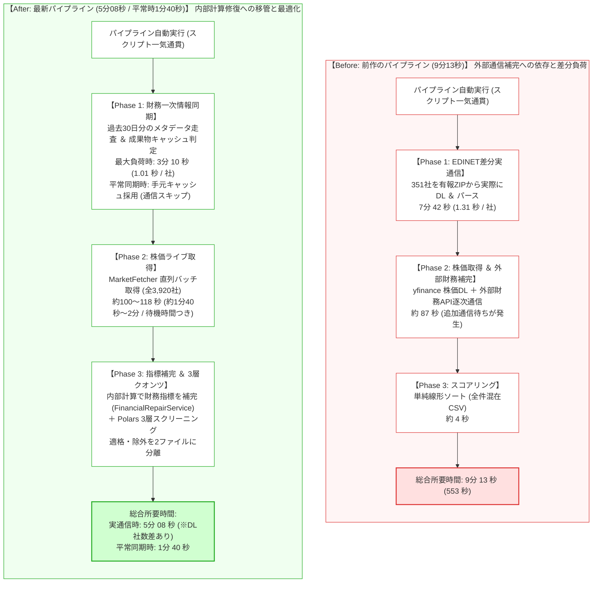
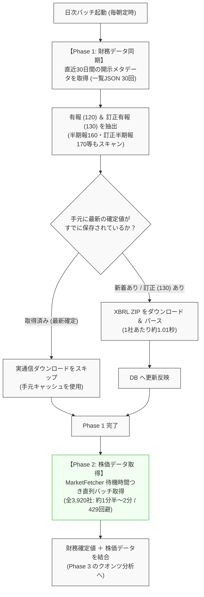

# EDINETの訂正有報を半年取りこぼし、yfinanceは429制限… 30日スキャン＋差分キャッシュで作り直した話

## TL;DR
- 東証の約3,900社を毎朝取り込むパイプラインで、訂正有報の取りこぼしと yfinance の429エラー（レート制限）に悩まされていました。
- 毎朝過去30日分の書類一覧（メタデータ）だけをスキャンし、取得済みの書類は再ダウンロードしないようにしました。財務データはEDINETだけに絞り、足りない指標は手元の内部計算で逆算するようにしました。
- 財務同期はキャッシュにより平常時0.58秒まで短縮され、パイプライン全体の所要時間は最大負荷時約5分、平常時はyfinanceの株価取得（約1分40秒）が支配的になりました。

---

## 概要

本記事は東証全上場銘柄（全3,920社）の財務開示データおよび株価を取得・分析するデータパイプラインにおいて、半年間の実運用で判明したデータ取りこぼしバグを修正し、時系列データの整合性と耐障害性を高めるために設計を見直した記録です。  
※前作ではETFやREITを含む東証全上場約4,400銘柄を対象としていましたが、本作では純粋な事業会社（普通株）の財務分析にフォーカスするため、ETF・ETN・REIT等を除外した3,920社を母集団としています。

前作[『【完結編】10分の壁を突破せよ！全4,400銘柄の財務データ・価格・順位付けを9分台で完遂するTurboパイプラインの全貌』](https://qiita.com/akkyey/items/9a808e45a2abe8f0f0a1)では並列ダウンロードと非対称パースによって全体の処理時間を9分13秒まで短縮しました。
しかし本番環境で半年ほど日次運用を続ける中で、処理速度を優先した設計に起因する「訂正開示の取りこぼしバグ」や「時系列データの欠損」などの問題が生じました。

本稿では前回の設計を見直し、「速度の追求」から「データの整合性を優先した設計」へ転換してバグを根本修正したプロセスをまとめます。

> 動作環境：Ubuntu 24.04 LTS / 8 vCPU / 16GB RAM / Python 3.12.8 / Polars 1.x

---

## 第1章：前回の設計と、その前提

前作では、スクリプトによる一気通貫の自動実行により、総合所要時間 9分13秒（553.0秒）で処理を完了させていました。

当時の設計は、「yfinance をメインとして動いていたシステムに対し、重い有報パース部分のみを EDINET で補完する」という二重データソース混在モデルでした。当時のパイプラインの内訳は以下の通りです。  
※平常の日次運用は「前日差分のみの単日スキャン」に依存していましたが、バッチ停止時のデータ抜けを自動復旧する仕組みがなかったため、定期的に手動で直近30日分の再取得リカバリを走らせていました。前作で記録した「9分13秒」というベンチマークは、この30日一括リカバリで新着開示351社を実通信ダウンロード・パースした際の測定値です。

- Phase 1: EDINET実通信取得（7分42秒）: 手動リカバリにより直近30日間の新着書類（351社）を有報ZIPから実際にダウンロード＆パース（約1.31秒/社）
- Phase 2: yfinance株価取得 ＆ 財務補完通信（約87秒）: 東証全銘柄の株価並列ダウンロード、および欠損指標に対する外部財務API追加通信
- Phase 3: スコアリング ＆ 出力（約4秒）: Polarsによる単純ランキング（全件を1つのCSVに出力）

前作では「9分台」を達成したものの、「yfinanceをベースにEDINETを足す」という発想だったため、以下の設計上の問題が残っていました。

- 差分通信の負荷: 日次バッチは「前日差分のみの単日スキャン」を基本としていたため、バッチ停止時の取りこぼし対策として30日分を再取得しようとすると、キャッシュクリア等による全件再取得となり、毎回300社以上の巨大ZIP実通信ダウンロード（7分42秒）が発生していた
- 外部APIによる指標の補完: yfinanceで指標が取れない場合は、追加の外部財務通信（`stock.cashflow` 等）で穴埋めすればよいと考えていた
- 単日スキャンによる見落とし: 平常運用を前日差分だけに頼っていたため、過去のバッチ停止時の一括リカバリを日次で自動化できず、後日提出される訂正報告書を追う仕組みがなかった


```mermaid
flowchart TD
    subgraph Before ["【Before: 前作のパイプライン (9分13秒)】 外部通信補完への依存と差分負荷"]
        direction TB
        B_Start["パイプライン自動実行 (スクリプト一気通貫)"] --> B_E["【Phase 1: EDINET差分実通信】<br>351社を有報ZIPから実際にDL ＆ パース<br>7分 42 秒 (1.31 秒 / 社)"]
        B_E --> B_Y["【Phase 2: 株価取得 ＆ 外部財務補完】<br>yfinance 株価DL ＋ 外部財務API逐次通信<br>約 87 秒 (追加通信待ちが発生)"]
        B_Y --> B_A["【Phase 3: スコアリング】<br>単純線形ソート (全件混在CSV)<br>約 4 秒"]
        B_A --> B_Total["総合所要時間: 9分 13 秒 (553 秒)"]
    end

    subgraph After ["【After: 最新パイプライン (5分08秒 / 平常時1分40秒)】 内部計算修復への移管と最適化"]
        direction TB
        A_Start["パイプライン自動実行 (スクリプト一気通貫)"] --> A_E["【Phase 1: 財務一次情報同期】<br>過去30日分のメタデータ走査 ＆ 成果物キャッシュ判定<br>最大負荷時: 3分 10 秒 (1.01 秒 / 社)<br>平常同期時: 手元キャッシュ採用 (通信スキップ)"]
        A_E --> A_Y["【Phase 2: 株価ライブ取得】<br>MarketFetcher 直列バッチ取得 (全3,920社)<br>約100〜118 秒 (約1分40秒〜2分 / 待機時間つき)"]
        A_Y --> A_A["【Phase 3: 指標補完 ＆ 3層クオンツ】<br>内部計算で財務指標を補完 (FinancialRepairService)<br>＋ Polars 3層スクリーニング<br>適格・除外を2ファイルに分離"]
        A_A --> A_Total["総合所要時間:<br>実通信時: 5分 08 秒 (※DL社数差あり)<br>平常同期時: 1分 40 秒"]
    end

    style Before fill:#fff5f5,stroke:#d33,stroke-width:1px,color:#333
    style After fill:#f0fff0,stroke:#2a2,stroke-width:1px,color:#333
    style B_Start fill:#fff,stroke:#d33,stroke-width:1px,color:#333
    style B_E fill:#fff,stroke:#d33,stroke-width:1px,color:#333
    style B_Y fill:#fff,stroke:#d33,stroke-width:1px,color:#333
    style B_A fill:#fff,stroke:#d33,stroke-width:1px,color:#333
    style B_Total fill:#ffe0e0,stroke:#d33,stroke-width:2px,color:#333
    style A_Start fill:#fff,stroke:#2a2,stroke-width:1px,color:#333
    style A_E fill:#fff,stroke:#2a2,stroke-width:1px,color:#333
    style A_Y fill:#fff,stroke:#2a2,stroke-width:1px,color:#333
    style A_A fill:#fff,stroke:#2a2,stroke-width:1px,color:#333
    style A_Total fill:#d0ffd0,stroke:#2a2,stroke-width:2px,color:#333
```

---

## 第2章：実際に半年動かしてみて起きた問題

半年ほど毎日動かしていたら、データ取得層において運用上見過ごせない問題が出てきました。

### 1. 外部API依存による通信遅延とデータの歪み
もともと「yfinanceを主軸に、欠損した財務データを外部API通信で補完する」という発想だったため、指標の欠損を見つけるたびに個別銘柄への追加HTTP通信（`stock.cashflow` や `.info` の呼び出し）が発生していました。これが通信遅延やレート制限（429 Too Many Requests）の主な原因になっていました。

さらに、日本基準（J-GAAP）の財務諸表が米国Yahoo! Financeのフォーマットに変換される過程で、項目の誤認識や型の不整合（None, NaN, 文字列の混在）が起こり、外部APIで穴埋めしようとすればするほど、かえってデータの整合性を保つのが難しくなっていました。

### 2. バッチ停止時の取りこぼしと、訂正有報の未反映
一方、財務データの同期面でも、実際に半年運用して重大な取りこぼしに気づきました。

- **バッチ停止時のデータ欠落**:  
  日次同期を「前日差分（昨日提出された書類のみ）」に依存していたため、サーバーメンテナンスや一時的な障害でバッチが数日止まると、その期間に提出された開示書類が丸ごと手元DBから抜け落ちてしまい、手動でのリカバリが必要でした。
- **訂正有報の取りこぼし**:  
  東証全銘柄を半年（約120営業日）走らせたところ、訂正有価証券報告書（130）は数十件提出されていました。  
  しかし、**前作（第4弾記事）の「③ 財務的インテリジェンス：本決算(有報) 優先フィルタ」で紹介した以下のロジック**に盲点がありました。

  ```python
  # ▼ 前作で「四半期決算の上書きを防ぐインテリジェンス」として紹介したコード
  def select_best_document(docs):
      def get_weight(doc):
          # docTypeCode: '120'（本決算）を優先にするあまり...
          return 10 if doc['docTypeCode'] == '120' else 1
          
      return max(docs, key=lambda d: (get_weight(d), d['submitDateTime']))
  ```

  前作では「四半期報告書で本決算データが上書きされないように」と工夫したつもりでしたが、この `docTypeCode == '120'` を重み付けで最優先にするロジックのせいで、企業が決算発表の数日後に誤りを修正して提出した **`docTypeCode: "130"`（訂正有価証券報告書）が選ばれず素通り** していました。  
  さらにローカルにファイルが存在するかどうか（`os.path.exists`）だけでキャッシュ判定していたため、訂正前の古い財務データのまま手元に残り続けていたのです。

---

## 第3章：なぜその問題が起きたのか

起きていた問題の原因を掘り下げると、設計の前提そのものに根本的な原因がありました。

### 1. 「外部APIで穴埋めする」ことの限界
「外部APIで欠損したデータを、別の外部通信で穴埋めする」という対症療法は、設計として無理がありました。外部ネットワーク通信は不安定ですし、サードパーティAPIのデータ構造はこちらでコントロールできません。

日本企業の確定財務数値は、金融庁の有報原本（EDINET）に揃っています。手元の不完全さを外部通信の連鎖で補うのではなく、「一次情報であるEDINETから取得し、足りない指標は手元の内部計算で逆算する」という構成に改めるべきでした。

### 2. 「前日分だけ取る」「一度取ったら変わらない」という前提の破綻
同期漏れが起きた根本原因は、**「バッチは毎日無停止で動く」「有報は一度出たら確定して二度と変わらない」という暗黙の仮定**にありました。

前作のADR（アーキテクチャ意思決定記録）でも「1. 差分スキャン ＆ 本決算(120)優先戦略」として、初回構築時は「過去365日の書類リストから、銘柄ごとの最新の『docTypeCode: 120 (有価証券報告書)』を1枚だけ抽出する」と胸を張って設計していました。  
しかし現実には、サーバー障害やネットワーク断で日次バッチが止まることは避けられませんし、企業は決算発表後に数値の誤りを修正するために訂正報告書（130）を提出します。

それにもかかわらず、「昨日出た分だけを単日スキャンする」「手元にファイルがあればスキップする」という設計にしていたため、バッチ停止時の自動復旧もできず、後から出された訂正情報も素通りしてしまっていました。

バッチ停止時のリカバリと訂正報告書の自動反映を両立するには、「毎朝、過去30日分の開示メタデータを一覧スキャンし、提出日時を突合して差分を検知する」アーキテクチャが必要だったのです。

---

## 第4章：どう設計し直したか

これまでの対症療法をやめ、EDINETとyfinanceの役割を整理し直しました。

### 設計の基本方針
- 過去30日分の開示メタデータを毎朝スキャンする（取りこぼし復旧と訂正有報の検知）
- 取得済みの書類はダウンロードをスキップする（成果物キャッシュ）
- 財務データはEDINETの一次情報に絞る（外部の財務API呼び出しはやめる）
- 株価・出来高データはバルク取得が得意なyfinanceに任せる（429エラーを避けるため直列バッチで取得）
- 指標の算出や欠損の修復は手元のPolars内部計算で行う

### 4つの改善ポイント
1. **過去30日分のメタデータスキャン**:
   日次の処理で、過去30日分の開示書類一覧を取得します。万が一バッチが数日止まっても、また企業の訂正報告書（130）が後から出ても、次回の実行で自動的に検知して上書き反映できます。
2. **成果物キャッシュによるダウンロードのスキップ**:
   30日分のメタデータ（一覧JSON、30回のリクエスト）は毎朝取得しますが、すでに手元に保存済みの書類については、重い有報ZIPのダウンロードをスキップします。
3. **EDINET（財務）と yfinance（株価）の役割分担**:
   - **EDINET（財務データ担当）**: 純利益・純資産・総資産・発行済株式数などの財務データはEDINETの開示情報に一本化し、前作で呼んでいたyfinanceの財務API（`stock.cashflow` 等）は廃止しました。
   - **yfinance（株価・出来高担当）**: 日々の株価と出来高（OHLCV）は、429エラーを避けるために待機時間を設けた直列バッチ（MarketFetcher）で取得します。全銘柄を約1分半〜2分で取得できます。
   - **足切り用の指標計算**: スクリーニングで小型株や無出来高銘柄を判定するための「20日平均売買代金」や「現在株価」は、この市場データから計算します。
4. **財務指標の手元計算（外部通信依存の解消）**:
   財務指標の計算や欠損の穴埋めを、データ取得フェーズから評価フェーズ（Phase 3）のPolars処理（`FinancialRepairService`）へ移しました。手元にある確定値から関係式を使って自己資本比率の逆算やPERの算出を行うため、外部への追加通信は発生しません。

### コラム：なぜ yfinance を残したのか？

「財務APIをやめたのなら、なぜyfinance自体を完全に使わない方針にしなかったのか？」という疑問もあるかもしれません。
理由はシンプルで、**株価・出来高の履歴データをまとめて取得する用途においては、yfinanceが十分に速く便利だから**です。

| レイヤー | 使用エンジン | 取得・処理内容 | 役割 |
| :--- | :--- | :--- | :--- |
| **① 財務データ** | EDINET | 有価証券報告書 (XBRL確定値) | 財務の一次情報として使用 |
| **② 市況データ** | yfinance | 日足OHLCV ＆ 出来高 (20日履歴) | 株価と流動性の判定に使用 |
| **③ 指標計算・分析** | Polars | 内部計算による指標逆算 ＆ 判定 | 外部通信なしで指標算出と足切り |

前作で問題だったのは「yfinanceを財務データの穴埋めに使ってしまったこと」でした。株価履歴の一括取得エンジンとしては優秀なので、レート制限に配慮したランダム待機（0.1〜0.5秒）を入れながら、市況データの取得役として引き続き活用しています。


```mermaid
flowchart TD
    Start["日次バッチ起動 (毎朝定時)"] --> Scan["【Phase 1: 財務データ同期】<br>直近30日間の開示メタデータを取得 (一覧JSON 30回)"]
    Scan --> Filter["有報 (120) ＆ 訂正有報 (130) を抽出<br>(半期報160・訂正半期報170等もスキャン)"]
    Filter --> Check{"手元に最新の確定値が<br>すでに保存されているか？"}
    
    Check -- "新着あり / 訂正 (130) あり" --> Download["XBRL ZIP をダウンロード ＆ パース<br>(1社あたり約1.01秒)"]
    Check -- "取得済み (最新確定)" --> Skip["実通信ダウンロードをスキップ<br>(手元キャッシュを使用)"]
    
    Download --> Upsert["DB へ更新反映"]
    Skip --> Merge["Phase 1 完了"]
    Upsert --> Merge
    
    Merge --> P2["【Phase 2: 株価データ取得】<br>MarketFetcher 待機時間つき直列バッチ取得<br>(全3,920社: 約1分半〜2分 / 429回避)"]
    P2 --> End["財務確定値 ＋ 株価データを結合<br>(Phase 3 のクオンツ分析へ)"]

    style Start fill:#f9f9f9,stroke:#333,stroke-width:1px,color:#333
    style Scan fill:#f9f9f9,stroke:#333,stroke-width:1px,color:#333
    style Filter fill:#f9f9f9,stroke:#333,stroke-width:1px,color:#333
    style Check fill:#f9f9f9,stroke:#333,stroke-width:1px,color:#333
    style Download fill:#f9f9f9,stroke:#333,stroke-width:1px,color:#333
    style Skip fill:#f9f9f9,stroke:#333,stroke-width:1px,color:#333
    style Upsert fill:#f9f9f9,stroke:#333,stroke-width:1px,color:#333
    style Merge fill:#f9f9f9,stroke:#333,stroke-width:1px,color:#333
    style P2 fill:#f0fff0,stroke:#2a2,stroke-width:1px,color:#333
    style End fill:#f9f9f9,stroke:#333,stroke-width:1px,color:#333
```

---

## 第5章：実装のポイントとコード

実装のポイントは、「軽量メタデータのスキャン」と「成果物照合によるダウンロード遮断」を分けた点にあります。

### 1. 30日メタデータのスキャンと成果物照合
EDINET API v2 では、特定日の書類一覧（JSON）は数KB〜数十KBと小さく、高速に取得できます。一方で、個別の有価証券報告書（XBRL ZIP）は数MB〜数十MBあります。
このサイズ差に着目し、メタデータ取得とZIP取得を分けて処理します。

```python:src/fetcher/turbo_acquisition.py
# 成果物キャッシュによるダウンロード判定
def pipeline_worker(self, doc: Dict[str, Any]) -> tuple[str, Dict[str, Any]]:
    code = doc["clean_code"]
    doc_id = doc["docID"]
    result_file = os.path.join(self.results_dir, f"{code}.json")

    # 成果物キャッシュ判定 (取得済みの同一書類ならスキップ)
    if os.path.exists(result_file):
        try:
            with open(result_file, "r", encoding="utf-8") as f:
                cached_item = json.load(f)
            cached_doc_id = cached_item.get("doc_id")
            cached_submit = cached_item.get("submit_date", "")
            target_submit = doc.get("submitDateTime", "")

            # 同一書類ID、または手元ファイルの提出日時が対象開示と同等以上の場合はダウンロードをスキップ
            # （※ submit_date は保存時に doc['submitDateTime'] をそのまま格納しているため、同一の YYYY-MM-DD HH:MM 形式で文字列比較可能）
            if cached_doc_id == doc_id or (cached_submit and cached_submit >= target_submit):
                return code, cached_item
        except Exception:
            # キャッシュ読み込み失敗時は再取得へ進む
            pass

    # 手元に最新データがない場合のみ実通信でダウンロード
    try:
        with dl_semaphore:
            zip_path = self.fetcher.download_xbrl(doc_id, self.tmp_dir)
            time.sleep(0.5)  # EDINET API への負荷を抑えるための待機
        ...
```

### 2. 訂正報告書の優先適用ロジック
前作の失敗は「有報（120）を最優先」にしたあまり、「訂正有報（130）」が排除されてしまったことでした。  
そこで新設計では、**有報（120）と訂正有報（130）を同一の「年次報告グループ（`is_annual = True`）」として扱い、グループ内では提出日時（`submitDateTime`）が新しい方を無条件で採用する**ロジックに改めました。

これにより、四半期報告書による誤った上書きを防ぎつつ、有報の後に提出された訂正有報（130）が確実に選ばれるようになります。

> ※注：対象決算期（`periodEnd`）の突合や、XBRLが添付されていない書類（`xbrlFlag == '0'`）の除外は、前段の書類一覧取得フェーズで事前にフィルタリングしています。また、前述のキャッシュ判定（提出日時比較）も、この正規化を経た代表1枚に対して行われるため、別書類との取り違えは発生しません。

```python:src/fetcher/turbo_acquisition.py
def _filter_annual_priority(
    self, docs: List[Dict[str, Any]]
) -> List[Dict[str, Any]]:
    """銘柄ごとに本決算（有報・訂正有報）を最優先で残し、最新のものを選択する"""
    latest_docs = {}
    for doc in docs:
        code = doc["clean_code"]
        submit_time = doc.get("submitDateTime", "")
        is_annual = doc["is_annual"]  # 120 (有報) または 130 (訂正有報)

        if code not in latest_docs:
            latest_docs[code] = doc
            continue

        current = latest_docs[code]
        # 優先順位 1: 本決算の有報・訂正有報を最優先（半期報160等より優先）
        if is_annual and not current["is_annual"]:
            latest_docs[code] = doc
        # 優先順位 2: 区分が同じなら提出日時がより新しいものを採用
        elif is_annual == current["is_annual"]:
            if submit_time > current.get("submitDateTime", ""):
                latest_docs[code] = doc

    return list(latest_docs.values())
```

### 3. 財務指標の内部計算（Polarsによる逆算）
外部API（yfinance）による財務データの追加通信をやめ、評価フェーズにおいてPolarsの内部計算（`FinancialRepairService`）で補完する構成にしました。

```python:src/services/financial_repair.py
class FinancialRepairService:
    """手元のEDINET確定値から指標を計算・修復するサービス"""
    @staticmethod
    def repair(df: pl.DataFrame) -> pl.DataFrame:
        cols = df.columns
        
        # [Step 1] 自己資本比率の逆算補完 (D/Eレシオからの関係式逆算)
        # ※XBRLのフォーマット差等で自己資本比率タグが直接取れず、D/Eレシオがある場合のフォールバック計算
        # 自己資本比率 = 純資産 / 総資産 = 100 / (1 + DE/100)
        # （※ここでのDEレシオは「総負債 ÷ 純資産」を前提とした推計値）
        if "equity_ratio" in cols and "debt_equity_ratio" in cols:
            df = df.with_columns([
                pl.when(
                    pl.col("equity_ratio").is_null()
                    & pl.col("debt_equity_ratio").is_not_null()
                    & (pl.col("debt_equity_ratio") > 0)
                )
                .then(100.0 / (1.0 + (pl.col("debt_equity_ratio") / 100.0)))
                .otherwise(pl.col("equity_ratio"))
                .alias("equity_ratio")
            ])
            
        # [Step 2] PER の計算 (株価 / 1株当たり当期純利益)
        ...
        return df
```

> ※注：D/Eレシオからの逆算について  
> EDINETから取得できるデータにおいて、総資産と純資産が揃っている銘柄は直接計算（`純資産 / 総資産 * 100`）で自己資本比率を求めます。ただ、XBRLの項目差などで直接取れないケースがあるため、計算済みテーブルに存在するD/Eレシオ（負債/純資産比率）との関係式を使って推計値を補います。なお、開示上の厳密な自己資本比率には非支配株主持分（旧称：少数株主持分）等の調整項目が含まれるため、あくまで欠損を埋めるための推計モデルです。

これにより、財務データの穴埋めによる外部通信待ちがなくなり、安定してデータを揃えられるようになりました。

### 4. yfinanceによる株価データの直列バッチ取得
株価と出来高の取得については、Yahoo! Financeのレート制限（HTTP 429）を避けるため、過剰な並列リクエストをやめて直列バッチ処理にしました。20銘柄ごとのバッチに分割し、0.1〜0.5秒のランダム待機を挟んでいます。

```python:src/fetcher/market_fetcher.py
class MarketFetcher(FetcherBase):
    """株価データの取得を担当するクラス"""
    def _parallel_download_and_raw_df(
        self, full_symbols: list[str], period: str, threads: bool, context: Any = None
    ) -> dict[str, pd.DataFrame]:
        SUB_BATCH_SIZE = 20
        # ※関数名（_parallel_...）は前作並列処理時の名残。429レート制限を避けるため直列（MAX_WORKERS = 1）で処理
        MAX_WORKERS = 1

        def download_sub_batch(sub_symbols: list[str], end_date: str | None = None):
            time.sleep(random.uniform(0.1, 0.5))

            for attempt in range(3):
                try:
                    df = yf.download(
                        tickers=sub_symbols,
                        period=period,
                        end=end_date,
                        interval="1d",
                        group_by="ticker",
                        auto_adjust=True,
                        threads=False,
                        progress=False,
                    )
                    if not df.empty:
                        time.sleep(0.2)
                        return df
                    # 429発生時は待機してリトライ
                    wait_time = (2**attempt) * 5 + random.uniform(1, 3)
                    time.sleep(wait_time)
                except Exception as e:
                    ...
```

取得した株価データから「最新終値」や「20日平均売買代金」を計算し、次のクオンツ評価（スクリーニング）に渡します。

---

## 第6章：動かしてみた結果とベンチマーク

設計を見直した結果、日次バッチの安定性が向上し、処理時間も短縮できました。

### 運用して確認できたこと
- 過去30日分の自動復旧: 30日以内の停止であれば、バッチが数日間停止した場合でも、復旧時の1回の実行で停止期間中の新着有報や訂正報告書が自動検知・同期される
- 訂正報告書の自動反映: 提出後の訂正報告書が自動検知され、手元の財務数値が最新値に更新される

### 処理時間の測定結果
キャッシュの有無による2つの状態について、本番環境（Linuxサーバー）で測定しました。

| 運用状態 | Phase 1: EDINET差分 | Phase 2: yfinance株価取得 | Phase 3: 3層クオンツ分析 | 総合パイプライン時間 | 備考 |
| :--- | :---: | :---: | :---: | :---: | :--- |
| **状態 A: 新着多数時**<br>(188社を新規ダウンロード) | 3分 10.2 秒 | 1分 58.2 秒 | 0.15 秒 | 5分 08.5 秒 | 188社の有報ZIPを実際にダウンロード・パースした実測値 |
| **状態 B: 平常同期時**<br>(キャッシュ有効) | 0.58 秒 | 1分 39.6 秒 | 0.15 秒 | 1分 40.3 秒 | 30日分をスキャンしつつ、取得済みはスキップした実測値 |

> ※注（実測値の計測条件について）  
> 外部APIへの連続リクエストを避けるため、実通信を伴うフェーズ（状態Aの全工程、状態BのPhase 2）は 2026-09-22〜09-23 の実測値を記載しています。内部処理である状態BのPhase 1（0.58秒）とPhase 3（0.15秒）は、最新の実装コードでの計測値です。

### 前回記事との対比

前回記事（351社ダウンロード時）と今回の実測（188社ダウンロード時）の処理時間は以下の通りです。

| 測定フェーズ | 前回 (第4弾: 351社) | 今回 (新着188社DL時) | 比較・備考 |
| :--- | :---: | :---: | :--- |
| Phase 1: EDINET差分実通信DL＆パース | 7分42秒 (462.0 秒) | 3分10.2秒 (190.2 秒) | 1社あたり 1.31秒 ➔ 1.01秒 (約23%高速化) |
| Phase 2: yfinance全銘柄株価ライブ取得 | 1分27秒 (87.0 秒) | 1分58.2秒 (118.2 秒) | レート制限対策の待機時間を設けた直列バッチ |
| Phase 3: 3層クオンツ分析＆2ファイル出力 | 約 4.0 秒 (単純順位付け) | 0.15 秒 (3層判定・CSV出力) | Polarsベクトル演算による高速判定 |
| **総合パイプライン合計** | **9分13秒 (553.0 秒)** | **5分08.5秒 (308.5 秒)** | **※新着開示社数の差を含む実測値** |

- **1社あたりの処理時間（目安）**:
  - 前回: 462.0秒 / 351社 = 約 1.31 秒 / 社
  - 今回: 190.2秒 / 188社 = 約 1.01 秒 / 社 (約 23% 高速化)

> ※注：1社あたりの処理が速くなった理由（1.31秒 ➔ 1.01秒）  
> 1社あたりの処理時間が短縮された主な要因は、書類メタデータの一括スキャンとZIP取得を完全に分離し、不要なHTTPリクエストのオーバーヘッドを削減した点にあります。また、XBRLパース時に抽出対象のタクソノミタグ（BS/PLの主要項目）をあらかじめ絞り込み、不要なタグの走査をスキップしたことも寄与しています（※なお、開示書類のページ数やZIPファイルサイズの差も含む目安値です）。

> ※注：総合処理時間に関する補足  
> 今回の総合時間（5分08.5秒）は、新規開示が188社だった日の実測値です。1社あたりのダウンロード＆パース時間は約1.31秒から約1.01秒（約23%高速化）となっており、前回と同規模の351社を新規取得したと仮定すると約7分53秒相当の計算になります。  
> また、普段の運用では取得済みの書類をスキップできるため、Phase 1（財務データ同期）はわずか0.58秒で完了します。その結果、平常時の総合所要時間（1分40.3秒）の大半はレート制限対策で待機を入れたPhase 2（yfinance株価取得：1分39.6秒）となり、パイプラインのボトルネックが財務同期から市況データ取得側へと完全にシフトしたことが分かります。

> ※注：yfinanceのアクセス制限について  
> yfinance は短時間に何度も連続リクエストを行うと Yahoo! Finance のアクセス制限（HTTP 429）を受けます。そのため、外部通信を伴う株価取得は夜間バッチで1回だけ行い、日中のスクリーニング分析はローカル蓄積DBから約3.3秒（うちPhase 3の計算時間は0.15秒）で処理する運用にしています。

### 今回の設計の限界とトレードオフ

本設計を日次で運用するにあたり、以下の制約とトレードオフを意識しています。

1. **yfinanceの利用前提**:  
   yfinance は Yahoo! Finance の非公式APIラッパーです。仕様変更による取得失敗リスクが常にあるため、商用本番サービスではなく、個人利用や研究・検証目的のパイプラインとして運用すべき前提です。
2. **30日ウィンドウの限界**:  
   バッチが30日を超えて停止した場合、その間に提出された書類は日次スキャンでは拾えません。長期停止後や定期的なタイミングで、全件の再同期を組み合わせる必要があります。

データの整合性を優先して設計を整理した結果、運用が安定しただけでなく、処理時間の短縮にもつながりました。

---

## 次回予告（後編）

前編では、データ取得層における時系列整合性と耐障害性の見直しについて解説しました。
しかし、問題はデータ取得だけでは終わりませんでした。

取得した財務データと株価データを結合してスクリーニングを行う際、**「赤字企業の低PER」や「債務超過企業の高利回り」のように、指標の意味が成り立たない現象**に直面しました。

後編では、Polarsによる時系列指標集計と3段階判定を用いて東証全3,920社を約0.15秒で判定し、結果を後から検証しやすくするための**「適格・除外銘柄の2ファイル分離」**の設計について解説します。

👉 **後編：[債務超過の銘柄が割安ランキング1位に来たので、3層フィルタで除外ファイルを分けた（※公開後にリンク設定）](#)**

> 免責事項（Disclaimer）  
> 本記事はデータエンジニアリングおよびパイプライン設計の技術的知見を共有するものであり、特定の有価証券の売買推奨や投資助言を目的としたものではありません。掲載されている判定基準やスコアリングロジックは分析基盤の検証・学習用途であり、実際の投資判断はご自身の責任において行ってください。
