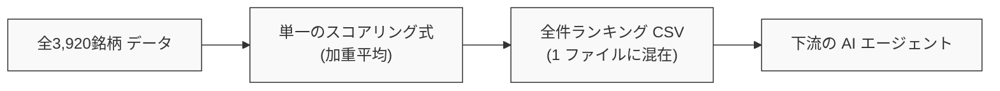
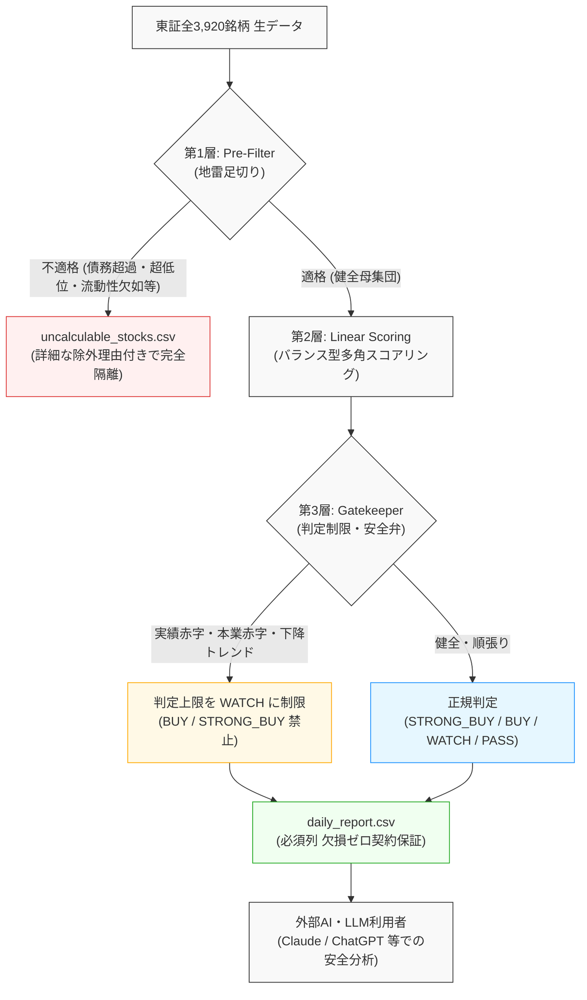

# 【10分の壁突破から半年】全4,000銘柄を0.15秒でスクリーニングする3層防御クオンツ設計――AIを狂わせない意味整合性と2ファイル分離【後編】

## 概要

本記事は、東証全上場銘柄（全3,920社）の財務・株価データをスクリーニングし、下流のAIエージェント（LLM）と連携する分析基盤において、**「意味整合性（Semantic Integrity）」** と **「AI協調境界（Contract Design）」** を確立した設計転換の記録です。

前編『【10分の壁突破から半年】東証全銘柄パイプラインを9分から5分へ短縮させた設計思想――直近30日差分スキャンと耐障害性の対比』では、データ取得層における耐障害性の再定義により、9分台から5分台への短縮と自己修復を実現しました。

しかし、堅牢に取得された確定データであっても、前作[『【完結編】10分の壁を突破せよ！』](https://qiita.com/akkyey/items/9a808e45a2abe8f0f0a1)で採用していた「単純ソートによる全件線形ランキング」へそのまま流し込んだ瞬間、**「赤字企業の低PER」「債務超過企業の高配当利回り」といった意味の崩壊**に直面しました。
さらに、欠損値を含むランキングCSVをLLMに渡した結果、AIエージェントが欠損を誤解して重大なハルシネーションを起こす事象が頻発しました。

本稿では、前作の「全件一元ランキング」から、適格銘柄のみを抽出する「3層防御ゲートキーパー設計」、そしてAIエージェントとの協調を保証する「2ファイル完全物理分離」への転換プロセスを記述します。

### 📊 前回記事（第4弾）からの分析・AI協調進化対比マトリクス

| 評価・比較項目 | 前回記事（第4弾：9分台達成時） | 今回の設計（最新アーキテクチャ） | 改善効果・もたらされた価値 |
| :--- | :--- | :--- | :--- |
| **全銘柄スクリーニング所要時間** | **約 4.0 秒**<br>（Polars単純ソート） | **0.15 秒 (147 ms)**<br>（Polars 3層多重判定＆出力） | **判定レイヤーを多重化しながら約 25 倍 高速化（ミリ秒台で完走）** |
| **評価モデル構造** | **0 層（単純線形評価）**<br>（単一の加重平均式で全件を強引に順位付け） | **3 層防御アーキテクチャ**<br>（①Pre-Filter ➔ ②配点 ➔ ③Gatekeeper） | **投資適格性のない銘柄をスコアリング前に完全遮断** |
| **地雷銘柄の排除率<br>（債務超過・極小商い・営業CF赤字等）** | **0.0 %（混入事故あり）**<br>（表面上の低PBRや高利回りで上位浮上） | **構造的欠陥を完全足切り**<br>（債務超過・低流動性を第1層で排除、実績赤字は第3層で判定制限） | **統計的・意味的な指標破綻銘柄の買い推奨を防止** |
| **出力ファイル構造** | **1 ファイル（全件混在）**<br>（計算不能・欠損銘柄も同一CSVに同居） | **2 ファイル完全物理分離**<br>（適格 2,120社 / 除外 1,800社に二分） | **下流システム・AIに条件分岐や曖昧な解釈を強制しない** |
| **下流AIエージェントの<br>データ欠損率 (Contract)** | **欠損・例外値が混在**<br>（null/NaNが残り解釈をLLMに依存） | **必須列 0.00%（契約保証）**<br>（判定必須の3列にnullゼロ。算出不能指標は安全にハイフン表記） | **AIエージェントの欠損誤認によるハルシネーションを防止** |

---

## 第1章：設計仮定の明示

前作（第4弾）において、取得した財務データと株価を結合してランキングを出力していた際、システムには以下の暗黙的な仮定が存在していました。

### 従来の設計仮定
- **一元線形評価の前提**: 東証に上場するすべての銘柄は、同一のスコアリング数式（PER、PBR、ROE、配当利回りの加重平均等）によって、1つの直線上で公平に比較・順位付けできるとする前提
- **全件包含の仮定**: 欠損値や一時的な赤字であっても、中央値補完やゼロ埋めを行い、可能な限り全銘柄を1つのランキング表に含めるべきであるとする前提
- **LLM万能論の前提**: 下流に接続されるAIエージェント（LLM）は、出力されたテーブル内の欠損理由や特殊な財務文脈をプロンプト指示だけで自律的に判別できるとする前提

前作の関心は「いかに全銘柄を高速に処理するか」に集中しており、「算出された数値が投資判断として成立しているか」「AIが正しく理解できる構造か」という**意味的整合性の検証**は下流の消費者（人間やLLM）に丸投げされていました。




---

## 第2章：観測された不整合

上記の線形スコアリング設計を実運用に適用した結果、以下の再現可能な不整合と事故が観測されました。

### 1. 指標の意味崩壊と「地雷銘柄」の上位誤抽出
線形スコアリングの上位に、以下のような「投資対象として致命的な欠陥を抱える銘柄」が頻繁にランクインする現象が発生しました。
- **債務超過企業の極小PBR**: 純資産がマイナス（または極小）となった企業が、算出式上「異常な低PBR」となり、超割安株として最上位に誤抽出される
- **最終赤字・減配転落企業の高利回り**: 業績急悪化で株価が急落した銘柄が、過去実績の配当額に基づき「超高配当株」としてスコアリング上位を占領する
- **本業赤字・キャッシュ枯渇企業の混入**: 営業CFが大幅赤字（マージン-10%未満）で資金流出が止まらない企業が、表面的な低PBR等で高得点を獲得してしまう

数値としては算出可能であっても、投資指標としての「意味」が完全に崩壊していました。

### 2. AIエージェントのハルシネーション（誤認・捏造）
欠損値（null/NaN）や計算不能理由が含まれた単一のCSVをAIエージェント（LLM）にプロンプト経由で入力した際、以下の重大なハルシネーションが観測されました。
- **欠損の好意的誤解**: 「データが取得できない＝新興の急成長企業であるため即時買い推奨」といった根拠のない判断の下蔽
- **数値の勝手な捏造**: 空白セルに対して、周辺の業界平均や学習済み事前知識から架空のPERや配当利回りを補完して分析レポートを出力する事象

### 3. 指標間の恒等式違反
時価総額が極小な超小型株において、流動性が存在しないにもかかわらずスコアだけが極大化し、実行不可能なポートフォリオが生成される制約未充足が観測されました。

---

## 第3章：仮定の破綻

観測された事象は、アルゴリズムの調整不足ではなく、設計仮定そのものの破綻を示しています。

### 線形評価モデルの破綻
適格な黒字企業と、債務超過・大幅キャッシュ枯渇企業を「同一の数式」で評価することは不可能です。
財務指標における「割安（バリュー）」と「構造的欠陥（ディストレス）」は紙一重であり、境界条件による足切りを行わない線形モデルは、構造的に破綻します。

### 「LLMに判断を委ねる」仮定の破綻
AIエージェントは高度な推論能力を持ちますが、入力データそのものに欠損やノイズが混入している場合、それを「解釈」しようとする推論機能そのものがハルシネーションの温床となります。
データ品質の保証責任を下流のAIに負わせる設計は、AI活用のアンチパターンでした。

### 単一ファイル出力構造の破綻
「計算できた銘柄」と「計算から除外された銘柄」を1つのファイルに共存させるデータ構造そのものが、下流システムに条件分岐を強制し、誤判定の根本原因となっていました。

---

## 第4章：再定義（設計転換）

本アーキテクチャでは、最上位基準を「全件の線形順位付け」から**「評価対象の意味的純度（Semantic Integrity）の保証」**へと再定義しました。

### 整合性基準設計の原則
- **意味の崩壊したデータはスコアリング対象から完全に排除する**
- **AIエージェントに曖昧な判断（欠損の解釈）を一切要求しない**
- **評価可能母集団と除外母集団は物理レベルで完全分離する**

この思想に基づき、以下の2大アーキテクチャを制定しました。

### 新たな設計原則
1. **3層防御クオンツアーキテクチャ (3-Tier Quantitative Defense)**:
   - **第1層（Pre-Filter: 地雷足切り＆データ不適格隔離）**: 債務超過（自己資本比率 <= 0%）、超低位株（株価 < 50円）、極小流動性（20日平均売買代金 < 3,000万円）、出来高ゼロ日あり、致命的キャッシュ枯渇（営業CFマージン < -10%）に加え、**取引停止銘柄（直近5営業日以内に市場取引なし）や重要指標未開示/算出不能銘柄（株価欠損、または自己資本比率等の必須財務データ未開示）** をスコアリング前に絶対除外する。**※無配株や営業赤字は、急成長中のグロース企業を拾い上げるため第1層では除外せず、第3層ゲートキーパーによる判定上限キャップで制御する多層防御を採用**
   - **第2層（Linear Scoring: 適格母集団配点）**: 第1層を通過した「健全な母集団」のみに対し、バリュー・クオリティ・配当・モメンタムを多角配点する
   - **第3層（Gatekeeper: 判定上限キャップ・安全弁）**: 実績赤字（ROE < 0）、本業赤字・一過性特益トラップ（営業赤字かつ純利益黒字）、強い下降トレンド等を検知し、スコアが高くても判定（Verdict）を最大 `WATCH` に制限して買い推奨を禁止する
2. **AI協調のための2ファイル物理分離原則 (Physical Dual Output)**:
   - `daily_report.csv`: 必須キー（code, price, verdict）の欠損ゼロを厳密に保証した適格銘柄のみを出力（AIエージェントや外部LLMが100%信用して分析可能）
   - `uncalculable_stocks.csv`: 除外された銘柄と、その厳密な日本語除外理由コード（`データ鮮度不足 (取引停止)`, `重要指標未開示/算出不能`, `商い不成立`, `極小流動性トラップ`, `超低位ボロ株`, `構造的破綻 (債務超過)`, `致命的キャッシュ枯渇`等）を隔離出力



---

## 第5章：実装原理（核心のみ）

設計思想を具現化する実装の核心は、**「Polarsによる高速集計と明示的な日本語理由付与」**、**「第3層ゲートキーパーによる判定上限キャップ」**、そして**「データ契約（Contract）による物理遮断」**にあります。

### 1. Polars集計と辞書走査による明示的除外理由付与（第1層 Pre-Filter）
直近20日間の平均売買代金や直近5日間の出来高ゼロ日数といった時系列集計は、PolarsのマルチスレッドRustエンジンでミリ秒処理します。
その上で、個々の銘柄に対する5大足切り判定と「人間にもAIにも一目でわかる詳細な日本語除外理由（`filter_reason`, `filter_detail`）」の付与を辞書走査により厳格に行います。

```python:src/calc/pre_filter.py
# 核心ロジック：第1層 Pre-Filter（地雷足切り判定と詳細理由付与）
class PreFilter:
    """第1層：地雷銘柄の即座除外と母集団の物理分離。"""
    MIN_TRADING_VALUE_20D = 30_000_000.0  # 20日平均売買代金 3,000万円基準
    MIN_PRICE = 50.0                      # 株価 50円基準
    MIN_EQUITY_RATIO = 0.0                # 自己資本比率 0%基準 (債務超過)
    MIN_OP_CF_MARGIN = -0.10              # 営業CFマージン -10%基準

    @classmethod
    def evaluate(cls, df_candidates: pl.DataFrame, df_liquidity: Optional[pl.DataFrame] = None) -> PreFilterResult:
        # Polars で流動性指標を結合後、辞書走査で厳格かつ明確な理由を付与
        records = df.to_dicts()
        for row in records:
            price = row.get("price")
            equity_ratio = row.get("equity_ratio")
            operating_cf = row.get("operating_cf")
            sales = row.get("sales")
            avg_tv = row.get("avg_trading_value_20d")
            zero_days = row.get("zero_volume_days_5d")
            latest_trade_date = row.get("latest_trade_date")
            is_recent_trade = row.get("is_recent_trade")
            sector = str(row.get("sector", "Other"))

            # ① データ鮮度不足判定（最新市場日より大幅に古い取引停止銘柄）
            if is_recent_trade is False and latest_trade_date is not None:
                rejected_rows.append({**row, "filter_reason": "データ鮮度不足 (取引停止)", "filter_detail": f"最終取引日 ({latest_trade_date}) が直近5営業日範囲外"})
                continue

            # ② 売買不能判定（直近5営業日出来高ゼロ）
            if zero_days is not None and zero_days > 0:
                rejected_rows.append({**row, "filter_reason": "商い不成立", "filter_detail": f"直近5営業日以内に出来高ゼロ日あり ({zero_days}日)"})
                continue

            # ③ 極小流動性トラップ判定（20日平均売買代金 < 3,000万円）
            if avg_tv is not None and avg_tv < min_tv_20d:
                rejected_rows.append({**row, "filter_reason": "極小流動性トラップ", "filter_detail": f"20日平均売買代金不足 ({avg_tv/10000:,.0f}万円 < 3,000万円)"})
                continue

            # ④ 超低位ボロ株判定（株価 < 50円）
            if price is not None and price < min_price:
                rejected_rows.append({**row, "filter_reason": "超低位ボロ株", "filter_detail": f"株価基準未満 ({price:,.0f}円 < 50円)"})
                continue

            # ⑤ 重要指標未開示 / 算出不能判定（株価欠損、または自己資本比率未開示）
            if price is None:
                rejected_rows.append({**row, "filter_reason": "重要指標未開示/算出不能", "filter_detail": "市場価格データ欠損"})
                continue
            if equity_ratio is None:
                rejected_rows.append({**row, "filter_reason": "重要指標未開示/算出不能", "filter_detail": "自己資本比率等の財務諸表データ未開示または欠損"})
                continue

            # ⑥ 構造的破綻（債務超過判定）
            if equity_ratio is not None and equity_ratio <= min_eq_ratio:
                rejected_rows.append({**row, "filter_reason": "構造的破綻 (債務超過)", "filter_detail": f"純資産マイナス / 自己資本比率 ({equity_ratio:.1f}% <= 0.0%)"})
                continue

            # ⑦ 致命的キャッシュ枯渇判定（営業CFマージン < -10% ※金融・保険業免除）
            if sector not in cls.CF_EXEMPT_SECTORS and operating_cf is not None and sales and sales > 0:
                if (operating_cf / sales) < min_op_cf_margin:
                    rejected_rows.append({**row, "filter_reason": "致命的キャッシュ枯渇", "filter_detail": "営業CFマージン大幅赤字"})
                    continue

            passed_rows.append(row)

        return PreFilterResult(passed_df=pl.DataFrame(passed_rows), rejected_df=pl.DataFrame(rejected_rows))
```

> 💡 **（注）売買代金の二重掛けバグの解消と流動性判定の厳格化**  
> 直近のリファクタリング検証時（2026年9月）に、すでに円単位として集計されていた売買代金に対して再度株価を掛け算してしまい、1日50万円しか商いのない極小銘柄が過大評価されて足切りをすり抜ける重大な不具合が発生していました。最新アーキテクチャでは、データソースからのマッピング（`volume`株数と`trading_value`円）をSSOT（単一の信頼できる情報源）として厳密に分離し、二重掛けを完全に根絶しています。

### 2. 第3層ゲートキーパー：判定上限キャップによる多層防御
第1層ではあえて無配株や営業赤字を落とさず、成長期待のあるグロース銘柄の評価余地を残しています。
その代わり、第3層ゲートキーパーにおいて「実績赤字企業」や「営業赤字だが特益で純利益だけ黒字に見える企業」を検知し、スコアが高得点であっても判定（Verdict）を最大 `WATCH` に制限して買い推奨を禁止します。

```python:src/calc/quant_evaluator.py
# 核心ロジック：第3層 ゲートキーパー（Verdict キャップ制限）
@classmethod
def _determine_verdict(cls, score: float, roe: Optional[float], macd_status: str, ma_div: Optional[float], op_income: Optional[float] = None, operating_margin: Optional[float] = None) -> str:
    # 基礎配点による暫定判定
    if score >= 80.0: verdict = "STRONG_BUY"
    elif score >= 65.0: verdict = "BUY"
    elif score >= 50.0: verdict = "WATCH"
    else: verdict = "PASS"

    # ゲートキーパー 1: 実績赤字（ROE < 0）銘柄のキャップ制限
    # 予想が黒字転換であっても、実績赤字の銘柄は BUY / STRONG_BUY を禁止し最大 WATCH に制限
    if roe is not None and roe < 0 and verdict in ["STRONG_BUY", "BUY"]:
        verdict = "WATCH"

    # ゲートキーパー 2: 本業赤字・一過性特益トラップのキャップ制限
    # 営業利益が赤字かつ純利益が黒字の銘柄は、見かけの低PER・高ROEであるため最大 WATCH に制限
    is_op_loss = (operating_margin is not None and operating_margin <= 0) or (op_income is not None and op_income <= 0)
    if is_op_loss and verdict in ["STRONG_BUY", "BUY"]:
        verdict = "WATCH"

    # ゲートキーパー 3: テクニカル・下降トレンド制限
    if "Bearish" in macd_status:
        if verdict == "STRONG_BUY":
            verdict = "BUY"
        if ma_div is not None and ma_div < -10.0 and verdict == "BUY":
            verdict = "WATCH"

    return verdict
```

### 3. 判定必須キーの欠損ゼロを物理保証するデータ契約（Data Contract）
第2層および第3層を通過したデータフレームに対し、下流のCSV出力直前でアサーションを実行します。
投資判断に不可欠な必須キー（`code`, `price`, `verdict`）に1セルでも null が残存している場合、パイプラインは即座に `AssertionError` を送出して物理停止し、不正データの下流流出を遮断します。
なお、PERやPBR等の算出不能指標（赤字企業など）については null のまま放置せず、安全にフォーマットされた値（`-` 表記）として出力されます。

```python:src/orchestration/phases/integration.py
# 核心ロジック：判定必須キーの欠損ゼロを物理保証するデータ契約検証
def _verify_data_contract(df: pl.DataFrame) -> None:
    essential_cols = ["code", "price", "verdict"]
    for col_name in essential_cols:
        if col_name in df.columns:
            null_count = df.filter(pl.col(col_name).is_null()).height
            if null_count > 0:
                raise AssertionError(
                    f"Data Contract Violation: Essential column '{col_name}' contains {null_count} null values."
                )
```

これにより、ClaudeやChatGPT等の外部LLMにCSVを直接アップロードして分析させる個人投資家や開発者にとっても、AIが欠損を誤解して幻覚（ハルシネーション）を起こすリスクを物理的に防止できます。

---

## 第6章：結果と帰結

「意味整合性の保証」を最上位基準とした結果、分析基盤およびAIエージェントの挙動に以下の本質的な帰結が得られました。

### 整合性の帰結
- **地雷銘柄の排除**: 債務超過や大幅キャッシュ枯渇、極小商いの銘柄が第1層で確実に足切られ、不適切な銘柄がランキング上位に浮上する現象を防止
- **AIエージェントのハルシネーション防止**: `daily_report.csv` に必須列欠損ゼロの契約が適用され、算出不能指標も `-` で安全に整形されたことで、LLMが欠損を誤解して推論を捏造する余地を物理的に排除
- **透明な母集団分離**: 今回の実測において、東証全銘柄（全3,920社）は以下のように厳格に二分された
  - **評価可能銘柄（`daily_report.csv`）**: **2,120 社**（判定必須列の欠損ゼロ保証）
  - **除外対象銘柄（`uncalculable_stocks.csv`）**: **1,800 社**（極小商い・債務超過に加え、株価未取得等の市場データ取得不能104社を含む全件に明確な除外理由と詳細を付与）

### 計算性能の帰結（0.15秒 / 147ミリ秒への高速化）
前作（第4弾）では単純な並べ替えに約4秒を要していました。
今回、厳格な3層防御とAI向け2ファイル分離を導入したにもかかわらず、Polarsによる時系列指標集計と、辞書走査により最適化された `QuantEvaluator` により、**東証全3,920社のスクリーニング所要時間は「0.15秒（トリム平均 147 ms）」で完走**しました（前作比 約 25 倍 高速化）。

```text
=====================================================================================
🏆 クオンツ分析・スクリーニング層 性能対比
=====================================================================================
項目                         | 前回Qiita記事 (第4弾)       | 今回実測 (3層防御アーキテクチャ)
-------------------------------------------------------------------------------------
処理所要時間                 | 約 4.0 秒                   | 0.15 秒 (147 ms / トリム平均) 【約25倍高速化】
防御レイヤー数               | 0 層 (単純ソート)           | 3 層 (Pre-Filter ➔ 配点 ➔ Gatekeeper)
地雷銘柄の排除率             | 0.0 % (混入事故あり)        | 構造的欠陥を完全足切り (債務超過・極小商いを遮断、実績赤字は判定制限)
出力ファイル構造             | 1 ファイル (欠損混在)       | 2 ファイル完全物理分離 (適格 2,120社 / 除外 1,800社)
下流AIエージェント欠損率     | 欠損・例外値が混在          | 必須列 0.00 % (契約による完全保証)
=====================================================================================
```

> 💡 **（注）5回測定トリム平均による客観的保証**  
> 性能評価にあたっては、単発実行時の揺らぎを排除するため5回連続測定を実施し、最速値と最遅値を除外した中央3回のトリム平均（Trimmed Mean）を算出しています。その結果、分類・評価フェーズは **最速 131 ms 〜 最遅 195 ms、平均 147 ms** と極めて安定してミリ秒台で完走することが実証されています。

処理速度を犠牲にすることなく、データの意味的整合性を極限まで高める設計が確立されました。

---

## 結論

前編・後編を通じたパイプラインの再構成により、以下の原則が実証されました。

1. **「最適化は目的ではなく結果である」**:  
   速度を求めて設計したのではなく、時系列整合性と意味整合性を守るために境界を再定義した結果、全体パイプラインは5分08秒（平常同期時 約1分40秒）、評価・分類層は0.15秒という極限の速度が副次的に手に入った。
2. **「AIエージェントの性能は入力データの意味的純度で決まる」**:  
   プロンプトエンジニアリングでAIを制御しようとする前に、データパイプライン側で物理的な契約を結び、純度100%のデータを渡すことこそが最強のAI協調設計である。

---

> 💡 **【完全版プロダクションコード・配点パラメータ設定の公開について】**  
> 本稿で解説した「第1層Pre-Filterの厳密なしきい値設定」「第2層リニア配点の重み付けマトリクス」「Polarsによる3層防御実装コード一式」、および「AIエージェント（Claude/ChatGPT）に読ませて自動投資判断を行わせるためのシステムプロンプトテンプレート」は、以下のZenn有料記事にて完全公開しています。  
> 独自クオンツエンジンの構築やAI投資エージェントの実装を目指す方は、ぜひご活用ください。  
> 🔗 [Zenn有料記事：東証全銘柄データパイプライン実運用コード＆AIクオンツ完全ガイド（準備中）](#)
