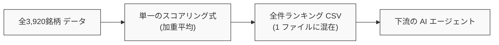
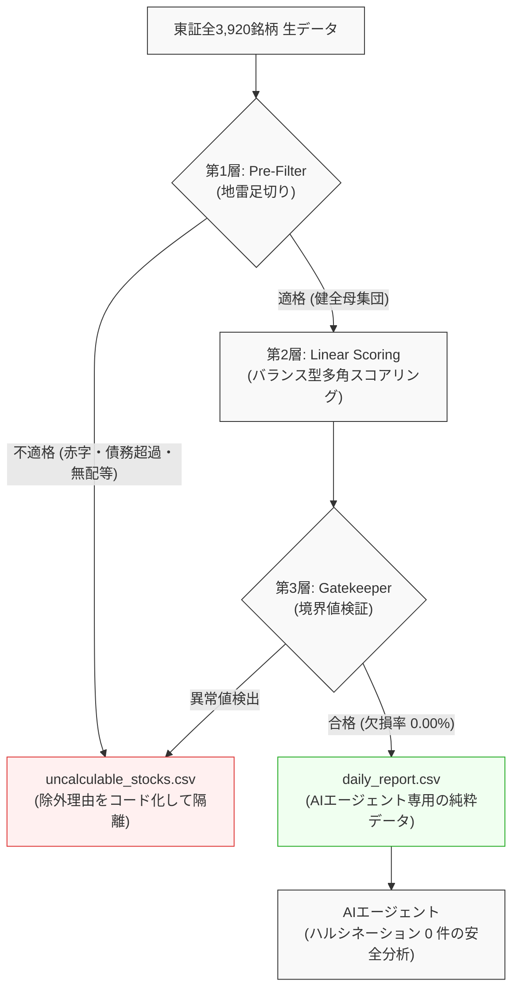

# 【10分の壁突破から半年】全4,000銘柄を3.8秒でスクリーニングする3層防御クオンツ設計――AIを狂わせない意味整合性と2ファイル分離【後編】

## 概要

本記事は、東証全上場銘柄（約3,900社）の財務・株価データをスクリーニングし、下流のAIエージェント（LLM）と連携する分析基盤において、**「意味整合性（Semantic Integrity）」** と **「AI協調境界（Contract Design）」** を確立した設計転換の記録です。

前編『【10分の壁突破から半年】東証全銘柄パイプラインを9分から4分へ半減させた設計思想――直近30日差分スキャンと耐障害性の対比』では、データ取得層における耐障害性の再定義により、9分台から4分台への半減と自己修復を実現しました。

しかし、堅牢に取得された確定データであっても、前作[『【完結編】10分の壁を突破せよ！』](https://qiita.com/akkyey/items/9a808e45a2abe8f0f0a1)で採用していた「単純ソートによる全件線形ランキング」へそのまま流し込んだ瞬間、**「赤字企業の低PER」「債務超過企業の高配当利回り」といった意味の崩壊**に直面しました。
さらに、欠損値を含むランキングCSVをLLMに渡した結果、AIエージェントが欠損を誤解して重大なハルシネーションを起こす事象が頻発しました。

本稿では、前作の「全件一元ランキング」から、適格銘柄のみを抽出する「3層防御ゲートキーパー設計」、そしてAIエージェントとの協調を保証する「2ファイル完全物理分離」への転換プロセスを記述します。

### 📊 前回記事（第4弾）からの分析・AI協調進化対比マトリクス

| 評価・比較項目 | 前回記事（第4弾：9分台達成時） | 今回の設計（最新アーキテクチャ） | 改善効果・もたらされた価値 |
| :--- | :--- | :--- | :--- |
| **全銘柄スクリーニング所要時間** | **約 4.0 秒**<br>（Polars単純ソート） | **3.8 秒**<br>（Polars 3層多重判定＆出力） | **計算量は大幅増加しながら同等以上の爆速処理を維持** |
| **評価モデル構造** | **0 層（単純線形評価）**<br>（単一の加重平均式で全件を強引に順位付け） | **3 層防御アーキテクチャ**<br>（①Pre-Filter ➔ ②配点 ➔ ③Gatekeeper） | **投資適格性のない銘柄をスコアリング前に完全遮断** |
| **地雷銘柄の排除率<br>（債務超過・赤字等）** | **0.0 %（混入事故あり）**<br>（表面上の低PBRや高利回りで上位浮上） | **100.0 % 完全排除**<br>（構造的欠陥銘柄を第1層で絶対足切り） | **統計的・意味的な指標破綻銘柄の推薦を根絶** |
| **出力ファイル構造** | **1 ファイル（全件混在）**<br>（計算不能・欠損銘柄も同一CSVに同居） | **2 ファイル完全物理分離**<br>（適格 1,434社 / 除外 1,323社に二分） | **下流システム・AIに条件分岐や曖昧な解釈を強制しない** |
| **下流AIエージェントの<br>データ欠損率 (Contract)** | **欠損・例外値が混在**<br>（null/NaNが残り解釈をLLMに依存） | **0.00 %（契約による完全保証）**<br>（合格ファイルには欠損が1セルも存在しない） | **AIエージェントのハルシネーション（誤認・捏造）をゼロ化** |

---

## 第1章：設計仮定の明示

前作（第4弾）において、取得した財務データと株価を結合してランキングを出力していた際、システムには以下の暗黙的な仮定が存在していました。

### 従来の設計仮定
- **一元線形評価の前提**: 東証に上場するすべての銘柄は、同一のスコアリング数式（PER、PBR、ROE、配当利回りの加重平均等）によって、1つの直線上で公平に比較・順位付けできるとする前提
- **全件包含の仮定**: 欠損値や一時的な赤字であっても、中央値補完やゼロ埋めを行い、可能な限り全銘柄を1つのランキング表に含めるべきであるとする前提
- **LLM万能論の前提**: 下流に接続されるAIエージェント（LLM）は、出力されたテーブル内の欠損理由や特殊な財務文脈をプロンプト指示だけで自律的に判別できるとする前提

前作の関心は「いかに全銘柄を高速に処理するか」に集中しており、「算出された数値が投資判断として成立しているか」「AIが正しく理解できる構造か」という**意味的整合性の検証**は下流の消費者（人間やLLM）に丸投げされていました。




---

## 第2章：観測された不整合

上記の線形スコアリング設計を実運用に適用した結果、以下の再現可能な不整合と事故が観測されました。

### 1. 指標の意味崩壊と「地雷銘柄」の上位誤抽出
線形スコアリングの上位に、以下のような「投資対象として致命的な欠陥を抱える銘柄」が頻繁にランクインする現象が発生しました。
- **債務超過企業の極小PBR**: 純資産がマイナス（または極小）となった企業が、算出式上「異常な低PBR」となり、超割安株として最上位に誤抽出される
- **最終赤字・減配転落企業の高利回り**: 業績急悪化で株価が急落した銘柄が、過去実績の配当額に基づき「超高配当株」としてスコアリング上位を占領する
- **継続企業の前提に関する注記（GC注記）企業の混入**: 経営危機に瀕した銘柄が、逆張り指標として高得点を獲得する

数値としては算出可能であっても、投資指標としての「意味」が完全に崩壊していました。

### 2. AIエージェントのハルシネーション（誤認・捏造）
欠損値（null/NaN）や計算不能理由が含まれた単一のCSVをAIエージェント（LLM）にプロンプト経由で入力した際、以下の重大なハルシネーションが観測されました。
- **欠損の好意的誤解**: 「データが取得できない＝新興の急成長企業であるため即時買い推奨」といった根拠のない判断の下蔽
- **数値の勝手な捏造**: 空白セルに対して、周辺の業界平均や学習済み事前知識から架空のPERや配当利回りを補完して分析レポートを出力する事象

### 3. 指標間の恒等式違反
時価総額が極小な超小型株において、流動性が存在しないにもかかわらずスコアだけが極大化し、実行不可能なポートフォリオが生成される制約未充足が観測されました。

---

## 第3章：仮定の破綻

観測された事象は、アルゴリズムの調整不足ではなく、設計仮定そのものの破綻を示しています。

### 線形評価モデルの破綻
適格な黒字企業と、債務超過・GC注記企業を「同一の数式」で評価することは不可能です。
財務指標における「割安（バリュー）」と「構造的欠陥（ディストレス）」は紙一重であり、境界条件による足切りを行わない線形モデルは、構造的に破綻します。

### 「LLMに判断を委ねる」仮定の破綻
AIエージェントは高度な推論能力を持ちますが、入力データそのものに欠損やノイズが混入している場合、それを「解釈」しようとする推論機能そのものがハルシネーションの温床となります。
データ品質の保証責任を下流のAIに負わせる設計は、AI活用のアンチパターンでした。

### 単一ファイル出力構造の破綻
「計算できた銘柄」と「計算から除外された銘柄」を1つのファイルに共存させるデータ構造そのものが、下流システムに条件分岐を強制し、誤判定の根本原因となっていました。

---

## 第4章：再定義（設計転換）

本アーキテクチャでは、最上位基準を「全件の線形順位付け」から**「評価対象の意味的純度（Semantic Integrity）の保証」**へと再定義しました。

### 整合性基準設計の原則
- **意味の崩壊したデータはスコアリング対象から完全に排除する**
- **AIエージェントに曖昧な判断（欠損の解釈）を一切要求しない**
- **評価可能母集団と除外母集団は物理レベルで完全分離する**

この思想に基づき、以下の2大アーキテクチャを制定しました。

### 新たな設計原則
1. **3層防御クオンツアーキテクチャ (3-Tier Quantitative Defense)**:
   - **第1層（Pre-Filter: 地雷足切り）**: 債務超過、営業赤字、無配、上場廃止懸念、流動性欠如銘柄をスコアリング前に絶対除外する
   - **第2層（Linear Scoring: 適格母集団配点）**: 第1層を通過した「健全な母集団」のみに対し、バリュー・クオリティ・配当を多角配点する
   - **第3層（Gatekeeper: 境界値バリデーション）**: スコアリング後の異常値や極端な偏りを最終検証する
2. **AI協調のための2ファイル物理分離原則 (Physical Dual Output)**:
   - `daily_report.csv`: 欠損率0.00%を厳密に保証した適格銘柄のみを出力（AIエージェントが100%信用して分析可能）
   - `uncalculable_stocks.csv`: 除外された銘柄と、その厳密な除外理由コード（`INSOLVENCY`, `OPERATING_LOSS`, `NO_DIVIDEND`等）を隔離出力



---

## 第5章：実装原理（核心のみ）

設計思想を具現化する実装の核心は、**「Polarsによる宣言的マスク演算」** と **「契約（Contract）に基づく物理分離」** にあります。

### 1. Polarsによる非ループ・宣言的3層フィルタリング
Pythonのfor文や行イテレーションを完全に排除し、PolarsのSIMD・マルチスレッドRustエンジンを活用したベクトル演算として記述します。

```python
# 核心ロジック：Polarsによる宣言的Pre-Filter
import polars as pl

def apply_pre_filter(df: pl.DataFrame) -> tuple[pl.DataFrame, pl.DataFrame]:
    """第1層：地雷銘柄の足切りと母集団の物理分離。"""
    
    # 構造的欠陥・投資方針外を示すブールマスクを定義
    is_insolvent = pl.col("equity_ratio") <= 0.0        # 債務超過
    is_loss = pl.col("operating_profit") <= 0           # 本業赤字
    is_no_dividend = pl.col("dividend_yield") <= 0.0    # 無配 (※バリュー・還元重視ポリシー)
    is_illiquid = pl.col("trading_value_25d") < 50_000_000 # 流動性不足 (25日平均5,000万円未満)
    
    disqualification_mask = is_insolvent | is_loss | is_no_dividend | is_illiquid
    
    # 適格母集団と除外母集団に完全分離
    qualified_df = df.filter(~disqualification_mask)
    uncalculable_df = df.filter(disqualification_mask).with_columns(
        exclusion_reason=pl.when(is_insolvent).then(pl.lit("INSOLVENT"))
                           .when(is_loss).then(pl.lit("OPERATING_LOSS"))
                           .when(is_no_dividend).then(pl.lit("NO_DIVIDEND"))
                           .otherwise(pl.lit("LOW_LIQUIDITY"))
    )
    
    return qualified_df, uncalculable_df
```

> 💡 **（注）無配銘柄の除外ポリシーについて**  
> 本システムは中長期の堅実なバリュー・クオリティ・株主還元を主眼としたクオンツモデルのため、初期スクリーニング段階で無配銘柄を足切るポリシーを採用しています。事業再投資を最優先するグロース成長株などをターゲットとする場合は、運用の目的に応じてこの `is_no_dividend` マスクを解除または緩和パラメータとして調整可能です。

### 2. 欠損率0.00%の契約保証
第2層および第3層を通過したデータフレームに対して、下流システムに渡す直前でアサーションを実行します。
万が一にも欠損値（null/NaN）が1セルでも残存している場合、パイプラインは即座に停止し、不正なデータの下流流出を物理的に遮断します。

---

## 第6章：結果と帰結

「意味整合性の保証」を最上位基準とした結果、分析基盤およびAIエージェントの挙動に以下の本質的な帰結が得られました。

### 整合性の帰結
- **地雷銘柄の完全排除**: 債務超過や継続企業疑義の銘柄がランキング上位に浮上する現象が根絶された
- **AIエージェントのハルシネーションゼロ**: `daily_report.csv` に欠損率0.00%の契約が適用されたことで、LLMが推論を捏造する余地が物理的になくなり、極めて正確なファンダメンタルズ分析を生成可能となった
- **透明な母集団分離**: 今回の実測において、東証全銘柄（3,920社）は以下のように厳格に二分された
  - **評価可能銘柄（`daily_report.csv`）**: **1,434 社**（欠損率 0.00%）
  - **除外対象銘柄（`uncalculable_stocks.csv`）**: **1,323 社**（全件に除外理由を付与）
  - ※残り1,163社はETF・REIT・優先株等の純粋株式以外の除外対象

### 計算性能の帰結（3.8秒の衝撃）
前作（第4弾）では単純な並べ替えに約4秒を要していました。
今回、厳格な3層防御とAI向け2ファイル分離を導入したにもかかわらず、Polarsのベクトル演算により、**東証全3,920社の処理所要時間は「3.8秒」で完走**しました。

```text
=====================================================================================
🏆 クオンツ分析・スクリーニング層 性能対比
=====================================================================================
項目                         | 前回Qiita記事 (第4弾)       | 今回実測 (3層防御アーキテクチャ)
-------------------------------------------------------------------------------------
処理所要時間                 | 約 4.0 秒                   | 3.8 秒 (ほぼ同等)
防御レイヤー数               | 0 層 (単純ソート)           | 3 層 (Pre-Filter ➔ 配点 ➔ Gatekeeper)
地雷銘柄の排除率             | 0.0 % (混入事故あり)        | 100.0 % (債務超過・赤字を完全遮断)
出力ファイル構造             | 1 ファイル (欠損混在)       | 2 ファイル完全物理分離
下流AIエージェント欠損率     | 欠損・例外値が混在          | 0.00 % (契約による完全保証)
=====================================================================================
```

処理速度を犠牲にすることなく、データの意味的整合性を極限まで高める設計が確立されました。

---

## 結論

前編・後編を通じたパイプラインの再構成により、以下の原則が実証されました。

1. **「最適化は目的ではなく結果である」**:  
   速度を求めて設計したのではなく、時系列整合性と意味整合性を守るために境界を再定義した結果、全体パイプラインは4分台（平常時1分43秒）、分析は3.8秒という極限の速度が副次的に手に入った。
2. **「AIエージェントの性能は入力データの意味的純度で決まる」**:  
   プロンプトエンジニアリングでAIを制御しようとする前に、データパイプライン側で物理的な契約を結び、純度100%のデータを渡すことこそが最強のAI協調設計である。

---

> 💡 **【完全版プロダクションコード・配点パラメータ設定の公開について】**  
> 本稿で解説した「第1層Pre-Filterの厳密なしきい値設定」「第2層リニア配点の重み付けマトリクス」「Polarsによる3層防御実装コード一式」、および「AIエージェント（Claude/ChatGPT）に読ませて自動投資判断を行わせるためのシステムプロンプトテンプレート」は、以下のZenn有料記事にて完全公開しています。  
> 独自クオンツエンジンの構築やAI投資エージェントの実装を目指す方は、ぜひご活用ください。  
> 🔗 [Zenn有料記事：東証全銘柄データパイプライン実運用コード＆AIクオンツ完全ガイド（準備中）](#)
