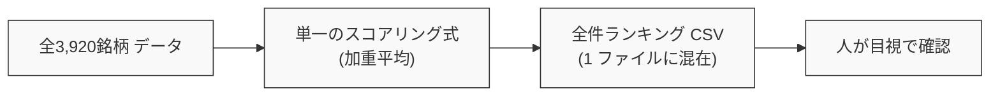
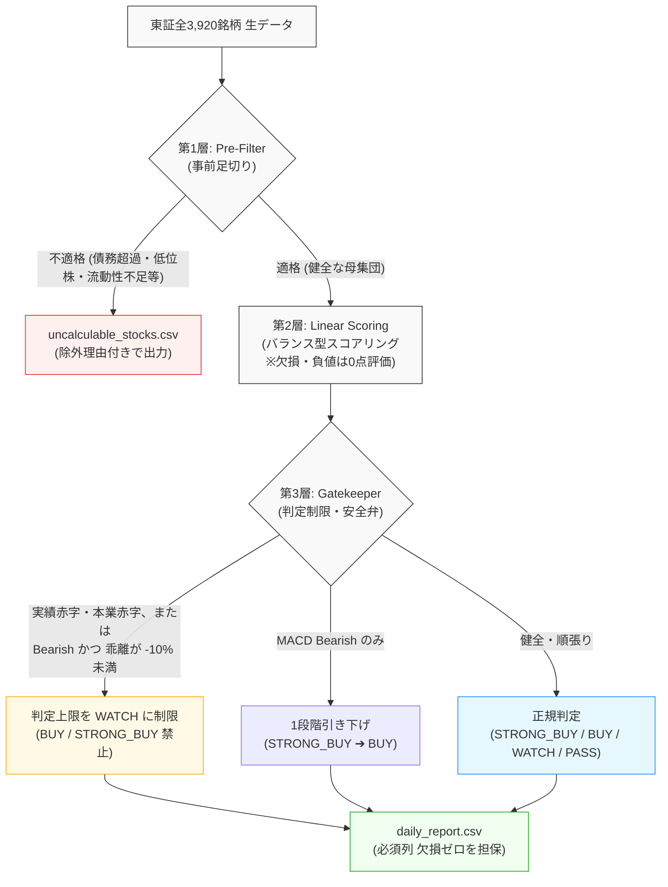

# 債務超過の銘柄が割安ランキング1位に来たので、Polarsと3層フィルタで除外ファイルを分けた

## TL;DR
- 財務確定値と株価を結合したものの、単純な全件線形ランキングでは「赤字企業の低PER」や「債務超過（マイナスPBR）」などの不適格銘柄が割安度満点で上位に入っていた現象を改善
- 健全性を判定する事前足切り（第1層）、無効値の0点評価（第2層）、赤字判定キャップ（第3層）からなる3層モデルを導入し、適格銘柄と除外銘柄を別々の2ファイルへ分離出力
- 全3,920社を約0.15秒で判定・CSV出力し、適格2,120社（WATCH/PASS含む）と除外1,800社に分離。上位候補は判定（Verdict: BUY以上）で絞り込んで並べるため、不適格銘柄の上位混入を防止

---

## 概要

本記事は、東証全上場銘柄（全3,920社）の財務・株価データをスクリーニングする分析基盤において、データの品質と信頼性を高めるために設計を見直した記録です。

前編『[EDINETの訂正有報を半年取りこぼし、yfinanceは429制限… 30日スキャン＋差分キャッシュで作り直した話](https://qiita.com/akkyey/items/12a8df355ee895ed73d4)』では、データ取得層における耐障害性の見直しにより、新着多数時で約5分、普段は約1分40秒で自動同期する仕組みを解説しました。

しかし、手元に揃えた確定データであっても、前作で採用していた「単純ソートによる全件線形ランキング」へそのまま流し込んだ場合、**「赤字企業の低PER」や「債務超過企業の高配当利回り」のように、指標の意味が成り立たない現象**に直面しました。

本稿では、前作の「全件一元ランキング」から、適格銘柄のみを抽出する「3層判定によるスクリーニング」、そして結果を後から検証しやすくする「適格・除外銘柄の2ファイル分離」についてまとめます。

> 動作環境：Ubuntu 24.04 LTS / 8 vCPU / 16GB RAM / Python 3.12.8 / Polars 1.x

---

## 第1章：前編の設計とその前提

前編において、取得した財務データと株価を結合してランキングを出力していた際、システムには以下の前提がありました。

- 一元線形評価の前提: 東証に上場するすべての銘柄は、同一のスコアリング式（PER、PBR、ROE、配当利回りの加重平均等）によって、1つの直線上で公平に比較・順位付けできると考えていた
- 全件包含の仮定: 欠損値や一時的な赤字であっても、中央値補完やゼロ埋めを行い、できるだけ全銘柄を1つのランキング表に含めるべきだと考えていた

前作の関心は「いかに全銘柄を高速に処理するか」に集中しており、「算出された数値が投資判断として成立しているか」という検証は後回しになっていました。


```mermaid
flowchart LR
    A["全3,920銘柄 データ"] --> B["単一のスコアリング式<br>(加重平均)"]
    B --> C["全件ランキング CSV<br>(1 ファイルに混在)"]
    D["人が目視で確認"]
    C --> D
    style A fill:#f9f9f9,stroke:#333,stroke-width:1px,color:#333
    style B fill:#f9f9f9,stroke:#333,stroke-width:1px,color:#333
    style C fill:#f9f9f9,stroke:#333,stroke-width:1px,color:#333
    style D fill:#f9f9f9,stroke:#333,stroke-width:1px,color:#333
```

---

## 第2章：実際に半年動かしてみて起きた問題

上記の設計で実際に運用を続けた結果、いくつかの問題が起きました。

### 1. 債務超過・不適格銘柄のランキング1位浮上
線形スコアリングの上位に、投資対象としてふさわしくない銘柄がランクインする現象が発生しました。

典型的な例が、債務超過に陥っている銘柄の「マイナスPBR」による1位浮上です。
旧システムのある日の割安ランキングでは、債務超過（自己資本比率 <= 0%、純資産マイナス）の銘柄が総合スコア1位に表示されていました。

```text
【旧ランキング（全件線形ソート）の上位出力例】
Rank: 1
Code: XXXX（匿名化）
株価: 114円
PBR: -0.80倍（純資産マイナス・債務超過）
配当利回り: 0.0%
総合スコア: 88.5点（割安度満点判定）
```

純資産がマイナスで1株あたり純資産（BPS）もマイナスになっていたため、PBRがマイナス（-0.80倍）として計算され、「数値が低いほど割安」という単純なスコアリング式で満点扱いになってしまったのです。
これ以外にも、以下のような現象が起きていました。
- 最終赤字・業績急落企業の高利回り: 業績悪化で株価が急落した銘柄が、過去実績の配当額（減配見込み前）に基づいて「超高配当株」として上位に入り込む
- 本業赤字・キャッシュ枯渇企業の混入: 営業CFが赤字（営業CFマージン -10%未満）で資金流出が続いている企業が、表面的な低PBRなどで高得点を獲得してしまう

数値として計算はできても、指標として意味を成していませんでした。

### 2. 欠損値の中央値埋めによる「平均的な会社」への偽装
旧システムでは「全件を1つのランキング表に含める」ことを優先していたため、データが取得できなかった欠損値（null）をゼロや業界中央値で補完していました。
その結果、本来であれば開示の遅れや開示形式の違いで営業CFが取れていない銘柄が「平均的なキャッシュフローを持つ会社」として計算を通過し、実態とは異なるスコアでランキング中位〜上位に残ってしまう問題が起きていました。

### 3. 超小型株の流動性トラップ
時価総額が極めて小さな超小型株において、1日数十万円しか商いがないような銘柄でもスコアが高くなり、実際にはスリッページが大きすぎて売買できない銘柄が抽出されていました。

---

## 第3章：なぜその問題が起きたのか

これらの問題は、配点比率の調整不足ではなく、設計前提そのものに原因がありました。

### 線形評価モデルの限界
健全な黒字企業と、債務超過や深刻なキャッシュ枯渇企業を「同じ1つの数式」で順位付けすること自体に無理がありました。
財務指標における「割安」と「財務不健全」は数字の上で似通うことがあり、事前に足切りを行わない線形モデルでは適切な選別が困難です。

### 1つのファイルに全件を混ぜる構造の限界
「正常に計算できた銘柄」と「除外すべき銘柄」を1つのファイルに同居させる構造そのものが、集計スクリプトや目視確認のたびに除外条件を書き直す必要があり、運用の手間とミスの原因になっていました。

---

## 第4章：どう設計し直したか

「全件を一律に順位付けする」方針をやめ、**「評価対象として健全な母集団のみをスコアリングする」**設計へ変更しました。

### 設計の基本方針
- 投資不適格なデータはスコアリングの前に除外する
- 欠損値を補完値で埋めたまま評価しない
- 評価対象銘柄と除外銘柄を別々のファイルに分けて出力する

### 2つの改善ポイント
1. **3層評価モデルによる多段階判定**:
   - **第1層（Pre-Filter: 事前足切り）**: 債務超過（自己資本比率 <= 0%）、超低位株（株価 < 50円）、極小流動性（20日平均売買代金 < 3,000万円）、出来高ゼロ日あり、営業CF赤字（マージン < -10%）に加え、取引停止銘柄や財務データ未開示銘柄をスコアリング前に除外（※無配株や営業赤字は、成長中のグロース企業を拾い上げるため第1層では落とさず、第3層ゲートキーパーで制御）
   - **第2層（Linear Scoring: 健全母集団の配点）**: 第1層を通過した健全な母集団のみに対し、バリュー・クオリティ・配当・モメンタムを多角的に配点。なお、営業CF等の欠損値（null）や負のPER・PBRなどの算出不能値は業界中央値等で穴埋めせず、**無効値として一律0点として厳格に評価**。生成される `daily_report.csv` には適格銘柄（全2,120社）がWATCHやPASSを含めて全件出力されますが、利用時に上位候補を確認する際は**判定（Verdict: BUY以上）で絞り込んだ上でスコア順に並べる**ことで、不適格な銘柄の上位混入を防ぐ設計としています
   - **第3層（Gatekeeper: 判定上限キャップと下方修正）**: 当期実績赤字（ROE < 0）や本業赤字（営業利益 <= 0 または 営業利益率 <= 0%）を検知した場合は、スコアが高得点でも判定（Verdict）を最大 `WATCH` に制限（上位判定 BUY/STRONG_BUY を禁止）。また、テクニカル面ではMACDがBearish（下落基調）の場合に `STRONG_BUY` を `BUY` へ1段階引き下げ、さらに移動平均から大きく下方乖離（< -10%）している場合は `WATCH` まで引き下げて急落局面での判定を抑制
2. **適格・除外銘柄の2ファイル分離出力**:
   - `daily_report.csv`: 必須キー（code, price, verdict）の欠損ゼロを担保した適格銘柄（全2,120社）を出力
   - `uncalculable_stocks.csv`: 除外された銘柄と、その日本語除外理由コード（`データ鮮度不足 (取引停止)`, `重要指標未開示/算出不能`, `商い不成立`, `極小流動性トラップ`, `超低位ボロ株`, `構造的破綻 (債務超過)`, `致命的キャッシュ枯渇`等）を出力


```mermaid
flowchart TD
    Raw["東証全3,920銘柄 生データ"] --> L1{"第1層: Pre-Filter<br>(事前足切り)"}
    
    L1 -- "不適格 (債務超過・低位株・流動性不足等)" --> Uncalc["uncalculable_stocks.csv<br>(除外理由付きで出力)"]
    L1 -- "適格 (健全な母集団)" --> L2["第2層: Linear Scoring<br>(バランス型スコアリング<br>※欠損・負値は0点評価)"]
    
    L2 --> L3{"第3層: Gatekeeper<br>(判定制限・安全弁)"}
    L3 -- "実績赤字・本業赤字、または<br>Bearish かつ 乖離が -10% 未満" --> Cap["判定上限を WATCH に制限<br>(BUY / STRONG_BUY 禁止)"]
    L3 -- "MACD Bearish のみ" --> StepDown["1段階引き下げ<br>(STRONG_BUY ➔ BUY)"]
    L3 -- "健全・順張り" --> Normal["正規判定<br>(STRONG_BUY / BUY / WATCH / PASS)"]
    
    Cap --> Daily["daily_report.csv<br>(必須列 欠損ゼロを担保)"]
    StepDown --> Daily
    Normal --> Daily
    
    style Raw fill:#f9f9f9,stroke:#333,stroke-width:1px,color:#333
    style L1 fill:#f9f9f9,stroke:#333,stroke-width:1px,color:#333
    style L2 fill:#f9f9f9,stroke:#333,stroke-width:1px,color:#333
    style L3 fill:#f9f9f9,stroke:#333,stroke-width:1px,color:#333
    style Uncalc fill:#fff0f0,stroke:#d33,stroke-width:1px,color:#333
    style Cap fill:#fff9e6,stroke:#fa0,stroke-width:1px,color:#333
    style Normal fill:#e6f7ff,stroke:#1890ff,stroke-width:1px,color:#333
    style Daily fill:#f0fff0,stroke:#2a2,stroke-width:1px,color:#333
```

---

## 第5章：実装のポイントとコード

実装のポイントは、「Polarsによる集計と日本語理由の付与」、「第3層ゲートキーパーによる判定制限」、そして「必須列の欠損検証」の3点です。

### 1. Polars集計と辞書走査による除外理由の付与（第1層 Pre-Filter）
直近20日間の平均売買代金や直近5日間の出来高ゼロ日数といった時系列集計は、Polarsで高速に処理します。
その上で、個々の銘柄に対する8段階の足切り判定と日本語の除外理由（`filter_reason`, `filter_detail`）の付与を行います。

```python:src/calc/pre_filter.py
class PreFilter:
    """第1層：不適格銘柄の除外と母集団の分離"""
    MIN_TRADING_VALUE_20D = 30_000_000.0  # 20日平均売買代金 3,000万円基準
    MIN_PRICE = 50.0                      # 株価 50円基準
    MIN_EQUITY_RATIO = 0.0                # 自己資本比率 0%基準 (債務超過)
    MIN_OP_CF_MARGIN = -0.10              # 営業CFマージン -10%基準
    CF_EXEMPT_SECTORS = {"銀行業", "保険業", "証券、商品先物取引業"}  # 金融セクター除外

    @classmethod
    def evaluate(cls, df_candidates: pl.DataFrame, df_liquidity: Optional[pl.DataFrame] = None) -> PreFilterResult:
        # ...（前処理および変数の初期化は一部省略）
        min_tv_20d = cls.MIN_TRADING_VALUE_20D
        min_price = cls.MIN_PRICE
        min_eq_ratio = cls.MIN_EQUITY_RATIO
        min_op_cf_margin = cls.MIN_OP_CF_MARGIN
        passed_rows, rejected_rows = [], []

        records = df.to_dicts()
        for row in records:
            price = row.get("price")
            equity_ratio = row.get("equity_ratio")
            operating_cf = row.get("operating_cf")
            sales = row.get("sales")
            avg_tv = row.get("avg_trading_value_20d")
            zero_days = row.get("zero_volume_days_5d")
            latest_trade_date = row.get("latest_trade_date")
            is_recent_trade = row.get("is_recent_trade")
            sector = str(row.get("sector", "Other"))

            # ① 市場データ取得不能（株価欠損）
            if price is None:
                rejected_rows.append({**row, "filter_reason": "市場データ取得不能", "filter_detail": "市場価格データ欠損 (OHLCV未取得)"})
                continue

            # ② 取引日・市場データ欠損（直近5営業日範囲外または取引日データ欠損）
            if latest_trade_date is None or is_recent_trade is False:
                detail = "最終取引日データ欠損" if latest_trade_date is None else f"最終取引日 ({latest_trade_date}) が直近5営業日範囲外"
                rejected_rows.append({**row, "filter_reason": "データ鮮度不足 (取引停止)", "filter_detail": detail})
                continue

            # ③ 売買不能（直近5営業日出来高ゼロ日ありまたは出来高データ欠損）
            if zero_days is None or zero_days > 0:
                detail = "出来高時系列データ欠損" if zero_days is None else f"直近5営業日以内に出来高ゼロ日あり ({zero_days}日)"
                rejected_rows.append({**row, "filter_reason": "商い不成立", "filter_detail": detail})
                continue

            # ④ 極小流動性トラップ（20日平均売買代金欠損、または < 3,000万円）
            if avg_tv is None or avg_tv < min_tv_20d:
                detail = "売買代金データ欠損/算出不能" if avg_tv is None else f"20日平均売買代金不足 ({avg_tv/10000:,.0f}万円 < 3,000万円)"
                rejected_rows.append({**row, "filter_reason": "極小流動性トラップ", "filter_detail": detail})
                continue

            # ⑤ 超低位ボロ株（株価 < 50円）
            if price < min_price:
                rejected_rows.append({**row, "filter_reason": "超低位ボロ株", "filter_detail": f"株価基準未満 ({price:,.0f}円 < 50円)"})
                continue

            # ⑥ 構造的破綻（債務超過判定: 純資産マイナス または 自己資本比率 <= 0）
            net_assets = row.get("net_assets")
            if (net_assets is not None and net_assets <= 0) or (equity_ratio is not None and equity_ratio <= min_eq_ratio):
                detail = f"純資産マイナス ({net_assets:,.0f}円)" if (net_assets is not None and net_assets <= 0) else f"自己資本比率マイナス/ゼロ ({equity_ratio:.1f}% <= 0.0%)"
                rejected_rows.append({**row, "filter_reason": "構造的破綻 (債務超過)", "filter_detail": detail})
                continue

            # ⑦ 重要指標未開示 / 算出不能（自己資本比率等の財務データ未開示または欠損）
            if equity_ratio is None:
                rejected_rows.append({**row, "filter_reason": "重要指標未開示/算出不能", "filter_detail": "自己資本比率等の財務諸表データ未開示または欠損"})
                continue

            # ⑧ 致命的キャッシュ枯渇（営業CFマージン < -10% ※金融・保険業免除）
            if sector not in cls.CF_EXEMPT_SECTORS and operating_cf is not None and sales and sales > 0:
                if (operating_cf / sales) < min_op_cf_margin:
                    rejected_rows.append({**row, "filter_reason": "致命的キャッシュ枯渇", "filter_detail": "営業CFマージン大幅赤字"})
                    continue

            passed_rows.append(row)

        return PreFilterResult(passed_df=pl.DataFrame(passed_rows), rejected_df=pl.DataFrame(rejected_rows))
```

> ※注：売買代金の二重掛けバグについて  
> 開発中に頭を抱えたのが、売買代金の二重掛けバグでした。すでに円単位になっていた売買代金データに対して再度株価を掛け算してしまい、1日50万円しか商いのない極小銘柄が足切りをすり抜けていました。気づいたときは冷や汗が出ましたが、株数（`volume`）と売買代金（`trading_value`）のマッピングを見直して修正しました。

> ※注：なぜベクトル式ではなく辞書走査なのか  
> 20日平均売買代金などの集計はPolarsで高速に処理しています。その後の足切り判定では、8段階のフォールスルー判定と日本語の除外理由テキストを生成する必要があるため、全3,920行程度であれば保守性や読みやすさを重視して辞書走査（実行時間は十数ミリ秒）を採用しています。

### 2. 第3層ゲートキーパー：判定上限キャップと下方修正
第1層ではあえて無配株や営業赤字を落とさず、成長期待のあるグロース銘柄の評価余地を残しています。
その代わり、第3層ゲートキーパーにおいて「当期実績赤字企業」や「本業赤字企業」を検知した場合は、スコアが高得点であっても判定（Verdict）を最大 `WATCH` に制限（上位判定 BUY/STRONG_BUY を禁止）します。また、テクニカル面ではMACDがBearish（下落トレンド）の場合に判定を1段階引き下げ（`STRONG_BUY` ➔ `BUY`）、さらに移動平均から大きく下方乖離（< -10%）している場合は `WATCH` まで引き下げて急落局面での上位選出を防ぎます。

```python:src/calc/quant_evaluator.py
@classmethod
def _determine_verdict(cls, score: float, roe: Optional[float], macd_status: str, ma_div: Optional[float], op_income: Optional[float] = None, operating_margin: Optional[float] = None) -> str:
    # 基礎配点による暫定判定
    if score >= 80.0: verdict = "STRONG_BUY"
    elif score >= 65.0: verdict = "BUY"
    elif score >= 50.0: verdict = "WATCH"
    else: verdict = "PASS"

    # ゲートキーパー 1: 当期実績赤字（ROE < 0）銘柄のキャップ制限
    # 前期比で改善傾向であっても、当期実績が赤字の銘柄は最大 WATCH に制限（有報の実績値のみで判定）
    if roe is not None and roe < 0 and verdict in ["STRONG_BUY", "BUY"]:
        verdict = "WATCH"

    # ゲートキーパー 2: 本業赤字のキャップ制限
    # 営業利益が赤字（営業利益率 <= 0% または 営業利益 <= 0）の銘柄は、最大 WATCH に制限
    is_op_loss = (operating_margin is not None and operating_margin <= 0) or (op_income is not None and op_income <= 0)
    if is_op_loss and verdict in ["STRONG_BUY", "BUY"]:
        verdict = "WATCH"

    # ゲートキーパー 3: テクニカル・下降トレンド制限
    if "Bearish" in macd_status:
        if verdict == "STRONG_BUY":
            verdict = "BUY"
        if ma_div is not None and ma_div < -10.0 and verdict == "BUY":
            verdict = "WATCH"

    return verdict
```

### 3. 必須列の欠損ゼロを担保するデータ検証
判定を通過したデータフレームに対し、CSV出力の直前で検証を実行します。
投資判断に不可欠な必須キー（`code`, `price`, `verdict`）に1セルでも欠損がある場合、処理を停止して欠損データが出力されるのを防ぎます。
なお、PERやPBR等の算出不能指標（赤字企業など）については、安全にフォーマットされたハイフン（`-`）として出力されます。

```python:src/orchestration/phases/integration.py
def _verify_data_contract(df: pl.DataFrame) -> None:
    essential_cols = ["code", "price", "verdict"]
    cols = set(df.columns)
    missing_cols = set(essential_cols) - cols

    if missing_cols:
        raise AssertionError(
            f"Data Contract Violation: Missing required essential columns in DataFrame: {sorted(missing_cols)}"
        )

    null_exprs = [pl.col(c).is_null().sum().alias(c) for c in essential_cols]
    null_counts = df.select(null_exprs).to_dicts()[0]
    invalid_cols = {col: count for col, count in null_counts.items() if count > 0}
    if invalid_cols:
        raise AssertionError(
            f"Data Contract Violation: Null values detected in essential columns: {invalid_cols}"
        )
```

> ※注：なぜ異常行をスキップせず AssertionError で止めるのか  
> 欠損行だけ飛ばして処理を続ける手もありますが、このCSVは翌朝の銘柄確認にそのまま使うので、壊れたまま出力されるよりはエラーで止まってくれたほうが安全だと判断しました。下流に不正なデータを流さないためのガードレールです。

> ※注：PolarsにおけるNaNの扱い  
> Polarsでは浮動小数点数の `NaN` は `is_null()` では捕捉されません。そのため、前段の集計フェーズで `fill_nan(None)` を実行してnullに正規化し、契約検証で確実に検知できるようにしています。

---

## 第6章：動かしてみた結果とベンチマーク

設計を見直した結果、母集団の選別が適切に行われるようになり、安心して確認できるランキングが出力されるようになりました。

### 運用して確認できたこと
- 不適格銘柄の除外: 債務超過やキャッシュ枯渇、極小商いの銘柄が第1層で除外され、指標の意味が成り立たない銘柄が上位に上がってくる現象を解消
- 必須列の欠損ゼロ: `daily_report.csv` の必須列欠損ゼロが担保され、算出不能指標も `-` で整形されたことで、手動確認時にも数値の意味を疑わずに済む環境を確立
- 明確な母集団の分離: 東証全銘柄（全3,920社）を以下の2つに分離して出力
  - 評価対象銘柄（`daily_report.csv`）: 2,120 社
  - 除外対象銘柄（`uncalculable_stocks.csv`）: 1,800 社（除外理由つき）

```text
■ daily_report.csv (適格 2,120社 / 必須キー欠損ゼロ)
Rank,Code,Name,Sector,Price,Verdict,Score,ROE,PER,PBR,Div_Yield
1,A001,サンプル商事,卸売業,2850.0,BUY,82.5,12.4,9.2,1.05,2.85
2,A002,サンプル銀行,銀行業,1520.0,BUY,78.0,8.5,10.1,0.85,3.20
... (以下、適格銘柄のみが並ぶ)

■ uncalculable_stocks.csv (除外 1,800社 / 日本語の除外理由付き)
code,name,price,filter_reason,filter_detail
X001,サンプルメディカル,,市場データ取得不能,市場価格データ欠損 (OHLCV未取得)
X002,サンプル開発,32.0,超低位ボロ株,株価基準未満 (32円 < 50円)
X003,サンプル産業,150.0,構造的破綻 (債務超過),自己資本比率マイナス/ゼロ (-5.2% <= 0.0%)
X004,サンプル興産,500.0,商い不成立,直近5営業日以内に出来高ゼロ日あり (1日)
```
> ※表示されている銘柄コード・銘柄名・数値はすべて解説用のダミーデータです。  
> ※注：1位のサンプル商事はスコア82.5点ですが、第3層ゲートキーパーによりテクニカル指標（MACD Bearish）を検知して `STRONG_BUY` から `BUY` へ1段階引き下げが作動した出力例です。

### 除外銘柄（1,800社）の理由別内訳

Pre-Filterで除外された1,800社の内訳は以下の通りです。

| 除外判定理由（filter_reason） | 除外社数 | 主な除外詳細（filter_detail） |
| :--- | :---: | :--- |
| 極小流動性トラップ | 1,464 社 | 20日平均売買代金が3,000万円未満 |
| 商い不成立 | 128 社 | 直近5営業日以内に出来高ゼロ日が存在 |
| 市場データ取得不能 | 104 社 | yfinance等の市場価格（OHLCV）データ未取得 |
| 致命的キャッシュ枯渇 | 72 社 | 営業CFマージンが-10%未満の赤字流出（金融除く） |
| 超低位ボロ株 | 15 社 | 株価が50円未満 |
| データ鮮度不足 (取引停止) | 11 社 | 最終取引日が直近5営業日範囲外（長期取引停止等） |
| 構造的破綻 (債務超過) | 5 社 | 純資産マイナスまたは自己資本比率 <= 0% |
| 重要指標未開示/算出不能 | 1 社 | 自己資本比率等の必須財務データ未開示 |
| **除外銘柄 合計** | **1,800 社** | **全3,920社中 45.9% をスコアリング前に隔離** |

> ※注：除外内訳のカウント方式について  
> 本内訳はフォールスルー方式（判定条件を上から順に評価し、最初に該当した理由でカウント）で集計しています。そのため、「極小流動性トラップ（1,464社）」の中には、下流の「株価50円未満」や「営業CF赤字」の条件も重複して満たす銘柄が含まれています。

### スクリーニング処理時間の測定結果

多段階の判定と安全弁を追加したものの、Polarsの集計と辞書走査の組み合わせにより、全3,920社のスクリーニングは約0.15秒（トリム平均 147ミリ秒）で処理できています。

| 項目 | 前回 (第4弾: 速度優先) | 今回 (3層評価モデル) | 改善内容 |
| :--- | :---: | :---: | :--- |
| 処理所要時間 | 約 4.0 秒 | 0.15 秒 (147 ms / トリム平均) | 判定レイヤーを多重化しながら十分な速度を維持 |
| 判定レイヤー数 | 0 層 (単純ソート) | 3 層 (Pre-Filter ➔ 配点 ➔ Gatekeeper) | 投資対象として不適格な銘柄を事前に除外 |
| 不適格銘柄の除外 | 混入あり (低PBR等で浮上) | 事前判定により除外 | 指標が成り立たない銘柄の上位混入を防止 |
| 出力ファイル構造 | 1 ファイル (欠損混在) | 2 ファイル分離 (適格 2,120社 / 除外 1,800社) | 下流での再フィルタや複雑な条件分岐が不要 |
| 必須列の欠損率 | 欠損や例外値が混在 | 0.00 % (欠損ゼロを担保) | 契約検証 (Assertion) によるデータ品質保証 |

> ※注：測定方法と処理時間（0.15秒 vs 3.3秒）の範囲について  
> 単発実行時の揺らぎを避けるため5回連続測定を実施し、最大・最小を除いた中央3回のトリム平均（Trimmed Mean）を算出しています（最速 131 ms 〜 最遅 195 ms、平均 147 ms）。  
> なお、本稿の「0.15秒」は、全3,920銘柄のデータがメモリ上に準備された状態から、スクリーニング処理および2つのCSV出力が完了するまでの所要時間です（前編で触れた「日中のスクリーニング分析：約3.3秒」は、ローカル蓄積DBからの全データ読み込みI/Oを含めた総合所要時間です）。前回（約4.0秒）も同様にメモリ上でのPolars全件線形ソート・処理時間ですが、判定レイヤーを3層に多重化したにもかかわらず処理時間を短縮できた主な要因は、20日移動平均・売買代金等の時系列集計処理をPolarsベクトル演算へ集約したことによる効果が大きく、Python側での辞書走査足切り判定も十数ミリ秒程度で完了するため全体のオーバーヘッドが極めて小さく抑えられていることによるものです。

### 今回の設計の限界とトレードオフ

本設計を導入するにあたり、以下のトレードオフを意識的に受け入れています。

1. **売買代金基準（3,000万円）による大量除外とスタイルの制約**:  
   Pre-Filterにおいて「20日平均売買代金3,000万円以上」を課したことで、東証全銘柄の約37%（1,464社）がこの単一基準でスクリーニング対象外となります。これは、個人投資家〜中小型ファンドの運用における「板の薄さによるスリッページ」や「買えても売れなくなる流動性リスク」を抑えるための保守的な設計です。そのため、「時価総額数十億円の超小型株や地方単独上場銘柄から大化け株を発掘する」ような投資スタイルには向かず、そうした分析を行う場合は閾値を下げるか別の判定パイプラインを用意する必要があります。
2. **フォールスルー方式による除外理由の優先度依存**:  
   除外理由は判定条件の上から順に評価して最初に該当したものを記録しているため、「極小流動性トラップ」で除外された銘柄の中に、実は「債務超過」や「営業CF赤字」の銘柄も含まれています。除外銘柄の網羅的な多重フラグ分析を行う場合は、フォールスルーではなく全フラグのビットマスク集計等に拡張する必要があります。
3. **黒字を維持したまま急落した銘柄の過去配当トラップ**:  
   当期実績が黒字のまま株価が急落した銘柄については、第1層の足切りや第3層の赤字キャップをすり抜け、過去実績配当に基づいた「見かけの高利回り」として上位に残る余地があります（テクニカル下降トレンドで1段階下がるのみ）。直近の会社予想下方修正や減配リスクをリアルタイムに反映するには、EDINETの通期確定値だけでなくTDnet等の適時開示ニュースデータの連携が必要であり、今後の拡張課題としてのトレードオフです。

---

## 結論

前編・後編を通じたパイプラインの再構成を通じて、以下の2点を実感しました。

1. **「処理速度は、設計を整理した結果として付いてくる」**:  
   速度だけを目的にチューニングするのではなく、時系列整合性やデータの意味を保つために境界を整理した結果、全体パイプラインは約5分（平常時は約1分40秒）、スクリーニング層は0.15秒という十分な速度が得られました。
2. **「数字が出せることと、その数字が意味を持つことは別」**:  
   単に欠損値を埋めて無理やり全件の順位を計算するのではなく、足切りと除外理由の記録をパイプライン側でやっておくことで、毎朝のランキングを信用して見られるようになりました。

### 今後の展望：AIエージェント連携への布石

今回、スクリーニング結果を「必須列欠損ゼロの適格銘柄（`daily_report.csv`）」と「日本語理由付きの除外銘柄（`uncalculable_stocks.csv`）」の2ファイルに明確に分離しました。

この設計は日次の目視確認をスムーズにするだけでなく、**「次のフェーズとして、出力したCSVをAIエージェントに渡して解釈させ、詳細な分析レポート作成を自律化させる」**ための布石でもあります。

欠損や例外値が含まれたままのテーブルをLLMに渡すと、推論機能が仇となって意図しない解釈やハルシネーションを引き起こしやすくなります。しかし、データパイプライン側で品質契約（欠損ゼロ）を担保し、不適格な銘柄を除外理由つきで別ファイルに隔離しておけば、AIエージェントにとっても欠損や除外理由が整理された入力になります。

この「出力したCSVをAIエージェントに解釈させて完成させる」ステップは、今後の取り組みとして進めていく予定です。パイプラインが信頼できるデータを供給できるようになったことで、安心して次のステップへ進めそうです。

> ※【今後の実装に関する注記】  
> 今後公開予定のOSSリポジトリでは、金融商品取引法（投資助言規制）に配慮し、本記事で解説した判定文字列（STRONG_BUY / BUY 等）に加えて客観的な格付けグレード（Grade S / Grade A 等）への切替機能を設ける予定です。

---

> 免責事項（Disclaimer）  
> 本記事はデータエンジニアリングおよびパイプライン設計の技術的知見を共有するものであり、特定の有価証券の売買推奨や投資助言を目的としたものではありません。掲載されている判定基準やスコアリングロジックは分析基盤の検証・学習用途であり、実際の投資判断はご自身の責任において行ってください。
