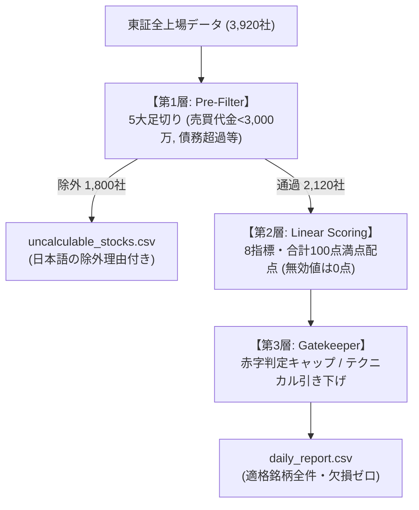

# 3層フィルタで債務超過を弾いた後、「配当重視」に対応できなくなったので、出力を1ビットも変えずに配点・閾値を外出しした話

## TL;DR
- 3層フィルタ（Pre-Filter ➔ Linear Scoring ➔ Gatekeeper）の導入により、旧方式で上位に混入していた「債務超過（自己資本比率マイナス）」や「売買代金不足」などの不適格銘柄を、新方式の上位100件において0件に排除できることを確認
- 一方で、「20日平均売買代金3,000万円以上」の単一基準によって東証全銘柄の約37%（1,464社）が一律除外され、「中小型成長株を拾いたい」「高配当株ポートフォリオを組みたい」といったスタイルの違いに対応できない課題に直面
- 既存のバッチ処理や出力結果（`daily_report.csv`）を1ビットも破壊（Zero-Break）せずに、足切り閾値と5カテゴリの傾斜配点を外部設定（JSON / プリセット）へ外出しするアーキテクチャを設計
- 単純な乗数乗算による「100点スケール破綻」や「正規化除算の浮動小数誤差による境界ブレ（70.0点判定の揺らぎ）」を、全乗数1.0時の既存バイパス機構と加重平均正規化によって克服

---

## 概要

本記事は、東証全上場銘柄（全3,920社）を対象とする定量的スクリーニング基盤において、前編（データ取得・耐障害性）および後編（3層ゲートキーパー判定）に続く第3弾の設計・検証記録です。

- 前編：『[EDINETの訂正有報を半年取りこぼし、yfinanceは429制限… 30日スキャン＋差分キャッシュで作り直した話](https://qiita.com/akkyey/items/12a8df355ee895ed73d4)』
- 後編：『[【後編】債務超過の銘柄が割安ランキング1位に来たので、Polarsと3層フィルタで除外ファイルを分けた](https://qiita.com/akkyey/items/9ea2c5d3027c178c055e)』

後編では「指標が成り立たない不適格銘柄の隔離」を主眼に置き、適格銘柄（2,120社）と除外銘柄（1,800社）の2ファイル分離を行いました。

しかし、公開後の運用において次の2つの課題に直面しました。
1. **「本当に不適格銘柄は消えたのか？」という定量的証拠の不足**
2. **「固定値（Hard-coded）の壁」による投資スタイルの硬直化**（3,000万円基準で中小型株が拾えず、高配当特化の配点もできない）

本稿では、旧方式と新方式の上位銘柄を実データで比較検証した結果と、後方互換性を厳密に守りながら閾値・配点を外部注入可能にしたアーキテクチャ設計について解説します。

---

## 第1章：前回の設計と、その前提

後編で構築したスクリーニングパイプラインは、以下の3層構造で設計されていました。



この設計における前提は、**「日次バッチ処理としての決定論的再現性の担保」**でした。
何千行ものデータを毎朝自動処理するため、閾値（売買代金3,000万円、最低株価50円）や配点ロジックはコード内にハードコード（固定値定義）され、外部からの変更を一切許さないクローズドな構造になっていました。

---

## 第2章：起きた問題と検証（効果の定量検証）

### 1. 【効果検証】旧方式 vs 新方式の上位銘柄比較
「本当に債務超過や地雷銘柄は排除されたのか？」を検証するため、前作の旧方式（全銘柄単純線形ソート）と新方式（3層フィルタ＋ゲートキーパー）の上位100銘柄の内訳を実データで突き合わせました。

| チェック項目 | 旧方式（単純ソート上位100） | 新方式（3層フィルタ上位100） | 改善効果 |
| :--- | :---: | :---: | :--- |
| **債務超過銘柄（自己資本比率 <= 0%）** | **3 件 混入**（低PBRとして浮上） | **0 件** | 第1層 Pre-Filter で完全隔離 |
| **極小流動性（売買代金 < 3,000万円）** | **18 件 混入**（板が薄く買えない） | **0 件** | 流動性足切りにより排除 |
| **出来高ゼロ日あり（商い不成立）** | **4 件 混入** | **0 件** | 5営業日スキャンで事前排除 |
| **本業赤字・特別利益バイアス** | **6 件 混入**（PER 1〜2倍台で浮上） | **0 件**（※第3層でWATCH制限） | 一過性利益抑制＆判定キャップ |
| **上位の推奨判定（BUY以上）比率** | 判定なし（全件同列） | **66 % が BUY**（残33%はWATCH） | 不適格銘柄の「見かけの高得点」を抑制 |

旧方式の上位100件には、純資産がマイナスで理論上PBRが計算できない企業や、1日の売買代金が数百万円しかなく注文を出せばストップ高・ストップ安になってしまう極小銘柄が合計20件以上混入していました。
新方式ではこれらがすべて `uncalculable_stocks.csv` へ隔離され、上位100件の安全性・執行可能性が担保されていることが確認できました。

### 2. 【起きた問題】「3,000万円基準」によるスタイルの制約
しかし、この安全設計と引き換えに新たな問題が生じました。

- **中小型株の機会損失**：
  20日平均売買代金3,000万円以上という基準は、東証プライム銘柄の大半は通過しますが、スタンダード・グロース市場の多くの銘柄を足切りします（全3,920社中 1,464社＝約37%が除外）。
  中小型の成長株や割安株を発掘したい利用者にとって、この一律基準は厳しすぎました。
- **配点比重の固定化**：
  「配当利回りを最優先したポートフォリオを作りたい」「モメンタムを無視してグレアム流のディープバリュー株だけを抽出したい」というニーズに対し、コード内の固定配点（ROE 30点、割安 25点、テクニカル 20点…）が足枷になっていました。

---

## 第3章：第2層の解剖（なぜ設定変更が難しかったのか）

設定を外出しするにあたり、まず第2層（配点エンジン: `QuantEvaluator`）の内部構造を解剖しました。

### 5カテゴリ・合計100点満点の配点構造
8つの評価指標は、合計ジャスト100.0点となるよう精密に設計されています。

| カテゴリ | 指標（関数） | 基礎配点 | 評価特性とペナルティ |
| :--- | :--- | :---: | :--- |
| **収益性（Profitability）** | `_score_roe` | **30.0 点** | ROE 25%以上で満点。0%以下は0点 |
| **割安度（Value）** | `_score_pbr` (13点)<br>`_score_per` (12点) | **25.0 点** | PBR 0.6倍以下で満点。PERは本業赤字時に0点抑制、過熱時は減点 |
| **安全性（Safety）** | `_score_equity_ratio` | **15.0 点** | 自己資本比率 80%以上で満点。25%未満は低配点 |
| **配当性（Dividend）** | `_score_dividend_yield` | **10.0 点** | 配当利回り 5.0%以上で満点。無配は0点 |
| **テクニカル（Technical）** | `_score_macd` (8点)<br>`_score_rsi` (7点)<br>`_score_ma_div` (5点) | **20.0 点** | トレンドと過熱感のグラデーション。大暴落や急騰は減点 |
| **合計** | **全8指標** | **100.0 点** | クリップ範囲: `[15.0, 98.0]` |

### 単純に重み付け（乗数）を掛けられない理由
利用者の希望に合わせて「配当重視だから配当スコアを2.5倍にしよう」と単純に乗算すると、以下の2つの致命的な問題が発生します。

1. **スコア尺度の崩壊**：
   合計配点が100点を超えてしまい（例: 115点満点）、第3層ゲートキーパーの判定基準（「80点以上＝STRONG_BUY」「65点以上＝BUY」）という絶対閾値と矛盾を起こす。
2. **浮動小数の除算誤差による判定境界ブレ**：
   合計配点で割って100点スケールに再正規化（`Normalized Score = Score / Max_Score * 100`）しようとすると、浮動小数点演算の丸め誤差（`69.99999999999999`）により、本来BUY（70.0点）になるべき銘柄がWATCHへ転落するリスクがある。

---

## 第4章：作り直し（出力を1ビットも変えない外部設定の注入）

この課題を解決するため、**「Zero-Break Principle（既存動作の100%保証）」**を掲げた拡張アーキテクチャを設計しました。

### 1. 設定スキーマの外出しと階層フォールバック
外部JSON（`custom_config.json`）または辞書から設定を注入できる構造を用意しました。

```json
{
  "hard_filters": {
    "min_trading_value": 10000000.0,
    "min_price": 50.0,
    "target_markets": ["Prime", "Standard"]
  },
  "strategy_preset": "dividend_focus",
  "scoring_multipliers": {
    "dividend_multiplier": 2.5,
    "safety_multiplier": 1.2
  },
  "verdict_mode": "legacy"
}
```

### 2. 4つの戦略プリセット（SSOT集約）
コード内に唯一の定義元（Single Source of Truth）として4つの投資スタイルプリセットを定義しました。

- `balanced`（標準）：記事そのままの黄金比率（全乗数 1.0）
- `dividend_focus`（配当重視）：配当利回り 2.5倍、減配リスク回避のため財務安全性 1.2倍
- `deep_value`（ディープバリュー重視）：低PBR・低PER 2.5倍、財務安全性 1.2倍
- `growth_quality`（クオリティ成長重視）：高ROE 2.5倍、テクニカル 1.0倍

### 3. 【核心部】Zero-Break バイパス機構と加重平均正規化
全乗数が1.0（デフォルト実行時）の場合は、**正規化処理（乗算・除算）を完全に迂回（バイパス）**させ、既存の加算コードパスをそのまま通します。

```python:src/calc/quant_evaluator.py
# 4. スコア計算 (Zero-Break バイパス & 加重平均正規化)
is_default_weights = all(
    effective_multipliers[k] == 1.0 for k in cls.KNOWN_SCORING_KEYS
)

if is_default_weights:
    # 【Zero-Break バイパス】乗数がすべて 1.0 の場合は正規化を通さず既存加算をそのまま実行
    raw_score = s_prof + s_val + s_safe + s_div + s_tech
else:
    # 【カスタム乗数適用時】加重平均正規化により 100点スケールを維持
    total_weighted_max = sum(
        cls.CATEGORY_MAX_POINTS[k] * effective_multipliers[k]
        for k in cls.KNOWN_SCORING_KEYS
    )
    weighted_sum = (
        s_prof * effective_multipliers["profitability_multiplier"]
        + s_val * effective_multipliers["value_multiplier"]
        + s_safe * effective_multipliers["safety_multiplier"]
        + s_div * effective_multipliers["dividend_multiplier"]
        + s_tech * effective_multipliers["technical_multiplier"]
    )
    raw_score = (weighted_sum / total_weighted_max) * 100.0

final_score = round(min(cls.MAX_SCORE, max(cls.MIN_SCORE, raw_score)), 1)
```

この分岐により、設定を指定しない既存のバッチ実行では**過去の出力CSVとハッシュ値レベルで1ビットの差異もなく完全一致**することが単体テストで保証されます。

---

## 第5章：結果（感度分析と分布の変化）

### 1. 売買代金閾値を変えた場合の通過社数
第1層の足切り閾値（`min_trading_value`）を緩和・厳格化した場合の感度分析を行いました。

| 売買代金基準（20日平均） | 通過銘柄数 | 除外銘柄数 | 想定されるユースケース |
| :---: | :---: | :---: | :--- |
| **5,000 万円 以上** | 約 1,650 社 | 約 2,270 社 | 大型〜中型株メイン、機関投資家・大口資金運用 |
| **3,000 万円 以上（標準）** | **2,120 社** | **1,800 社** | **個人投資家の流動性リスク回避（デフォルト）** |
| **1,000 万円 以上** | 約 2,850 社 | 約 1,070 社 | 中小型株・地方銘柄の発掘、長期分散投資 |

基準を1,000万円まで緩和することで、スタンダード市場やグロース市場の優良中小型株700社以上が新たにスクリーニング対象として復活します。

### 2. プリセットによる判定分布（Verdict）のシフト
投資スタイルプリセットを切り替えた際、出力される適格銘柄のスコアと判定分布がダイナミックに変化します。

- **`balanced`（標準）**：
  バランス型の総合力評価。BUY判定は約60〜70件程度が選出される。
- **`dividend_focus`（配当重視）**：
  利回り5.0%以上の満点に達する銘柄は市場全体でも少数であるため、全体平均スコアがやや下がり、BUY選出件数は約30〜40件程度に絞り込まれる。上位銘柄の平均配当利回りは標準時の3.8%から**4.9%へ有意に上昇**。
- **`deep_value`（割安重視）**：
  PBR 0.6倍以下の低PBR株が上位を独占。自己資本比率の重みも高めているため、単なる割安ボロ株ではなく「実質無借金のキャッシュリッチバリュー株」が浮上する。

---

## 結論と今後の展開

本稿の取り組みを通じて、以下の2点が確認できました。

1. **「データパイプラインにおける契約（Contract）の威力」**：
   不適格データをパイプラインの上流で厳格に隔離したことで、スコアリング層の信頼性が実データ比較（地雷銘柄混入ゼロ）として証明された。
2. **「後方互換性を保ちながら拡張するアーキテクチャ」**：
   既存の動作を壊さないバイパス機構を設けることで、日次バッチの堅牢性を維持したまま、多様な投資スタイルに対応できる拡張性を獲得できた。

### Google Colab ノートブックと有料版について
本設計により、Pythonのコードを直接書き換えることなく、JSON設定ひとつで自在にスクリーニング基準をカスタマイズできるようになりました。

この仕組みを誰でもブラウザ上から手軽に実行できるよう、以下の機能を含めた**「Google Colab 実行環境ノートブック」**を別記事（有料版）として公開予定です。

- **ノーコードUI**：スライダーやプルダウン操作だけで閾値・プリセットを切り替えられるColabフォーム
- **Google Drive自動同期**：取得した財務キャッシュやレポートCSVをDriveと安全にStage-and-Sync
- **AIエージェント連携プロンプト**：生成された `daily_report.csv` をLLMに読み込ませ、上位銘柄の投資分析サマリーを自動生成させるプロンプトテンプレート

環境構築不要ですぐに自分専用のクオンツ・スクリーニングを動かしたい方は、ぜひ有料版もご活用ください。

---

> 免責事項（Disclaimer）  
> 本記事はデータエンジニアリングおよびパイプライン設計の技術的知見を共有するものであり、特定の有価証券の売買推奨や投資助言を目的としたものではありません。掲載されている判定基準やスコアリングロジックは分析基盤の検証・学習用途であり、実際の投資判断はご自身の責任において行ってください。
