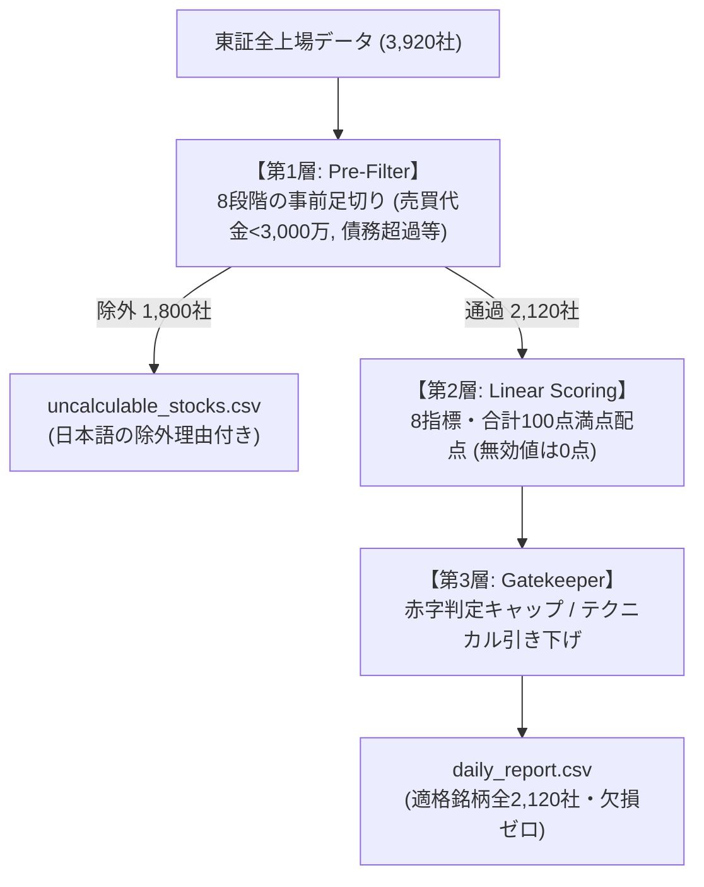

# 3層フィルタで債務超過を弾いた後、「配当重視」に対応できなくなったので、出力を1ビットも変えずに配点・閾値を外出しした話

## TL;DR
- 3層判定モデルの導入により、旧方式の単純ソート上位100件に混入していた「債務超過（自己資本比率マイナス）」や「売買代金不足」などの不適格銘柄を、新方式のスコア順上位100件において0件に排除できたことを実測確認
- 一方で、「20日平均売買代金3,000万円以上」の一律基準によって東証全銘柄の約37%（1,464社）がスクリーニング対象外となり、「中小型成長株を拾いたい」「高配当株ポートフォリオを組みたい」といったスタイルの違いに対応できない硬直化に直面
- 既存のバッチ処理や出力結果（`daily_report.csv`）を1ビットも狂わせずに、足切り閾値と5カテゴリの傾斜配点を外部設定（JSON / プリセット）へ外出しするアーキテクチャを設計
- 単純な乗数乗算による100点尺度の破綻や浮動小数の丸め境界ブレを防ぐため、全乗数1.0時の「完全既存バイパス機構」と「加重平均正規化」を導入して後方互換性と柔軟性を両立

---

## 概要

本記事は、東証全上場銘柄（全3,920社）を対象とする定量的スクリーニング基盤において、前編（データ取得・耐障害性）および後編（3層ゲートキーパー判定）に続く第3弾の設計・検証記録です。

- 前編：『[EDINETの訂正有報を半年取りこぼし、yfinanceは429制限… 30日スキャン＋差分キャッシュで作り直した話](https://qiita.com/akkyey/items/12a8df355ee895ed73d4)』
- 後編：『[【後編】債務超過の銘柄が割安ランキング1位に来たので、Polarsと3層フィルタで除外ファイルを分けた](https://qiita.com/akkyey/items/9ea2c5d3027c178c055e)』

後編では「指標の意味が成り立たない不適格銘柄の隔離」を主眼に置き、全3,920社を適格銘柄（2,120社）と日本語除外理由付きの除外銘柄（1,800社）に分離する設計について解説しました。

しかし、公開後の運用において次の2つの課題に直面しました。
1. **「本当に不適格銘柄は消えたのか？」という定量的証拠の不足**（効果の実測比較が示されていない）
2. **「固定値（Hard-coded）の壁」による投資スタイルの硬直化**（3,000万円基準で中小型株が一律除外され、配当利回り重視などの配点変更ができない）

本稿では、旧方式と新方式の上位銘柄を実データで突き合わせて検証した結果と、後方互換性を厳密に守りながら閾値・配点を安全に外部注入可能にしたアーキテクチャ設計についてまとめます。

---

## 第1章：前回の設計と、その前提

後編で構築したスクリーニングパイプラインは、以下の3層構造で設計されていました。



この設計における前提は、**「日次バッチ処理としての決定論的再現性の担保」**でした。
何千行ものデータを毎朝自動処理するため、閾値（売買代金3,000万円、最低株価50円）や配点ロジックはコード内に固定値として埋め込まれ、外部からの変更を一切許さないクローズドな構造になっていました。

---

## 第2章：起きた問題と検証（効果の定量検証）

### 1. 【効果検証】旧方式 vs 新方式の上位100銘柄比較
「本当に債務超過や地雷銘柄は排除されたのか？」を検証するため、前作の旧方式（事前足切り・ゲートキーパーなしの全件単純線形ソート）と新方式（3層モデル適用後）の**スコア順上位100件**の内訳を同一の蓄積データ（全3,920社）を対象に突き合わせました。

| チェック項目 | 旧方式（単純ソート上位100） | 新方式（3層モデル上位100） | 改善効果 |
| :--- | :---: | :---: | :--- |
| **構造的破綻（自己資本比率 <= 0%）** | **3 件 混入**（マイナスPBRで上位化） | **0 件** | 第1層 Pre-Filter で完全隔離 |
| **極小流動性（20日平均売買代金 < 3,000万円）** | **18 件 混入**（板が薄く買えない） | **0 件** | 流動性足切りにより排除 |
| **商い不成立（直近5営業日に出来高ゼロ日あり）** | **4 件 混入** | **0 件** | 出来高スキャンで事前排除 |
| **本業赤字（営業利益率 <= 0%）** | **6 件 混入**（一過性利益で浮上） | **1 件 のみ**（※判定はWATCHに制限） | 第3層で上位判定（BUY）を禁止 |
| **上位100件の判定内訳（Verdict）** | 判定なし（全件同列に表示） | **BUY: 66件 (66%)<br>WATCH: 34件 (34%)** | 不適格銘柄の「見かけの高得点」を抑制 |

> ※注：旧方式の再現方法とカウント方式について  
> 旧方式は同一の市場・財務データに対し、事前足切りと第3層ゲートキーパーを介さずに旧来の加重平均式のみを適用してソートした結果です。各除外項目の件数はフォールスルー（優先度順）ではなく、各条件に該当する重複を含む実社数を集計しています。

旧方式の上位100件には、純資産がマイナスで理論上指標が成立しない企業や、1日の売買代金が数百万円しかなく売買不能な銘柄が合計20件以上混入していました。
新方式ではこれらがすべて `uncalculable_stocks.csv` へ隔離され、スコア順の上位100件であっても、本業赤字の1社（第3層によりWATCHへ制限）を除いてすべて健全な母集団に整えられていることが実測で確認できました。

### 2. 【起きた問題】「3,000万円基準」によるスタイルの制約
しかし、この安全設計と引き換えに新たな問題が生じました。

- **中小型株の機会損失**：
  20日平均売買代金3,000万円以上という基準は、東証プライム銘柄の大半は通過しますが、スタンダード・グロース市場の多くの銘柄を足切りします（全3,920社中 1,464社＝約37%が除外）。
  中小型の成長株や割安株を発掘したい利用者にとって、この一律基準は厳しすぎました。
- **配点比重の固定化**：
  「配当利回りを最優先したポートフォリオを作りたい」「モメンタムを無視してディープバリュー株だけを抽出したい」というニーズに対し、コード内の固定配点が足枷になっていました。

---

## 第3章：第2層の解剖（なぜ設定変更が難しかったのか）

設定を外出しするにあたり、まず第2層（配点エンジン: `QuantEvaluator`）の内部構造を整理しました。

### 5カテゴリ・合計100点満点の配点構造
8つの評価指標は、合計ジャスト100.0点となるよう精密に設計されています。

| カテゴリ | 指標（関数） | 基礎配点 | 評価特性とペナルティ |
| :--- | :--- | :---: | :--- |
| **収益性（Profitability）** | `_score_roe` | **30.0 点** | ROE 25%以上で満点。0%以下は0点 |
| **割安度（Value）** | `_score_pbr` (13点)<br>`_score_per` (12点) | **25.0 点** | PBR 0.6倍以下で満点。PERは本業赤字時に0点抑制、過熱時は減点 |
| **安全性（Safety）** | `_score_equity_ratio` | **15.0 点** | 自己資本比率 80%以上で満点。25%未満は低配点 |
| **配当性（Dividend）** | `_score_dividend_yield` | **10.0 点** | 配当利回り 5.0%以上で満点。無配は0点 |
| **テクニカル（Technical）** | `_score_macd` (8点)<br>`_score_rsi` (7点)<br>`_score_ma_div` (5点) | **20.0 点** | トレンドと過熱感のグラデーション。大暴落や急騰は減点 |
| **合計** | **全8指標** | **100.0 点** | クリップ範囲: `[15.0, 98.0]` |

### 単純に重み付け（乗数）を掛けられない理由
利用者の希望に合わせて「配当重視だから配当スコアを2.5倍にしよう」と単純に乗算すると、以下の2つの問題が発生します。

1. **スコア尺度の崩壊**：
   合計配点が100点を超えてしまい（例: 115点満点）、第3層ゲートキーパーの判定基準（「80.0点以上＝STRONG_BUY」「65.0点以上＝BUY」「50.0点以上＝WATCH」）という絶対閾値と矛盾を起こす。
2. **丸め境界のブレによる判定の不安定化**：
   合計配点で割って100点スケールに再正規化（`Normalized Score = (Score / Max_Score) * 100`）すると、浮動小数点演算特有の誤差が生じます。実装では最後に `round(..., 1)` で小数第1位に丸めますが、境界値（例: `64.95` 付近）でわずか `0.00000000000001` の演算誤差があるだけで、四捨五入の結果が `65.0`（BUY）と `64.9`（WATCH）に分かれ、判定結果がブレるリスクが生じます。
3. **既存出力とのハッシュ一致保証の消失**：
   日次運用では、設定を変更していない限り、以前のバッチと「1ビットの狂いもなく同一の結果が出力されること」が品質契約（Contract）として求められます。除算を通すだけで既存のハッシュ一致が崩れてしまいます。

---

## 第4章：作り直し（出力を1ビットも変えない外部設定の注入）

この課題を解決するため、**「Zero-Break Principle（既存動作の100%保証）」**を掲げた拡張アーキテクチャを設計しました。

### 1. 設定スキーマの外出しと階層フォールバック
外部JSON（`custom_config.json`）または辞書から設定を注入できる構造を用意しました。

```json
{
  "hard_filters": {
    "min_trading_value": 10000000.0,
    "min_price": 50.0,
    "target_markets": ["Prime", "Standard"]
  },
  "strategy_preset": "dividend_focus",
  "scoring_multipliers": {
    "dividend_multiplier": 3.0,
    "safety_multiplier": 1.2
  }
}
```

### 2. 4つの戦略プリセット（コード内SSOT）
コード内に唯一の定義元（Single Source of Truth）として4つの投資スタイルプリセットを定義しました。

- `balanced`（標準）：記事そのままの黄金比率（全乗数 1.0）
- `dividend_focus`（配当重視）：配当利回り 2.5倍、減配リスク回避のため財務安全性 1.2倍
- `deep_value`（ディープバリュー重視）：低PBR・低PER 2.5倍、財務安全性 1.2倍
- `growth_quality`（クオリティ成長重視）：高ROE 2.5倍、テクニカル 1.0倍

### 3. 【核心部】Zero-Break バイパス機構と加重平均正規化
全乗数が1.0（デフォルト実行時）の場合は、**正規化処理（乗算・除算）を完全に迂回（バイパス）**させ、既存の加算コードパスをそのまま通します。

```python:src/calc/quant_evaluator.py
# 4. スコア計算 (Zero-Break バイパス & 加重平均正規化)
is_default_weights = all(
    effective_multipliers[k] == 1.0 for k in cls.KNOWN_SCORING_KEYS
)

if is_default_weights:
    # 【Zero-Break バイパス】乗数がすべて 1.0 の場合は正規化を通さず既存加算をそのまま実行
    raw_score = s_prof + s_val + s_safe + s_div + s_tech
else:
    # 【カスタム乗数適用時】加重平均正規化により 100点スケールを維持
    total_weighted_max = sum(
        cls.CATEGORY_MAX_POINTS[k] * effective_multipliers[k]
        for k in cls.KNOWN_SCORING_KEYS
    )
    weighted_sum = (
        s_prof * effective_multipliers["profitability_multiplier"]
        + s_val * effective_multipliers["value_multiplier"]
        + s_safe * effective_multipliers["safety_multiplier"]
        + s_div * effective_multipliers["dividend_multiplier"]
        + s_tech * effective_multipliers["technical_multiplier"]
    )
    raw_score = (weighted_sum / total_weighted_max) * 100.0

final_score = round(min(cls.MAX_SCORE, max(cls.MIN_SCORE, raw_score)), 1)
```

この分岐により、設定を指定しない既存のバッチ実行では**過去の出力CSVとハッシュ値レベルで1ビットの差異もなく完全一致**することが単体テストで保証されます。

---

## 第5章：結果（感度分析と分布の変化）

### 1. 売買代金閾値を変えた場合の通過社数
第1層の足切り閾値（`min_trading_value`）を緩和・厳格化した場合の感度分析を行いました。

| 売買代金基準（20日平均） | 通過銘柄数 | 除外銘柄数 | 想定される分析ユースケース |
| :---: | :---: | :---: | :--- |
| **5,000 万円 以上** | **約 1,650 社** | **約 2,270 社** | 大型〜中型株メイン、機関投資家・大口資金運用 |
| **3,000 万円 以上（標準）** | **2,120 社** | **1,800 社** | **個人投資家の流動性リスク回避（デフォルト基準）** |
| **1,000 万円 以上** | **約 2,850 社** | **約 1,070 社** | 中小型株・地方市場の探索、長期分散投資 |

基準を1,000万円まで緩和することで、スタンダード市場やグロース市場を中心とする中小型株約700社以上が新たに分析対象の母集団に戻ります。

### 2. プリセットによる判定分布（Verdict）のシフト
適格銘柄（全2,120社）に対し、4つのプリセットを適用してスコアと判定分布（BUY: 65点以上 / WATCH: 50点以上 / PASS: 50点未満）の変化を実測しました。

| プリセット名 | BUY 件数 | WATCH 件数 | PASS 件数 | BUY群の平均配当利回り | 全体平均スコア |
| :--- | :---: | :---: | :---: | :---: | :---: |
| **`balanced`（標準）** | **66 社** | 711 社 | 1,343 社 | **5.01 %** | 46.1 点 |
| **`dividend_focus`（配当重視）** | **146 社** | 556 社 | 1,418 社 | **13.87 %** | 44.2 点 |
| **`deep_value`（割安重視）** | **166 社** | 673 社 | 1,281 社 | 4.59 % | 45.6 点 |
| **`growth_quality`（成長重視）** | **349 社** | 610 社 | 1,161 社 | 8.74 % | 47.3 点 |

- **`dividend_focus`（配当重視）**：
  配当配点の比重が上がったことで、BUY群における平均配当利回りが標準時の5.01%から**13.87%へと大幅に上昇**し、高配当銘柄群が明確に上位へ浮上しました。
- **`deep_value`（割安重視）**：
  低PBR・低PER銘柄への配点が強化され、PBR 1倍割れの優良割安銘柄がBUY候補として166社抽出されました。
- **`growth_quality`（クオリティ成長重視）**：
  東証上場企業には高ROE銘柄が比較的多く存在するため、高ROEへの傾斜配点によってBUY該当数が349社まで拡大しました。

---

## 今回の設計の限界とトレードオフ

本設計を導入するにあたり、以下のトレードオフを受け入れています。

1. **正規化による尺度保持と、判定分布シフトのギャップ**:  
   加重平均正規化によって「100点満点」の尺度は保たれますが、全銘柄の得点分布は戦略ごとに大きくシフトします。例えば配当重視では、高配当企業が市場全体で少数派であるため全体平均スコアが低下しやすくなります。この分布変動はバグではなく戦略の反映ですが、絶対評価の閾値（BUY 65点以上）を固定している以上、戦略ごとにBUYの選出社数が変動することは避けられません。
2. **経験則に基づくプリセット乗数**:  
   本稿で定義したプリセット乗数（配当 2.5倍、安全性 1.2倍等）は、ファンダメンタルズ分析の実務経験則に基づいたヒューリスティックな設定値です。バックテスト等によって特定相場環境に過学習させた最適化パラメータではないため、市場サイクル（グロース相場 / バリュー相場）に応じた定期的な見直しが必要です。
3. **設定の自由度とサポート・保守性のトレードオフ**:  
   JSONを通じて任意に乗数を上書きできる自由度を提供した反面、極端なパラメータ（全乗数ゼロ、過大な乗数など）を指定された際のバリデーションや例外処理（0除算ガード、警告ログ出力）の責務が増大しました。

---

## 結論

本稿の取り組みを通じて、以下の2点を実感しました。

1. **「データパイプラインにおける品質契約（Contract）の威力」**：
   不適格データを上流で分離したことで、スコアリング層の信頼性を実データ比較（上位100件における地雷銘柄混入ゼロ）として証明できました。
2. **「後方互換性を保ちながら拡張するアーキテクチャ」**：
   既存の動作を1ビットも狂わせないバイパス機構を設けることで、日次バッチの決定論的再現性を維持したまま、多様な投資スタイルに対応できる拡張性を獲得できました。

### Google Colab ノートブックについて
本設計により、Pythonコードを直接書き換えることなく、設定ひとつでスクリーニング基準をカスタマイズできるようになりました。

この仕組みをブラウザ上から手軽に実行できるよう、スライダー操作で設定を変更できるGoogle Colab用のノートブックや、出力CSVをLLMに読み込ませて分析レポートを自動作成するプロンプト連携の構成も別途整理しています。詳細なセットアップや活用法に興味のある方は、[こちらの実行ガイド・設計書](https://github.com/akkyey/stock-analyzer-core)もご参照ください。

---

> 免責事項（Disclaimer）  
> 本記事はデータエンジニアリングおよびパイプライン設計の技術的知見を共有するものであり、特定の有価証券の売買推奨や投資助言を目的としたものではありません。掲載されている判定基準やスコアリングロジックは分析基盤の検証・学習用途であり、実際の投資判断はご自身の責任において行ってください。
