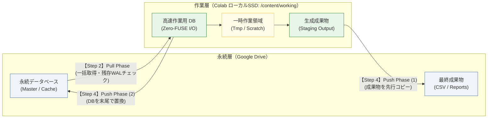

## TL;DR
- Google Colab（FUSE）上でGoogle Drive配下の組込みDB（DuckDB）を直接読み書きした結果、激しいI/O遅延、ロックエラー、セッション中断による中間データ不整合が発生した
- 高頻度I/OはColab内蔵ローカルSSD（/content/working）で完結させ、開始時に一括Pull・終了時に一括Push（成果物先行・DB末尾置換）する2層ストレージ設計に変更した
- I/O遅延とロック競合を解消し、Push開始前の強制切断時にも永続層の既存データを汚さない耐障害性を向上させた

:::note info
**【Colab実運用基盤シリーズ】**
- **第1弾（データ永続化編・本作）**: Google Drive上のDuckDB直叩きで遅延とロック破損が起きた話：ColabとDrive間のPull/Push 2層ストレージ設計
- **第2弾（コード配布編）**: [!git clone で配布したColabが本番で動かなくなる理由：壊れないブートストラップ設計と依存解決](qiita_part7_colab_git_bootstrap_architecture.md)
<!-- ※ 第2弾公開後に実際のQiita URLへ差し替えてください -->
:::

---

## はじめに

Google Colaboratory（以下、Colab）は、手軽に Python 実行環境を利用できるプラットフォームです。しかし、セッション切断時にファイルが初期化されるエフェメラル（一時的）な仮想マシンであるため、定期バッチ処理やデータ分析ツールの実行基盤として利用する場合、データの永続化と実行速度の両立において構造的な課題が生じます。

本稿では、特定業務ドメインに依存しない汎用的なバッチ実行基盤を対象とし、Colab 上でデータとデータベースを安全かつ高速に運用するためのストレージ設計思想と、その実装原理をまとめます。

---

## 第1章：初期の設計と、暗黙の前提

Colab 上でデータを失わずにバッチ処理を実行する最もシンプルなアプローチは、Google Drive をマウントし、そのディレクトリ上に直接データベースや成果物を出力する構成です。

```python:naive_drive_duckdb.py
# 初期の典型的な設計：Google Drive 上のファイルを直接読み書きする
from google.colab import drive
import duckdb
from pathlib import Path

# Google Drive をマウント
drive.mount("/content/drive")

DRIVE_DIR = Path("/content/drive/MyDrive/AppStorage")
db_path = DRIVE_DIR / "cache" / "app_data.duckdb"

# マウント先のDBファイルを直接開いてクエリを実行
con = duckdb.connect(str(db_path))
con.execute("CREATE TABLE IF NOT EXISTS metrics AS SELECT ...")

# 処理結果のCSVやレポートも Drive 上のフォルダへ直接1件ずつ保存
out_dir = DRIVE_DIR / "output"
out_dir.mkdir(parents=True, exist_ok=True)
save_results(con, out_dir)
```

この初期設計の背景には、以下の暗黙の前提（仮定）が存在します。

- **前提 1（ストレージ透過性の前提）**: マウントされた Google Drive（FUSE ファイルシステム[^fuse-note]）はローカルファイルシステムと同等に扱える。データベースファイル（SQLite、DuckDB、Parquet 等）を Drive 配下に直接配置して読み書きを行っても、整合性と実用的な速度が維持される
- **前提 2（逐次同期の前提）**: 処理の進行に伴い、生成されたファイルや更新されたレコードを都度 Google Drive 上に直接書き込むことで、セッションの突然死（タイムアウトや切断）に対する耐性が最も高くなる
- **前提 3（コード展開の前提）**: ノートブック配布型のツールにおいて、コードセルがそのまま展開されている状態が利用者にとって透明性が高く、実行エラーの自己解決を容易にする

[^fuse-note]: **FUSE（Filesystem in Userspace）**: Linux のカーネルを変更せずに、ユーザー空間のプログラムを経由してファイルシステムを構築する仕組み。Colab の Google Drive マウントは、クラウドストレージの API 呼び出しをローカルのディレクトリ操作のように見せかけているため、通信の往復遅延やロックセマンティクスの制限がローカルディスクと大きく異なります。

---

## 第2章：Drive直叩きで起きた3つのトラブル

数千件規模のデータ更新を伴うバッチ処理を上記前提のもとで実行したところ、運用上見過ごせない3つの問題が発生しました。

### 1. FUSE 経由の大きなI/O遅延とロック破損
Google Drive を `/content/drive` にマウントし、その配下に配置した組込み型リレーショナルデータベース（DuckDB）に対して直接接続と更新を試みた際、ローカル環境と比較して以下の乖離が発生しました。

- 単純なクエリ発行時の I/O 待機時間がローカル SSD 比で数十倍に増大
- ネットワーク瞬断や FUSE レイヤの同期遅延に起因するロックエラーおよびファイル破損の発生
  ```text:duckdb_io_error.log
  duckdb.IOException: IO Error: Could not set lock on file "/content/drive/MyDrive/.../app_data.duckdb": 
  Resource temporarily unavailable
  ```
- ランタイム再起動時、ロックファイル（`.wal` やロックフラグ）の開放遅延による接続拒否

### 2. セッション切断時の不完全な書き込み
逐次同期を前提として Drive 上の出力フォルダへファイルを1件ずつ直接書き込んでいた際、ループの途中でセッションが切断されると「全100件中40件だけ出力され、残りの60件が欠損した書きかけフォルダ」が永続層に残存しました。

次回起動時にパイプラインを実行すると、過去の正常なキャッシュなのか、前回の異常中断で中途半端に残ったファイル群なのかをプログラムが識別できず、欠損データを前提に後続の集計処理が進んで計算結果の不整合が生じる現象が発生しました。

### 3. 操作ミスによる意図しないデータ初期化
ノートブック上で環境の初期化や再構築を行うためのセルを用意した際、コードが露出していることやパラメータの意味を誤読したことで、利用者が永続層の既存データを誤って上書き消去するインシデントが発生しました。

---

## 第3章：なぜFUSEでDBを動かすと失敗するのか

起きていた問題の原因を掘り下げると、Colab と Google Drive の仕組みに対する前提そのものに無理がありました。

### 1. 「ローカルファイルと同じ」という前提の限界
FUSE を介したクラウドストレージは、ローカルブロックデバイスとは根本的にレイテンシ特性と一貫性モデルが異なります。大量のランダムリード／ライトを伴う組込みデータベースや、細かなファイルの連続生成に対して、同期的な書き込みを直接行うことは構造的に不適格です。

### 2. 「都度書き込めば安全」という発想の逆効果
分散ストレージへの逐次書き込みは、障害耐性を高めるどころか不完全な中間状態の永続化を招きます。エフェメラル環境における耐障害性とは、途中状態を細かく保存することではなく、**一連の処理が完了した状態のみをまとめて永続層へ反映すること** によって担保できます。

### 3. コード露出による運用の脆さ
運用上の安定性は、コードの可視性だけでなく実行境界の明確さや不可逆な操作に対する保護の仕組みが備わっていることで高まります。プログラムがそのまま露出していることは、視認性を低下させ、誤操作のリスクを高める要因になり得ます。

---

## 第4章：どう設計し直したか（Pull/Push 2層ストレージ）

場当たり的な対応を避け、ストレージの役割と実行フローを整理し直しました。

### 設計の基本方針

- **永続層と作業層のストレージ分離（2層ストレージ設計）**: 実行中のすべての高頻度 I/O は Colab インスタンス内蔵の高速ローカル SSD（`/content/working`）上で完結させる。Google Drive はバッチ開始前の元データ取得とバッチ終了後の成果物保存のみを担うコールドストレージとして扱う
- **Pull/Push 一括同期モデルの採用（失敗時に永続層を汚さない）**: データフローを開始時の一括 Pull（抽出）、ローカル隔離環境での高速処理、終了時の一括 Push（置換・追記）の 3 フェーズに明確に分離する。Push 開始前に処理が異常終了した場合は永続層に一切の変更を加えない
- **宣言的フォーム化による実行境界のカプセル化**: 全コードセルをフォーム化（`cellView: form`）し、ロジックを背後に隠蔽する。初期化のような不可逆な操作には明示的な確認文字列入力を義務付ける



---

## 第5章：実装のポイントとコード

### 1. 2層ストレージの Pull/Push 同期（成果物先行・DB末尾置換）

開始時に永続層から作業層へ必要な資産を展開し、終了時に作業層から永続層へ成果物を同期します。
途中で切断されても「DBは旧版のまま」残るよう、成果物を先に同期し、DB を最後に置換します。直前世代の DB は `.bak` として保存します。

```python:stage_and_sync.py
import shutil
from pathlib import Path
import duckdb

DRIVE_DIR = Path("/content/drive/MyDrive/AppStorage")
WORKING_DIR = Path("/content/working")
DB_NAME = "app_data.duckdb"


def _safe_replace(src: Path, dest: Path) -> None:
    """同一フォルダ内の一時ファイル経由で置換する。
    ※Drive(FUSE)上での rename の原子性は完全には保証されないため、
      「書きかけファイルを本番名で直接参照させない」ためのベストエフォート策。
    """
    dest.parent.mkdir(parents=True, exist_ok=True)
    tmp = dest.with_name(dest.name + ".tmp")
    shutil.copy2(src, tmp)
    tmp.replace(dest)


def pull_phase(fresh: bool = False) -> Path:
    """永続層 → 作業層 (Pull)。fresh=True なら空のDBから開始する。
    永続層(Drive)には一切書き込まない。"""
    for sub in ("cache", "output"):
        (WORKING_DIR / sub).mkdir(parents=True, exist_ok=True)

    drive_db = DRIVE_DIR / "cache" / DB_NAME
    local_db = WORKING_DIR / "cache" / DB_NAME

    # 前回セッションの残骸を作業層から除去
    for p in (local_db, local_db.with_name(local_db.name + ".wal")):
        p.unlink(missing_ok=True)

    # Drive上にWALが残っている = 過去に直叩きしていた痕跡。警告のみ出す
    if drive_db.with_name(drive_db.name + ".wal").exists():
        print("⚠️ Drive上に .wal が残存しています。DBが最新でない可能性があります。")

    if not fresh and drive_db.exists():
        shutil.copy2(drive_db, local_db)

    return local_db


def push_phase(con: duckdb.DuckDBPyConnection) -> None:
    """作業層 → 永続層 (Push)。
    成果物を先に、DBを最後に置換する。途中で切断されても
    「DBは旧版のまま」なので、次回は前回正常時点から再実行できる。"""
    # WALを本体へ完全にフラッシュしてから閉じる（.wal を残さない）
    con.execute("CHECKPOINT")
    con.close()

    # (1) 成果物の先行同期
    for out_file in (WORKING_DIR / "output").glob("*"):
        if out_file.is_file():
            _safe_replace(out_file, DRIVE_DIR / "output" / out_file.name)

    # (2) DBの置換（最後に置換。直前世代を .bak として退避）
    local_db = WORKING_DIR / "cache" / DB_NAME
    drive_db = DRIVE_DIR / "cache" / DB_NAME
    if drive_db.exists():
        shutil.copy2(drive_db, drive_db.with_name(drive_db.name + ".bak"))
    _safe_replace(local_db, drive_db)


def finalize() -> None:
    """Driveへの書き込みキャッシュを確実にフラッシュする。バッチの最後で呼ぶ。"""
    from google.colab import drive
    drive.flush_and_unmount()
```

### 2. 不可逆操作の安全装置（明示的確認と遅延適用）

データベース初期化のような危険な操作では、以下の対策を設けます。
1. `{ run: "auto" }` を外し、チェックボックス変更時の意図しない自動発火を防ぐ
2. `confirm_text` に `DELETE` という文字列の一致を要求し、Run All での素通りを阻止する
3. リセット要求時も Drive を即時削除せず、「空の DB で開始し、Push 成功時に初めて置き換える」方式とし、処理失敗時の既存データを保護する

```python:step2_safe_pull.py
# @title 【Step 2】環境初期化 & Pull Phase
reset_database = False  # @param {type:"boolean"}
confirm_text = ""  # @param {type:"string"}
# ↑ 初期化する場合のみ DELETE と入力

_LOCK_KEY = "_reset_executed_folders"
_done = globals().setdefault(_LOCK_KEY, set())
target = str(DRIVE_DIR)

fresh = False
if reset_database:
    if confirm_text != "DELETE":
        raise RuntimeError(
            "🛑 reset_database が有効ですが確認文字列が一致しません。"
            "初期化する場合は confirm_text に DELETE と入力してください。"
        )
    if target in _done:
        raise RuntimeError(
            "🛑 このセッションで既に初期化済みです。"
            "再初期化する場合はランタイムを再起動してください。"
        )
    _done.add(target)
    fresh = True
    print("🔄 空のDBで開始します（Drive上のDBは Push 完了時に置き換わります）。")

local_db = pull_phase(fresh=fresh)
con = duckdb.connect(str(local_db))
print(f"✅ Pull 完了: {local_db}")
```

### 3. バッチ実行と最終同期（Step 4 セル）

バッチ処理の終了後、成果物と DB を同期し、最後に必ず `finalize()` を呼び出して Drive の書き込みを確定させます。

```python:step4_pipeline_push.py
# @title 【Step 4】パイプライン実行 & Push Phase
# (ここでローカルSSD上の高速バッチ処理を実行...)
# run_pipeline(con)

# 処理完了後に永続層へ同期
push_phase(con)

# 重要: flush_and_unmount() の呼び出し後は Drive にアクセスできなくなるため、
# 必ずノートブックの最終セルで一度だけ呼び出す
finalize()
print("✅ バッチ完了 & Google Drive への同期が完了しました。")
```

### 4. ノートブックのフォーム化（`cellView: form`）

プログラムコードを非表示にし、タイトルバーと入力フォームのみを初期表示とするため、セルメタデータに `cellView` を定義します。
（※リポジトリのクローンや依存パッケージ解決を行う【Step 1】環境セットアップのフォーム定義例）

```json:notebook_cell_form.json
{
 "cell_type": "code",
 "execution_count": null,
 "metadata": {
  "cellView": "form"
 },
 "outputs": [],
 "source": [
  "# @title 【Step 1】環境セットアップ実行\n",
  "import subprocess\n",
  "# (以降のセットアップコードはデフォルトで折りたたまれる)\n"
 ]
}
```

---

## 第6章：動かしてみた結果とベンチマーク

この 2 層ストレージ・一括同期アーキテクチャの導入により、以下の改善が得られました。

### 1. 処理性能と安定性の比較（傾向）

標準的な Colab 無料枠ランタイム（CPU環境）において、約 3,900 件のレコード走査および集計更新クエリを処理した際のレイテンシおよび所要時間の傾向比較です。

| 処理フェーズ / 操作 | Google Drive直叩き (FUSE) | ローカルSSD作業層 (Pull/Push) | 改善効果 |
| :--- | :---: | :---: | :--- |
| **DB接続・単純クエリ発行** | 約 180〜420 ms（遅延大） | **約 2〜5 ms** | 数十〜百倍程度の短縮 |
| **約3,900件のバッチ更新** | 5分以上（頻繁にロック待機） | **約 8.5 秒（ローカルI/O完結）** | I/Oボトルネックの解消 |
| **強制切断時の耐障害性** | `.wal` 残存・中間ファイル汚染 | **Push開始前なら永続層は変更なし（既存データを保持）** | 自動ロールバック相当の整合性維持 |

※FUSE 環境での数値は Google Drive との通信レイテンシや負荷状況により変動しますが、ローカル SSD 作業層への分離によりオーダー単位での性能向上が確認できます。

### 2. 障害時の整合性維持
途中で Colab の割り当て上限（タイムアウト）やブラウザ切断が発生した場合でも、Push Phase に到達していない中間データは Drive に反映されません。次回起動時は前回正常完了した時点の完全なスナップショットから再開され、データの時系列整合性が担保されます。

### 3. 今回の設計の限界とトレードオフ
本設計を運用するにあたり、以下の制約とトレードオフを意識しています。

- **同時実行による競合**: 同一の Google Drive フォルダに対して複数の Colab セッションから同時にバッチを実行した場合、後から Push したセッションで上書きされます（単一セッション実行が前提）
- **長時間バッチにおける途中成果物の喪失**: Push 前にセッションが切断された場合、その回の処理結果はすべて失われます。数時間におよぶ長時間処理の場合は、チェックポイントごとに中間 Push を挟む設計が必要です
- **ローカル SSD の容量上限**: 作業層（`/content/working`）では、インスタンスのローカルディスク（通常数十GB〜100GB程度）の上限を超えるデータセットは扱えません

---

## 結び

Google Colab を単なる実験用ノートブックではなく配布可能なバッチ基盤として活用する場合、FUSE ストレージを過信せず、**エフェメラルなローカル環境と永続ストレージの役割を明確に分断すること** が重要な設計基準となります。

本アーキテクチャは、データ分析や機械学習推論、Web スクレイピングなど、Colab 上で反復的なデータ処理を実行するあらゆるバッチパイプラインにそのまま適用可能な汎用パターンです。
