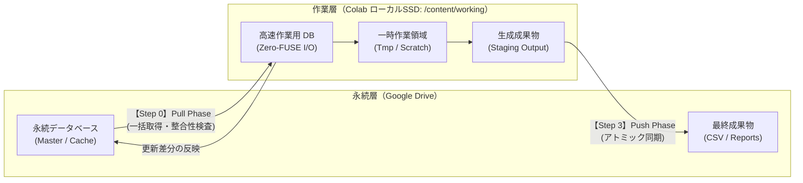

# エフェメラル環境におけるデータ永続化の整合性基準設計：Google Colab と分散ストレージ間の Pull/Push 2層アーキテクチャ

## はじめに

Google Colaboratory（以下、Colab）は、無償で手軽に Python 実行環境を利用できる優れたプラットフォームです。しかし、セッション切断時にすべてのファイルが初期化されるエフェメラル（一時的）な仮想マシンであるため、定期バッチ処理や大規模データ分析の実行基盤として利用する場合、データの永続化と実行速度の両立において構造的な課題に直面します。

本稿では、株式分析などの特定ドメインに依存しない汎用的なバッチ実行基盤を対象とし、Colab 上で大規模データとデータベースを安全かつ高速に運用するためのストレージ設計思想と、その実装原理を記録します。

---

## 第1章：設計仮定の明示

Colab 環境で外部ストレージを用いてデータを永続化する際、一般には以下の設計仮定が置かれます。

- **仮定 1（ストレージ透過性の仮定）**:  
  マウントされた Google Drive（FUSE ファイルシステム）はローカルファイルシステムと同等に扱える。データベースファイル（SQLite、DuckDB、Parquet 等）を Drive 配下に直接配置して読み書きを行っても、整合性と実用的な速度が維持される。
- **仮定 2（逐次同期の仮定）**:  
  処理の進行に伴い、生成されたファイルや更新されたレコードを都度 Google Drive 上に直接書き込むことで、セッションの突然死（タイムアウトや切断）に対する耐性が最も高くなる。
- **仮定 3（実行コード露出の仮定）**:  
  ノートブック配布型のツールにおいて、コードセルがそのまま展開されている状態が利用者にとって透明性が高く、実行エラーの自己解決を容易にする。

---

## 第2章：観測された不整合

数千件規模のデータ更新を伴うバッチ処理を上記仮定のもとで実行したところ、以下の不整合が数値およびログベースで観測されました。

### 1. FUSE ファイルシステム経由の I/O 遅延とロック不整合
Google Drive を `/content/drive` にマウントし、その配下に配置した組込み型リレーショナルデータベース（DuckDB）に対して直接接続と更新を試みた際、ローカル環境と比較して以下の乖離が発生しました。

- 単純なクエリ発行時の I/O 待機時間がローカル SSD 比で数十倍に増大
- ネットワーク瞬断や FUSE レイヤの同期遅延に起因する `Database lock error` およびファイル破損の発生
- ランタイム再起動時、ロックファイル（`.wal` やロックフラグ）の開放遅延による接続拒否

### 2. セッション切断時の不完全な書き込み
逐次同期を前提として Drive 上のディレクトリに中間成果物を直接生成した際、セッションが途中で切断されると「未完了の半端なファイル群」が Drive 上に残存しました。次回実行時にこれらの不完全なファイルが正常な過去キャッシュとして誤認され、データパイプライン全体の恒等式が崩れる現象が観測されました。

### 3. 操作ミスによる意図しないデータ初期化
ノートブック上で環境の初期化や再構築を行うためのセルを用意した際、コードが露出していることで利用者がセルの実行順序を誤る、あるいはフォームパラメータの意味を誤読し、永続層の既存データを上書き消去するインシデントが発生しました。

---

## 第3章：仮定の破綻

観測された事象から、前述の前提は以下のように破綻していることが明らかになりました。

### 1. 透過的ストレージ仮定の破綻
FUSE を介したクラウドストレージは、ローカルブロックデバイスとは根本的にレイテンシ特性と一貫性モデルが異なります。大量のランダムリード／ライトを伴う組込みデータベースや、細かなファイルの連続生成に対して、同期的な書き込みを直接行うことは構造的に不適格です。

### 2. 逐次書き込み耐性仮定の破綻
分散ストレージへの逐次書き込みは、障害耐性を高めるどころか「不完全な中間状態の永続化」を招きます。エフェメラル環境における耐障害性とは、途中状態を細かく保存することではなく、**「成功した状態のみを不可分（アトミック）に反映する」** ことでしか担保できません。

### 3. コード露出透明性仮定の破綻
エンドユーザーにとっての運用安定性は、コードの可視性ではなく「実行境界の明確さ」と「不可逆な操作に対する防壁」によって担保されます。プログラムが露出していることは、視認性を低下させ、誤操作を誘発する要因にしかなり得ません。

---

## 第4章：再定義（設計転換）

破綻した仮定を排除し、ストレージの責務と実行モデルを以下のように再定義します。

### 設計原則

- **永続層と作業層の物理的分離（2層ストレージ設計）**:  
  実行中のすべての高頻度 I/O は Colab インスタンス内蔵の高速ローカル SSD（`/content/working`）上で完結させる。Google Drive は「バッチ開始前の元データ取得」と「バッチ終了後の成果物保存」のみを担うコールドストレージとして扱う。
- **Pull/Push アトミック同期モデルの採用**:  
  データフローを「開始時の一括 Pull（抽出）」「ローカル隔離環境での高速処理」「終了時の一括 Push（置換・追記）」の 3 フェーズに厳格に分離する。処理が異常終了した場合は永続層に一切の変更を加えない。
- **宣言的フォーム化による実行境界のカプセル化**:  
  全コードセルをフォーム化（`cellView: form`）し、ロジックを背後に隠蔽する。初期化や破壊的操作にはセッション単位の安全装置（二重実行ガード）を設ける。



---

## 第5章：実装原理（核心のみ）

### 1. 2層ストレージの Pull/Push 同期

開始時に永続層から作業層へ必要な資産を展開し、終了時に作業層から永続層へ成果物を同期します。

```python
import shutil
from pathlib import Path

DRIVE_DIR = Path("/content/drive/MyDrive/AppStorage")
WORKING_DIR = Path("/content/working")

def pull_phase() -> None:
    """永続層から作業層への初期ロード (Pull)"""
    WORKING_DIR.mkdir(parents=True, exist_ok=True)
    (WORKING_DIR / "cache").mkdir(exist_ok=True)
    (WORKING_DIR / "output").mkdir(exist_ok=True)

    drive_db = DRIVE_DIR / "cache" / "app_data.duckdb"
    local_db = WORKING_DIR / "cache" / "app_data.duckdb"

    # 既存DBが存在する場合は作業層ローカルSSDへコピー
    if drive_db.exists():
        shutil.copy2(drive_db, local_db)

def push_phase() -> None:
    """作業層から永続層へのアトミック同期 (Push)"""
    local_db = WORKING_DIR / "cache" / "app_data.duckdb"
    drive_db = DRIVE_DIR / "cache" / "app_data.duckdb"

    # DBの同期 (ローカル側の安全なフラッシュを確認後に反映)
    if local_db.exists():
        temp_target = drive_db.with_suffix(".tmp")
        shutil.copy2(local_db, temp_target)
        temp_target.replace(drive_db)  # 同一ファイルシステム内でのアトミック置換

    # 出力成果物の同期
    for out_file in (WORKING_DIR / "output").glob("*"):
        if out_file.is_file():
            shutil.copy2(out_file, DRIVE_DIR / "output" / out_file.name)
```

この分離により、処理中の数万回に及ぶレコード走査・更新クエリはすべてローカル SSD のバス帯域（数GB/s）で実行され、Google Drive の FUSE レイヤには一切負荷がかかりません。

### 2. 不可逆操作の安全装置（セッション単位の破壊防止ガード）

「データベース初期化」のような危険な操作が、ノートブックの全セル一括実行（Run All）によって意図せず連打される事故を防ぐため、セッション変数による実行ロックを設けます。

```python
# @title 【Step 0】環境初期化 & Pull Phase { run: "auto" }
reset_database = False  # @param {type:"boolean"}

_SESSION_RESET_LOCK_KEY = "_reset_executed_folders"
if _SESSION_RESET_LOCK_KEY not in globals():
    globals()[_SESSION_RESET_LOCK_KEY] = set()

target_folder = str(DRIVE_DIR)

if reset_database:
    if target_folder in globals()[_SESSION_RESET_LOCK_KEY]:
        print(f"⚠️ 安全装置: フォルダ '{target_folder}' は同一セッション内で既に初期化されています。")
        print("   重複実行を抑止しました。再実行が必要な場合はランタイムを再起動してください。")
    else:
        # 初回のみ消去を実行
        shutil.rmtree(DRIVE_DIR / "cache", ignore_errors=True)
        shutil.rmtree(WORKING_DIR / "cache", ignore_errors=True)
        globals()[_SESSION_RESET_LOCK_KEY].add(target_folder)
        print("🔄 キャッシュを安全に初期化しました。")
```

### 3. ノートブックのフォーム化（`cellView: form`）

プログラムコードを非表示にし、タイトルバーと入力フォームのみを初期表示とするため、セルメタデータに `cellView` を定義します。

```json
{
 "cell_type": "code",
 "execution_count": null,
 "metadata": {
  "cellView": "form"
 },
 "outputs": [],
 "source": [
  "# @title 【Step 1】環境セットアップ実行\n",
  "import subprocess\n",
  "# (以降のセットアップコードはデフォルトで折りたたまれる)\n"
 ]
}
```

利用者はコードの複雑さに惑わされることなく、再生ボタンを押すだけでバッチを実行可能となります。

---

## 第6章：結果と帰結

この 2 層ストレージ・アトミック同期アーキテクチャへの刷新により、以下の帰結が得られました。

### 1. 処理性能と安定性の両立
- **I/O ボトルネックの解消**:  
  すべてのデータ書き込み・DB トランザクションがローカル SSD 上で行われるため、FUSE のオーバーヘッドが完全に排除されました。
- **ロック障害・ファイル破損の根絶**:  
  Google Drive 上で直接 DB コネクションを維持しないため、セッション瞬断時でも Drive 上のデータベースファイルが破損するリスクが排除されました。

### 2. 障害時の整合性維持
途中で Colab の割り当て上限（タイムアウト）やブラウザ切断が発生した場合でも、Push Phase に到達していない中間データは Drive に反映されません。次回起動時は「前回正常完了した時点の完全なスナップショット」から再開され、データの時系列整合性が自動的に担保されます。

### 3. 利用者体験の向上
コードを折りたたみ、フォーム UI に抽象化したことで、利用者の心理的ハードルと誤操作率が大幅に低減しました。

---

## 結び

Google Colab を単なる「使い捨ての対話的ノートブック」ではなく「配布可能なサーバーレスバッチ基盤」として活用する場合、FUSE ストレージを過信せず、**エフェメラルなローカル環境と永続ストレージの役割を明確に分断すること** が極めて重要な設計基準となります。

本アーキテクチャは、データ分析や機械学習推論、Web スクレイピングなど、Colab 上で反復的な大規模処理を実行するあらゆるバッチパイプラインにそのまま適用可能な汎用パターンです。
