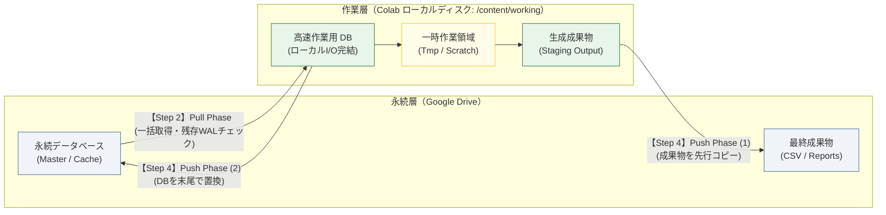

## TL;DR
- Google Colab（FUSE）上でGoogle Drive配下の組込みDB（DuckDB）を直接読み書きすると、大きなI/O遅延、ロックエラー、セッション中断による中間データ不整合が発生する
- 高頻度I/OはColabのローカルディスク（/content/working）で完結させ、開始時に一括Pull・終了時に一括Push（成果物先行・DB末尾置換）する2層ストレージ設計にする
- これにより、I/O遅延とロック競合を解消し、Push開始前の強制切断時にも永続層の既存データ破損を防ぎ、耐障害性を確保できる

:::note info
**【Colab実運用基盤シリーズ】**
- **第1弾（データ永続化編・本作）**: Google Drive上のDuckDBを直接読み書きして遅延とロック破損が起きた話：ColabとDrive間のデータステージング（2層ストレージ）設計
- **第2弾（コード配布編）**: [!git clone で配布したColabが本番で動かなくなる理由：壊れないブートストラップ設計と依存解決](qiita_part7_colab_git_bootstrap_architecture.md)
<!-- ※ 第2弾公開後に実際のQiita URLへ差し替えてください -->
:::

---

## はじめに

筆者は、日本株の全銘柄（約3,900銘柄）を分析する株価スクリーナーの Colab 実行環境を構築していました。しかし、Google Colaboratory（以下、Colab）は、セッション切断時にファイルが初期化されるエフェメラル（一時的）[^ephemeral-note] な仮想マシンであるため、定期バッチ処理の実行基盤として利用する場合、データの永続化と実行速度の両立において構造的な課題が生じます。

ここで重要なのは、想定している処理モデル（ワークロード）の性質です。
単に1回限りの使い捨てスクリプトを実行し、生成されたCSVファイルをGoogle Driveに1つ保存して終了するような単発タスクであれば、Driveマウント先に直接ファイルを出力するだけでも実用上は問題になりません。

しかし、以下のようなワークロードをColab上で継続運用しようとすると、話は一変します。

- **マスタ蓄積型パイプライン**: 過去の分析履歴やマスタデータを組込みDB（DuckDBやSQLite）に保持し、実行のたびに前回のデータを参照・更新しながら長期的にデータを育てていくモデル
- **長時間の反復・高頻度I/O**: 数分〜数十分かけて大量データの照合・分析クエリを実行し、多数の個別レポートや派生ファイルを反復生成する処理
- **過去データの保護要件**: 処理の途中でセッションが強制切断されても、過去から蓄積してきたマスタDBや正常な成果物を破壊せず、安全に前回の状態を維持したい要件

本稿では、東証全銘柄のスクリーニング処理を題材とし、Colab 上でデータとデータベースを安全かつ高速に運用するためのストレージ設計の考え方と、具体的な実装コードをまとめます。

---

## 第1章：初期の設計と、暗黙の前提

Colab 上でデータを失わずにバッチ処理を実行する最もシンプルなアプローチは、Google Drive をマウントし、そのディレクトリ上に直接データベースや成果物を出力する構成です。

ここでは、「東証全銘柄（約3,900銘柄）のマスタDB（DuckDB）から対象銘柄を取得し、反復ループで各銘柄のテクニカル指標計算と個別CSV出力を1件ずつ行い、最後に処理結果と実行ステータスをマスタDBへ書き戻す」という、数分〜数十分を要するバッチ処理を想定します。

```python:naive_drive_duckdb.py
# 初期の典型的な設計：Google Drive 上のファイルを直接読み書きする
from google.colab import drive
import duckdb
from pathlib import Path
import uuid

# Google Drive をマウント
drive.mount("/content/drive")

DRIVE_DIR = Path("/content/drive/MyDrive/AppStorage")
db_path = DRIVE_DIR / "cache" / "app_data.duckdb"
out_dir = DRIVE_DIR / "output"
out_dir.mkdir(parents=True, exist_ok=True)

# 1. マウント先のマスタDBを開き、対象銘柄を取得・バッチ実行ログを記録
con = duckdb.connect(str(db_path))
con.execute("""
    CREATE TABLE IF NOT EXISTS batch_runs (
        run_id VARCHAR PRIMARY KEY,
        status VARCHAR,
        started_at TIMESTAMP,
        completed_at TIMESTAMP
    )
""")
run_id = str(uuid.uuid4())
con.execute("INSERT INTO batch_runs VALUES (?, 'running', now(), NULL)", [run_id])

tickers = con.execute("SELECT ticker, name FROM tickers").fetchall()

# 2. ループ処理：反復計算を行い、個別レポートを Drive 上へ1件ずつ直接保存
for ticker, name in tickers:
    report_data = analyze_ticker(con, ticker)
    (out_dir / f"report_{ticker}.csv").write_text(report_data)

# 3. 処理完了後、マスタDBのバッチ実行ステータスを完了に更新
con.execute(
    "UPDATE batch_runs SET status = 'completed', completed_at = now() WHERE run_id = ?",
    [run_id]
)
con.close()
```

この初期設計の背景には、以下のような「暗黙の前提（無意識の思い込み）」が存在していました。

- **前提 1（ストレージ透過性の前提）**: マウントされた Google Drive（FUSE ファイルシステム[^fuse-note]）はローカルファイルシステムと同等に扱える。データベースファイル（SQLite、DuckDB、Parquet 等）を Drive 配下に直接配置して読み書きを行っても、整合性と実用的な速度が維持される
- **前提 2（逐次同期の前提）**: 処理の進行に伴い、生成されたファイルや更新されたレコードを都度 Google Drive 上に直接書き込むことで、セッションの突然死（タイムアウトや切断）に対する耐性が最も高くなる
- **前提 3（即時永続化の前提）**: Python プログラム側でファイルクローズや書き込み処理が正常終了した時点で、クラウドストレージ側（Google Drive）にもデータが即座に同期・永続化されている

[^ephemeral-note]: **エフェメラル（Ephemeral）**: 「一時的な」「短命な」という意味の英単語。クラウドや仮想環境において、インスタンスの停止やセッション切断とともに保存データやインストール環境がすべて消滅・初期化される「使い捨て」の実行環境を指します。
[^fuse-note]: **FUSE（Filesystem in Userspace）**: Linux のカーネルを変更せずに、ユーザー空間のプログラムを経由してファイルシステムを構築する仕組み。Colab の Google Drive マウントは、クラウドストレージの API 呼び出しをローカルのディレクトリ操作のように見せかけているため、通信の往復遅延やロックセマンティクスの制限がローカルディスクと大きく異なります。

---

## 第2章：Google Driveへの直接I/Oで起きた3つのトラブル

東証全銘柄（約3,900銘柄）のデータ処理を Colab 無料枠（CPU）で上記前提のもと実行したところ、運用上見過ごせない3つのトラブルが発生しました。

### 1. FUSE 経由の大きなI/O遅延とロック破損
Google Drive を `/content/drive` にマウントし、その配下に配置した組込み型リレーショナルデータベース（DuckDB）に対して直接接続と更新を試みた際、ローカル環境と比較して以下の乖離が発生しました。

- 単純なクエリ発行時の I/O 待機時間がローカルディスク比で数十倍に増大
- ネットワーク瞬断や FUSE レイヤの同期遅延に起因するロックエラーおよびファイル破損の発生
  ```text:duckdb_io_error.log
  duckdb.IOException: IO Error: Could not set lock on file "/content/drive/MyDrive/.../app_data.duckdb": 
  Resource temporarily unavailable
  ```
- ランタイム再起動時、ロックファイル（`.wal`[^wal-note] やロックフラグ）の開放遅延による接続拒否

### 2. セッション切断時の不完全な書き込み
前述のように逐次同期を前提とし、Drive 上の出力フォルダへ個別レポートを1件ずつ直接書き込んでいた際、ループの途中でセッションが切断されると「全3,900件中1,200件だけ出力され、残りの2,700件が欠損した書きかけフォルダ」が永続層に残存しました。

次回起動時にパイプラインを実行すると、過去の正常なキャッシュなのか、前回の異常中断で中途半端に残ったファイル群なのかをプログラムが識別できず、欠損データを前提に後続の集計処理が進んで計算結果の不整合が生じる現象が発生しました。

### 3. 正常終了したはずなのにデータが蒸発（未反映・先祖返り）
Python のコード上で `con.close()` や `file.close()` が完了し、コンソール上にはエラーなく正常終了と表示されたため、処理が終わったと判断してブラウザを閉じた（または放置してセッションがタイムアウトした）ところ、不可解な現象が発生しました。

後から Google Drive 側を確認すると、更新したはずの個別レポート群や DB ファイルが古い状態のまま先祖返りしている、あるいはファイル自体が存在せず、更新が反映されていない現象が起きたのです。

調査の結果、原因は Google Drive の FUSE レイヤがクラウドとの通信を非同期で遅延処理している点にありました。Python 側でクローズ処理を行っても、OS の書き込みバッファに未送信データが滞留しており、明示的にフラッシュとアンマウントを行わずにランタイムが停止したことで、未同期データが破棄されていたのです。

[^wal-note]: **WAL（Write-Ahead Logging）**: データベースのクラッシュ時にデータを復旧できるよう、本体ファイルへの反映前に変更ログを先行記録する仕組み、およびその一時ファイル（DuckDB では `.wal`）。ネットワーク経由の FUSE 上ではロックの同期遅れによってこのファイルが正常に解放されず、DB に再接続できなくなるトラブルの原因になります。

---

## 第3章：なぜFUSEでDBを動かすと失敗するのか

起きていた問題の原因を掘り下げると、Colab と Google Drive の仕組みに対する前提そのものに構造的な無理がありました。

### 1. ローカルブロックデバイスと FUSE（クラウド連携）の構造的差異

最大の要因は、ローカルブロックデバイス（ローカルディスク）と FUSE（Google Drive マウント）が持つ「物理的・カーネル的な構造の違い」を考慮していなかった点にあります。

| 比較項目 | ローカルブロックデバイス（ローカルディスク） | Google Drive FUSE マウント |
| :--- | :--- | :--- |
| **I/O 制御経路** | OS カーネル ➔ ブロック層 ➔ デバイスドライバ | OS カーネル ➔ VFS ➔ **FUSE デーモン（ユーザ空間） ➔ HTTPS REST API** |
| **アクセスレイテンシ** | **マイクロ秒（μs）単位**（10〜100 μs） | **ミリ秒〜秒（ms〜s）単位**（100〜500 ms、数千倍以上） |
| **排他制御（ロック）** | OS カーネル内の POSIX ロック（即座・確実） | 分散環境越しの擬似ロック（通信遅れや API 制限で競合・解放漏れ多発） |
| **整合性保証（fsync）** | 物理ディスクの不揮発メモリへの書き込み完了を保証 | API 呼び出しのキューイングに過ぎず、クラウド本体への反映は非同期 |
| **適したアクセス** | ランダムリード／ライト、頻繁な小さなトランザクション | シーケンシャルな大容量ファイルの一括転送 |

組込み型リレーショナルデータベース（DuckDB や SQLite）は、**「マイクロ秒単位で応答し、POSIX ファイルロックが確実に機能し、fsync で即座に書き込みが保証されるローカルディスク」** を前提として設計されています。
これをインターネット越しの REST API をファイルに見せかけているだけの FUSE 上で直接動かせば、クエリごとにネットワーク往復遅延が生じ、ロックエラーや破損につながるのは構造上避けられない現象でした。

### 2. 「都度書き込めば安全」という逐次同期の逆効果
分散ストレージへの逐次書き込みは、耐障害性を高めるどころか不完全な中間状態の永続化を招きます。エフェメラル環境における耐障害性とは、途中状態を細かく保存することではなく、**一連の処理が完了した状態のみをまとめて永続層へ反映すること** によって担保されます。

### 3. close() しても同期は終わっていない
Python のコード上で `file.close()` や `con.close()` を呼んでも、FUSE レイヤではクラウドへのアップロード処理がバックグラウンドで遅延実行されています。OS の書き込みバッファに溜まったデータをクラウド本体へ確実に同期させるには、明示的に `drive.flush_and_unmount()` を呼び出す必要があります。この手順を踏まないままセッションが切断されると、処理が正常終了したように見えてもデータが消失します。

---

## 第4章：どう設計し直したか（データステージングによる2層分離）

場当たり的な対応を避け、ストレージの役割とデータフローを整理し直しました。

着目したのは、**「データを長期間保持する役割（永続層）」** と **「計算中の頻繁な読み書きを引き受ける役割（作業層）」** を1つのストレージに背負わせないことです。そこで、クラウドバッチ処理や HPC で定石となっている **データステージング（Data Staging）パターン**[^staging-note] を採用し、ストレージを物理的に2層へ分離しました。

### 設計の基本方針

- **永続層（Google Drive）と作業層（ローカルディスク）の2層分離**:
  実行中のすべての高頻度 I/O は Colab インスタンス内蔵の高速なローカルディスク（`/content/working`）上で完結させます。Google Drive は処理中のランダム I/O から隔離し、バッチ開始前の元データ取得と終了後の成果物保存のみを担う「コールドストレージ（保管専用の永続層）」として扱います
- **FUSE特性を活かした Stage-in（一括読み込み・Pull）フロー**:
  バッチ開始時に、Google Drive からマスタDB（`app_data.duckdb`）をローカル作業層へ一括コピー（シーケンシャルリード）します。
  - **FUSE 特性の活用**: 第3章で示した通り、FUSE はランダムアクセスには弱い一方、シーケンシャルな一括読み込みであれば安定したスループットを発揮します。起動時に1回だけ一括転送することで、計算実行中のクエリ遅延を解消します
  - **残存 WAL 検知とローカル初期化**: 作業層に残る前回セッションの残骸をクリーンアップした上で、永続層側に過去の異常終了による `.wal` が残存していないかを検証し、健全なマスタDBを作業層へ展開します
  - **永続層の保護（Read-only 動作）**: Pull フェーズは永続層に対して読み取り専用として動作するため、ファイルロックを取得せず、仮に転送途中で切断されても永続層のデータは破損しません
- **安全な Stage-out（一括書き戻し・Push）フロー**:
  全処理が正常完了した段階で、生成された成果物と更新済み DB を作業層から永続層へ一括コピー（シーケンシャルライト）します。Push 処理中の切断に備え、「成果物の先行同期 ➔ 直前DBの `.bak` 退避 ➔ 一時ファイル（`.tmp`）経由でのDB末尾置換 ➔ 明示的フラッシュ（`flush_and_unmount`）」という順序制御を敷きます

[^staging-note]: **データステージング（Data Staging）**: クラウドや HPC（科学技術計算等）のバッチ処理において、低速な永続ストレージ（S3 や Google Drive 等）から高速な計算ノードのローカル作業ディスクへ処理前にデータを一括転送（Stage-in）し、計算終了後に成果物だけを一括書き戻す（Stage-out）標準的なアーキテクチャパターン。



---

## 第5章：実装のポイントとコード

### 1. 2層ストレージの Pull/Push 同期（成果物先行・DB末尾置換）

開始時に永続層から作業層へ必要な資産を一括展開（Stage-in / Pull）し、終了時に作業層から永続層へ成果物を一括同期（Stage-out / Push）します。

- **Pull Phase**: 永続層（Drive）に対しては読み取り専用として振る舞い、残存 `.wal` を検知した上で作業層へコピーします
- **Push Phase**: 途中で切断されても「DBは旧版のまま」残るよう、成果物を先に同期し、DB を最後に置換します。直前世代の DB は `.bak` として保存します

```python:stage_and_sync.py
import shutil
from pathlib import Path
import duckdb

DRIVE_DIR = Path("/content/drive/MyDrive/AppStorage")
WORKING_DIR = Path("/content/working")
DB_NAME = "app_data.duckdb"


def _safe_replace(src: Path, dest: Path) -> None:
    """同一フォルダ内の一時ファイル経由で置換する。
    ※Drive(FUSE)上での rename の原子性（中途半端な状態を残さず瞬時に置き換わる性質）は完全には保証されないため、
      「書きかけファイルを本番名で直接参照させない」ためのベストエフォート策。
    """
    dest.parent.mkdir(parents=True, exist_ok=True)
    tmp = dest.with_name(dest.name + ".tmp")
    shutil.copy2(src, tmp)
    tmp.replace(dest)


def pull_phase(fresh: bool = False) -> Path:
    """永続層 → 作業層 (Pull)。fresh=True なら空のDBから開始する。
    永続層(Drive)には書き込まない。"""
    for sub in ("cache", "output"):
        (WORKING_DIR / sub).mkdir(parents=True, exist_ok=True)

    drive_db = DRIVE_DIR / "cache" / DB_NAME
    local_db = WORKING_DIR / "cache" / DB_NAME

    # 前回セッションの残骸を作業層から除去
    for p in (local_db, local_db.with_name(local_db.name + ".wal")):
        p.unlink(missing_ok=True)

    # Drive上にWALが残っている = 過去にDrive上のDBを直接更新していた痕跡。警告のみ出す
    if drive_db.with_name(drive_db.name + ".wal").exists():
        print("⚠️ Drive上に .wal が残存しています。DBが最新でない可能性があります。")

    if not fresh and drive_db.exists():
        shutil.copy2(drive_db, local_db)

    return local_db


def push_phase(local_db_path: Path) -> None:
    """作業層 → 永続層 (Push)。
    成果物を先に、DBを最後に置換する。途中で切断されても
    DBは旧版のまま維持されるため、次回は前回正常時点から再実行できる。"""
    # (1) 成果物の先行同期
    for out_file in (WORKING_DIR / "output").glob("*"):
        if out_file.is_file():
            _safe_replace(out_file, DRIVE_DIR / "output" / out_file.name)

    # (2) DBの置換（最後に置換。直前世代を .bak として退避）
    drive_db = DRIVE_DIR / "cache" / DB_NAME
    if drive_db.exists():
        shutil.copy2(drive_db, drive_db.with_name(drive_db.name + ".bak"))
    _safe_replace(local_db_path, drive_db)


def finalize() -> None:
    """Driveへの書き込みキャッシュをフラッシュする。バッチの最後で呼ぶ。"""
    from google.colab import drive
    drive.flush_and_unmount()
```

### 2. 安全なパイプライン実行フロー（Stage-in ➔ 処理 ➔ Stage-out）

ステージング設計の安全性を活かすため、計算処理（Compute）と書き戻し（Push）で例外ハンドリングを分離してライフサイクルを制御します。

```python:run_staged_pipeline.py
# バッチ実行のライフサイクル制御
from pathlib import Path
import duckdb

def main():
    # 1. Stage-in (Pull): Google Drive からローカルディスクへ展開
    local_db_path = pull_phase()
    con = duckdb.connect(str(local_db_path))

    # 2. Compute Phase: ローカルディスク上で計算処理とDB更新を実行
    try:
        print("ローカルディスク上でバッチ処理を実行中...")
        # run_batch_processing(con)
        
        # DBへの変更をフラッシュして安全にクローズ
        con.execute("CHECKPOINT")
        con.close()
    except Exception as e:
        con.close()
        print(f"計算処理中にエラーが発生しました: {e}")
        print("Push は実行されていないため、Google Drive の既存データは変更されていません。")
        raise

    # 3. Stage-out (Push) Phase: Google Drive へ一括書き戻し
    try:
        print("Google Drive へ一括書き戻し中 (Push Phase)...")
        push_phase(local_db_path)
        
        # 4. Finalize: FUSE の非同期バッファを強制フラッシュして完了
        finalize()
        print("すべての処理と Google Drive への同期が正常完了しました。")
    except Exception as e:
        print(f"Google Drive への同期中にエラーが発生しました: {e}")
        print("Google Drive 側の状態（.bak の存在など）を確認してください。")
        print(f"ローカルディスク（{local_db_path}）に今回の最新データが残っています。")
        raise
```

---

## 第6章：動かしてみた結果とベンチマーク

この 2 層ストレージ・一括同期アーキテクチャの導入により、以下の改善が得られました。

### 1. 処理性能と安定性の比較

標準的な Colab 無料枠ランタイム（CPU環境）において、東証全銘柄（約 3,900 銘柄）の指標算出クエリを処理した際の筆者環境での実測値です。

| 処理フェーズ / 操作 | Google Drive直接I/O (FUSE) | ローカルディスク作業層 (データステージング) | 改善効果 |
| :--- | :---: | :---: | :--- |
| **DB接続・単純クエリ発行** | 約 180〜420 ms（遅延大） | **約 2〜5 ms** | 数十〜百倍程度の短縮 |
| **約3,900件のバッチ更新** | 5分以上（頻繁にロック待機） | **約 8.5 秒（ローカルI/O完結）** | I/Oボトルネックの解消 |
| **途中切断時の耐障害性** | `.wal` 残存・中間ファイル汚染 | **旧版維持・安全なリトライ可能** | ロールバック相当の整合性維持 |

※FUSE 環境での数値は Google Drive との通信レイテンシや負荷状況により変動しますが、ローカルディスクへの分離により大きな性能向上が確認できます。

### 2. 切断やエラー時におけるデータの整合性と保護

バッチ処理が中断された場合の耐障害性について、フェーズごとに検証します。

#### ① Push 開始前に切断された場合（ロールバック相当）
ローカルディスク（`/content/working`）上で計算処理を行っている最中に Colab のタイムアウトや切断が発生した場合、そのセッションのローカルデータはすべて破棄されます。
Google Drive には書き込みを行っていないため、書きかけの欠損ファイル群や破損した DB は永続層に残りません。次回起動時は前回正常終了した状態から安全にリトライできます。

#### ② Push（書き戻し）実行中に切断された場合（多段階の保護）
ローカルから Google Drive への一括同期（Stage-out）の最中に切断されるケースに対しては、以下の順序制御と保護策を講じています。

- **成果物先行・DB末尾置換の順序制御**:
  CSV やレポート等の成果物を先に同期し、マスタである DB ファイルの置換を一番最後に行います。成果物のコピー途中で切断された場合、一部の成果物は反映されるものの、**DB 本体は旧版のまま維持** されます。
- **バッチ完了ステータスによる未完了検知**:
  第1章で示した通り、マスタDB内の `batch_runs` テーブルにバッチIDと `completed` ステータスを最後にコミットする設計にしています。途中で切れて「新しい成果物」と「古い DB」が混在した場合でも、次回起動時にプログラムは DB 内のステータスを見て「前回のバッチは未完了」と判定できます。未完了を検知した際は、前回の未完了バッチIDに対応する成果物を上書き・クリーンアップした上で安全に再計算を実行します。
- **一時ファイル（`.tmp`）経由の置換（`_safe_replace`）**:
  Drive 上で直接本番ファイル名を上書きするのではなく、同一ディレクトリ内に `app_data.duckdb.tmp` としてコピーを完了させた後、置換（`replace()`）します。FUSE 上の rename の原子性は完全には保証されませんが、通信切断によって「書きかけの不完全な DB ファイル」が本番名として直接参照されるリスクを低減するベストエフォート策として機能します。
- **直前世代のバックアップ（`.bak` 退避）**:
  DB を置換する直前に、既存の正常な DB を `app_data.duckdb.bak` として複製退避します。万一通信瞬断で置換処理に失敗した場合でも、`.bak` から手動または自動で直前世代を復元できます。
- **`drive.flush_and_unmount()` による非同期バッファの強制同期**:
  Python のファイル操作が完了しても、FUSE の書き込みバッファがクラウド本体に届く前にセッションが切れるとデータが反映されません。処理の末尾で必ず `flush_and_unmount()` を呼び出し、クラウド側への反映完了を待機してからセッションを終了します。

#### ③ Google Drive 容量不足や同期エラーで書き込めない場合（フェイルセーフとリカバリ）
Google Drive の空き容量不足（`OSError: [Errno 28] No space left on device`）やネットワーク瞬断、APIクォータ超過により、Push 処理中のファイル書き込みや `flush_and_unmount()` が失敗した場合、システムは以下のように安全側に倒れます。

- **永続層（Google Drive）の安全停止（マスタ旧版の維持）**:
  一時ファイル（`.tmp`）の生成中、または `.bak` 退避の時点で例外が発生して処理が中断します。本番ファイル名（`app_data.duckdb`）への置換処理（`tmp.replace()`）には到達しないため、Google Drive 上のマスタ DB は「前回の正常な状態」が保護されます。書きかけの壊れた DB が本番ファイルに置き換わることはありません。
  ※なお、`flush_and_unmount()` 自体が失敗した場合は、replace 後の通信切断によりクラウド側への反映が未完了となるリスクがありますが、直前に退避した `.bak` が安全弁として機能します。
- **作業層（ローカルディスク）でのデータ残存と手動リカバリ**:
  例外でスクリプトが停止しても、今回計算した最新の成果物と DB は Colab ローカルディスク（`/content/working`）上に残っています。
  - **セッション存続時**: Google Drive 上の不要ファイルを整理して容量を確保した後、Drive の再マウント確認（`drive.mount("/content/drive")`）を行った上で、ノートブック上で `push_phase(local_db_path); finalize()` を再実行すれば、今回の計算結果を失わずに Drive へ反映できます。また、`files.download()` を用いてローカル PC へ緊急退避することも可能です。
  - **セッション強制終了時**: ランタイムが停止してローカル作業データが破棄された場合でも、Google Drive 側のマスタ DB は健全な旧版のまま維持されています。次回起動時は「前回のバッチは未完了」として健全な旧版マスタから安全に再計算・リトライできます。

### 3. 今回の設計が持つトレードオフと運用上の制約
本アーキテクチャは「ローカルディスクでの高速性」と「切断時に永続データを汚さない安全性」を優先した設計です。そのため、以下の**トレードオフ（何を得て、何を妥協したか）**が存在します。

- **【データの整合性 vs 途中進捗の保存】途中で切断された場合、そのセッションの計算時間は無駄になる**:
  Push 開始前に切断された場合、永続層が汚れない代わりに、その回にローカルで計算した途中成果物はすべて破棄されます。「途中まででもいいから保存したい」という要求は切り捨て、データの整合性を優先しています（※数時間におよぶ長時間バッチでは、定期的に中間Pushを挟むチェックポイント設計が必要になります）
- **【実行中のI/O速度 vs 起動・終了時の転送待ち時間】起動時と終了時に一括コピーの通信コストが発生する**:
  実行中のI/O遅延を解消する代償として、開始時（Stage-in / Pull）と終了時（Stage-out / Push）にGoogle Driveとの間でファイル一括転送の待ち時間が発生します。データサイズが大きくなるほど、この前後のオーバーヘッドが増加します
- **【シンプルな同期設計 vs 複数ノードからの並行書き込み】単一セッション実行に限定される**:
  分散ロックなどの複雑な排他制御を排除してシンプルなPush/Pullにした代償として、同一のGoogle Driveフォルダに対して複数のColabから同時にバッチを実行することはできません（後からPushしたセッションで上書きされます）
- **【ローカルディスクの速度 vs 扱えるデータ容量の制約】永続層・作業層の空き容量管理が必要になる**:
  作業層（`/content/working`）では Colab インスタンス内蔵ディスク（無料枠で数十GB〜100GB程度）の上限を超えるデータセットは扱えません。また、永続層（Google Drive）の空き容量が枯渇すると Push 時に書き込みエラーとなるため、定期的な空き容量監視が運用前提となります

---

## 結び

Google Colab を単なる実験用ノートブックではなく定期的なバッチ基盤として活用する場合、FUSE ストレージを過信せず、エフェメラルなローカル環境と永続ストレージの役割を明確に分けることが重要になります。

株価スクリーナーのように、過去データをマスタDBとして育てながら高頻度な計算を行うワークロードでは、データステージングによる2層分離がシンプルで扱いやすい選択肢となりました。同じように Colab 上でのデータ破損や I/O 遅延に悩んでいる方の参考になれば幸いです。
