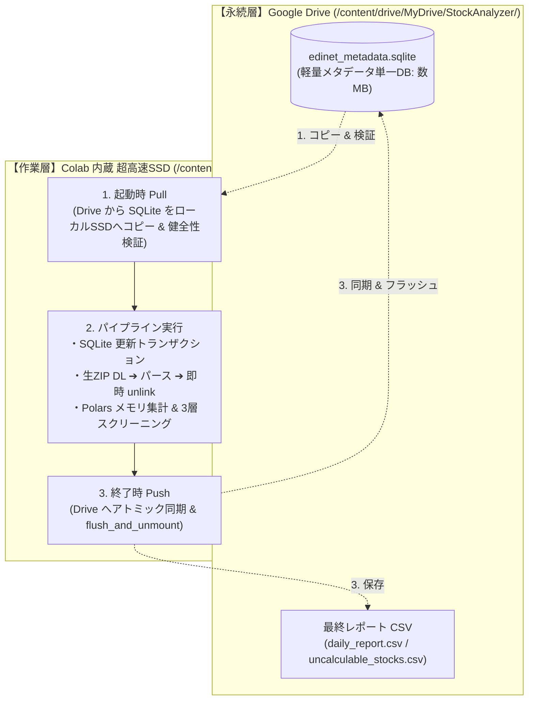
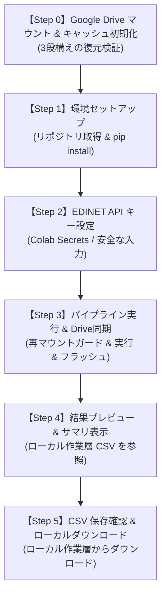

# Google Colab 実行基盤および有料コンテンツ提供設計書 (v1.0)

## 1. 概要と背景 (Background & Objective)

### 1.1 背景
Qiitaの前後編記事（データ取得編・3層クオンツ判定編）を通じて、東証全上場約3,900社を対象とした高速データパイプラインのアーキテクチャ設計・思想・実運用でのトラブルシューティングを公開した。  
多くの読者にとって最大の関心事は「この仕組みを自分の手元ですぐに動かして、毎日のスクリーニング結果を手に入れたい」という点にある。

しかし、ローカル環境（Mac / Windows / Linux）での動作には以下の参入障壁が存在する：
- Python バージョン（3.12+ 推奨）や C 拡張依存ライブラリのインストールトラブル
- OSごとのパス差異や文字コード（Shift-JIS / UTF-8）問題
- 常時稼働マシンやサーバーの不在

### 1.2 目的
誰でもブラウザ1つで即座に実行できる **Google Colab** を一次プラットフォームとし、ローカル環境構築のハードルを完全排除した「動かし方」の標準仕様を設計する。  
あわせて、本設計を有料コンテンツ（Zenn Book / 有料チャプター / note等）として提供する際の構成・ユーザー体験・トラブルシューティング指針を確立する。

---

## 2. システム要件と制約条件 (Requirements & Constraints)

### 2.1 Colab 無料枠スペックと適格性
- **メモリ**: 約 12 GB RAM
- **ディスク**: 約 100 GB（揮発性一時ストレージ）
- **CPU**: 2 vCPU
- **パイプライン適合性**:
  - 本システムのメモリ消費量は Polars の最適化により最大でも約 1.5 GB 程度であり、無料枠の 12 GB で十分に余裕がある。
  - 処理時間は平常時約 1 分 40 秒（新着書類多数時でも約 5 分）のため、Colab のアイドル切断制限（約90分無操作）に抵触することなく安全に完走可能。
  - ※なお、Colab 無料枠には「アイドル切断（90分）」のほかに「セッション最大継続時間（約12時間で強制切断）」が存在するが、本バッチは数分で終了するため影響を受けない。

### 2.2 Colab 固有のストレージ制約と「データ格納の 3 大リスク」
Colab のランタイムと Google Drive 連携においては、一般的なローカル PC や常駐サーバーとは大きく異なる以下の固有制約が存在する。

1. **FUSE マウントによる極端な I/O レイテンシ（大量の細切れファイル問題）**:  
   Google Drive（`/content/drive/`）はネットワーク経由の FUSE（Filesystem in Userspace）で動作する。数千件に及ぶ有報書類の細切れキャッシュや JSON などを Drive 直下で直接読み書きすると、ローカル SSD と比較して数十倍〜百倍以上の遅延が発生し、平常時 1分40秒のパイプラインが 30分以上フリーズしたように遅くなる。
2. **SQLite のファイルロック遅延と DB 破損リスク**:  
   Drive 上の SQLite ファイルに対して高頻度の書き込み・トランザクションを実行すると、FUSE の遅延によって `database is locked` エラーやファイル破損が発生しやすい。
3. **ユーザーの Google Drive 無料枠（15 GB）圧迫リスク**:  
   一般ユーザーの Drive 無料枠は Gmail や Google フォトと共有されている。生 ZIP や不要な中間生成物を Drive に溜め込むと、数回の実行で容量オーバーとなり実行不能に陥る。

---

## 3. 二層ストレージ（Stage-and-Sync）アーキテクチャ設計

上記の制約を完全克服するため、**「作業層（高速SSD）」と「永続層（Google Drive）」を明確に分離した二層ステージング同期モデル** を採用する。



### 3.1 ディレクトリ分離仕様

| 領域 | パス | 格納対象 | 特徴・管理方針 |
| :--- | :--- | :--- | :--- |
| **作業層**<br>(Local SSD) | `/content/working/` | ・実行用 SQLite DB<br>・ダウンロードした生 ZIP<br>・Polars 中間テーブル | **Colab 内蔵 高速ローカル SSD**。<br>すべての高頻度 I/O はここで行い、生 ZIP はパース直後に即時削除（`unlink`）してディスクを圧迫させない。セッション切断で破棄される前提の一時領域。 |
| **永続層**<br>(Google Drive) | `/content/drive/MyDrive/StockAnalyzer/` | ・`cache/edinet_metadata.sqlite`<br>・`output/daily_report.csv`<br>・`output/uncalculable_stocks.csv`<br>・`config/custom_config.json` | **ユーザーの Google Drive**。<br>細切れファイルは一切置かず、単一 DB（数MB）と最終 CSV（2ファイル）のみを保持。ユーザーの無料枠 15GB を消費させない（数十MB未満）。 |

### 3.2 同期ライフサイクル（Stage-and-Sync 規約）
1. **[Pull Phase: 実行開始時 & 整合性検証（3段構えの復元）]**:
   - Google Drive 上に `cache/edinet_metadata.sqlite` が存在するか確認。
   - **整合性検証と 3 段構えの自動復旧**:
     - **第1段（メインDB検証）**: Drive 上にメイン DB が存在する場合、作業層（`/content/working/cache/`）へコピーし、`PRAGMA quick_check` を実行。結果が `ok` であればそのまま採用。
     - **第2段（.bak 検証と復元）**: メイン DB が存在しない、または `quick_check` で破損が検知された場合、Drive 上のバックアップ `cache/edinet_metadata.sqlite.bak` を作業層へコピーし、**この `.bak` に対しても `PRAGMA quick_check` を実行**。健全であれば警告ログ（`⚠️ メインDB破損を検知したため、健全なバックアップ (.bak) から復元しました`）を出力して採用。
     - **第3段（新規初期化フォールバック）**: メイン DB・バックアップともに未存在、または**両方とも破損している場合**は、破損ファイルを破棄して新規 SQLite DB を初期化作成（`⚠️ バックアップDBも破損または未存在のため、DBを新規初期化します`）。
2. **[Execution Phase: パイプライン実行中]**:
   - パイプライン本体には作業層のローカルパス（`/content/working/`）のみを環境変数 `STOCK_ANALYZER_BASE_DIR` として渡す（※Google Driveのパスは絶対に渡さない）。
   - すべての SQLite トランザクション、ZIP 展開、Polars 集計はローカル SSD の爆速 I/O で完結。
3. **[Push Phase: 実行完了時・アトミック同期・フラッシュ & バックアップ]**:
   - 正常終了時のみ、更新された `edinet_metadata.sqlite` および生成された CSV を Google Drive 側へ安全に同期する。
   - **SQLite WAL モード対策**:
     - SQLite を WAL（Write-Ahead Logging）モードで運用している場合、コピー前に `PRAGMA wal_checkpoint(TRUNCATE)` を明示的に実行するか、全コネクションを完全に `close()` して `-wal` / `-shm` ファイルの変更を作業層のメインDBにフラッシュ（結合）した上でコピーを行う。
   - **安全な世代退避とアトミック書き込み**:
     - 既存の健全 DB を上書き・移動するのではなく、Drive 上で `cache/edinet_metadata.sqlite.bak` へ**コピー（`shutil.copy2`）して 1 世代分退避**（置き換え処理中の無保護な隙間時間をゼロにする）。
     - 作業層の最新 DB を Drive 上の `.tmp` ファイル（`edinet_metadata.sqlite.tmp`）に書き出した上で、`os.replace` によりアトミックに本番ファイルへ置き換える。
   - **非同期アップロードの完了保証（フラッシュと副作用への配慮）**:
     - FUSE 経由の書き込みはバックグラウンドで非同期にクラウドへ同期されるため、Push 完了直後に `from google.colab import drive; drive.flush_and_unmount()` を呼び出し、Google Drive クラウド側へのアップロード完了を確実に待機・保証する。
     - **アンマウントに伴う重要規約**: `flush_and_unmount()` 実行後は `/content/drive` へのアクセスが遮断される。そのため、**後続の Step 4（プレビュー）および Step 5（ダウンロード）は必ずローカル作業層（`/content/working/output/`）を参照する**設計とする。
     - また、同一セッションで条件を変更して Step 3 だけを再実行するケースに備え、Step 3 冒頭に「未マウント時のみ再マウントするガード処理」を配備する。

## 4. Colab ノートブック セル構成と UX 設計 (Step-by-Step Flow)

購入者が「上から順に再生ボタン（Shift+Enter）を押すだけ」で完了する、全6ステップのセル構成を規定する。



### 4.1 各セルの詳細仕様

#### 【Step 0】Google Drive マウント & キャッシュ初期化（Pull Phase）
- `google.colab.drive.mount('/content/drive')` を実行。
- 永続用フォルダ（`/content/drive/MyDrive/StockAnalyzer/`）の存在を確認し、なければ自動作成。
- **Stage-and-Sync (Pull)**: 3.2 節の 3 段構え検証（メイン DB -> .bak -> 新規作成）に基づき、健全な DB を Colab の高速ローカル SSD（`/content/working/cache/`）へ配置。

#### 【Step 1】環境セットアップ（安定リリースタグの取得 ＆ 依存解決）
- **公開 Git リポジトリからの安定バージョン取得**:
  - トークンや認証を一切不要とし、`!git clone` を実行。
  - **バージョン固定戦略**: 開発中の破壊的変更が購入者環境に直撃するのを防ぐため、デフォルトでは**検証済みの最新安定リリースタグ（例: `--branch v1.0.0`）**をチェックアウトする。
  - **ノートブックの整合性保証**: 「Open in Colab」バッジの URL も、`main` ではなく同一タグのパス（`https://colab.research.google.com/github/<ユーザー名>/stock-analyzer-core/blob/v1.0.0/notebooks/stock_analyzer_colab.ipynb`）を指すように設定し、セル構成とコードのバージョンの不一致を完全に防止する。
- **依存ライブラリの自動インストール**:
  - `polars`, `yfinance`, `requests` 等を静音インストール（`-q`）。
  - 所要時間：約 20〜30 秒。

```python
# Step 1 セル実装イメージ
import os
import shutil

repo_url = "https://github.com/<ユーザー名>/stock-analyzer-core.git"
target_dir = "/content/stock-analyzer-core"
target_version = "v1.0.0"  # 安定タグ指定 (必要に応じて "main" に変更可能)

if os.path.exists(target_dir):
    shutil.rmtree(target_dir)

!git clone --depth 1 --branch {target_version} {repo_url} {target_dir}
%cd {target_dir}
!pip install -q -r requirements.txt
```

#### 【Step 2】EDINET API キーの設定（セキュリティ設計）
- APIキーが平文で公開・共有ノートブックに残る事故を防止する。
- **推奨方式**: Colab の「シークレット（鍵アイコン：`userdata.get`）」機能を利用。
- **フォールバック**: 未登録の場合は `getpass.getpass()` による対話的マスク入力を要求。

```python
# APIキー設定セル (イメージ)
import getpass
import os

try:
    from google.colab import userdata

    edinet_api_key = userdata.get("EDINET_API_KEY")
except Exception:
    edinet_api_key = None

if not edinet_api_key:
    edinet_api_key = getpass.getpass(
        "EDINET APIキーを入力してください (画面には非表示): "
    )

os.environ["EDINET_API_KEY"] = edinet_api_key
```

#### 【Step 3】パイプライン実行 & Drive アトミック同期（Execution & Push Phase）
- **再マウントガード**: Step 3 を単独で再実行した場合に備え、Drive がアンマウント状態であれば自動で再マウントする。
  ```python
  if not os.path.exists("/content/drive/MyDrive"):
      from google.colab import drive

      drive.mount("/content/drive")
  ```
- 作業層（`/content/working/`）上でパイプラインを実行。すべての SQLite 書き込み・生 ZIP 展開パース・Polars 演算を超高速 SSD 上で完結させる。
  - 初回実行時：過去30日分の初期スキャン（約 3〜5 分）
  - 2回目以降：ローカル差分キャッシュ活用（約 1 分 40 秒）
- **Stage-and-Sync (Push)**:
  - SQLite コネクションを close / checkpoint フラッシュ。
  - Drive 上の既存 DB を `.bak` へコピー退避（`shutil.copy2`）した上で、`.tmp` 経由でアトミックに最新 DB と CSV 2 ファイルを Google Drive へ同期。
  - 転送直後に `drive.flush_and_unmount()` を呼び出し、Google Drive の非同期クラウド同期完了を確実に待機・保証。
- 完了時に処理時間を明示し、読者に「速さ」を実感させる演出。

#### 【Step 4】結果プレビュー ＆ サマリ表示（体験の最大化）
CSV を開かなくても、Colab 上で即座に分析結果を確認できるようにリッチテーブル表示を行う。
- **参照元**: Drive ではなく、**ローカル作業層（`/content/working/output/daily_report.csv`）**を読み込む。
- **適格銘柄ランキング Top 10**:
  - `Rank`, `Code`, `Name`, `Market`, `Verdict`, `PER`, `PBR`, `ROE`, `Equity_Ratio` を綺麗にフォーマット表示。
- **除外銘柄の理由別パイチャート / 集計表**:
  - 「極小流動性トラップ: 1,464社」「債務超過: 42社」などの内訳を可視化。

#### 【Step 5】CSV 保存確認 ＆ ローカルダウンロード
- Google Drive 上の保存パス（`My Drive/StockAnalyzer/output/daily_report.csv`）に永続保存・フラッシュ済みであることを案内。
- 手元の PC への保存は、**ローカル作業層から `google.colab.files.download('/content/working/output/daily_report.csv')`** を呼び出して提供（Drive がアンマウントされていても即座にダウンロード可能）。

---

## 5. トラブルシューティング ＆ エラー防止設計 (Fault-Tolerance)

購入者からの問い合わせ・不満を極小化するため、起こりうるエラーへの自動ガードを組み込む。

| 想定トラブル | 発生要因 | ノートブック側での自動対策 / ガード |
| :--- | :--- | :--- |
| **401 Unauthorized** | EDINET API キーの間違い、未登録 | 実行直前にメタデータ API へ 1 件テスト通信を実施。**HTTP ステータスコード（401）だけでなく、JSON レスポンスボディ内のエラーコード（`statusCode` や `message` 等）の両方を判定**し、認証不備時は「APIキーが正しくありません」と日本語で即時案内。 |
| **429 Too Many Requests** | yfinance / Yahoo のレート制限（※特に Google Cloud IP 帯は厳格制限を受けやすい） | バッチ取得時のチャンクサイズ調整、指数バックオフ（Retry with Exponential Backoff）の組み込み。**フェーズ 2 の実証検証において最優先で負荷検証を行う**。 |
| **Drive 容量不足** | 生 ZIP などの肥大化データ残存 | Google Drive へは単一の SQLite DB と最終 CSV（2ファイル）のみを同期し、生 ZIP は作業層（`/content/working/`）でパース直後に即時削除（`unlink`）して永続層に一切持ち込ませない。 |
| **セッション切断** | ブラウザを閉じた、ランタイムタイムアウト等 | 実行中の途中経過（未コミット分）は失われるが、**前回正常終了時点の DB が Google Drive に安全に保持されている**ため、再接続時も前日までのキャッシュを引き継いですぐに再実行が可能（全件再取得にはならない）。 |

---

## 6. 有料コンテンツとしての提供パッケージ設計

### 6.1 配布モデル（公開 GitHub ＋ 有料ガイド・Colab連携）
- **ソースコード**: GitHub 上で公開リポジトリとしてホスティング。
  - バグ修正や機能追加は `git push` 後に新タグを発行することで、利用者が混乱せずに安定版と最新版を選べるようにする。
- **有料コンテンツ（Zenn / note）**:
  - ワンクリックでノートブックが立ち上がる `[](...)` リンクを提供。
  - 読者への価値は「コードの文字列」ではなく、**「5分で動かせる完全な実行環境」「EDINET APIキー取得手順」「3層フィルタの各パラメータの意味とカスタマイズ術」「生成CSVをAIに読ませるプロンプト」** として提供する。

### 6.2 コンテンツの構成（目次案）
1. **はじめに**
   - 本コンテンツで手に入るもの（動作する完全環境、最新データ、日次ランキング）
   - 前後編記事の復習と本ツールの位置づけ
2. **準備編：5分で終わる事前準備**
   - EDINET API キー（無料）の取得手順（スクリーンショット付き）
   - 「Open in Colab」ボタンからワンクリックで開く手順
3. **実践編：Colab でスクリーニングを走らせる**
   - 各セルの解説と実行ボタンの押し方
   - 生成された `daily_report.csv` の読み解き方
4. **応用編：自分好みのスクリーニングへのカスタマイズ**
   - 流動性閾値（3,000万円）の変更方法
   - バリュー株重視 / グロース株重視の配点ウェイト変更
5. **発展編（特典）：LLM（Claude / ChatGPT）連携プロンプト**
   - 出力 CSV をそのまま LLM に投げて「朝の投資判断レポート」を自動執筆させるプロンプトテンプレート

### 6.3 法的留意事項・利用規約および免責設計

有料コンテンツとして販売・配布するにあたり、**EDINET API**、**yfinance**、および**金融商品取引法（投資助言・代理業）**に関する法的・規約上のリスクを低減・整理するための設計指針を規定する。
（※本節の整理は一般的な法解釈および実務慣行に基づく設計上の整理であり、個別具体的な法適合性を保証するものではない。商用販売に先立ち、必要に応じて弁護士等専門家への確認・相談を推奨する。）

#### ① EDINET API の利用適格性（公的オープンデータ準拠）
* **基本方針・位置づけ**:
  - 金融庁が提供する EDINET API は、政府のオープンデータ基本指針に基づき提供されており、原則として商用・非商用を問わず二次利用が認められていると整理される。
  - 最新の利用規約・利用案内（金融庁 EDINET 閲覧・提出サイト掲載）を定期的に確認し、準拠を維持する。
* **運用上の配慮**:
  - **API キーの個別取得**: API キーの代理取得や共有・再配布は行わず、**購入者自身に金融庁の無料アカウントから個別の API キーを取得させる設計**（Step 2）とする。
  - **クレジット表示**: 出力ドキュメント、CSV レポートヘッダ、および解説記事内に「出典：金融庁 EDINET 閲覧（提出）サイト」等の適切なクレジット表記を明記する。
  - **サーバー負荷への配慮**: 差分キャッシュ（Stage-and-Sync）により、金融庁サーバーへの過剰な負荷（連続再取得・短時間過密アクセス）を抑制する。

#### ② yfinance（Yahoo Finance）の利用境界と制約事項
* **規約上の制約と現状の認識**:
  - Yahoo Finance の利用規約（Terms of Service）では、商用・非商用を問わず「自動化された手段（クローリング、スクレイピング、非公式 API 等）によるアクセス」が制限されている条項が存在する。
  - したがって、「購入者が個人利用（Personal Use）で実行するから完全に規約上安全である」と過度に断定することは避け、**非公式ライブラリ（yfinance）の利用には規約抵触や突然のアクセス遮断（429 Too Many Requests 等）のリスクが内在することを明記**する。
* **本教材における設計上の整理**:
  - 本コンテンツが販売するのは株価データそのものではなく、**「オープンソースコード（GitHub公開）と、それを用いた個人学習用のデータエンジニアリング手順書（Zenn/note）」**である。
  - データ取得の実行主体は購入者自身であり、教材提供者がデータを配信・再販する形態は取らない。
* **恒久対策と今後のロードマップ（Actions 版での対応）**:
  - 将来的な規約改定やアクセス遮断に備え、価格取得ロジックは**プロバイダ抽象インターフェース**として切り出し可能な構成を維持する。
  - 本番運用や安定した自動化（GitHub Actions 版等）を志向する利用者に向けて、日本取引所グループ公式の正規商用データプロバイダである **[J-Quants API](https://jquants.com/) 等への差し替えオプション**を推奨・提示する。
  - 記事内およびノートブックに以下の注記を付与する：
    > *「※本教材はデータ処理技術の個人学習・研究を目的として yfinance を使用しています。Yahoo の利用規約上の制限やアクセス制限リスクが存在するため、安定した本番運用や商用利用を行う場合は、日本取引所グループ公式の [J-Quants API](https://jquants.com/) 等の正規データプロバイダの利用を強く推奨します。」*

#### ③ 金融商品取引法（投資助言・代理業）への抵触回避
* **法的位置づけ（金商法第2条第8項第11号・金融庁監督指針準拠）**:
  - 投資助言・代理業に該当するか否かは、金融商品取引法第2条第8項第11号括弧書（「不特定多数の者に対して販売することを目的として作成された書籍その他の著作物の販売等」の除外規定）および金融庁の「事務ガイドライン（投資助言・代理業関係）」に基づき判断される。
  - 本ツールが出力する `Verdict: BUY` や総合スコアについて、登録を要する「投資助言」とみなされないよう、以下の設計およびサポート境界を遵守する。
* **セーフティ設計要件**:
  1. **客観的・数学的計算ツールの維持**: あらかじめ定められた客観的な計算アルゴリズムに基づき機械的に数値を算出するプログラムであり、販売者独自の主観的推奨を配信するものではないこと。
  2. **パラメータの可変性**: 利用者自身が条件（売買代金閾値や戦略プリセット等のパラメータ）を任意に変更・調整して探索・検証できる設計になっていること（カスタマイズ機能の提供）。
  3. **不特定多数への一律販売**: 特定の個人向けにカスタマイズした銘柄診断や投資判断を提供するものではないこと。
* **サポート境界と厳禁事項（運用の絶対原則）**:
  - **日次スクリーニング結果の定期配信の禁止**: 購入者コミュニティや有料メルマガ・限定チャット等で「本日の BUY 銘柄一覧」を継続的に配信する行為は、投資助言に該当するリスクが急増するため、本コンテンツのサポート・提供範囲から完全に除外する（あくまで「自分で動かすツール」の提供に限定）。
  - **個別銘柄相談の禁止**: 「この銘柄を買うべきか」「このスコアはどう判断すべきか」といった購入者からの個別投資相談には一切回答せず、サポート対象外とする。
  - **誇大表現の排除**: 「このツールで絶対に勝てる」「将来の株価上昇を保証する」といった誇大表現や売買指示的なセールスコピーを一切排除する。
* **標準免責事項文（販売ページおよび Colab 先頭への必着テンプレート）**:
  ```text
  【免責事項（Disclaimer）】
  本ツールおよび解説コンテンツは、公開財務データおよび市場データの自動処理・スクリーニング技術の
  学習・研究を目的としたものであり、特定の有価証券の売買推奨や投資助言を提供するものではありません。
  算出されるスコアおよび判定（Verdict）は数式モデルに基づく機械的計算結果であり、将来の運用成果を
  保証するものではありません。実際の投資判断および売買は、必ずご自身の責任において行ってください。
  また、本ツールの利用により生じたいかなる損害についても、著者は一切の責任を負いかねます。
  ```

#### ④ コンプライアンス・チェックリストまとめ

| 対象 | 法的・規約上の位置づけ | 必須となる防衛措置 |
| :--- | :--- | :--- |
| **EDINET** | 🟢 公的オープンデータ（二次利用容認） | ・購入者自身に個別 API キーを取得させる<br>・「出典：EDINET」のクレジット記載<br>・差分キャッシュによるサーバー負荷軽減<br>・最新利用規約の継続確認 |
| **yfinance** | 🟡 自動アクセス制限等の規約リスクあり | ・データそのものではなく「個人学習用の動かし方・コード」として販売<br>・自動アクセス制限や規約リスクの注記を明示<br>・正規プロバイダ（J-Quants API 等）への切り替え推奨<br>・将来のプロバイダ抽象化の布石 |
| **金商法 (BUY判定)** | 🟡 投資助言業（第2条第8項第11号）の境界 | ・機械的計算ツールの位置づけ（パラメータ変更可能性を確保）<br>・不特定多数向け著作物除外の範囲内での運用<br>・日次スクリーニング結果配信や個別銘柄相談の厳禁（サポート境界明定）<br>・標準免責事項文（自己責任原則）の明示 |

---

## 7. 今後のアクションプラン

1. **[フェーズ 1] Colab 用ノートブック本体（`.ipynb`）の作成**
   - 本設計書に基づき、エラーガードと Drive アトミック同期を実装したノートブックを作成。
2. **[フェーズ 2] Colab 実行の単体検証（最重要：yfinance レート制限検証）**
   - Google Cloud IP 帯からの yfinance 並列ダウンロードにおける 429 エラー発生有無の厳密測定。
   - 初回実行（キャッシュゼロ）および 2 回目実行（差分キャッシュ有効）の処理時間・アトミック Push の安全性検証。
3. **[フェーズ 3] 読者向けマニュアル（Zenn / note 原稿ドラフト）の執筆**
   - スクリーンショットを含めた丁寧な解説記事を作成。

---

### 【参考メモ】GitHub Actions 版（完全自動化）着手時の最重要検討論点
将来の Actions 版（定時バッチ自動実行）の設計に進む際、本設計書 6.3 節の法的整理と直結する以下の構造的課題を初期論点として設定する：

* **公開リポジトリへの日次 commit リスク**:
  - Actions 実行のキャッシュ永続化としてリポジトリへの自動 commit ＆ push を採用する場合、**公開リポジトリ（Public）では `daily_report.csv` や株価由来データが毎日全世界に公開・蓄積**されていく。
  - これは「日次スクリーニング結果の継続的公表・配信（金商法上の投資助言リスク）」および「yfinance 取得データの再配布（Yahoo 規約リスク）」とみなされる懸念がある。
* **設計上の選択肢とトレードオフ**:
  1. **Commit 対象の限定**: リポジトリに commit するのは EDINET 由来のメタデータ DB のみとし、`daily_report.csv` 等の分析結果は GitHub Actions Artifact（保持期間制限あり）や外部非公開ストレージへ逃がす方式。
  2. **非公開リポジトリ（Private）前提**: 購入者に自身のアカウントで Private リポジトリとしてフォーク／作成させる方式。
     - *トレードオフ*: GitHub Actions の無料枠は Public では無制限だが、**Private では月間 2,000 分の上限**がある。日次実行（約3〜5分/回 × 30日 ＝ 約90〜150分/月）であれば無料枠内で十分に収まるため、Private 推奨が最も安全な構成となる可能性が高い。
  - ※これらの比較検討は Actions 版の設計着手時に最初のテーマとして詳細化する。
