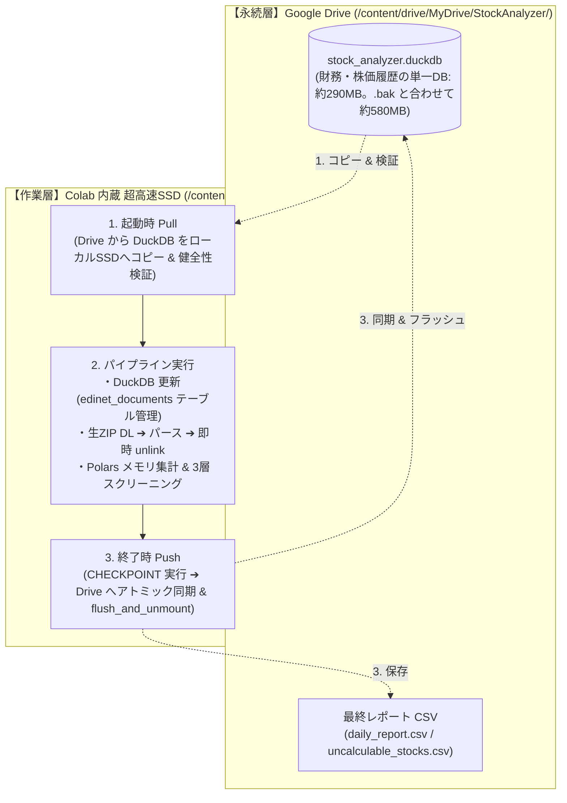
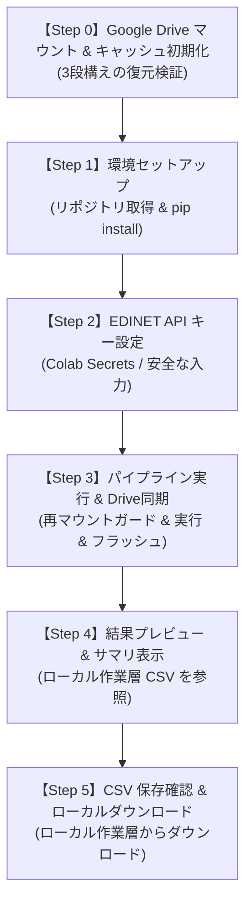

# Google Colab 実行基盤および有料コンテンツ提供設計書 (v1.0)

## 1. 概要と背景 (Background & Objective)

### 1.1 背景
Qiitaの前後編記事（データ取得編・3層クオンツ判定編）を通じて、東証全上場約3,900社を対象とした高速データパイプラインのアーキテクチャ設計・思想・実運用でのトラブルシューティングを公開した。  
多くの読者にとって最大の関心事は「この仕組みを自分の手元ですぐに動かして、毎日のスクリーニング結果を手に入れたい」という点にある。

しかし、ローカル環境（Mac / Windows / Linux）での動作には以下の参入障壁が存在する：
- Python バージョン（3.12+ 推奨）や C 拡張依存ライブラリのインストールトラブル
- OSごとのパス差異や文字コード（Shift-JIS / UTF-8）問題
- 常時稼働マシンやサーバーの不在

### 1.2 目的
誰でもブラウザ1つで即座に実行できる **Google Colab** を一次プラットフォームとし、ローカル環境構築のハードルを完全排除した「動かし方」の標準仕様を設計する。  
あわせて、本設計を有料コンテンツ（Zenn Book / 有料チャプター / note等）として提供する際の構成・ユーザー体験・トラブルシューティング指針を確立する。

---

## 2. システム要件と制約条件 (Requirements & Constraints)

### 2.1 Colab 無料枠スペックと適格性
- **メモリ**: 約 12 GB RAM
- **ディスク**: 約 100 GB（揮発性一時ストレージ）
- **CPU**: 2 vCPU
- **パイプライン適合性**:
  - 本システムのメモリ消費量は Polars の最適化により最大でも約 1.5 GB 程度であり、無料枠の 12 GB で十分に余裕がある。
  - 処理時間は Colab 上で初回・2回目以降とも約 8〜10 分（通信 1 回あたりの遅延が大きいため。§3.3 参照）。専用 IP のローカル / サーバーでは平常時約 1 分 40 秒（新着書類多数時でも約 5 分）。いずれも Colab のアイドル切断制限（約90分無操作）に抵触することなく安全に完走可能。
  - ※なお、Colab 無料枠には「アイドル切断（90分）」のほかに「セッション最大継続時間（約12時間で強制切断）」が存在するが、本バッチは数分で終了するため影響を受けない。

### 2.2 Colab 固有のストレージ制約と「データ格納の 3 大リスク」
Colab のランタイムと Google Drive 連携においては、一般的なローカル PC や常駐サーバーとは大きく異なる以下の固有制約が存在する。

1. **FUSE マウントによる極端な I/O レイテンシ（大量の細切れファイル問題）**:  
   Google Drive（`/content/drive/`）はネットワーク経由の FUSE（Filesystem in Userspace）で動作する。数千件に及ぶ有報書類の細切れキャッシュや JSON などを Drive 直下で直接読み書きすると、ローカル SSD と比較して数十倍〜百倍以上の遅延が発生し、平常時 1分40秒のパイプラインが 30分以上フリーズしたように遅くなる。
2. **DuckDB のファイルロック遅延と DB 破損リスク**:  
   Drive 上のデータベースファイルに対して直接高頻度の書き込み・トランザクションを実行すると、FUSE の遅延によってロック競合エラーやファイル破損が発生しやすい。
3. **ユーザーの Google Drive 無料枠（15 GB）圧迫リスク**:  
   一般ユーザーの Drive 無料枠は Gmail や Google フォトと共有されている。生 ZIP や不要な中間生成物を Drive に溜め込むと、数回の実行で容量オーバーとなり実行不能に陥る。

---

## 3. 二層ストレージ（Stage-and-Sync）アーキテクチャ設計

上記の制約を完全克服するため、**「作業層（高速SSD）」と「永続層（Google Drive）」を明確に分離した二層ステージング同期モデル** を採用する。



### 3.1 ディレクトリ分離仕様

| 領域 | パス | 格納対象 | 特徴・管理方針 |
| :--- | :--- | :--- | :--- |
| **作業層**<br>(Local SSD) | `/content/working/` | ・実行用 DuckDB (`cache/stock_analyzer.duckdb`)<br>・ダウンロードした生 ZIP<br>・Polars 中間テーブル | **Colab 内蔵 高速ローカル SSD**。<br>すべての高頻度 I/O はここで行い、生 ZIP はパース直後に即時削除（`unlink`）してディスクを圧迫させない。セッション切断で破棄される前提の一時領域。 |
| **永続層**<br>(Google Drive) | `/content/drive/MyDrive/StockAnalyzer/`<br>（※`drive_folder_name` により任意のフォルダ名・相対階層・共有ドライブへ変更可能） | ・`cache/stock_analyzer.duckdb`<br>・`output/daily_report.csv`<br>・`output/uncalculable_stocks.csv`<br>・`config/custom_config.json` | **ユーザーの Google Drive**。<br>細切れファイルは一切置かず、単一 DB（約290MB。直前の世代 `.bak` と合わせて約580MB）と最終 CSV（2ファイル）のみを保持。ユーザーの無料枠 15GB に対しては十分に小さい（約4%）。 |

### 3.2 同期ライフサイクル（Stage-and-Sync 規約）
1. **[Pull Phase: 実行開始時 & 整合性検証（3段構えの復元）]**:
   - Google Drive 上に `cache/stock_analyzer.duckdb` が存在するか確認。
   - **整合性検証と 3 段構えの自動復旧**:
     - **第1段（メインDB検証）**: Drive 上にメイン DB が存在する場合、作業層（`/content/working/cache/`）へコピーし、主要テーブル（`stocks` 等）の読み込み検証を実行。正常であればそのまま採用。
     - **第2段（.bak 検証と復元）**: メイン DB が存在しない、または検証で破損が検知された場合、Drive 上のバックアップ `cache/stock_analyzer.duckdb.bak` を作業層へコピーし、**この `.bak` に対しても健全性検証を実行**。健全であれば警告ログ（`⚠️ メインDB破損を検知したため、健全なバックアップ (.bak) から復元しました`）を出力して採用。
     - **第3段（作業層の既存 DB 継続 / 新規初期化）**: メイン DB・バックアップともに未存在、または**両方とも破損している場合**、作業層に健全な DB があれば**消さずに継続利用**する（Step 3 の同期確定で Drive がアンマウントされた後に Step 1 を再実行した場合や、同期失敗後の再実行で、最新データを失わないため）。作業層にも無ければ新規初期化とし、スキーマ作成はパイプライン（`ensure_schema`）が行う。
     - **検証前に作業層 DB を上書きしない**: Drive からのコピーは一時ファイル（`.pulltmp`）へ行い、健全性を確認してから `os.replace` で作業層 DB と置き換える。Drive 側が破損していても作業層の既存 DB は保たれる。
     - **古い WAL の破棄**: 作業層 DB を置き換える際（第1・2段）と新規初期化する際は、置き換え前の DB に属する WAL（`<db>.wal`。ランタイム再起動などで中断した実行の未反映分）を削除する。残っていると新しい DB に再生されて開けなくなり、整合性チェックが「破損」と誤判定して不要なリセットを促してしまう。作業層 DB を継続利用する場合（第3段）は、その DB 自身の WAL なので残す。`reset_cache` も WAL を削除する。
     - Step 1 は冒頭で Drive が未マウントなら再マウントする（Step 3 と同じガード）。
2. **[Execution Phase: パイプライン実行中]**:
   - パイプライン本体には作業層のローカルパス（`/content/working/`）のみを環境変数 `STOCK_ANALYZER_BASE_DIR` として渡す（※Google Driveのパスは絶対に渡さない）。
   - すべての DuckDB トランザクション、ZIP 展開、Polars 集計はローカル SSD の爆速 I/O で完結。
3. **[Push Phase: 実行完了時・アトミック同期・フラッシュ & バックアップ]**:
   - 正常終了時のみ、更新された `stock_analyzer.duckdb` および生成された CSV を Google Drive 側へ安全に同期する。
   - **DuckDB CHECKPOINT 対策**:
     - コピー前に `CHECKPOINT` クエリを明示的に実行し、WAL の変更を確実にメインDBファイルへ完全にフラッシュ結合させた上でコピーを行う。
   - **安全な世代退避とアトミック書き込み**:
     - 既存の健全 DB を上書き・移動するのではなく、Drive 上で `cache/stock_analyzer.duckdb.bak` へ**コピー（`shutil.copy2`）して 1 世代分退避**（置き換え処理中の無保護な隙間時間をゼロにする）。
     - **退避は「既存の Drive DB が健全な場合のみ」行う**。破損した Drive DB で健全な `.bak` を上書きしないよう、コピー前に健全性を検証し、破損時は既存の `.bak` を保護して退避をスキップする。
     - 作業層の最新 DB を Drive 上の `.tmp` ファイル（`stock_analyzer.duckdb.tmp`）に書き出した上で、`os.replace` によりアトミックに本番ファイルへ置き換える（Drive 直下への不要な重複コピーは行わない）。
   - **非同期アップロードの完了保証（フラッシュと副作用への配慮）**:
     - FUSE 経由の書き込みはバックグラウンドで非同期にクラウドへ同期されるため、Push 完了直後に `from google.colab import drive; drive.flush_and_unmount()` を呼び出し、Google Drive クラウド側へのアップロード完了を確実に待機・保証する。
     - **アンマウントに伴う重要規約**: `flush_and_unmount()` 実行後は `/content/drive` へのアクセスが遮断される。そのため、**後続の Step 4（プレビュー）および Step 5（ダウンロード）は必ずローカル作業層（`/content/working/output/`）を参照する**設計とする。
     - また、同一セッションで条件を変更して Step 3 だけを再実行するケースに備え、Step 3 冒頭に「未マウント時のみ再マウントするガード処理」を配備する。

### 3.3 取得プロファイルと差分取得仕様（Colab 専用ルート）

#### 3.3.1 なぜ Colab 専用ルートか
市場データ取得（`MarketFetcher`）のコード経路は CLI / Colab で同一（20 銘柄ずつのサブバッチ・1 並列）である。専用環境では約 1 分 40 秒（約 0.5 秒/サブバッチ）だが、Colab では約 2.3 秒/サブバッチかかり、差分モードでも約 8 分を要する。1 分 40 秒は Colab では達成できない前提とする。

**実測（2026-10-02、Colab、差分モード 197 サブバッチ、yfinance 0.2.66）**:

| プロファイル（事前インターバル） | 全体 | 市場データ取得 | 空応答・例外（429 の疑い） | 取得不能銘柄 |
| :--- | ---: | ---: | :---: | :---: |
| `colab` 初期値（1.0 秒） | 664 秒 | 607 秒 | 0 | 120 |
| `standard`（0.2 秒、直前の実行に続く不利な条件） | 499 秒 | 454 秒 | 0 | 120 |

- 取得時間の差（153 秒）は事前インターバルの差（0.8 秒 × 197 ≒ 158 秒）でほぼ説明でき、**429 は当日の 4 回の実行すべてで 0 件**。Colab の遅さの主因は 429 ではなく**通信 1 回あたりの遅延**であり、事前インターバルは効果が無かった。
- このため `colab` の事前インターバルは標準と同値（0.2 秒）とし、**リトライ回数・バックオフの拡大のみ**を Colab 専用の保険として残す（429 が発生しない限りコストは無い）。
- 取得不能の 120 銘柄はすべて取引が止まっている銘柄（2 日分の取得は 0 件、1 年分でも最終日が 9 月以前）で、429 による欠落ではない。
- さらなる短縮には並列化（`MAX_WORKERS` > 1）やサブバッチ拡大が考えられるが、429 リスクが変わるため Colab 実測を伴う別検討とする。

| プロファイル | 選択方法 | サブバッチ成功後の事前インターバル | リトライ回数 | バックオフ基準 (空応答 / 例外) |
| :--- | :--- | :---: | :---: | :---: |
| `standard`（CLI 既定） | 未指定 | 0.2 秒 | 3 | 5 秒 / 10 秒 |
| `colab` | ノートブックが `context.config["fetch_profile"] = "colab"` を設定（環境変数 `STOCK_ANALYZER_FETCH_PROFILE` でも指定可） | 0.2 秒 | 5 | 8 秒 / 15 秒 |

- 選択順は `context.config["fetch_profile"]` → 環境変数 → `standard`。**環境の推測判定（`/content` の有無など）は行わず、ノートブックが明示する**。
- 値は上記の実測に基づく（実装: `src/fetcher/fetch_profile.py`）。開発者の検証用に、ノートブックで Step 3 の前に `fetch_profile = "standard"` を定義すると切り替えられる。
- 取得できなかった銘柄は `context.config["fetch_missing_codes"]` に集計され、Step 3 の完了時に件数が表示される（上場廃止銘柄を含む）。

#### 3.3.2 差分取得の期間は銘柄ごとに DB の最終日から決める
- DB 全体の単一フラグではなく、**銘柄ごとの DB 履歴**で取得期間を決める。履歴が `MIN_HISTORY_ROWS`（20 行、直近 20 日平均売買代金の算出に必要な最低行数）未満の銘柄は `1y`。
- 十分な銘柄は、**DB の最終日から今日までの欠落営業日数 + 1 日**（最終日も取り直して重なり日にする）を `2d` / `5d` / `10d` / `21d` に切り上げて取得する。欠落が 1 か月を超える場合は `1y`（`src/fetcher/incremental.py`）。
  - v1.2.0 までは常に `2d` だったため、実行間隔が空くとその間の日付が永久に欠落していた（8 営業日の欠落で Trend が変わる銘柄 30%）。
- 期間ごとにバッチを分けて取得する。新規上場や、前回の 429 で欠落した銘柄は、次回実行で自動的に `1y` で取り直される（欠落の自己修復）。
- `context.config["is_first_run"]` が True の場合は全銘柄 `1y`。CLI のように未設定でも、履歴が無ければ全銘柄 `1y` になる。
- **株式分割**: Yahoo Finance は日本株の分割を**過去に遡って調整しない**（2026-10 に確認。しまむら 8227 の 3:1 分割は、調整済みの値でも 10,975 円 → 3,713 円の段差のまま）。株価取得のリクエストで分割イベント（`actions=True`）も受け取り、`stock_splits` に記録したうえで、分割前の株価を比率で割り、出来高に比率を掛けて自前で調整する（`apply_split_adjustments`）。
  - Yahoo のイベント日は実際の段差より 1〜3 営業日後になる（8227: 段差 2/18・イベント 2/19、7946: 段差 3/2・イベント 3/5）ため、イベント日の 7 日前〜3 日後で前日比が分割比率に最も近い日を段差とみなす。段差が無い（調整済みの）履歴には何もしないので、毎回適用しても結果は変わらない。
  - v1.2.0 までは分割の段差がそのまま残り、3:1 分割で 25 日線乖離率 −64%・RSI 10 という偽の暴落が 2 か月続いていた。初回の 1 年分の取得にも段差が含まれていた。
- **配当落ちの調整のずれ**: Yahoo は配当落ちのたびに過去の値を遡って調整する（`auto_adjust=True`）が、DB の保存値は古い調整のまま残る。重なり日の終値が 0.5% を超えて食い違った銘柄は、DB の履歴を使わず `2y` で全期間を取り直す（保存時に DB の過去の値も上書きされる）。
- **当日足**: 東証の大引け（15:30）後、Yahoo の日足が確定するまでの余裕をみて、**16:00 前に取得した当日の足は採用しない**（取引時間中の途中値で評価・保存しない）。
- **待機**: 取得スレッドから結果が届かない状態を最大 900 秒待つ（Colab プロファイルの再試行・待機が 1 バッチ最大約 8 分のため。v1.2.0 は 180 秒で打ち切り、途中までのデータで評価していた）。最後の試行の後の待機は行わない。
- DB から読む履歴の始値・高値・安値は保存値を返す（v1.2.0 はダミーの 0 を返し、保存時に DB の実際の値を 0 で上書きしていた。0 は欠損として読み、順次 NULL に置き換わる）。

### 3.4 DB 整合性検証仕様（Colab / CLI 共通）
- 閾値は `ColabSyncManager.MIN_STOCKS = 1000`（銘柄マスタ・財務データ）、`MIN_HISTORY_DATES = 20`（`daily_metrics` の日数）の**単一定義**。必須テーブルは `stocks` / `fundamentals` / `daily_metrics`。
- 検証・案内・中断は `ColabSyncManager.enforce_integrity()` に集約し、Step 1・Step 3・`pull_database(validate_integrity=True)` はすべてこれを呼ぶ。不整合時は Colab 向け（`reset_database` を ON）と CLI 向け（`reset_cache` を実行）の両方の対処を案内して `RuntimeError` で中断する。
- **初回判定**: ノートブック Step 1 は `pull_database(validate_integrity=True)` の後、**実際に使う DB が健全かどうか**で初回を判定する（Drive が見えないだけで初回扱いにしない）。既存 DB を使う場合は整合性を検証し、新規（初回・`reset_database` 直後）は検証しない。`is_first_run()`（Drive 上のメイン**または** `.bak` の有無で判定）は Step 3 を単独実行した場合の補助判定に使う。
- Step 3 が正常完了したら `is_first_run = False` に更新し、同一セッションでの Step 3 単独再実行は差分モードかつ検証ありで動作する。
- `reset_cache` は DB・`.bak` に加え、Push 中断で残る `.tmp` も削除する。

### 3.5 リリース・タグ運用
- 開発は `main` 1 本で行う。ブランチは分けない。
- Colab が取得するコードは、ノートブック Step 1 の `TARGET_BRANCH`（検証済みタグ）で固定する。**「Open in Colab」バッジは `main` のノートブックを開く**ため、ノートブックを変更するときは `TARGET_BRANCH` を新タグへ上げる。
- **公開済みタグは付け替えない**。修正のたびに新しい番号（機能追加は `v1.x.0`、修正のみは `v1.x.y`）の注釈付きタグを発行する。
- リリース手順: ① `main` で修正・Colab 動作確認 → ② ノートブックの `TARGET_BRANCH` を新タグへ更新してコミット → ③ そのコミットに注釈付きタグを付け、`main` と一緒に push。
- ノートブックが呼ぶ `ColabSyncManager` のメソッドが `TARGET_BRANCH` 時点のコードに存在することは `tests/test_colab_sync.py::test_notebook_uses_only_existing_sync_methods` が検証する（タグ作成後に有効）。
- タグの clone に失敗して `main` へフォールバックした場合、ノートブックは警告を表示する。

### 3.6 調査用サマリ（トラブル時のサポート情報）
- 購入者の環境で問題が起きたとき、サポートへ添付できる 1 つのテキスト `diagnostics_summary.txt`（`src/utils/diagnostics.py`）を生成する。Colab / CLI 共通。
- **生成タイミング**: Step 3 の正常完了時（Drive 同期結果を含む）と、パイプラインが例外で中断したとき（traceback を含む）。Step 3 より前の失敗に備え、末尾の「困ったときは」セルが未作成のサマリをその場で生成する。
- **取得は任意操作**: 通常は意識させない。困ったときだけ「困ったときは」セルを実行すると、内容を表示しファイルとしてダウンロードする。
- **内容**: 実行環境（Colab / CLI、Python、コード版 = `git describe`、主要ライブラリ版）、取得コード指定（`TARGET_BRANCH`）、実行モード、設定の主要項目（ホワイトリスト）、市場データ取得の統計（サブバッチ数・空応答・例外・1y/2d の計画銘柄数）、取得できなかった銘柄、時間内訳、DB 統計（各テーブル件数・日付範囲・サイズ。**中身は含めない**）、Drive キャッシュの有無と更新時刻、記録されたエラーと中断時の traceback。
- **含めない情報**: API キー、メールアドレス、認証情報、設定ファイル全体、DB の中身。API キー様の文字列とメールアドレスは出力時に自動で伏せる（`scrub`）。ファイル冒頭に「含まれない情報」を明記し、添付前の確認を促す。
- **堅牢性**: 各セクションの収集失敗は握りつぶし、取れた範囲だけ出力する。診断はファイルシステムに副作用を持たない（読み取り専用）。
- **取り違え防止**: Step 3 開始時に `stamp_run` で実行時のコード版と開始時刻を記録し、サマリには「実行時のコード版」と「サマリ作成時点のコード版」を分けて載せる。結果欄は生成元で区別する（Step 3 完了 / Step 3 失敗 / 「困ったときは」セルで作成＝結果不明）。時刻は JST、Drive 未マウント時はその旨を表示する。
- 取得統計は `context.config["fetch_stats"]`（`record_fetch_stat`）に加算され、`fetch_missing_codes` と合わせて出力される。

### 3.7 銘柄マスタの月次更新と、市場データ非提供銘柄の再取得抑制（Colab / CLI 共通）

#### 3.7.1 銘柄マスタの月次更新（`src/services/stock_master.py`）
- 同梱の銘柄リスト（`src/resources/jp_stock_list.csv`）は固定のため、放置すると新規上場銘柄が対象外のまま、上場廃止銘柄が取得失敗として残り続ける（実測: 2026-10 時点で新規 43 件が未登録、廃止 71 件が残存）。
- 取得フェーズの冒頭で、**最終更新から 30 日以上経過していれば** JPX 公式の上場銘柄一覧（`data_j.xlsx`）を取得して反映する。最終更新日は DB の `app_meta`（キー `stock_master_refreshed_at`）に保存されるため、Colab では Drive の DB とともに引き継がれる。
  - **新規上場**: `stocks` に追加（有効）。財務データは EDINET 同期で順次補われ、揃うまで指標は `-`。
  - **上場廃止**（一覧から消えた銘柄）: `is_active=FALSE` / `status='delisted'` とし、取得対象から外す。**データは削除せず**、除外銘柄リストに「上場廃止」として残す。
  - **再上場**: 再び有効化。**社名・業種・市場の変更**: 更新。
- **安全弁**: 取得した一覧が 3,000 件未満（不完全）、または廃止判定が登録銘柄の 10% を超える（一覧の異常）場合は、誤った一覧による大量の無効化を防ぐため**何も変更しない**。ダウンロード失敗も含め、更新の失敗は本処理を止めず、従来のマスタで継続する（`fetcher.refresh_stock_master: false` で無効化可）。

#### 3.7.2 市場データ非提供銘柄の再取得抑制
- PRO Market 等、Yahoo Finance が株価を提供しない銘柄は、毎回取得を試みても取得できず、時間と通信を無駄にする（実測: 取得不能 120 件のうち 56 件は現行の JPX 一覧に存在する）。
- **DB に履歴が全く無い銘柄**が **3 回連続**で取得できなかった場合、**30 日間**再取得を止める（`stocks.excluded_until` / `exclusion_reason`）。期間が過ぎたら 1 回だけ再確認し、データが取れれば失敗回数と停止を自動でリセットする。
- 誤停止の防止: 直近 2 日に取引が無いだけの銘柄（履歴あり）は数えない。通信障害などで**取得成功率が 70% 未満の実行は、誰も失敗として数えない**。
- 停止中の銘柄も銘柄マスタには残るため、除外銘柄リストに「市場データ取得不能」（詳細に「Yahoo Finance にデータが提供されていません」）として出力される。
- 調査用サマリ（§3.6）の取得統計に、`master_added` / `master_delisted` / `skipped_no_data_stocks` / `no_data_failed` / `no_data_cooled` が記録される。

#### 3.7.3 レポートの出所表示（`*_Src`）
- 出所は `calc`（株価と EPS・BPS・DPS・発行済株式数から再計算でき、保存値と一致）/ `stored`（DB 保存値。取得元・取得時点は断定しない）/ `-`（元データなし）で表示する。
- 実測（2026-10-03、開発者の Drive DB）: PER・PBR・配当利回り・時価総額は 1,200〜1,800 件に値があるが、再計算の入力である EPS・BPS・DPS・発行済株式数はほぼ空（3〜6 件）。これらは過去の取得処理が DB に保存した値で、本システムが再計算できない。以前の一律 `yf` 表示は、取得元を証明できないため `stored` に改めた。
- **開発者の DB と購入者の DB は別物**: 購入者の DB は空から始まり、同梱シードに PER 等は無い。購入者の出力は、シードの EPS・BPS・DPS 等から**株価と再計算できた銘柄のみ値が入り（`calc`）**、それ以外は `-` になる。開発者の DB での検証結果は、購入者の体験を代表しない。購入者相当の確認は、別の保存先フォルダ（Step 0 の `drive_folder_name`）で空の DB から実行して行う。

## 4. Colab ノートブック セル構成と UX 設計 (Step-by-Step Flow)

購入者が「上から順に再生ボタン（Shift+Enter）を押すだけ」で完了する、全6ステップのセル構成を規定する。



### 4.1 各セルの詳細仕様

#### 【Step 0】Google Drive マウント & キャッシュ初期化（Pull Phase）
- `google.colab.drive.mount('/content/drive')` を実行。
- 入力パラメータ `drive_folder_name`（デフォルト: `StockAnalyzer`）または環境変数 `STOCK_ANALYZER_DRIVE_DIR` に基づき、`ColabSyncManager.resolve_drive_dir` で永続先フォルダを動的に解決。
  - 単一フォルダ名（`StockAnalyzer` 等）の場合は `/content/drive/MyDrive/<名前>`
  - 相対パス（`Portfolio/Japan` 等）の場合は `/content/drive/MyDrive/<相対パス>`
  - 絶対パス（`/content/drive/Shareddrives/...` 等）の場合はそのまま採用（共有ドライブ対応）
- 解決された永続用フォルダ配下の `cache/`, `output/`, `config/` の存在を確認し、なければ自動作成。
- **Stage-and-Sync (Pull)**: 実際の DB 配置（`pull_database`）はリポジトリ取得後に必要となるため **Step 1 で実行**する。3.2 節の 3 段構え検証（メイン DB -> .bak -> 新規作成）に基づき、健全な DB を Colab の高速ローカル SSD（`/content/working/cache/`）へ配置。Step 0 は Drive マウント・フォルダ作成・作業層準備と `reset_database` スイッチの定義まで。

#### 【Step 1】環境セットアップ（安定リリースタグの取得 ＆ 依存解決）
- **公開 Git リポジトリからの安定バージョン取得**:
  - トークンや認証を一切不要とし、`!git clone` を実行。
  - **バージョン固定戦略**: 開発中の破壊的変更が購入者環境に直撃するのを防ぐため、デフォルトでは**検証済みの最新安定リリースタグ（例: `--branch v1.2.0`）**をチェックアウトする。タグの運用規約は §3.5。
  - **ノートブックの整合性保証**: 「Open in Colab」バッジは `main` のノートブックを開く。購入者向け記事のリンクを変えずに検証済みコードだけを届けるため、取得するコードのバージョンはノートブック内の `TARGET_BRANCH` で固定し、ノートブック更新時に新タグへ上げる（§3.5）。
- **依存ライブラリの自動インストール**:
  - `polars`, `yfinance`, `requests` 等を静音インストール（`-q`）。
  - 所要時間：約 20〜30 秒。

```python
# Step 1 セル実装イメージ
import os
import shutil

repo_url = "https://github.com/<ユーザー名>/stock-analyzer-core.git"
target_dir = "/content/stock-analyzer-core"
target_version = "v1.2.0"  # 安定タグ指定 (公開済みタグは付け替えず、更新時は新タグへ上げる)

if os.path.exists(target_dir):
    shutil.rmtree(target_dir)

!git clone --depth 1 --branch {target_version} {repo_url} {target_dir}
%cd {target_dir}
!pip install -q -r requirements-colab.txt
```

#### 【Step 2】EDINET API キーの設定（セキュリティ設計）
- APIキーが平文で公開・共有ノートブックに残る事故を防止する。
- **推奨方式**: Colab の「シークレット（鍵アイコン：`userdata.get`）」機能を利用。
- **フォールバック**: 未登録の場合は `getpass.getpass()` による対話的マスク入力を要求。

```python
# APIキー設定セル (イメージ)
import getpass
import os

try:
    from google.colab import userdata

    edinet_api_key = userdata.get("EDINET_API_KEY")
except Exception:
    edinet_api_key = None

if not edinet_api_key:
    edinet_api_key = getpass.getpass(
        "EDINET APIキーを入力してください (画面には非表示): "
    )

os.environ["EDINET_API_KEY"] = edinet_api_key
```

#### 【Step 3】パイプライン実行 & Drive アトミック同期（Execution & Push Phase）
- **再マウントガード**: Step 3 を単独で再実行した場合に備え、Drive がアンマウント状態であれば自動で再マウントする。
  ```python
  if not os.path.exists("/content/drive/MyDrive"):
      from google.colab import drive

      drive.mount("/content/drive")
  ```
- 作業層（`/content/working/`）上でパイプラインを実行。すべての DuckDB 書き込み・生 ZIP 展開パース・Polars 演算を超高速 SSD 上で完結させる。
  - 初回実行時：東証全3,920社の市場データ初期取得・スクリーニング（約 8〜10 分）
  - 2回目以降：Google Drive 差分キャッシュ活用。ただし全銘柄を取得し、Colab は通信 1 回あたりの遅延が大きいため Colab 上でも約 8〜10 分（専用 IP のローカル / サーバーでは約 1 分 40 秒）。取得は Colab 専用プロファイル（§3.3）で実行
- **Stage-and-Sync (Push)**:
  - DuckDB `CHECKPOINT` を実行し WAL を完全フラッシュ。
  - Drive 上の既存 DB を `.bak` へコピー退避（`shutil.copy2`）した上で、`.tmp` 経由でアトミックに最新 DB と CSV 2 ファイルを Google Drive へ同期。
  - 転送直後に `drive.flush_and_unmount()` を呼び出し、Google Drive の非同期クラウド同期完了を確実に待機・保証。
- 完了時に処理時間を明示し、読者に「速さ」を実感させる演出。

#### 【Step 4】結果プレビュー ＆ サマリ表示（体験の最大化）
CSV を開かなくても、Colab 上で即座に分析結果を確認できるようにリッチテーブル表示を行う。
- **参照元**: Drive ではなく、**ローカル作業層（`/content/working/output/daily_report.csv`）**を読み込む。
- **適格銘柄ランキング Top 10**:
  - `Rank`, `Code`, `Name`, `Market`, `Verdict`, `PER`, `PBR`, `ROE`, `Equity_Ratio` を綺麗にフォーマット表示。
- **除外銘柄の理由別パイチャート / 集計表**:
  - 「極小流動性トラップ: 1,464社」「債務超過: 42社」などの内訳を可視化。

#### 【Step 5】CSV 保存確認 ＆ ローカルダウンロード
- Google Drive 上の保存パス（`My Drive/StockAnalyzer/output/daily_report.csv`）に永続保存・フラッシュ済みであることを案内。
- 手元の PC への保存は、**ローカル作業層から `google.colab.files.download('/content/working/output/daily_report.csv')`** を呼び出して提供（Drive がアンマウントされていても即座にダウンロード可能）。

---

## 5. トラブルシューティング ＆ エラー防止設計 (Fault-Tolerance)

購入者からの問い合わせ・不満を極小化するため、起こりうるエラーへの自動ガードを組み込む。

| 想定トラブル | 発生要因 | ノートブック側での自動対策 / ガード |
| :--- | :--- | :--- |
| **404 Not Found (ノートブック未検出)** | バッジ URL と GitHub ブランチの不整合 | バッジリンクを検証済みの `main` または安定リリース用タグに固定。反映待ち時は Colab の「ノートブックを開く」ダイアログにある「ブランチ」プルダウンから該当ブランチを選択して開くようガイド。 |
| **Unknown accelerator: None** | `.ipynb` メタデータスキーマの不整合 | `.ipynb` 生成時に無効な `"accelerator": "None"` キーを完全排除（標準 CPU スキーマに準拠）。過去セッションのキャッシュが残った場合は「ランタイム」➔「ランタイムのタイプを変更」➔「CPU」を選択保存することで即時リカバリ。 |
| **401 Unauthorized** | EDINET API キーの間違い、未登録 | 実行直前にメタデータ API へ 1 件テスト通信を実施。**HTTP ステータスコード（401）だけでなく、JSON レスポンスボディ内のエラーコード（`statusCode` や `message` 等）の両方を判定**し、認証不備時は「APIキーが正しくありません」と日本語で即時案内。また、Colab シークレット（🔑）への永続登録手順を案内して次回以降の入力を自動化。 |
| **429 Too Many Requests** | yfinance / Yahoo のレート制限（※特に Google Cloud IP 帯は厳格制限を受けやすい） | Colab 専用取得プロファイル（§3.3: リトライ回数・バックオフの拡大）、指数バックオフ（Retry with Exponential Backoff）。取得できなかった銘柄は件数を表示し、次回実行で自動的に 1 年分で取り直す。**フェーズ 2 の実証検証において最優先で負荷検証を行う**。 |
| **Drive 容量不足** | 生 ZIP などの肥大化データ残存 | Google Drive へは単一の SQLite/DuckDB と最終 CSV（2ファイル）のみを同期し、生 ZIP は作業層（`/content/working/`）でパース直後に即時削除（`unlink`）して永続層に一切持ち込ませない。 |
| **セッション切断** | ブラウザを閉じた、ランタイムタイムアウト等 | 実行中の途中経過（未コミット分）は失われるが、**前回正常終了時点の DB が Google Drive に安全に保持されている**ため、再接続時も前日までのキャッシュを引き継いですぐに再実行が可能（全件再取得にはならない）。 |

---

## 6. 有料コンテンツとしての提供パッケージ設計

### 6.1 配布モデル（公開 GitHub ＋ 有料ガイド・Colab連携）
- **ソースコード**: GitHub 上で公開リポジトリとしてホスティング。
  - バグ修正や機能追加は `git push` 後に新タグを発行することで、利用者が混乱せずに安定版と最新版を選べるようにする。
- **有料コンテンツ（Zenn / note）**:
  - ワンクリックでノートブックが立ち上がる `[](...)` リンクを提供。
  - 読者への価値は「コードの文字列」ではなく、**「5分で動かせる完全な実行環境」「EDINET APIキー取得手順」「3層フィルタの各パラメータの意味とカスタマイズ術」「生成CSVをAIに読ませるプロンプト」** として提供する。

### 6.2 コンテンツの構成（目次案）
1. **はじめに**
   - 本コンテンツで手に入るもの（動作する完全環境、最新データ、日次ランキング）
   - 前後編記事の復習と本ツールの位置づけ
2. **準備編：5分で終わる事前準備**
   - EDINET API キー（無料）の取得手順（スクリーンショット付き）
   - 「Open in Colab」ボタンからワンクリックで開く手順
3. **実践編：Colab でスクリーニングを走らせる**
   - 各セルの解説と実行ボタンの押し方
   - 生成された `daily_report.csv` の読み解き方
4. **応用編：自分好みのスクリーニングへのカスタマイズ**
   - 流動性閾値（3,000万円）の変更方法
   - バリュー株重視 / グロース株重視の配点ウェイト変更
5. **発展編（特典）：LLM（Claude / ChatGPT）連携プロンプト**
   - 出力 CSV をそのまま LLM に投げて「朝の投資判断レポート」を自動執筆させるプロンプトテンプレート

### 6.3 法的留意事項・利用規約および免責設計

有料コンテンツとして販売・配布するにあたり、**EDINET API**、**yfinance**、および**金融商品取引法（投資助言・代理業）**に関する法的・規約上のリスクを低減・整理するための設計指針を規定する。
（※本節の整理は一般的な法解釈および実務慣行に基づく設計上の整理であり、個別具体的な法適合性を保証するものではない。商用販売に先立ち、必要に応じて弁護士等専門家への確認・相談を推奨する。）

#### ① EDINET API の利用適格性（公的オープンデータ準拠）
* **基本方針・位置づけ**:
  - 金融庁が提供する EDINET API は、政府のオープンデータ基本指針に基づき提供されており、原則として商用・非商用を問わず二次利用が認められていると整理される。
  - 最新の利用規約・利用案内（金融庁 EDINET 閲覧・提出サイト掲載）を定期的に確認し、準拠を維持する。
* **運用上の配慮**:
  - **API キーの個別取得**: API キーの代理取得や共有・再配布は行わず、**購入者自身に金融庁の無料アカウントから個別の API キーを取得させる設計**（Step 2）とする。
  - **クレジット表示**: 出力ドキュメント、CSV レポートヘッダ、および解説記事内に「出典：金融庁 EDINET 閲覧（提出）サイト」等の適切なクレジット表記を明記する。
  - **サーバー負荷への配慮**: 差分キャッシュ（Stage-and-Sync）により、金融庁サーバーへの過剰な負荷（連続再取得・短時間過密アクセス）を抑制する。

#### ② yfinance（Yahoo Finance）の利用境界と制約事項
* **規約上の制約と現状の認識**:
  - Yahoo Finance の利用規約（Terms of Service）では、商用・非商用を問わず「自動化された手段（クローリング、スクレイピング、非公式 API 等）によるアクセス」が制限されている条項が存在する。
  - したがって、「購入者が個人利用（Personal Use）で実行するから完全に規約上安全である」と過度に断定することは避け、**非公式ライブラリ（yfinance）の利用には規約抵触や突然のアクセス遮断（429 Too Many Requests 等）のリスクが内在することを明記**する。
* **本教材における設計上の整理**:
  - 本コンテンツが販売するのは株価データそのものではなく、**「オープンソースコード（GitHub公開）と、それを用いた個人学習用のデータエンジニアリング手順書（Zenn/note）」**である。
  - データ取得の実行主体は購入者自身であり、教材提供者がデータを配信・再販する形態は取らない。
* **恒久対策と今後のロードマップ（Actions 版での対応）**:
  - 将来的な規約改定やアクセス遮断に備え、価格取得ロジックは**プロバイダ抽象インターフェース**として切り出し可能な構成を維持する。
  - 本番運用や安定した自動化（GitHub Actions 版等）を志向する利用者に向けて、日本取引所グループ公式の正規商用データプロバイダである **[J-Quants API](https://jquants.com/) 等への差し替えオプション**を推奨・提示する。
  - 記事内およびノートブックに以下の注記を付与する：
    > *「※本教材はデータ処理技術の個人学習・研究を目的として yfinance を使用しています。Yahoo の利用規約上の制限やアクセス制限リスクが存在するため、安定した本番運用や商用利用を行う場合は、日本取引所グループ公式の [J-Quants API](https://jquants.com/) 等の正規データプロバイダの利用を強く推奨します。」*

#### ③ 金融商品取引法（投資助言・代理業）への抵触回避
* **法的位置づけ（金商法第2条第8項第11号・金融庁監督指針準拠）**:
  - 投資助言・代理業に該当するか否かは、金融商品取引法第2条第8項第11号括弧書（「不特定多数の者に対して販売することを目的として作成された書籍その他の著作物の販売等」の除外規定）および金融庁の「事務ガイドライン（投資助言・代理業関係）」に基づき判断される。
  - 本ツールが出力する `Verdict: BUY` や総合スコアについて、登録を要する「投資助言」とみなされないよう、以下の設計およびサポート境界を遵守する。
* **セーフティ設計要件**:
  1. **客観的・数学的計算ツールの維持**: あらかじめ定められた客観的な計算アルゴリズムに基づき機械的に数値を算出するプログラムであり、販売者独自の主観的推奨を配信するものではないこと。
  2. **パラメータの可変性**: 利用者自身が条件（売買代金閾値や戦略プリセット等のパラメータ）を任意に変更・調整して探索・検証できる設計になっていること（カスタマイズ機能の提供）。
  3. **不特定多数への一律販売**: 特定の個人向けにカスタマイズした銘柄診断や投資判断を提供するものではないこと。
* **サポート境界と厳禁事項（運用の絶対原則）**:
  - **日次スクリーニング結果の定期配信の禁止**: 購入者コミュニティや有料メルマガ・限定チャット等で「本日の BUY 銘柄一覧」を継続的に配信する行為は、投資助言に該当するリスクが急増するため、本コンテンツのサポート・提供範囲から完全に除外する（あくまで「自分で動かすツール」の提供に限定）。
  - **個別銘柄相談の禁止**: 「この銘柄を買うべきか」「このスコアはどう判断すべきか」といった購入者からの個別投資相談には一切回答せず、サポート対象外とする。
  - **誇大表現の排除**: 「このツールで絶対に勝てる」「将来の株価上昇を保証する」といった誇大表現や売買指示的なセールスコピーを一切排除する。
* **標準免責事項文（販売ページおよび Colab 先頭への必着テンプレート）**:
  ```text
  【免責事項（Disclaimer）】
  本ツールおよび解説コンテンツは、公開財務データおよび市場データの自動処理・スクリーニング技術の
  学習・研究を目的としたものであり、特定の有価証券の売買推奨や投資助言を提供するものではありません。
  算出されるスコアおよび判定（Verdict）は数式モデルに基づく機械的計算結果であり、将来の運用成果を
  保証するものではありません。実際の投資判断および売買は、必ずご自身の責任において行ってください。
  また、本ツールの利用により生じたいかなる損害についても、著者は一切の責任を負いかねます。
  ```

#### ④ コンプライアンス・チェックリストまとめ

| 対象 | 法的・規約上の位置づけ | 必須となる防衛措置 |
| :--- | :--- | :--- |
| **EDINET** | 🟢 公的オープンデータ（二次利用容認） | ・購入者自身に個別 API キーを取得させる<br>・「出典：EDINET」のクレジット記載<br>・差分キャッシュによるサーバー負荷軽減<br>・最新利用規約の継続確認 |
| **yfinance** | 🟡 自動アクセス制限等の規約リスクあり | ・データそのものではなく「個人学習用の動かし方・コード」として販売<br>・自動アクセス制限や規約リスクの注記を明示<br>・正規プロバイダ（J-Quants API 等）への切り替え推奨<br>・将来のプロバイダ抽象化の布石 |
| **金商法 (BUY判定)** | 🟡 投資助言業（第2条第8項第11号）の境界 | ・機械的計算ツールの位置づけ（パラメータ変更可能性を確保）<br>・不特定多数向け著作物除外の範囲内での運用<br>・日次スクリーニング結果配信や個別銘柄相談の厳禁（サポート境界明定）<br>・標準免責事項文（自己責任原則）の明示 |

---

## 7. 今後のアクションプラン

1. **[フェーズ 1] Colab 用ノートブック本体（`.ipynb`）の作成**
   - 本設計書に基づき、エラーガードと Drive アトミック同期を実装したノートブックを作成。
2. **[フェーズ 2] Colab 実行の単体検証（最重要：yfinance レート制限検証）**
   - Google Cloud IP 帯からの yfinance 並列ダウンロードにおける 429 エラー発生有無の厳密測定。
   - 初回実行（キャッシュゼロ）および 2 回目実行（差分キャッシュ有効）の処理時間・アトミック Push の安全性検証。
3. **[フェーズ 3] 読者向けマニュアル（Zenn / note 原稿ドラフト）の執筆**
   - スクリーンショットを含めた丁寧な解説記事を作成。

---

### 【参考メモ】GitHub Actions 版（完全自動化）着手時の最重要検討論点
将来の Actions 版（定時バッチ自動実行）の設計に進む際、本設計書 6.3 節の法的整理と直結する以下の構造的課題を初期論点として設定する：

* **公開リポジトリへの日次 commit リスク**:
  - Actions 実行のキャッシュ永続化としてリポジトリへの自動 commit ＆ push を採用する場合、**公開リポジトリ（Public）では `daily_report.csv` や株価由来データが毎日全世界に公開・蓄積**されていく。
  - これは「日次スクリーニング結果の継続的公表・配信（金商法上の投資助言リスク）」および「yfinance 取得データの再配布（Yahoo 規約リスク）」とみなされる懸念がある。
* **設計上の選択肢とトレードオフ**:
  1. **Commit 対象の限定**: リポジトリに commit するのは EDINET 由来のメタデータ DB のみとし、`daily_report.csv` 等の分析結果は GitHub Actions Artifact（保持期間制限あり）や外部非公開ストレージへ逃がす方式。
  2. **非公開リポジトリ（Private）前提**: 購入者に自身のアカウントで Private リポジトリとしてフォーク／作成させる方式。
     - *トレードオフ*: GitHub Actions の無料枠は Public では無制限だが、**Private では月間 2,000 分の上限**がある。日次実行（約3〜5分/回 × 30日 ＝ 約90〜150分/月）であれば無料枠内で十分に収まるため、Private 推奨が最も安全な構成となる可能性が高い。
  - ※これらの比較検討は Actions 版の設計着手時に最初のテーマとして詳細化する。
