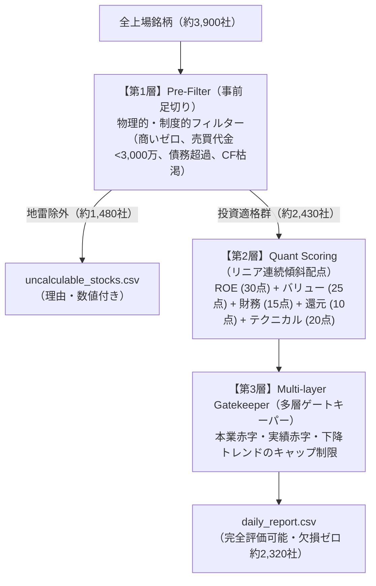

# 定量分析レポート (daily_report.csv / uncalculable_stocks.csv) エージェント解析・活用ガイドライン (v2.4)

## 1. 概要 (Overview)

本ドキュメントは、[stock-analyzer-core](file:///home/irom/dev/stock-analyzer-core) によって生成される定量スクリーニング・分析レポート CSV 群のファイル構造、各カラムの厳密な定義、**3層アーキテクチャ（第1層 Pre-Filter ➔ 第2層 リニア傾斜配点 ➔ 第3層 多層ゲートキーパー）**の算出基準、および AI エージェント（LLM）が本データを高精度に解析・活用するための標準運用仕様を規定したマニュアルである。

本システムでは、東証全上場銘柄（約3,900社）を対象として実行時に最初から **「完全評価可能銘柄レポート」** と **「論理的算出不能・事前足切り銘柄レポート」** の2ファイルへ直接分離出力するアーキテクチャを採用している。

---

## 2. 出力ファイル構成と責務

| ファイルパス | 収録対象 | 件数目安 | 主な特徴・責務 |
| :--- | :--- | :---: | :--- |
| [data/output/daily_report.csv](file:///home/irom/dev/stock-analyzer-core/data/output/daily_report.csv) | **完全評価可能銘柄** | **約 2,320 社** | 全19カラムにおいて**欠損値・空白ゼロ（欠損率 0.00%）**。<br>第1層の流動性・破綻リスク足切りを通過し、十分な出来高と健全財務・確定PERを持つ本物の投資適格データ。<br>※`Investment_Thesis`, `Risk_Factors`, `Time_Horizon` はスキーマ互換維持のため空文字（`""`）固定。 |
| [data/output/uncalculable_stocks.csv](file:///home/irom/dev/stock-analyzer-core/data/output/uncalculable_stocks.csv) | **除外・論理的算出不能銘柄** | **約 1,600 社** | 第1層（極小流動性、商いゼロ、ボロ株、債務超過、致命的CF枯渇）および財務未定義（当期純損失、上場廃止、有報未開示等）の全社に**具体的数値と理由**を明記。 |

> [!IMPORTANT]
> 出力ファイル名には日時は付与せず、固定名（`daily_report.csv` / `uncalculable_stocks.csv`）を維持する。
> 生成日時は、各CSVの第1行目にコメントヘッダー（`# Generated At: YYYY-MM-DD HH:MM:SS`）として付与される。

---

## 3. ファイル構造と安全なパース仕様

### 3.1 メタデータ・コメント行の仕様
両CSVともに、**第1行目は `#` で始まるコメント行** である。

```csv
# Generated At: 2026-09-22 15:44:57
Rank,Code,Name,Sector,Market,Verdict,Agent_Score,Price,RSI_14,MACD_Status,MA25_Divergence,PER,PBR,ROE,Equity_Ratio,Triggers,Investment_Thesis,Risk_Factors,Time_Horizon
1,2767,円谷フィールズホールディングス,卸売業,Prime,BUY,77.0,1418.0,42.2,Bullish (Above Signal),-1.3,5.1,1.47,19.7,64.0,"高ROE (19.7%), 健全財務 (自己資本比率 64.0%), 低PER割安水準 (5.1倍)",,,
```

### 3.2 推奨読み込みコード (Python)

#### Pandas での読み込み
```python
import pandas as pd

# コメント行スキップ
df_eval = pd.read_csv("data/output/daily_report.csv", comment="#")
df_uncalc = pd.read_csv("data/output/uncalculable_stocks.csv", comment="#")
```

#### Polars での読み込み
```python
import polars as pl

# コメント行プレフィックス指定
df_eval = pl.read_csv("data/output/daily_report.csv", comment_prefix="#")
df_uncalc = pl.read_csv("data/output/uncalculable_stocks.csv", comment_prefix="#")
```

---

## 4. 全カラム定義

### 4.1 評価可能銘柄レポート (`daily_report.csv`: 全19カラム)
**欠損値ゼロ（100% 網羅）** が保証されている。

| カラム名 | データ型 | 説明 | 具体例 |
| :--- | :--- | :--- | :--- |
| **Rank** | Integer | 総合スコア（`Agent_Score`）降順の順位 (1〜N) | `1`, `52` |
| **Code** | String | 銘柄コード (英字サフィックス含む) | `7203`, `2767`, `415A` |
| **Name** | String | 正式企業名 | `円谷フィールズホールディングス`, `トヨタ自動車` |
| **Sector** | String | 東証33業種分類 | `卸売業`, `情報・通信業`, `サービス業` |
| **Market** | String | 上場市場区分 | `Prime`, `Standard`, `Growth`, `Other` |
| **Verdict** | String | 投資判断判定 (`STRONG_BUY` / `BUY` / `WATCH` / `PASS`) | `STRONG_BUY`, `BUY` |
| **Agent_Score** | Float | 多変量連続グラデーションクオンツスコア (15.0〜98.0) | `77.0`, `68.5` |
| **Price** | Float | 最新株価 (円) | `1418.0` |
| **RSI_14** | Float | 14日相対力指数 (0.0〜100.0) | `42.2`, `55.8` |
| **MACD_Status** | String | MACD状態 (`Bullish (Above Signal)` / `Bearish (Below Signal)` / `Neutral`) | `Bullish (Above Signal)` |
| **MA25_Divergence** | Float | 25日移動平均乖離率 (%) | `-1.3`, `5.2` |
| **PER** | Float | 株価収益率 (倍) | `5.1` |
| **PBR** | Float | 株価純資産倍率 (倍) | `1.47` |
| **ROE** | Float | 自己資本利益率 (%) | `19.7` |
| **Equity_Ratio** | Float | 自己資本比率 (%) | `64.0` |
| **Triggers** | String | 点灯した着目シグナル一覧 (なし時は `"特になし"`) | `高ROE (19.7%), 健全財務 (自己資本比率 64.0%), 低PER割安水準 (5.1倍)` |
| **Investment_Thesis**| String | （定型文廃止・互換性維持のため空文字 `""` 固定） | `""` |
| **Risk_Factors** | String | （定型文廃止・互換性維持のため空文字 `""` 固定） | `""` |
| **Time_Horizon** | String | （定型文廃止・互換性維持のため空文字 `""` 固定） | `""` |

---

### 4.2 除外・算出不能銘柄レポート (`uncalculable_stocks.csv`: 全10カラム)

| カラム名 | データ型 | 説明 |
| :--- | :--- | :--- |
| **Code** | String | 銘柄コード |
| **Name** | String | 会社名 |
| **Sector** | String | 業種分類 |
| **Market** | String | 市場区分 |
| **Price** | Float | 最新株価 |
| **ROE** | Float | 自己資本利益率 (赤字時はマイナス値) |
| **PBR** | Float | 株価純資産倍率 (債務超過時はマイナス値) |
| **Equity_Ratio** | Float | 自己資本比率 |
| **Uncalculable_Reason** | String | **除外・算出不能理由カテゴリ** |
| **Detail** | String | **赤字額・不足売買代金・出来高ゼロ日数等の詳細** |

#### `Uncalculable_Reason` の分類一覧

##### A. 第1層（Pre-Filter: 事前足切り）による地雷株除外
1. **第1層足切り: 極小流動性トラップ**: 直近20営業日の1日平均売買代金（株数 × 株価）が 3,000万円未満（スリッページ・注文不能リスク）。`Detail` に「20日平均売買代金不足 (〇〇万円 < 3,000万円)」を明記。
2. **第1層足切り: 商い不成立**: 直近5営業日以内に出来高・売買代金ゼロの日が1日でもある銘柄。`Detail` にゼロ日数（例: 5日）を明記。
3. **第1層足切り: 致命的キャッシュ枯渇**: 営業CFマージン（営業CF ÷ 売上高）< -10% の資金ショート危機銘柄（※金融等免除業種除く）。`Detail` にマージン率を明記。
4. **第1層足切り: 超低位ボロ株**: 最新株価 < 50円の整理・ボロ株。
5. **第1層足切り: 構造的破綻 (債務超過)**: 自己資本比率 <= 0%（純資産マイナス / 資本欠損）。

##### B. 財務指標上の論理的算出不能
6. **当期純損失 (最終赤字)**: 国際基準（東証/ブルームバーグ）に従い、赤字企業は回収年数（PER）が未定義。赤字額またはマイナスROEを明記。
7. **債務超過 (純資産マイナス)**: 純資産マイナスのためPBR・自己資本比率が定義不能。
8. **重要指標未開示/算出不能**: PBR・ROE・自己資本比率のいずれかが未開示または算出不能。
9. **新規IPO直後**: 上場直後のため通期有報XBRLが未開示。
10. **有報未開示/上場廃止・整理ポスト**: 開示書類なし、またはTOB成立等による上場廃止。
11. **開示利益情報欠落/株式数取得不可**: 株式数データまたは確定利益データの取得不能。
12. **当期利益ゼロ**: 純利益が0円のため除算不能。

---

## 5. 3層評価アーキテクチャの完全仕様

本システムは、銘柄評価の死角とアンチパターンを徹底排除するため、**独立した3層パイプライン構造**を採用している。



---

### 5.1 【第1層】Pre-Filter（事前足切り）の設計原則

第1層に置くルールは、**「業績の良し悪し」ではなく「市場で正常に売買が成立するか」「会社が明日潰れないか」という物理的・制度的フィルターのみ**に厳密限定する。

#### ① 正統ルール（実装済み）
* **売買不能（商い不成立）**: 直近5営業日以内に出来高ゼロの日が1日でもある銘柄を即時除外。
* **極小流動性トラップ**: 直近20営業日の「1日平均売買代金が 3,000万円未満」の銘柄を即時除外。
* **構造的破綻（債務超過）**: 直近開示で自己資本比率 <= 0% の銘柄を即時除外。
* **致命的キャッシュ枯渇**: 営業CFマージン < -10% の銘柄を即時除外（金融セクターは免除）。
* **超低位ボロ株**: 株価 < 50円の銘柄を即時除外。

#### ② 設定してはならない「悪しきルール（アンチパターン）」の完全回避
以下の条件は第1層には**絶対に設定せず**、後続のリニア配点や第3層ゲートキーパーで制御する：
* ❌ **単年度の減収で除外しない**: 鉄鋼・化学・海運・商社などのシクリカル優良株の大底買い場を取りこぼさない。
* ❌ **業種一律の自己資本比率で除外しない**: 銀行・保険や不動産業などのビジネスモデル上負債比率が高い優良株を誤爆しない（セクター別ポリシー免除を適用）。
* ❌ **無配で除外しない**: 事業再投資を優先する急成長グロース銘柄を切り捨てない。
* ❌ **直近急落で除外しない**: 一時的な売られすぎ圏（RSI < 25）のリバウンド候補を握りつぶさない（第3層で安全制御）。
* ❌ **単一バリュエーション（高PER）で足切らない**: 高成長を続ける主役企業（Quality Growth）を消滅させない。

---

### 5.2 【第2層】連続グラデーション（リニア傾斜配点）の配点構造（最大100点）

各指標の実数値に応じてきめ細かく連続加点する。

1. **クオリティ（ROE 資本収益性）: 【最大 30点】**
   - ROE $\ge$ 25%: 30点（満点）
   - 10% $\le$ ROE < 25%: 15点 〜 30点（ROE 1% ごとに +1.0点）
   - 5% $\le$ ROE < 10%: 5点 〜 15点（ROE 1% ごとに +2.0点）
   - 0% < ROE < 5%: 0点 〜 5点
2. **バリュー（割安度: PBR & PER）: 【最大 25点】**
   - **PBR (最大13点)**:
     - PBR $\le$ 0.6倍: 13点（満点）
     - 0.6倍 < PBR $\le$ 1.0倍: 10点 〜 13点（解散価値割れを高く評価）
     - 1.0倍 < PBR $\le$ 2.0倍: 4点 〜 10点
     - 2.0倍 < PBR $\le$ 4.0倍: 0点 〜 4点
   - **PER (最大12点)**:
     - **一過性特別利益（バリュートラップ）抑止**: 本業赤字（営業利益率 $\le 0$ または 営業利益 $\le 0$）、または営業利益比率が純利益の半分未満（$\text{営業利益}/\text{純利益} < 0.5$）の低PER銘柄は、本業実力と乖離した資産売却益トラップとして **0点に大幅抑制**。また利益詳細未開示でも $\text{PER} < 3.0$ の異常値は最大2.0点に抑制。
     - PER $\le$ 6.0倍: 12点（満点）
     - 6.0倍 < PER $\le$ 10.0倍: 8点 〜 12点
     - 10.0倍 < PER $\le$ 15.0倍: 4点 〜 8点
     - 15.0倍 < PER $\le$ 25.0倍: 0点 〜 4点
     - PER > 40.0倍: 過熱割高ペナルティ減点 (最大 -3.0点)
3. **財務安全性（自己資本比率）: 【最大 15点】**
   - 自己資本比率 $\ge$ 80%: 15点（満点）
   - 50% $\le$ 比率 < 80%: 8点 〜 15点
   - 25% $\le$ 比率 < 50%: 2点 〜 8点
   - 比率 < 25%: 0点 〜 2点
4. **株主還元（配当利回り）: 【最大 10点】**
   - 配当利回り $\ge$ 5.0%: 10点（満点）
   - 3.0% $\le$ 利回り < 5.0%: 5点 〜 10点
   - 1.5% $\le$ 利回り < 3.0%: 1点 〜 5点
   - 0.0%（無配）および未取得: 0点
5. **テクニカル＆モメンタム: 【最大 20点】**
   - **MACD (最大8点)**: Bullish +6〜8点、Bearish 0〜2点、Neutral/未取得 3点
   - **RSI (最大7点)**:
     - $\le 25$: 7点（売られすぎ反発圏満点）
     - 25〜35: 5.5点 〜 7.0点
     - 35〜50: 4.0点 〜 5.5点
     - 50〜65: 2.5点 〜 4.0点
     - 65〜75: 2.5点 〜 0.0点（線形滑らか減衰）
     - $\ge 75$: -3.0点（過熱警戒減点）
   - **25日移動平均乖離率 (最大5点)**:
     - < -20.0%: ナイフキャッチ・大暴落警戒減点 (最大 -3.0点)
     - -20.0% 〜 -5.0%: 3.0点 〜 5.0点（リバウンド妙味圏）
     - -5.0% 〜 +5.0%: 3.0点（安定・巡航速度）
     - +5.0% 〜 +20.0%: 2.0点 〜 3.0点（健全なモメンタム初動加点）
     - > +20.0%: -4.0点（上方過熱警戒減点）

---

### 5.3 【第3層】Multi-layer Gatekeeper（判定上限キャップ制限）

スコアが80点以上・65点以上であっても、重大リスクを検知した場合は `Verdict` が強制制限される。

| 判定 (Verdict) | 獲得スコア基準 | 投資上の意味合い |
| :--- | :---: | :--- |
| **STRONG_BUY** | **80.0 点 以上** | **【至高の厳選株】** 収益性・割安度・安全性・モメンタムの全方位で最高峰 |
| **BUY** | **65.0 点 〜 79.9 点** | **【推奨優良株】** 良好な財務基盤と反発モメンタムを持つ上位候補 |
| **WATCH** | **50.0 点 〜 64.9 点** | **【中立観察株】** 市場平均水準。明確なカタリスト待ちの銘柄 |
| **PASS** | **50.0 点 未満** | **【見送り株】** 割高またはモメンタム低下 |

#### ゲートキーパー適用ルール
1. **本業赤字・一過性特益トラップ**: 営業利益率または営業利益が赤字（`<= 0`）の銘柄は、特別利益等による見かけの黒字・高ROE・低PERであるため、`STRONG_BUY` / `BUY` を全面禁止し **最大 `WATCH`** に制限。
2. **実績赤字（期間ズレ赤字）**: 実績 `ROE < 0` の銘柄は、会社予想PERで算出可能であっても **最大 `WATCH`** に制限。
3. **テクニカル・モメンタム足切り**: `MACD_Status` が `Bearish` の銘柄は `STRONG_BUY` を禁止（最大 `BUY` 止まり）。さらに 25日乖離率が `-10.0%` を下回る深い下降トレンド中の銘柄は **最大 `WATCH`** に制限。

---

## 6. AI エージェントによる分析推論ガイドライン

AI エージェントが本レポートを基にユーザーへ投資提案やスクリーニング結果を提示する際のベストプラクティス：

1. **メインスクリーニング対象**:
   - `daily_report.csv` に収録されている銘柄は、すでに第1層の流動性トラップ（売買代金不足・商い不成立）や債務超過、致命的CF枯渇が物理排除されているため、**安心して上位（`Rank <= 50` かつ `Verdict in ['STRONG_BUY', 'BUY']`）を即座に推奨可能**である。
2. **インサイトの根拠提示**:
   - `Triggers` 列の点灯シグナル（例: `"高ROE (19.7%), 健全財務 (自己資本比率 64.0%), 低PER割安水準 (5.1倍)"`）および各指標の実数値（ROE、PER、PBR、自己資本比率、乖離率など）を直接参照して、LLM自身が具体的で動的な投資根拠を提示する（※`Investment_Thesis` 等の定型文列は廃止・空文字化されているため参照不要）。
3. **除外・未算出銘柄の問い合わせ対応**:
   - ユーザーから「○○社のPERはなぜ載っていないのか？」「なぜこの銘柄がレポートにないのか？」と問われた際は、[uncalculable_stocks.csv](file:///home/irom/dev/stock-analyzer-core/data/output/uncalculable_stocks.csv) を照会し、`Uncalculable_Reason`（例: `第1層足切り: 極小流動性トラップ`）および `Detail`（例: `20日平均売買代金不足 (1,123万円 < 3,000万円)`）を即座に回答する。

---

## 7. 改訂履歴 (Revision History)

- **v1.0 (2026-09-20)**: 初版作成（旧スキーマ・`_Src` 列形式）。
- **v2.0 (2026-09-21)**: **メジャー改訂**。
  - `daily_report.csv`（完全評価可能・欠損ゼロ）と `uncalculable_stocks.csv`（算出不能・理由付き）の2ファイル完全分離アーキテクチャの仕様を規定。
  - 全19カラムの完全クリーン仕様および全7大算出不能理由カテゴリを定義。
  - 連続グラデーション（リニア傾斜配点）クオンツモデルの配点構造を明文化。
- **v2.1 (2026-09-21)**: **評価エンジン正式昇格・指標判定死角の解消**。
  - スコアリングを `QuantAgentEvaluator` モジュールとして正式昇格・一元化。
  - MACD `None` と `0.0` の分離、RSI 65〜75 の滑らか減衰モデル、25日乖離率暴落減点・初動加点を追加。
- **v2.2 (2026-09-21)**: **定型文カラムの空文字化（スキーマ互換維持）**。
  - `Investment_Thesis`, `Risk_Factors`, `Time_Horizon` の生成を廃止し空文字（`""`）固定へ移行。
- **v2.3 (2026-09-21)**: **一過性利益トラップ抑止・多層ゲートキーパー導入**。
  - 営業利益赤字または営業利益比率 < 0.5 の低PER銘柄に対するPERスコア0点抑制。
  - 本業赤字、実績赤字、テクニカル下降トレンドに対する `Verdict` 上限キャップ制限を導入。
- **v2.4 (2026-09-22)**: **第1層（Pre-Filter: 事前足切り）正式実装・3層アーキテクチャ統合**。
  - [src/calc/pre_filter.py](file:///home/irom/dev/stock-analyzer-core/src/calc/pre_filter.py) による地雷株の機械的即時除外（直近5日商いゼロ、20日平均売買代金3,000万円未満、債務超過、営業CFマージン-10%未満、ボロ株）を正式統合。
  - アンチパターン（単年度減収、業種一律自己資本比率、無配、直近急落、高PERでの事前除外）の完全回避原則を明文化。
  - `uncalculable_stocks.csv` に第1層足切り理由（売買代金不足額、ゼロ日数、CF赤字幅等）の完全収録仕様を追加。
