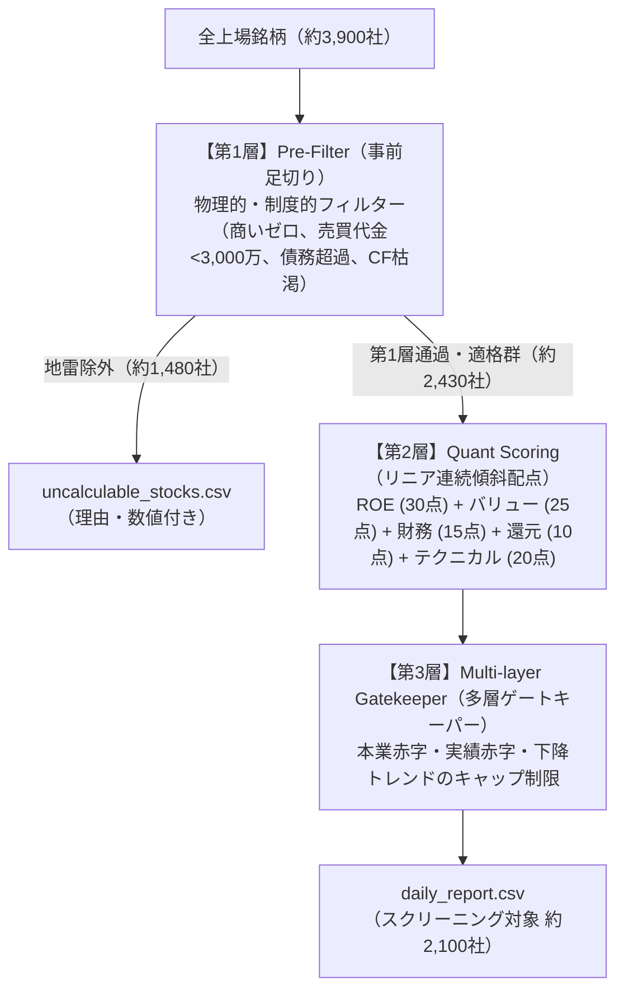

# 定量分析レポート (daily_report.csv / uncalculable_stocks.csv) エージェント解析・活用ガイドライン (v3.1)

## 1. 概要 (Overview)

本ドキュメントは、[stock-analyzer-core](file:///home/irom/dev/stock-analyzer-core) によって生成される定量スクリーニング・分析レポート CSV 群のファイル構造、各カラムの厳密な定義、**3層アーキテクチャ（第1層 Pre-Filter ➔ 第2層 リニア傾斜配点 ➔ 第3層 多層ゲートキーパー）**の算出基準、および AI エージェント（LLM）が本データを高精度に解析・活用するための標準運用仕様を規定したマニュアルである。

本システムでは、東証全上場銘柄（約3,900社）を対象として実行時に最初から **「スクリーニング対象銘柄レポート」** と **「論理的算出不能・事前足切り銘柄レポート」** の2ファイルへ直接分離出力するアーキテクチャを採用している。

---

## 2. 出力ファイル構成と責務

| ファイルパス | 収録対象 | 件数目安 | 主な特徴・責務 |
| :--- | :--- | :---: | :--- |
| `daily_report.csv` | **スクリーニング対象銘柄**（第1層 Pre-Filter を通過した全銘柄） | **約 2,100 社** | 24 カラム。**必須の識別・判定列（`Code` / `Verdict` / `Score`）は欠損ゼロ**。<br>指標列（PER・配当利回りなど）は、元データが無い場合に**推定値で埋めず `-`（欠損）**で出力する。 |
| `uncalculable_stocks.csv` | **除外・算出不能銘柄** | **約 1,800 社** | 第1層（極小流動性、商いゼロ、ボロ株、債務超過、致命的CF枯渇）や、市場データを取得できなかった銘柄。元データの列に加え、除外理由 `filter_reason` と詳細 `filter_detail` を明記。 |

> [!IMPORTANT]
> 出力ファイル名には日時は付与せず、固定名（`daily_report.csv` / `uncalculable_stocks.csv`）を維持する。
> 生成日時は `daily_report.csv` の `Report_Timestamp` 列（各行）に記録される。

---

## 3. ファイル構造と安全なパース仕様

### 3.1 構造
両 CSV ともコメント行は無く、**第1行がヘッダー**（UTF-8 BOM 付き）である。

```csv
Rank,Code,Name,Sector,Market,Market_Cap_Src,Market_Cap,Verdict,Score,PER_Src,PER,PBR_Src,PBR,Div_Yield_Src,Div_Yield,ROE_Src,ROE,Sales_Growth,Profit_Growth,Operating_Margin,Equity_Ratio,RSI,Trend,Report_Timestamp
1,3306,日本製麻,卸売業,Standard,calc,3181029376,Grade B,73.7,calc,5.55,calc,1.3,calc,0.55,edinet,27.41,2.03,-64.7,-1.48,59.72,63.3,3,2026-10-02 16:35:05
```

### 3.2 `-`（欠損）の扱い（重要）
- **`-` は「データなし／算出不能」を意味する**。0 や推定値ではない。
- `-` を数値として読み込むと型エラーになるため、**必ず欠損値として読み込む**。
- 指標が `-` の銘柄は、その指標について**言及・比較・ランキングの対象にしない**（推測で補わない）。

### 3.3 推奨読み込みコード (Python)

#### Pandas での読み込み
```python
import pandas as pd

df_eval = pd.read_csv("data/output/daily_report.csv", na_values=["-"])
df_uncalc = pd.read_csv("data/output/uncalculable_stocks.csv", na_values=["-"])
```

#### Polars での読み込み
```python
import polars as pl

df_eval = pl.read_csv("data/output/daily_report.csv", null_values=["-"])
df_uncalc = pl.read_csv("data/output/uncalculable_stocks.csv", null_values=["-"])
```

---

## 4. 全カラム定義

### 4.1 `daily_report.csv`（全 24 カラム）

| カラム名 | データ型 | 説明 | 具体例 |
| :--- | :--- | :--- | :--- |
| **Rank** | Integer | `Score` 降順の順位 (1〜N) | `1`, `52` |
| **Code** | String | 銘柄コード (英字サフィックス含む) | `7203`, `415A` |
| **Name** | String | 正式企業名 | `トヨタ自動車` |
| **Sector** | String | 東証33業種分類 | `卸売業`, `情報・通信業` |
| **Market** | String | 上場市場区分 | `Prime`, `Standard`, `Growth`, `Other` |
| **Market_Cap_Src** | String | `Market_Cap` の出所（下記参照） | `calc`, `edinet`, `-` |
| **Market_Cap** | Integer | 時価総額 (円) | `3181029376` |
| **Verdict** | String | 機械判定グレード (`Grade S` / `Grade A` / `Grade B` / `Grade C`、レガシー設定時: `STRONG_BUY` / `BUY` / `WATCH` / `PASS`) | `Grade A` |
| **Score** | Float | クオンツ総合スコア (0〜100) | `73.7` |
| **PER_Src** / **PER** | String / Float | 株価収益率 (倍) と出所 | `calc` / `5.55` |
| **PBR_Src** / **PBR** | String / Float | 株価純資産倍率 (倍) と出所 | `calc` / `1.3` |
| **Div_Yield_Src** / **Div_Yield** | String / Float | 配当利回り (**%表記**。`0.55` は 0.55%) と出所 | `calc` / `0.55` |
| **ROE_Src** / **ROE** | String / Float | 自己資本利益率 (**%表記**) と出所 | `edinet` / `27.41` |
| **Sales_Growth** | Float | 売上高成長率 (%) | `2.03` |
| **Profit_Growth** | Float | 利益成長率 (%) | `-64.7` |
| **Operating_Margin** | Float | 営業利益率 (%) | `-1.48` |
| **Equity_Ratio** | Float | 自己資本比率 (%) | `59.72` |
| **RSI** | Float | 14日相対力指数 (0〜100) | `63.3` |
| **Trend** | Integer | トレンドスコア (0〜3。大きいほど上昇基調) | `3` |
| **Report_Timestamp** | String | レポート生成日時 | `2026-10-02 16:35:05` |

**`*_Src`（出所）の値**
- `edinet`: 金融庁 EDINET の開示値（同梱ベースラインを含む）をそのまま使用。
- `calc`: 株価と財務データ（EPS・BPS・DPS・発行済株式数など）から本システムが算出した値。
- `-`: 元データが無く算出もできないため欠損（このとき数値列も `-`）。

> [!NOTE]
> v1.3.0 より、出所を実態どおりに表示する（財務データは EDINET 由来で、yfinance は株価・出来高のみ）。以前の `yf` 表示は、実際は算出値または EDINET 値だった。

> 旧版は、元データが無い場合に業種別の仮の PER・PBR、配当利回り 2.25%、推定株式数（2,500万株）、ROE 8.5% を `calc` として出力していた。これらは**実データではない**ため廃止し、`-` とした。過去に生成した CSV を扱う場合は、`calc` の値が仮の値である可能性に注意する。

---

### 4.2 `uncalculable_stocks.csv`（全 66 カラム）

銘柄の元データ（`code`, `market`, `entry_date`, `price`, 出来高、テクニカル指標、`per` / `pbr` / `roe` / `equity_ratio` 等の財務指標など）に、**除外理由の 2 列**を末尾に付与した構造である。主な列は次のとおり。

| カラム名 | 説明 |
| :--- | :--- |
| **code** / **name** / **sector** / **market** | 銘柄コード・会社名・業種・市場 |
| **entry_date** / **price** | 最新の取引日と株価 (**市場データを取得できなかった銘柄は空**) |
| **avg_trading_value_20d** | 直近20営業日の平均売買代金 (円) |
| **zero_volume_days_5d** | 直近5営業日の出来高ゼロ日数 |
| **status** / **exclusion_reason** | 銘柄マスタの状態（`delisted` = 上場廃止）と、除外・停止の理由 |
| **filter_reason** | **除外・算出不能理由カテゴリ** |
| **filter_detail** | **不足売買代金・ゼロ日数・CF赤字幅等の詳細** |

#### `filter_reason` の分類一覧

##### A. 第1層（Pre-Filter: 事前足切り）による除外
1. **極小流動性トラップ**: 直近20営業日の1日平均売買代金が 3,000万円未満（スリッページ・注文不能リスク）。`filter_detail` に「20日平均売買代金不足 (〇〇万円 < 3,000万円)」を明記。
2. **商い不成立**: 直近5営業日以内に出来高・売買代金ゼロの日がある銘柄。`filter_detail` にゼロ日数を明記。
3. **致命的キャッシュ枯渇**: 営業CFマージン（営業CF ÷ 売上高）< -10%（※金融等免除業種除く）。
4. **超低位ボロ株**: 最新株価 < 50円。
5. **構造的破綻 (債務超過)**: 自己資本比率 <= 0%。
6. **データ鮮度不足 (取引停止)**: 最新の取引日が古く、取引が止まっている。

##### B. 論理的算出不能
7. **上場廃止**: JPX の上場銘柄一覧（月次で自動更新）に掲載が無くなった銘柄。以後は株価の取得対象から外れる。
7b. **市場データ取得不能**: Yahoo Finance から株価を取得できなかった銘柄。多くは **Yahoo Finance がデータを提供しない銘柄（PRO Market 等）** や、新規上場直後の銘柄。連続して取得できない銘柄は 30 日間再取得を止め、`filter_detail` にその旨を表示する（30 日ごとに 1 回再確認し、データが取れれば自動で復帰する）。
8. **重要指標未開示/算出不能**: PBR・ROE・自己資本比率のいずれかが未開示または算出不能。

---

## 5. 3層評価アーキテクチャの完全仕様

本システムは、銘柄評価の死角とアンチパターンを徹底排除するため、**独立した3層パイプライン構造**を採用している。


```mermaid
flowchart TD
    A["全上場銘柄（約3,900社）"] --> B["【第1層】Pre-Filter（事前足切り）<br>物理的・制度的フィルター<br>（商いゼロ、売買代金<3,000万、債務超過、CF枯渇）"]
    B -- 地雷除外（約1,480社） --> C["uncalculable_stocks.csv<br>（理由・数値付き）"]
    B -- 第1層通過・適格群（約2,430社） --> D["【第2層】Quant Scoring（リニア連続傾斜配点）<br>ROE (30点) + バリュー (25点) + 財務 (15点) + 還元 (10点) + テクニカル (20点)"]
    D --> E["【第3層】Multi-layer Gatekeeper（多層ゲートキーパー）<br>本業赤字・実績赤字・下降トレンドのキャップ制限"]
    E --> F["daily_report.csv<br>（スクリーニング対象 約2,100社）"]
```

---

### 5.1 【第1層】Pre-Filter（事前足切り）の設計原則

第1層に置くルールは、**「業績の良し悪し」ではなく「市場で正常に売買が成立するか」「会社が明日潰れないか」という物理的・制度的フィルターのみ**に厳密限定する。

#### ① 正統ルール（実装済み）
* **売買不能（商い不成立）**: 直近5営業日以内に出来高ゼロの日が1日でもある銘柄を即時除外。
* **極小流動性トラップ**: 直近20営業日の「1日平均売買代金が 3,000万円未満」の銘柄を即時除外。
* **構造的破綻（債務超過）**: 直近開示で自己資本比率 <= 0% の銘柄を即時除外。
* **致命的キャッシュ枯渇**: 営業CFマージン < -10% の銘柄を即時除外（金融セクターは免除）。
* **超低位ボロ株**: 株価 < 50円の銘柄を即時除外。

#### ② 設定してはならない「悪しきルール（アンチパターン）」の完全回避
以下の条件は第1層には**絶対に設定せず**、後続のリニア配点や第3層ゲートキーパーで制御する：
* ❌ **単年度の減収で除外しない**: 鉄鋼・化学・海運・商社などのシクリカル優良株の大底買い場を取りこぼさない。
* ❌ **業種一律の自己資本比率で除外しない**: 銀行・保険や不動産業などのビジネスモデル上負債比率が高い優良株を誤爆しない（セクター別ポリシー免除を適用）。
* ❌ **無配で除外しない**: 事業再投資を優先する急成長グロース銘柄を切り捨てない。
* ❌ **直近急落で除外しない**: 一時的な売られすぎ圏（RSI < 25）のリバウンド候補を握りつぶさない（第3層で安全制御）。
* ❌ **単一バリュエーション（高PER）で足切らない**: 高成長を続ける主役企業（Quality Growth）を消滅させない。

---

### 5.2 【第2層】連続グラデーション（リニア傾斜配点）の配点構造（最大100点）

各指標の実数値に応じてきめ細かく連続加点する。

1. **クオリティ（ROE 資本収益性）: 【最大 30点】**
   - ROE $\ge$ 25%: 30点（満点）
   - 10% $\le$ ROE < 25%: 15点 〜 30点（ROE 1% ごとに +1.0点）
   - 5% $\le$ ROE < 10%: 5点 〜 15点（ROE 1% ごとに +2.0点）
   - 0% < ROE < 5%: 0点 〜 5点
2. **バリュー（割安度: PBR & PER）: 【最大 25点】**
   - **PBR (最大13点)**:
     - PBR $\le$ 0.6倍: 13点（満点）
     - 0.6倍 < PBR $\le$ 1.0倍: 10点 〜 13点（解散価値割れを高く評価）
     - 1.0倍 < PBR $\le$ 2.0倍: 4点 〜 10点
     - 2.0倍 < PBR $\le$ 4.0倍: 0点 〜 4点
   - **PER (最大12点)**:
     - **一過性特別利益（バリュートラップ）抑止**: 本業赤字（営業利益率 $\le 0$ または 営業利益 $\le 0$）、または営業利益比率が純利益の半分未満（$\text{営業利益}/\text{純利益} < 0.5$）の低PER銘柄は、本業実力と乖離した資産売却益トラップとして **0点に大幅抑制**。また利益詳細未開示でも $\text{PER} < 3.0$ の異常値は最大2.0点に抑制。
     - PER $\le$ 6.0倍: 12点（満点）
     - 6.0倍 < PER $\le$ 10.0倍: 8点 〜 12点
     - 10.0倍 < PER $\le$ 15.0倍: 4点 〜 8点
     - 15.0倍 < PER $\le$ 25.0倍: 0点 〜 4点
     - PER > 40.0倍: 過熱割高ペナルティ減点 (最大 -3.0点)
3. **財務安全性（自己資本比率）: 【最大 15点】**
   - 自己資本比率 $\ge$ 80%: 15点（満点）
   - 50% $\le$ 比率 < 80%: 8点 〜 15点
   - 25% $\le$ 比率 < 50%: 2点 〜 8点
   - 比率 < 25%: 0点 〜 2点
4. **株主還元（配当利回り）: 【最大 10点】**
   - 配当利回り $\ge$ 5.0%: 10点（満点）
   - 3.0% $\le$ 利回り < 5.0%: 5点 〜 10点
   - 1.5% $\le$ 利回り < 3.0%: 1点 〜 5点
   - 0.0%（無配）および未取得: 0点
5. **テクニカル＆モメンタム: 【最大 20点】**
   - **MACD (最大8点)**: Bullish +6〜8点、Bearish 0〜2点、Neutral/未取得 3点
   - **RSI (最大7点)**:
     - $\le 25$: 7点（売られすぎ反発圏満点）
     - 25〜35: 5.5点 〜 7.0点
     - 35〜50: 4.0点 〜 5.5点
     - 50〜65: 2.5点 〜 4.0点
     - 65〜75: 2.5点 〜 0.0点（線形滑らか減衰）
     - $\ge 75$: -3.0点（過熱警戒減点）
   - **25日移動平均乖離率 (最大5点)**:
     - < -20.0%: ナイフキャッチ・大暴落警戒減点 (最大 -3.0点)
     - -20.0% 〜 -5.0%: 3.0点 〜 5.0点（リバウンド妙味圏）
     - -5.0% 〜 +5.0%: 3.0点（安定・巡航速度）
     - +5.0% 〜 +20.0%: 2.0点 〜 3.0点（健全なモメンタム初動加点）
     - > +20.0%: -4.0点（上方過熱警戒減点）

---

### 5.3 【第3層】Multi-layer Gatekeeper（判定上限キャップ制限）

スコアが80点以上・65点以上であっても、重大リスクを検知した場合は `Verdict` が強制制限される。

| 判定 (Verdict) | 獲得スコア基準 | スクリーニング上の意味合い | レガシー表記 |
| :--- | :---: | :--- | :--- |
| **Grade S** | **80.0 点 以上** | **【最上位充足】** 収益性・割安度・安全性・モメンタムの全方位で最高峰 | `STRONG_BUY` |
| **Grade A** | **65.0 点 〜 79.9 点** | **【適格基準充足】** 良好な財務基盤と反発モメンタムを持つ上位候補 | `BUY` |
| **Grade B** | **50.0 点 〜 64.9 点** | **【監視基準】** 市場平均水準。業績回復やカタリスト待ち | `WATCH` |
| **Grade C** | **50.0 点 未満** | **【基準未達】** 指標が割高またはモメンタム低下 | `PASS` |

#### ゲートキーパー適用ルール
1. **本業赤字・一過性特益トラップ**: 営業利益率または営業利益が赤字（`<= 0`）の銘柄は、特別利益等による見かけの黒字・高ROE・低PERであるため、`Grade S` / `Grade A`（`STRONG_BUY` / `BUY`）を全面禁止し **最大 `Grade B`（`WATCH`）** に制限。
2. **実績赤字（期間ズレ赤字）**: 実績 `ROE < 0` の銘柄は、会社予想PERで算出可能であっても **最大 `Grade B`（`WATCH`）** に制限。
3. **テクニカル・モメンタム足切り**: `MACD_Status` が `Bearish` の銘柄は `Grade S`（`STRONG_BUY`）を禁止（最大 `Grade A` 止まり）。さらに 25日乖離率が `-10.0%` を下回る深い下降トレンド中の銘柄は **最大 `Grade B`（`WATCH`）** に制限。

---

## 6. AI エージェントによる分析推論ガイドライン

AI エージェントが本レポートを基にユーザーへスクリーニング結果や分析サマリを提示する際のベストプラクティス：

1. **メインスクリーニング対象**:
   - `daily_report.csv` に収録されている銘柄は、すでに第1層の流動性トラップ（売買代金不足・商い不成立）や債務超過、致命的CF枯渇が物理排除されているため、**客観的上位群（`Rank <= 50` かつ `Verdict in ['Grade S', 'Grade A']`）を中心に客観的ファクトを提示可能**である（特定の売買推奨・投資助言表現は避けること）。
2. **インサイトの根拠提示**:
   - 各指標の実数値（ROE、PER、PBR、配当利回り、自己資本比率、営業利益率、RSI など）を直接参照して、LLM 自身が具体的で客観的な財務分析根拠を提示する。
   - **指標が `-`（欠損）の銘柄は、その指標で比較・ランキング・評価をしない**。推定や補完をせず、「データなし」と明示する。
   - 数値の出所は `*_Src` 列で確認できる（`edinet` = 金融庁 EDINET の開示値、`calc` = 株価と開示値から本システムが算出した値）。
   - `Div_Yield` / `ROE` などは **%表記**（`0.55` は 0.55%）。100 倍して読まない。
3. **除外・未算出銘柄の問い合わせ対応**:
   - ユーザーから「○○社のPERはなぜ載っていないのか？」「なぜこの銘柄がレポートにないのか？」と問われた際は、[uncalculable_stocks.csv](file:///home/irom/dev/stock-analyzer-core/data/output/uncalculable_stocks.csv) を照会し、`filter_reason`（例: `極小流動性トラップ`）および `filter_detail`（例: `20日平均売買代金不足 (1,123万円 < 3,000万円)`）を即座に回答する。
   - `daily_report.csv` で指標が `-` の場合は、「その指標の元データが無く、算出もできないため」と回答する（推定値は出力していない）。

---

## 7. 改訂履歴 (Revision History)

- **v3.1 (2026-10-03)**: `*_Src` の出所を実態に合わせて `edinet` / `calc` / `-` に修正（`yf` は廃止）。除外理由に「上場廃止」を追加し、`status` / `exclusion_reason` 列を追加（66 カラム）。
- **v3.0 (2026-10-02)**: **現行スキーマへ全面改訂**。
  - `daily_report.csv` を実際の 24 カラム、`uncalculable_stocks.csv` を実際の 64 カラム（`filter_reason` / `filter_detail`）の定義に合わせた。コメント行（`# Generated At`）・`Triggers` 列などの廃止済み記述を削除。
  - 指標の欠損を `-` とする仕様を明文化（仮の PER・PBR・配当利回り・時価総額・ROE の出力を廃止）。配当利回り・ROE の 100 倍表示バグを修正。
  - `*_Src`（出所）列の意味を定義。
- **v1.0 (2026-09-20)**: 初版作成（旧スキーマ・`_Src` 列形式）。
- **v2.0 (2026-09-21)**: **メジャー改訂**。
  - `daily_report.csv`（完全評価可能・欠損ゼロ。※v3.0 で仕様変更）と `uncalculable_stocks.csv`（算出不能・理由付き）の2ファイル完全分離アーキテクチャの仕様を規定。
  - 全19カラムの完全クリーン仕様および全7大算出不能理由カテゴリを定義。
  - 連続グラデーション（リニア傾斜配点）クオンツモデルの配点構造を明文化。
- **v2.1 (2026-09-21)**: **評価エンジン正式昇格・指標判定死角の解消**。
  - スコアリングを `QuantAgentEvaluator` モジュールとして正式昇格・一元化。
  - MACD `None` と `0.0` の分離、RSI 65〜75 の滑らか減衰モデル、25日乖離率暴落減点・初動加点を追加。
- **v2.2 (2026-09-21)**: **定型文カラムの空文字化（スキーマ互換維持）**。
  - `Investment_Thesis`, `Risk_Factors`, `Time_Horizon` の生成を廃止し空文字（`""`）固定へ移行。
- **v2.3 (2026-09-21)**: **一過性利益トラップ抑止・多層ゲートキーパー導入**。
  - 営業利益赤字または営業利益比率 < 0.5 の低PER銘柄に対するPERスコア0点抑制。
  - 本業赤字、実績赤字、テクニカル下降トレンドに対する `Verdict` 上限キャップ制限を導入。
- **v2.4 (2026-09-22)**: **第1層（Pre-Filter: 事前足切り）正式実装・3層アーキテクチャ統合**。
  - [src/calc/pre_filter.py](file:///home/irom/dev/stock-analyzer-core/src/calc/pre_filter.py) による地雷株の機械的即時除外（直近5日商いゼロ、20日平均売買代金3,000万円未満、債務超過、営業CFマージン-10%未満、ボロ株）を正式統合。
  - アンチパターン（単年度減収、業種一律自己資本比率、無配、直近急落、高PERでの事前除外）の完全回避原則を明文化。
  - `uncalculable_stocks.csv` に第1層足切り理由（売買代金不足額、ゼロ日数、CF赤字幅等）の完全収録仕様を追加。
