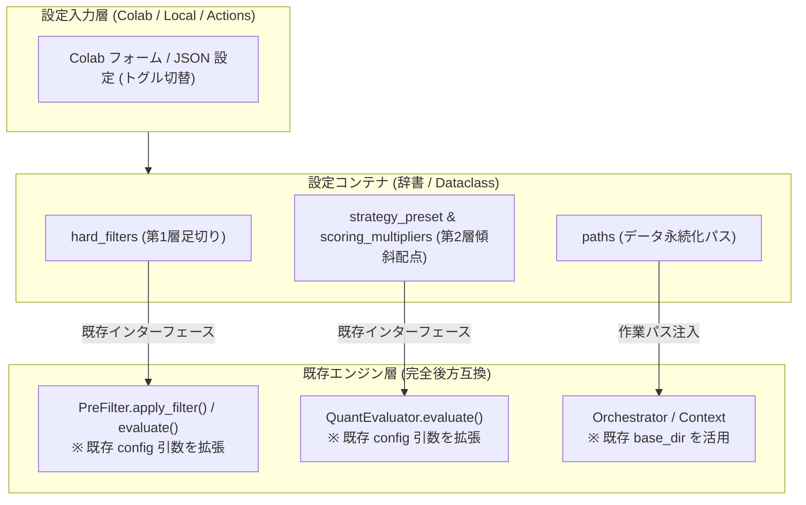

# 既存ロジック親和型 カスタマイズ性向上設計仕様書 (v1.0)

## 1. 基本方針 (Design Philosophy)

本設計は、有料コンテンツ（Google Colab / GitHub Actions / ローカル実行）において、購入者が自らの投資スタイルに合わせてパラメータを柔軟に変更できるようにするための設計仕様である。

最重要原則として **「既存ロジックとの完全な親和性と後方互換性の維持」** を掲げる。

### 遵守すべき 4 大原則
1. **Zero-Break Principle（既存動作の 100% 保証）**:
   設定を一切与えない場合（`config=None`）および全乗数が 1.0 の場合、従来の Qiita 前後編記事とまったく同一の数値計算・足切り基準・配点結果（売買代金 3,000万円、株価 50円、同一のスコア結果）が返る。
   判定名（Verdict）については、金融商品取引法上のコンプライアンス（投資助言規制配慮）に基づき、標準出力を客観的グレード `Grade S / Grade A / Grade B / Grade C` としつつ、設定で `{"verdict_mode": "legacy"}` を指定することで Qiita 記事と同一の判定文字列 (`STRONG_BUY / BUY / WATCH / PASS`) を完全再現可能とする。
2. **Interface Preservation（既存シグネチャの温存）**:
   内部コア `PreFilter.evaluate(df_candidates, df_liquidity, config)` およびコンビニエンスラッパー `PreFilter.apply_filter(df_candidates, df_liquidity, config)` の既存インターフェースを変更せず、引数 `config` の内部キーを拡張する形で設計する。
3. **Layered Fallback（多層フォールバック機構）**:
   優先順位は「環境ごとの入力源（Colab フォーム / GitHub Actions ワークフロー引数 / CLI 引数）」➔「外部設定ファイル (`custom_config.json`)」➔「デフォルト定数（Zero-Break 保証）」の順で安全にフォールバックする。
4. **No Heavy Dependencies（追加依存の排除）**:
   新たな設定管理フレームワーク等は導入せず、標準の `dataclass` / `dict` / `json` の範囲で軽量・高速に完結させる。

---

## 2. アーキテクチャとディレクトリ構成

### 2.1 拡張対象と既存コードの対応関係



### 2.2 リポジトリおよび実行時ディレクトリ構成

有料コンテンツ（Google Colab / GitHub）としての配布・保守性、および既存コードとの親和性を両立するディレクトリ構成を以下のように規定する。

#### ① 静的リポジトリ構成（Git 公開・管理対象）
```text
stock-analyzer-core/
├── notebooks/                         # 📓 Google Colab 関連
│   └── stock_analyzer_colab.ipynb     # 「Open in Colab」バッジから直接起動するノートブック
│
├── config/                            # ⚙️ 設定テンプレート・初期構成
│   └── custom_config.example.json     # 読者カスタマイズ用の設定ひな形
│
├── src/                               # 🧠 コアロジック (既存構造を踏襲)
│   ├── calc/
│   │   ├── pre_filter.py              # 第1層 (引数 config による足切り拡張)
│   │   └── quant_evaluator.py         # 第2層 (PRESET_STRATEGIES を SSOT として一元管理、5カテゴリ乗数・加重平均正規化)
│   ├── orchestration/
│   │   └── phases/                    # パイプライン実行フェーズ (EvaluationPhase等)
│   ├── utils/
│   │   ├── path_resolver.py           # 【新規】Colab / Local を透過する動的パス解決
│   │   └── ...
│   └── ...
│
├── data/                              # 💾 ローカル実行時のデフォルト配置 (Git管理外: .gitignore)
│   ├── cache/                         # DuckDBメタデータ・有報キャッシュ
│   └── output/                        # 生成CSV (daily_report.csv等)
│
├── docs/                              # 📚 設計書・技術ドキュメント
│   └── designs/
├── tests/                             # 🧪 回帰・バイパス検証テスト
├── requirements.txt                   # Colab環境用の最小依存ライブラリ定義
└── README.md                          # 「Open in Colab」バッジと利用説明
```

#### ② 実行時データディレクトリ構成（動的マッピング）
`PathResolver`（環境変数 `STOCK_ANALYZER_BASE_DIR`）により、実行環境ごとに以下の通り安全にマッピングされる。

* **Google Colab 実行時（Stage-and-Sync 規約）**:
  - **作業層（Colab 内蔵 高速ローカルSSD: `/content/working/`）**:
    - `cache/`: 実行中の DuckDB (`stock_analyzer.duckdb`)、一時展開生 ZIP（パース直後に即時削除）
    - `output/`: 生成直後の CSV
  - **永続層（Google Drive: `/content/drive/MyDrive/StockAnalyzer/` 等）**:
    - ※ Colab フォーム `drive_folder_name` や設定 `gdrive.drive_dir`（環境変数 `STOCK_ANALYZER_DRIVE_DIR`）により任意のフォルダ名・相対パス・共有ドライブへ変更可能。
    - `cache/`: `stock_analyzer.duckdb`（＋バックアップ `.bak`、安全同期用 `.tmp`）
    - `output/`: `daily_report.csv`, `uncalculable_stocks.csv`
    - `config/`: `custom_config.json`（ユーザー独自設定）
* **ローカル PC / サーバー実行時**:
  - `STOCK_ANALYZER_BASE_DIR` が未指定の場合、リポジトリ直下の `data/` を自動使用：
    - `data/cache/`: DuckDB データベース等
    - `data/output/`: レポート CSV
    - `config/custom_config.json`: 設定ファイル

---

## 3. 各レイヤーの詳細設計仕様

### 3.1 第1層（Pre-Filter: 事前足切り）の親和的拡張

#### 既存の現状
`src/calc/pre_filter.py` では `MIN_TRADING_VALUE_20D` のみが `config["hard_filters"]["min_trading_value"]` を参照しており、他の足切り値（株価、自己資本比率、営業CFマージン）は固定定数のままになっている。

#### 設計仕様
既存の `config["hard_filters"]` のキー定義を自然に拡張する。

```python
# 設定辞書の構造定義
hard_filters_config = {
    # 既存サポート済み
    "min_trading_value": 30_000_000.0,  # 20日平均売買代金 (円, float)
    # 今回の親和的拡張 (未指定時は既存定数へフォールバック)
    "min_price": 50.0,  # 最低株価 (円, float)
    "min_equity_ratio": 0.0,  # 最低自己資本比率 (%, float) [> min_equity_ratio で判定、0.0 超で債務超過除外]
    "min_op_cf_margin": -0.10,  # 最低営業CFマージン (比率・小数, float) [>= min_op_cf_margin で判定]
    "target_markets": None,  # 対象市場 (Optional[list[str]], None で全市場・フィルタなし)
}
```

* **安全なフォールバック・比較規約・バリデーション**:
  - `config` が `None` の場合でもクラッシュしないよう `(config or {}).get(...)` を徹底する。
  - `target_markets` のデフォルトを `None` とすることで、PRO Market 等の別区分銘柄（JPX 正規化値 `"Other"`）が意図せず除外されるのを防ぎ、Zero-Break 原則を担保する。
  - **未知キー検知（タイポ防止）**: ユーザーが `min_trading_values` 等の誤ったキーを指定した場合に備え、既知のキー以外が含まれていれば警告ログ（`logger.warning`）を出力する。

  ```python
  KNOWN_HF_KEYS = {
      "min_trading_value",
      "min_price",
      "min_equity_ratio",
      "min_op_cf_margin",
      "target_markets",
  }
  hf = (config or {}).get("hard_filters", {})
  unknown_keys = set(hf.keys()) - KNOWN_HF_KEYS
  if unknown_keys:
      logger.warning(
          f"⚠️ hard_filters に未知の設定キーが含まれています (無視されます): {unknown_keys}"
      )

  min_tv_20d = float(hf.get("min_trading_value", cls.MIN_TRADING_VALUE_20D))
  min_price = float(hf.get("min_price", cls.MIN_PRICE))
  min_eq_ratio = float(hf.get("min_equity_ratio", cls.MIN_EQUITY_RATIO))
  min_op_cf_margin = float(hf.get("min_op_cf_margin", cls.MIN_OP_CF_MARGIN))
  target_markets = hf.get("target_markets", None)  # None の場合は市場足切りをスキップ
  ```

---

### 3.2 第2層（QuantEvaluator: スコアリング配点）の 5 カテゴリ設計と正規化

#### 既存の現状（完全配点構造：合計 100.0 点）
`src/calc/quant_evaluator.py` の実装を精査した結果、8つのスコアリング関数は合計ジャスト 100.0 点で設計されている。

| カテゴリ名（乗数キー） | 対象関数と評価指標 | 基礎最大配点 | 指標特性とペナルティ（※関数内部で完結） |
| :--- | :--- | :---: | :--- |
| **`profitability_multiplier`** | `_score_roe` | **30.0 点** | 資本収益性 (ROE 25%以上で満点) |
| **`value_multiplier`** | `_score_pbr` (13点)<br>`_score_per` (12点) | **25.0 点** | 割安度 (PER>40で最大-3点、本業赤字特益抑制あり) |
| **`safety_multiplier`** | `_score_equity_ratio` | **15.0 点** | 財務健全性 (自己資本比率 80%以上で満点) |
| **`dividend_multiplier`** | `_score_dividend_yield` | **10.0 点** | 株主還元 (利回り 5.0%以上で満点) |
| **`technical_multiplier`** | `_score_macd` (8点)<br>`_score_rsi` (7点)<br>`_score_ma_div` (5点) | **20.0 点** | モメンタム (RSI>75で最大-3点、乖離>25%で最大-4点) |
| **合計** | **全 8 指標** | **100.0 点** | 最終クリップ: `[15.0, 98.0]`、四捨五入 `round(..., 1)` |

> [!NOTE]
> **ペナルティの内包性確認（数学的整合性の担保）**:  
> PER 過熱減点（-3点）、RSI 過熱減点（-3点）、移動平均乖離率の過熱・暴落減点（-4点〜-3点）、および本業赤字による特別利益抑制は、**すべて該当する各スコア関数の戻り値の内側に完全包含**されている（合計算出後に別途控除される外部ペナルティは存在しない）。  
> したがって、$S_i$ が負の値を取りうるがカテゴリ基礎スコアとして加算され、後段のゲートキーパー（`_determine_verdict`）もスコア算出後に Verdict 文字列をキャップする独立処理であるため、後述の正規化式は数学的に完全に成立する。

#### プリセット管理規約（Single Source of Truth: SSOT 原則）
プリセット定義（`PRESET_STRATEGIES`）は、コード（`src/calc/quant_evaluator.py`）内に**唯一無二の定義元（SSOT）**として集約管理する。
外部 JSON ファイル（`strategy_presets.json` 等）との二重管理は、設定更新時の不整合やコードと設定ファイルの乖離（ドリフト）を誘発するため、採用しない。
利用者が独自の乗数配分を適用したい場合は、外部プリセットファイルを増やすのではなく、`custom_config.json` の `scoring_multipliers`（差分辞書）を通じて直感的に上書き・マージできる設計とする。

#### 設計仕様：プリセットと個別上書きの 2 段構え（2-Tier Override）
利用者が親しみやすいプリセットを選択可能にしつつ、個別乗数のピンポイントな上書き（マージ）を許容する。

```python
# プリセット定義 (コード内 SSOT: デフォルトは記事と完全一致する 'balanced')
PRESET_STRATEGIES = {
    "balanced": {  # 【標準】Qiita 記事そのままの黄金比
        "value_multiplier": 1.0,
        "profitability_multiplier": 1.0,
        "safety_multiplier": 1.0,
        "dividend_multiplier": 1.0,
        "technical_multiplier": 1.0,
    },
    "dividend_focus": {  # 【高配当株ポートフォリオ重視】
        "value_multiplier": 0.8,
        "profitability_multiplier": 1.0,
        "safety_multiplier": 1.2,  # 減配リスク回避のため財務健全性も強化
        "dividend_multiplier": 2.5,  # 配当利回りを最重要視
        "technical_multiplier": 0.5,
    },
    "deep_value": {  # 【グレアム流ディープバリュー重視】
        "value_multiplier": 2.5,  # 低PER・低PBRに最大配点
        "profitability_multiplier": 0.8,
        "safety_multiplier": 1.2,
        "dividend_multiplier": 0.8,
        "technical_multiplier": 0.5,
    },
    "growth_quality": {  # 【高収益クオリティ成長重視】
        "value_multiplier": 0.5,
        "profitability_multiplier": 2.5,  # 高ROEに最大配点
        "safety_multiplier": 1.0,
        "dividend_multiplier": 0.5,
        "technical_multiplier": 1.0,
    },
}

# 2段構えのマージ解決と厳格バリデーション
KNOWN_SCORING_KEYS = {
    "value_multiplier",
    "profitability_multiplier",
    "safety_multiplier",
    "dividend_multiplier",
    "technical_multiplier",
}

preset_name = (config or {}).get("strategy_preset", "balanced")
if preset_name not in PRESET_STRATEGIES:
    logger.warning(
        f"⚠️ 未知のプリセット '{preset_name}' が指定されました。'balanced' を適用します。"
    )
    preset_name = "balanced"

base_multipliers = PRESET_STRATEGIES[preset_name].copy()
custom_multipliers = (config or {}).get("scoring_multipliers", {})

# 未知キー検知
unknown_scoring_keys = set(custom_multipliers.keys()) - KNOWN_SCORING_KEYS
if unknown_scoring_keys:
    logger.warning(
        f"⚠️ scoring_multipliers に未知のキーが含まれています (無視されます): {unknown_scoring_keys}"
    )

effective_multipliers = {**base_multipliers, **custom_multipliers}

# 負値ガードおよび0除算ガード
for k in KNOWN_SCORING_KEYS:
    val = float(effective_multipliers.get(k, 1.0))
    if val < 0.0:
        logger.warning(
            f"⚠️ 乗数 '{k}' に負の値 ({val}) が指定されたため、0.0 に補正しました。"
        )
        val = 0.0
    effective_multipliers[k] = val

CATEGORY_MAX_POINTS = {
    "profitability_multiplier": 30.0,
    "value_multiplier": 25.0,
    "safety_multiplier": 15.0,
    "dividend_multiplier": 10.0,
    "technical_multiplier": 20.0,
}

total_weighted_max = sum(
    CATEGORY_MAX_POINTS[k] * effective_multipliers[k] for k in KNOWN_SCORING_KEYS
)
if total_weighted_max <= 0:
    logger.warning("⚠️ 全乗数の合計配点が0以下です。デフォルト配点を適用します。")
    effective_multipliers = PRESET_STRATEGIES["balanced"].copy()
```

#### スコア計算と Zero-Break 保証バイパス（最重要）
* **Zero-Break 保証バイパス**:
  全乗数が `1.0`（デフォルトおよび `balanced` プリセット無変更時）の場合は、**正規化処理（除算・乗算）を一切通さず、既存の加算コードパスをそのまま実行**する。  
  これにより、浮動小数の微小誤差（`69.99999999...`）による Verdict 境界ブレやハッシュ不一致を 100% 回避する。
* **カスタム乗数適用時の加重平均正規化式**:
  各カテゴリの基礎スコアを $S_i$、基礎最大配点を $M_i$（収益:30, 割安:25, 安全:15, 配当:10, テク:20）、乗数を $w_i$ としたとき：
  $$\text{Normalized Raw Score} = \frac{\sum (S_i \times w_i)}{\sum (M_i \times w_i)} \times 100.0$$
  $$\text{Quant Score (Score カラム)} = \text{round}(\min(98.0, \max(15.0, \text{Normalized Raw Score})), 1)$$
  ※出力 CSV のカラム名は `Score`（旧スキーマとの互換性維持のため、内部で `Agent_Score` としても透過的にアクセス可能）。

> [!IMPORTANT]
> **得点分布シフトと Grade A（適格群）件数の変動（読者向け解説の要点）**:  
> 加重平均正規化によって保たれるのは**スコアの尺度（0〜100点スケール）**であり、全銘柄の「得点分布」は重み付けによってダイナミックに変化する。  
> 例えば `dividend_focus`（高配当重視）では、利回り 5.0% 以上の満点に達する銘柄が市場全体でも少数であるため、全体平均スコアが下がり、結果として Grade A 以上（適格群: 65.0点以上、レガシー表記 BUY）の件数が標準の `balanced` より減少する傾向がある。これはバグではなく「高配当基準による厳格なスクリーニング効果」であり、読者向けドキュメントにも明記して問い合わせを防止する。

---

### 3.3 パス・ストレージの動的解決設計（Colab / Local 透過化）

#### 既存の現状
各クラスで `Path("data/output")` や `Path("data/cache")` などの相対パスが分散して参照されている。

#### 設計仕様
環境変数 `STOCK_ANALYZER_BASE_DIR` でルートディレクトリを注入できるようにする。

```python
class PathResolver:
    """実行環境に応じたデータパスの解決クラス"""

    @classmethod
    def get_base_dir(cls, custom_path: Optional[str] = None) -> Path:
        if custom_path:
            return Path(custom_path)
        env_path = os.getenv("STOCK_ANALYZER_BASE_DIR")
        if env_path:
            return Path(env_path)
        # デフォルト (ローカルリポジトリ直下の data ディレクトリ)
        return Path(__file__).resolve().parent.parent.parent / "data"

    @classmethod
    def get_cache_dir(cls, base_dir: Path) -> Path:
        p = base_dir / "cache"
        p.mkdir(parents=True, exist_ok=True)
        return p

    @classmethod
    def get_output_dir(cls, base_dir: Path) -> Path:
        p = base_dir / "output"
        p.mkdir(parents=True, exist_ok=True)
        return p
```

* **環境ごとのパス指定規約（重要）**:
  - **ローカル PC / サーバー実行時**: 任意のディレクトリ（例: `/home/user/my_stock_data`）を指定可能。
  - **Google Colab 実行時**: **必ず作業層ローカル SSD（`/content/working`）を指定する**（※Google Drive のパスを直接指定すると、FUSE 遅延と SQLite ロック多発により動作不能になるため厳禁。Colab では Stage-and-Sync 規約により、実行終了後に Push で Drive へ同期する）。

---

## 4. Colab ノートブック上での直感的な UI（フォーム設計）

Google Colab の `@param` フォーム機能を利用することで、Python コードを 1 行も書かずに設定変更できる UI を提供する。  
※フォーマッタによる意図しない改行（フォーム認識不能エラー）を防ぐため、`# fmt: off` を明記する。

```python
# fmt: off
# @title ⚙️ スクリーニング設定のカスタマイズ { run: "auto" }

# @markdown ### 1. 外部設定ファイル (Drive 上の JSON) の利用
use_custom_json = False  # @param {type:"boolean"} # True の場合、Drive 上の config/custom_config.json を最優先

# @markdown ### 2. 投資スタイル (配点プリセット)
strategy_preset = "balanced"  # @param ["balanced", "dividend_focus", "deep_value", "growth_quality"]

# @markdown ### 3. 第1層 足切り条件 (Pre-Filter)
min_trading_value_million = 30  # @param {type:"slider", min:5, max:100, step:5} # 20日平均売買代金 (百万円)
min_price = 50.0  # @param {type:"number"} # 最低株価 (円)
target_market_ui = "全市場"  # @param ["全市場", "プライムのみ", "スタンダードのみ", "グロースのみ"]

# @markdown ---
# fmt: on

# UI 入力値と内部スキーマのマッピング処理
MARKET_MAP = {
    "全市場": None,  # None でフィルタなし (PRO Market 等を含む全件対象)
    "プライムのみ": ["Prime"],
    "スタンダードのみ": ["Standard"],
    "グロースのみ": ["Growth"],
}

import json
from pathlib import Path

# フォールバック & 優先順位の確定
if use_custom_json:
    json_path = DRIVE_DIR / "config" / "custom_config.json"
    if json_path.exists():
        with open(json_path, encoding="utf-8") as f:
            custom_config = json.load(f)
        print(f"✅ Drive 上のカスタム設定を適用しました: {json_path}")
    else:
        print(f"⚠️ {json_path} が見つからないため、Colab 画面の入力値を使用します。")
        use_custom_json = False

if not use_custom_json:
    custom_config = {
        "hard_filters": {
            "min_trading_value": float(min_trading_value_million * 1_000_000),
            "min_price": float(min_price),
            "target_markets": MARKET_MAP.get(target_market_ui, None),
        },
        "strategy_preset": strategy_preset,
        # 特定カテゴリのみピンポイントで上書きしたい場合は辞書で指定可能 (例: {"dividend_multiplier": 3.0})
        "scoring_multipliers": {},
        # 判定表記モード: "grade" (デフォルト: Grade S/A/B/C) または "legacy" (Qiita互換: STRONG_BUY/BUY/WATCH/PASS)
        "verdict_mode": "grade",
    }
```

---

## 5. 移行と検証計画

### 5.1 後方互換性・バイパス・正規化検算テスト
改修前後で以下のテストを実施し、**「設定なし実行で 1 ビットの差異も出ないこと」および「正規化計算パスの正確性」** を保証する：
1. **全単体テスト通過**: 既存の `tests/` スイート（すべての単体テスト）が 100% グリーンであること。
2. **完全後方互換（ハッシュ一致）**: 同一入力データに対し、`custom_config=None` で実行した際の `daily_report.csv` の行数、ハッシュ値、順位が改修前と完全一致すること。
3. **バイパス分岐の検算**: 明示的に `strategy_preset="balanced"`, `scoring_multipliers={}` を指定した場合、`config=None` のときと 1 ビットの差異もなく完全一致すること。
4. **正規化経路の機械的検算**: 全乗数を一律 2.0（`{k: 2.0 for k in KNOWN_SCORING_KEYS}`）にした場合、加重比率は基準と同一になるため、バイパスを通らず正規化経路（除算・乗算）を経由した上で、丸め前の生スコア同士の許容誤差 `abs(a - b) < 1e-9`（または丸め後スコアの許容差 ±0.1 以内）で基準スコアと一致すること（浮動小数の丸め境界ブレによるテスト不安定化を防止）。

### 5.2 拡張機能の検証
1. **足切り緩和の検証**: `min_trading_value` を 1,000万円 に緩和した際、通過銘柄数が約 2,120社 から増加し、除外理由「極小流動性トラップ」の件数が正しく減少することを確認。
2. **戦略プロファイルの有効性検証**: `dividend_focus` プリセットを選択した際、上位 10 銘柄の平均配当利回りが標準プリセットに比べて有意に上昇することを確認。
3. **プリセット別 Verdict 件数分布の測定**: 各プリセット（`balanced`, `dividend_focus`, `deep_value`, `growth_quality`）において、Grade S / Grade A 件数（レガシーでの STRONG_BUY / BUY 件数）およびスコア平均値のシフトを測定し、各戦略の特性が正しく反映されていることを確認。
