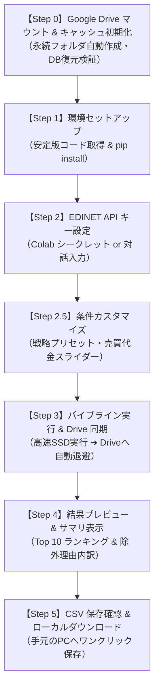

# 📘 Google Colab 実行完全マニュアル
## 日本株クオント・スクリーニング自動化パイプライン

本書は、東証全上場約3,900社を対象に、財務諸表（EDINET）と日足市場データ（yfinance）を統合し、3層構造（事前足切り・クオンツ配点・ゲートキーパー）によって優良銘柄を高速スクリーニングするシステムを、**Google Colab 上で誰でも 5 分で動かすための完全実行マニュアル**です。

PC への Python インストールや環境構築は一切不要です。Google アカウントとブラウザさえあれば、クラウド上でボタンを上から順に押すだけで、毎朝の投資判断レポート（CSV）が手元の Google Drive に自動生成されます。

---

## 1. はじめに：本ツールで手に入るもの

- **全銘柄の客観的クオンツスコア（0〜100点）と判定（Verdict）**:
  - `STRONG_BUY`（極めて優良な割安高収益株）
  - `BUY`（投資適格）
  - `WATCH`（監視・押し目待ち）
  - `PASS`（見送り）
- **地雷銘柄の徹底排除**:
  - 売買高ゼロ（商い不成立）、20日平均売買代金3,000万円未満（極小流動性トラップ）、債務超過（自己資本比率0%以下）、営業CFマージン大幅赤字、超低位ボロ株（50円未満）、一過性特益トラップ（本業赤字なのに低PER）を機械的に即座に除外。
- **実行時間**:
  - **初回実行時**: 過去30日分の初期スキャン（約 3〜5 分）
  - **2回目以降**: Google Drive の差分キャッシュを活用（**約 1 分 40 秒**）

---

## 2. 【事前準備】5分で終わる初期設定（2ステップ）

初回実行の前に、以下の 2 点のみご準備ください。

### ステップ 2-1: EDINET API キー（無料）の取得
金融庁の公式電子開示システム（EDINET）から財務諸表を取得するための無料 API キーを取得します。

1. [EDINET API 公式サイト](https://api.edinet-fsa.go.jp/) にアクセスします。
2. 画面右上の「新規登録」からアカウントを作成します（メールアドレスのみで登録可能、無料です）。
3. ログイン後、マイページの「APIキー発行」をクリックして、発行された **Subscription-Key**（文字列）をコピーして手元に控えておきます。

### ステップ 2-2: ノートブックを開く
以下の「Open in Colab」ボタンをクリックするか、Google Colab から直接開きます。

[](https://colab.research.google.com/github/akkyey/stock-analyzer-core/blob/main/notebooks/stock_analyzer_colab.ipynb)

> [!TIP]
> Google アカウントでログインした状態で開いてください。

---

## 3. 【実践手順】Colab ノートブックの動かし方

ノートブックを開いたら、**「上から順に各セルの左端にある再生ボタン（▶）を押す」** だけで進行します。（ショートカットキー: `Shift + Enter`）



---

### 【Step 0】Google Drive マウント & キャッシュ初期化
- **実行内容**:
  - セルを実行すると、「Google ドライブへの接続を許可しますか？」というポップアップが表示されます。**「Google ドライブに接続」** をクリックして許可してください。
  - Google Drive 内に `MyDrive/StockAnalyzer/` フォルダが自動作成されます。
  - 前回のキャッシュ DB がある場合は、Colab 内蔵の超高速ローカル SSD（`/content/working/`）へ自動で引き継がれます。
- **安心設計**:
  - Google Drive に保存されるのは数MBのデータベースと結果 CSV のみです。無料の 15GB 枠を圧迫することは一切ありません。

---

### 【Step 1】環境セットアップ（ライブラリ導入）
- **実行内容**:
  - リポジトリの取得と、高速データ処理ライブラリ（`polars`, `duckdb`, `yfinance` 等）のインストールが自動で行われます。
- **所要時間**: 約 20〜30 秒で完了します。

---

### 【Step 2】EDINET API キー設定 & 疎通確認
API キーの設定方法は 2 通りあります。お好みの方法をお使いください。

- **推奨（最も安全・自動化）: Colab のシークレット機能を使う**
  1. Colab 画面左端のツールバーにある **鍵アイコン（🔑 シークレット）** をクリックします。
  2. 「新しいシークレットを追加」をクリックし、以下を入力してスイッチを ON にします：
     - **名前**: `EDINET_API_KEY`
     - **値**: ステップ 2-1 で取得した Subscription-Key
  3. この設定を行っておくと、次回以降はセルを実行するだけで自動認識されます。
- **手動入力する場合**:
  - シークレット未設定の場合は、セル実行時に入力ボックスが表示されますので、キーを貼り付けて Enter を押してください（画面には伏字で保護されます）。
- **疎通確認**:
  - キー設定後、自動で金融庁 API への疎通テストが行われ、「`✅ EDINET API 疎通確認成功！ 認証は有効です。`」と表示されれば成功です。

---

### 【Step 2.5】⚙️ スクリーニング設定のカスタマイズ
画面上に直感的なフォームが表示されます。コードを書き換えることなく、スライダーやドロップダウンで設定を変更できます。

1. **投資スタイル（配点プリセット）**:
   - `balanced`: **【標準・推奨】** 収益性・割安度・安全性・配当・テクニカルの黄金比。
   - `dividend_focus`: **【高配当株重視】** 配当利回り（満点5.0%以上）に厚く配点。
   - `deep_value`: **【バリュー株重視】** 低PER・低PBRに最大配点。
   - `growth_quality`: **【クオリティ成長重視】** 高ROE・高収益性に最大配点。
2. **20日平均売買代金スライダー**:
   - 初期値: `30`（3,000万円以上）。大型株に絞りたい場合は `50` や `100`（1億円以上）に引き上げます。
3. **最低株価**:
   - 初期値: `50.0` 円（超低位ボロ株を排除）。
4. **対象市場**:
   - `全市場`、`プライムのみ`、`スタンダードのみ`、`グロースのみ` から選択可能。

---

### 【Step 3】パイプライン実行 & Drive アトミック同期
- **実行内容**:
  - 全銘柄の有報パース、株価・テクニカル計算、3層スクリーニングが一気に走り出します。
  - すべての処理は Colab 内蔵ローカル SSD 上で行われるため、極めて高速に処理されます。
- **実行完了後**:
  - 処理完了後、更新された最新データベースと結果 CSV が Google Drive（`MyDrive/StockAnalyzer/`）へ自動で同期（Push）されます。
  - クラウドへのアップロードが確実に完了するまで待機する安全設計です。

---

### 【Step 4】結果プレビュー & サマリ表示
CSV ファイルを開かなくても、Colab 上で即座に本日の有望銘柄を確認できます。

1. **適格銘柄ランキング Top 10 表**:
   - 順位、コード、銘柄名、市場、Verdict（`BUY` 等）、スコア、PER、PBR、ROE、自己資本比率、配当利回りが綺麗に一覧表示されます。
2. **第1層 足切り除外銘柄の内訳**:
   - 「極小流動性トラップ: 1,464社」「商い不成立: 230社」「構造的破綻（債務超過）: 42社」など、なぜ市場の大半の銘柄が見送りになったのかの根拠が可視化されます。

---

### 【Step 5】CSV 保存確認 & ローカルダウンロード
- セルを実行すると、手元の PC のダウンロードフォルダに `daily_report.csv` が自動で保存されます。
- 同時に Google Drive（`MyDrive/StockAnalyzer/output/daily_report.csv`）にも常に最新版が永続保存されています。

---

## 4. 【応用編】出力 CSV の読み解き方と活用術

ダウンロードされた `daily_report.csv` には、以下の主要カラムが含まれています：

| カラム名 | 意味・活用法 |
| :--- | :--- |
| **`Rank`** | 本日の総合クオンツスコア順位（1位〜） |
| **`Verdict`** | **判定結果**。`STRONG_BUY`（極めて優良）、`BUY`（適格）、`WATCH`（監視・押し目待ち） |
| **`Agent_Score`** | 100点満点の総合クオンツスコア。65.0点以上が `BUY` 基準 |
| **`PER` / `PBR`** | 予想PERおよび実績PBR。割安度の指標 |
| **`ROE`** | 自己資本利益率（%）。本業の資本効率 |
| **`Equity_Ratio`** | 自己資本比率（%）。財務健全性 |
| **`Dividend_Yield`**| 予想配当利回り（%） |
| **`filter_reason`** | （`uncalculable_stocks.csv` のみ）除外された具体的な理由 |

---

## 5. 【発展・特典】生成 AI（Claude / ChatGPT）連携プロンプト

生成された `daily_report.csv` をそのまま Claude や ChatGPT（GPT-4o）にドラッグ＆ドロップし、以下のプロンプトを入力してください。  
**毎朝 1 分で「プロのアナリストによる投資ブリーフィング」が自動生成されます。**

```text
あなたは経験豊富なプロの株式クオンツアナリストです。
添付した「daily_report.csv」は、東証全上場銘柄の中から財務健全性とテクニカルモメンタムを
満たした適格銘柄を抽出した本日の最新スクリーニング結果です。

このデータを分析し、以下の構成で朝の投資判断ブリーフィングを作成してください：

1. 【本日のサマリ】：
   - 全体的な傾向（バリュー優位かグロース優位か、目立つセクターなど）
2. 【注目ピックアップ Top 3】：
   - スコア上位銘柄の中から、特に「割安性」「財務の安全性」「配当利回り」のバランスが際立っている3社を選び、それぞれの強みとリスクを簡潔に解説してください。
3. 【セクター別の特徴】：
   - どの業種が上位に多くランクインしているか、市場の資金フローの観点から考察してください。
4. 【投資家への注記・注意点】：
   - テクニカル指標（RSIや移動平均乖離率）の観点から、短期的な過熱感や押し目買いのタイミングについて客観的なアドバイスを述べてください。
```

---

## 6. トラブルシューティング（よくある質問）

### Q1. `401 Unauthorized` エラーが出て止まります
- **原因**: 入力した EDINET API キー（Subscription-Key）が間違っているか、余分なスペースが含まれています。
- **対処法**: 金融庁 EDINET マイページでキーを再コピーし、Step 2 で貼り直してください。

### Q2. 途中でブラウザを閉じたり、通信が切れたらどうなりますか？
- **回答**: 実行中の計算は中断されますが、**前回正常に終了した時点のデータベースが Google Drive に安全に残っています**。再度ノートブックを開いて Step 0 から実行すれば、前日までのデータを引き継いで即座に再開できます（最初から全件やり直しにはなりません）。

### Q3. 2回目以降はどれくらい速くなりますか？
- **回答**: 初回は過去30日分の有報スキャンを行うため 3〜5 分程度かかりますが、2回目以降は Google Drive 上の差分キャッシュが効くため、**約 1 分 40 秒** で完了します。

---

## 7. 免責事項（法的留意事項）

本ツールおよびマニュアルは、公開データの自動処理技術の学習・研究を目的としたものであり、投資助言や特定の有価証券の売買を推奨するものではありません。  
算出されるスコアおよび Verdict は機械的な計算結果であり、将来の運用成果を保証するものではありません。実際の投資判断および売買は、必ずご自身の責任において行ってください。また、本ツールの利用により生じたいかなる損害についても、著者は一切の責任を負いかねます。
