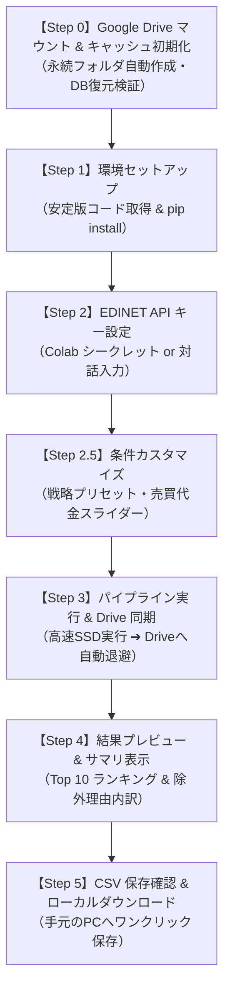

# 📘 Google Colab 実行完全マニュアル
## 日本株クオント・スクリーニング自動化パイプライン

本書は、東証全上場約3,900社を対象に、財務諸表（EDINET）と日足市場データ（yfinance）を統合し、3層構造（事前足切り・クオンツ配点・ゲートキーパー）によって優良銘柄を高速スクリーニングするシステムを、**Google Colab 上で誰でも 5 分で動かすための完全実行マニュアル**です。

PC への Python インストールや環境構築は一切不要です。Google アカウントとブラウザさえあれば、クラウド上でボタンを上から順に押すだけで、毎朝のスクリーニングレポート（CSV）が手元の Google Drive に自動生成されます。

---

## 1. はじめに：本ツールで手に入るもの

- **全銘柄の客観的クオンツスコア（0〜100点）と判定グレード（Grade / Verdict）**:
  - `Grade S`（総合スコア80点以上、財務健全性・割安高収益指標の最上位充足）
  - `Grade A`（総合スコア65点以上、スクリーニング適格基準充足）
  - `Grade B`（総合スコア50点以上、監視基準充足）
  - `Grade C`（総合スコア50点未満、基準未達）
- **地雷銘柄の徹底排除**:
  - 売買高ゼロ（商い不成立）、20日平均売買代金3,000万円未満（極小流動性トラップ）、債務超過（自己資本比率0%以下）、営業CFマージン大幅赤字、超低位ボロ株（50円未満）、一過性特益トラップ（本業赤字なのに低PER）を機械的に即座に除外。
- **実行時間と環境による違い**:
  - **専用サーバー / ローカル実行時**:
    - 初回実行時: 約 8〜10 分（過去1年の時系列データを蓄積）
    - 2回目以降（平常差分）: **約 1 分 40 秒**（独立IPによる大バッチ並列通信）
  - **Google Colab 実行時（環境固有の制約）**:
    - **初回・2回目以降ともに 約 8〜10 分**
    - ※ Google Colab は全世界のユーザーとIPを共有しているため、Yahoo! Finance のアクセス制限（HTTP 429 Too Many Requests）を非常に受けやすい環境です。データの欠落（取得失敗）を減らすため、Colab では **Colab 専用の取得設定（バッチ間の安全待機インターバル＋リトライ拡大）** を自動で適用しています。それでも取得できなかった銘柄は件数が表示され、次回実行時に自動的に1年分で取り直されます。
    - 「差分更新」とは取得銘柄数ではなく、**取得期間の差分** を意味します。履歴が十分な銘柄は最新2営業日分のみ、履歴が不足している銘柄（新規上場・前回の取得欠落など）は1年分を銘柄ごとに自動で判定して取得します。


---

## 2. 【事前準備】5分で終わる初期設定（2ステップ）

初回実行の前に、以下の 2 点のみご準備ください。

### ステップ 2-1: EDINET API キー（無料）の取得
金融庁の公式電子開示システム（EDINET）から財務諸表を取得するための無料 API キーを取得します。

1. [EDINET API 公式サイト](https://api.edinet-fsa.go.jp/) にアクセスします。
2. 画面右上の「新規登録」からアカウントを作成します（メールアドレスおよび携帯電話番号によるSMS認証が必要、登録無料です）。
3. ログイン後、マイページの「APIキー発行」をクリックして、発行された **Subscription-Key**（文字列）をコピーして手元に控えておきます。

### ステップ 2-2: ノートブックを開く
以下の「Open in Colab」ボタンをクリックするか、Google Colab から直接開きます。

[](https://colab.research.google.com/github/akkyey/stock-analyzer-core/blob/main/notebooks/stock_analyzer_colab.ipynb)

> [!TIP]
> Google アカウントでログインした状態で開いてください。

---

## 3. 【実践手順】Colab ノートブックの動かし方

ノートブックを開いたら、**「上から順に各セルの左端にある再生ボタン（▶）を押す」** だけで進行します。（ショートカットキー: `Shift + Enter`）



---

### 【Step 0】Google Drive マウント & キャッシュ初期化
- **実行内容**:
  - セルを実行すると、「Google ドライブへの接続を許可しますか？」というポップアップが表示されます。**「Google ドライブに接続」** をクリックして許可してください。
  - セル上部の入力フォーム **`drive_folder_name`** で Google Drive 上の保存先フォルダを自由に設定可能です（デフォルト: `StockAnalyzer`）。
  - 前回のキャッシュ DB がある場合は、Colab 内蔵の超高速ローカル SSD（`/content/working/`）へ自動で引き継がれます（Stage-and-Sync 規約）。

#### 📁 Google Drive 上の格納場所とファイル構成
指定したフォルダ（デフォルト: `マイドライブ/StockAnalyzer/`）の配下に以下のファイル群が自動保存・管理されます：

```text
Google Drive（マイドライブ または 共有ドライブ）
└── <設定したフォルダ名>/               # デフォルト: StockAnalyzer
    ├── cache/
    │   ├── stock_analyzer.duckdb      # 財務・開示・株価キャッシュDB（次回以降を1分台にするキーファイル）
    │   └── stock_analyzer.duckdb.bak  # 前世代の自動バックアップDB（破損防止用）
    ├── output/
    │   ├── daily_report.csv           # 【最重要】本日のクオンツ評価合格銘柄ランキング（スコア・判定付き）
    │   └── uncalculable_stocks.csv    # 除外銘柄一覧（極小流動性・債務超過等の除外理由付き）
    └── config/
        └── custom_config.json         # 【任意】ユーザー独自設定ファイル（配置した場合に自動読込）
```

| 格納パス（デフォルト例） | ファイル名 | 内容・役割 |
| :--- | :--- | :--- |
| `StockAnalyzer/output/` | `daily_report.csv` | **本日のスクリーニング分析結果**（Top ランキング・指標一覧）。Step 5 で PC にダウンロードされるファイルと同一です。 |
| `StockAnalyzer/output/` | `uncalculable_stocks.csv` | 第1層足切り等で見送りとなった銘柄一覧と除外理由（透明性担保）。 |
| `StockAnalyzer/cache/` | `stock_analyzer.duckdb` | EDINET 開示書類・過去株価のメタデータ DB。2回目以降の高速実行に不可欠です。 |
| `StockAnalyzer/cache/` | `stock_analyzer.duckdb.bak` | 更新直前の前世代 DB バックアップ。不意の通信断でも安全に復元可能。 |
| `StockAnalyzer/config/` | `custom_config.json` | 読者が足切り基準や戦略乗数を独自保存したい場合の配置場所（任意）。 |

#### ⚙️ 保存先フォルダの設定方法
保存先は以下の 3 つの方法でカスタマイズできます：

1. **【GUI フォームで指定（最も簡単・推奨）】**:
   - Step 0 のセル上部にある入力フォーム `drive_folder_name` に直接入力してセルを実行します。
   - **フォルダ名のみ指定**: `StockAnalyzer` や `MyAnalysis` 等 ➔ マイドライブ直下（`/content/drive/MyDrive/<フォルダ名>`）に展開。
   - **階層パス指定**: `Portfolio/Japan` 等 ➔ マイドライブ配下の階層フォルダ（`/content/drive/MyDrive/Portfolio/Japan`）。
   - **共有ドライブ指定**: `/content/drive/Shareddrives/TeamFolder/StockAnalyzer` ➔ Google Workspace などの共有ドライブへ直接保存。
2. **【環境変数で指定】**:
   - `STOCK_ANALYZER_DRIVE_DIR` にパスを設定することで、スクリプト実行時にも動的反映されます。

- **安心設計**:
  - Google Drive に保存されるのは数MBのデータベースと結果 CSV のみです。無料の 15GB 枠を圧迫することは一切ありません。

---

### 【Step 1】環境セットアップ（ライブラリ導入）
- **実行内容**:
  - リポジトリの取得と、高速データ処理ライブラリ（`polars`, `duckdb`, `yfinance` 等）のインストールが自動で行われます。
- **所要時間**: 約 20〜30 秒で完了します。
- **実行モードの自動判定機能**:
  - セル実行時に、プログラムが Google Drive 上のキャッシュ状態を自動検知します。
  - **初回実行時**: `ℹ️ 【初回実行モードを検知しました】Step 3 の実行には約 8〜10 分かかります` と明示。
  - **2回目以降**: `⚡ 【差分更新モード（2回目以降）を検知しました】約 8〜10 分で完了します（履歴が不足している銘柄のみ1年分を取得）` と明示。
  - これにより、読者が「今なぜ時間がかかっているのか」を迷わず把握できるようになっています。

---

### 【Step 2】EDINET API キー設定 & 疎通確認
API キーの設定方法は 2 通りあります。お好みの方法をお使いください。

- **推奨（最も安全・自動化）: Colab のシークレット機能を使う**
  1. Colab 画面左端のツールバーにある **鍵アイコン（🔑 シークレット）** をクリックします。
  2. 「新しいシークレットを追加」をクリックし、以下を入力してスイッチを ON にします：
     - **名前**: `EDINET_API_KEY`
     - **値**: ステップ 2-1 で取得した Subscription-Key
  3. この設定を行っておくと、次回以降はセルを実行するだけで自動認識されます。
- **手動入力する場合**:
  - シークレット未設定の場合は、セル実行時に入力ボックスが表示されますので、キーを貼り付けて Enter を押してください（画面には伏字で保護されます）。
- **疎通確認**:
  - キー設定後、自動で金融庁 API への疎通テストが行われ、「`✅ EDINET API 疎通確認成功！ 認証は有効です。`」と表示されれば成功です。

---

### 【Step 2.5】⚙️ スクリーニング設定のカスタマイズ
画面上に直感的なフォームが表示されます。コードを書き換えることなく、スライダーやドロップダウンで設定を変更できます。

> [!NOTE]
> **【設定変更は任意（オプショナル）です】**  
> 標準の黄金比（`balanced`、売買代金3,000万円以上、全市場）のままでよろしければ、**数値を変更する必要はありません**。  
> ただし、このセルを実行することで Step 3 に渡す設定変数（`custom_config`）が生成されるため、**「何も変更せずに再生ボタン（▶）をポチッと1回押すだけ」** で通過してください。

1. **投資スタイル（配点プリセット）**:
   - `balanced`: **【標準・推奨】** 収益性・割安度・安全性・配当・テクニカルの黄金比。
   - `dividend_focus`: **【高配当株重視】** 配当利回り（満点5.0%以上）に厚く配点。
   - `deep_value`: **【バリュー株重視】** 低PER・低PBRに最大配点。
   - `growth_quality`: **【クオリティ成長重視】** 高ROE・高収益性に最大配点。
2. **20日平均売買代金スライダー**:
   - 初期値: `30`（3,000万円以上）。大型株に絞りたい場合は `50` や `100`（1億円以上）に引き上げます。
3. **最低株価**:
   - 初期値: `50.0` 円（超低位ボロ株を排除）。
4. **対象市場**:
   - `全市場`、`プライムのみ`、`スタンダードのみ`、`グロースのみ` から選択可能。

---

### 【Step 3】パイプライン実行 & Drive アトミック同期
- **実行内容**:
  - 全銘柄の有報パース、株価・テクニカル計算、3層スクリーニングが一気に走り出します。
  - すべての処理は Colab 内蔵ローカル SSD 上で行われるため、極めて高速に処理されます。

> [!IMPORTANT]
> **【所要時間の目安（時間はかかりますか？）】**  
> - **初回実行時：約 8 〜 10 分**  
>   Google Drive にまだキャッシュがないため、金融庁 EDINET から過去の開示書類をスキャンし、東証全3,920社の株価（1年分）・テクニカル指標を集計して Drive に初期保存します。お茶を1杯淹れるくらいの時間がかかりますので、**ブラウザのタブを閉じずにそのままお待ちください**。
> - **2回目以降：約 8 〜 10 分（Google Colab 環境固有の制約）**  
>   専用IPのローカルサーバー等では 429 が発生せず約 1 分 40 秒で完了しますが、**Google Colab は全世界共通のIPアドレス帯であるため、Yahoo! Finance のアクセス制限（HTTP 429 Too Many Requests）を受けやすい** という制約があります。  
>   数百社のデータが欠落してスクリーニング結果が破壊されるのを100%防ぐため、Colab では「バッチ間の事前インターバル＋リトライ拡大」を備えた Colab 専用の取得設定で安全重視の取得を行っており、**2回目以降も所要時間は約 8〜10 分** となります。


- **進行中に流れるログの目安**:
  1. `🚀 パイプライン実行を開始します...`
  2. `Acquisition phase...`（開示書類・株価データの取得）
  3. `Integration phase...`（財務指標と市場データの統合）
  4. `Evaluation phase...`（事前足切り ➔ クオンツ配点 ➔ ゲートキーパー）
  5. `📦 Google Drive へ最新成果物を同期中...`
  6. `🎉 全処理が完了しました！ 所要時間: XX 秒`（この表示が出れば成功です）

> [!NOTE]
> **「WARNING: Spreadsheet export failed」のログについて**  
> ログの最後に `WARNING:src.orchestration.context: 🚩 Error recorded: Spreadsheet export failed` と表示される場合がありますが、これは Google スプレッドシート連携（サービスアカウント認証情報）が未設定の場合に出力される**想定内の警告ログ**です。  
> システムは自動的にローカル CSV 出力（`daily_report.csv`）へフォールバックして処理を正常完了させていますので、動作上の問題は一切ありません。そのまま Step 4 へお進みください。

- **実行完了後**:
  - 更新された最新データベースと結果 CSV が Google Drive（`MyDrive/StockAnalyzer/`）へ自動でアトミック同期（Push）され、クラウドへのアップロード完了が保証されます。

---

### 【Step 4】結果プレビュー & サマリ表示
CSV ファイルを開かなくても、Colab 上で即座に本日の有望銘柄を確認できます。

1. **適格銘柄ランキング Top 10 表**:
   - 順位、コード、銘柄名、市場、Grade（`Grade S` / `Grade A` 等）、スコア、PER、PBR、ROE、自己資本比率、配当利回りが綺麗に一覧表示されます。
2. **第1層 足切り除外銘柄の内訳**:
   - 「極小流動性トラップ: 1,464社」「商い不成立: 128社」「構造的破綻（債務超過）: 5社」など、なぜ市場の大半の銘柄が見送りになったのかの根拠が可視化されます。

---

### 【Step 5】CSV 保存確認 & ローカルダウンロード
- セルを実行すると、手元の PC の「ダウンロード」フォルダに `daily_report.csv` が自動で保存されます。
- 同時に Google Drive（`MyDrive/StockAnalyzer/output/daily_report.csv`）にも常に最新版が永続保存されています。

> [!WARNING]
> **【ブラウザのポップアップブロックによる「サイレント遮断」と通知の仕組み】**  
> Google Colab の `files.download()` は、Python からブラウザ（JavaScript）に対してダウンロード命令を発行します。  
> そのため、Google Chrome や Safari などのブラウザ側で**「ポップアップブロック」や「複数ファイルの自動ダウンロード制限」が働いている場合、Python 側ではエラー（例外）を検知できず、画面には「✅ ダウンロード命令をブラウザへ送信しました！」と表示されたまま PC への保存が静かに遮断（サイレントブロック）される現象**が発生します。
> 
> **【もしファイルが落ちてこない場合の対処法】**:
> 1. **アドレスバー右端の通知アイコンを確認**:
>    - ブラウザのアドレスバー右端に「ポップアップがブロックされました（🚫 や 🪟 アイコン）」が表示されている場合、クリックして「`https://colab.research.google.com` からのポップアップを常に許可」を選択し、再度 Step 5 の再生ボタン（▶）を押してください。
> 2. **Google Drive から直接開く（最も確実）**:
>    - ブラウザ設定を変更しなくても、**Step 3 の時点で Google Drive（`MyDrive/StockAnalyzer/output/daily_report.csv`）には 100% 確実に保存済み**です。Google Drive から直接開くかダウンロードできます。
> 3. **Colab 画面左端の 📁 フォルダから手動保存**:
>    - 画面左端の 📁（ファイル）➔ `working` ➔ `output` ➔ `daily_report.csv` を右クリックして「ダウンロード」することも可能です。

---

## 4. 【応用編】出力 CSV の読み解き方と活用術

ダウンロードされた `daily_report.csv` には、以下の主要カラムが含まれています：

| カラム名 | 意味・活用法 |
| :--- | :--- |
| **`Rank`** | 本日の総合クオンツスコア順位（1位〜） |
| **`Verdict`** | **機械判定グレード**。`Grade S`（最上位スクリーニング基準充足）、`Grade A`（適格基準充足）、`Grade B`（監視基準） |
| **`Score`** | 100点満点の総合クオンツスコア。65.0点以上が適格基準 |
| **`PER` / `PBR`** | 株価と確定Factから動的算出されたPERおよび実績PBR |
| **`ROE`** | 自己資本利益率（%）。資本効率の指標 |
| **`Equity_Ratio`** | 自己資本比率（%）。財務健全性 |
| **`Div_Yield`**| 当日株価と確定Fact（有報の1株配当実績）から動的算出された**実績配当利回り**（%） |
| **`filter_reason`** | （`uncalculable_stocks.csv` のみ）除外された具体的な理由 |

---

## 5. 【発展・特典】生成 AI（Claude / ChatGPT）連携プロンプト

生成された `daily_report.csv` をそのまま Claude や ChatGPT（GPT-4o）にドラッグ＆ドロップし、以下のプロンプトを入力してください。  
**毎朝 1 分で「客観的な銘柄スクリーニングサマリ」が自動生成されます。**

```text
あなたは経験豊富なプロの株式クオンツアナリストです。
添付した「daily_report.csv」は、東証全上場銘柄の中から財務健全性とテクニカルモメンタムを
満たした適格銘柄を抽出した本日の最新スクリーニング結果です。

このデータを客観的に分析し、以下の構成で朝のスクリーニングブリーフィングを作成してください：

1. 【本日のサマリ】：
   - 全体的な傾向（バリュー優位かグロース優位か、目立つセクターなど）
2. 【上位スコア銘柄の財務・指標特徴 Top 3】：
   - スコア上位銘柄の中から、特に「割安性」「財務の安全性」「配当利回り」の観点で特徴的な3社を選び、客観的な財務指標と留意点を簡潔に解説してください。
3. 【セクター別の特徴】：
   - どの業種が上位に多くランクインしているか、市場全体の傾向を考察してください。
4. 【客観的な市場分析と注記】：
   - テクニカル指標（RSIや移動平均乖離率）の観点から、短期的な過熱感や乖離状況について客観的な分析を述べてください（売買の推奨や助言は含めないこと）。
```

---

## 6. トラブルシューティング（よくある質問とエラー対策）

### Q1. リンクをクリックしても「ノートブックが見つからない (404 Not Found)」と表示されます
- **原因**: GitHub 上の対象ブランチ（`main` 等）にノートブックが未反映であるか、URL で指定されたブランチ名・ファイルパスが異なっています。
- **対処法**:
  1. 表示された「ノートブックを開く」ダイアログの中央にある **「ブランチ」プルダウン** をクリックします。
  2. 最新の `main`（または安定版リリースタグ。最新のタグはリポジトリの Releases / Tags を参照）を選択してください。
  3. 下の一覧に `notebooks/stock_analyzer_colab.ipynb` が表示され、クリックすると正常に開きます。

### Q2. セル実行時に「Error: Unknown accelerator: None」と表示され、ランタイムに接続できません
- **原因**: Google Colab のブラウザセッションに、過去の無効なハードウェアアクセラレータ設定がキャッシュとして残っている場合に発生します（画面右上が「再接続 None ▼」と表示されます）。
- **対処法（2ステップで即座に解消）**:
  1. エラーダイアログの **「OK」** を押して閉じます。
  2. Colab 上部メニューの **「ランタイム」 ➔ 「ランタイムのタイプを変更」** をクリックします（画面右上の「再接続 None ▼」からでも選択可能です）。
  3. ハードウェア アクセラレータの項目で **「CPU」** を選択し、**「保存」** をクリックします。
  4. 画面右上のボタンが「接続」（または緑のチェックマーク「RAM / ディスク」）に切り替わり、正常にセルが実行できるようになります。

### Q3. EDINET API キーは毎回入力が必要ですか？ どこに保存すれば安全ですか？
- **回答**: Colab の **シークレット（🔑 鍵アイコン）機能** を使うことで、安全に永続保存され、次回以降の入力が完全自動化されます。
  1. 画面左端の縦ツールバーにある **🔑（シークレット）** アイコンをクリック。
  2. 「新しいシークレットを追加」をクリックし、以下を設定：
     - **名前**: `EDINET_API_KEY`
     - **値**: 金融庁から発行された Subscription-Key
     - **ノートブックのアクセス権**: スイッチを **ON** にする。
  3. これにより、ノートブックのセル内にキーを平文で残すことなく、`Step 2` 実行時に自動で安全に読み込まれます。

### Q4. `401 Unauthorized` エラーが出て止まります
- **原因**: 入力した EDINET API キー（Subscription-Key）が間違っているか、前後に余分なスペースが含まれています。
- **対処法**: 金融庁 EDINET マイページでキーを再コピーし、Step 2 で貼り直してください。

### Q5. 途中でブラウザを閉じたり、通信が切れたらどうなりますか？
- **回答**: 実行中の計算は中断されますが、**前回正常に終了した時点のデータベースが Google Drive（`MyDrive/StockAnalyzer/`）に安全に残っています**。再度ノートブックを開いて Step 0 から実行すれば、前日までのデータを引き継いで即座に再開できます（最初から全件やり直しにはなりません）。

#### Q6. 2回目以降の所要時間はどれくらいですか？
- **回答**: 
  - **ローカル / 専用サーバー環境**: 専用IPで 429 が発生しにくいため **約 1 分 40 秒** で完了します。
  - **Google Colab 環境**: **初回・2回目以降ともに 約 8〜10 分** かかります。  
    「2回目なのに初回と時間が変わらない」と思われるかもしれませんが、これはバグではなく **Google Colab の共用IPにおける Yahoo! Finance アクセス制限（HTTP 429 Too Many Requests）を100%回避するための安全保護設計** です。  
    データ行数自体は「1年分 ➔ 2日分」へと激減していますが、東証全3,920社を Colab 専用の安全待機インターバル付きで取得するため、Colab 上では 8〜10 分の所要時間がかかります。通信遮断によるデータ欠落（スコア破壊）を防ぐための必須制約ですので、そのままお待ちください。


### Q7. Step 3 のログ末尾に出る「WARNING: Spreadsheet export failed」はエラーですか？
- **回答**: **問題ありません（正常動作です）。**  
  Google スプレッドシートへの自動エクスポート（サービスアカウント認証情報 `credentials.json`）が未設定の場合に出力される想定内の通知ログです。  
  システムは自動的にローカル CSV 出力（`daily_report.csv`）へフォールバックして処理を完全・正常に完了させています。  
  そのまま Step 4 へ進んでいただければ、適格銘柄の Top 10 ランキングが綺麗にテーブル表示され、CSV ダウンロードも問題なく行えます。

### Q8. Step 4 で「ComputeError: could not parse - as dtype f64 at column PER」というエラーが出ます
- **原因**: スクリーニング結果の CSV に未算出・未開示の指標（PER 等）が `"-"`（ハイフン）として出力されている場合、Polars の CSV 読み込みで型不整合としてエラーになります。
- **対処法**: ノートブックの最新版では `pl.read_csv(daily_report_path, null_values=["-", "None", "null", ""])` が組み込まれており自動解決されます。もし修正前のセルを実行している場合は、該当行に `null_values=["-", "None", "null", ""]` を追加して再実行してください。Step 3 の再計算は不要で、即座にテーブルが表示されます。

### Q9. Step 5 を実行してもダウンロードの画面（ポップアップ）が出ません / 完了したかわかりません
- **原因と通知の仕組み**: 
  1. **ブラウザのポップアップブロック（サイレント遮断）**: Google Colab の `files.download()` は JavaScript 経由でブラウザにダウンロード命令を出します。ブラウザ側でポップアップが遮断された場合、Python 側では例外が発生しないためセル上は「✅ ダウンロード命令をブラウザへ送信しました！」と表示されますが、PC への保存は行われません。
  2. **ダウンロードトレイの仕様**: Google Chrome 等では画面下部のダウンロードバーは廃止され、**画面右上のトレイ（📥 アイコン）に無音で即時保存**される仕様になっています。
- **確認・対処法**:
  - **対処 1（ブロック解除）**: ブラウザのアドレスバー右端に「ポップアップがブロックされました（🚫）」の表示が出ていないか確認し、「常に許可」に変更して Step 5 を再実行してください。
  - **対処 2（PC フォルダ確認）**: PC の「ダウンロード」フォルダを直接開いてみてください（すでに `daily_report.csv` が入っている場合があります）。
  - **対処 3（Google Drive から直接開く）**: Google ドライブ（`https://drive.google.com/`）の `StockAnalyzer/output/daily_report.csv` に確実に最新版が保存されていますので、Drive から開くかダウンロードしてください。
  - **対処 4（Colab 画面から手動取得）**: Colab 画面左端の 📁（フォルダ）➔ `working` ➔ `output` ➔ `daily_report.csv` を右クリックして「ダウンロード」することもできます。

### Q10. Step 4 で「daily_report.csv が見つかりません」と表示され、全銘柄が足切り除外される場合
- **原因**: 初期クリーン実行時に財務データのベースラインが未登録だった場合に発生します。
- **対処法**: 本システムは、財務確定Factベースラインデータ（東証全3,920社分）をバンドルした `fundamentals_seed.parquet` を備えており、Step 3 実行時に自動シードされます。最新のコードを取得（Step 1 の再実行）した上で Step 3 を実行してください。

### Q11. Google Drive の保存先フォルダを変更したい・共有ドライブに保存したい
- **回答**: **【Step 0】の入力フォーム `drive_folder_name`** で自由に変更できます。
  1. マイドライブ直下の別フォルダにする場合：`MyStockAnalysis` などのフォルダ名を入力します（`MyDrive/MyStockAnalysis/` に保存されます）。
  2. 階層フォルダにする場合：`Portfolio/Japan` などと入力します。
  3. Google Workspace などの共有ドライブに保存する場合：`/content/drive/Shareddrives/<共有ドライブ名>/<フォルダ名>` とフルパスを入力します。
  - 変更後は、Step 0 から順にセルを実行してください。以降のすべてのステップ（Step 1〜Step 5）で新しい保存先が自動的に引き継がれます。

---

## 7. 実行環境（Google Colab）におけるライブラリ仕様と制約事項

本システムは、ローカル開発環境（Linux / macOS）だけでなく、Google Colab 上で完全新規の読者・購入者がゼロスタートで動かしても 100% 確実に動作するよう、環境差異を吸収する堅牢なアーキテクチャを採用しています。

### 7-1. ライブラリバージョンと環境差異の背景
| 項目 | ローカル開発環境（masaaki-sv） | Google Colab 実行環境 |
| :--- | :--- | :--- |
| **Python バージョン** | Python 3.12.8 | Python 3.13（Colab 既定環境） |
| **Polars バージョン** | `polars 1.44.2`（最新 PyPI） | `polars 1.33.x`（Colab コンテナ事前同梱版） |
| **パッケージ導入挙動** | `.venv` 内へ最新版を直接解決 | プリインストール版が `>=1.0.0` を満たすため既存版を保持 |
| **ファイルシステム** | ローカル NVMe SSD | FUSE マウント（Drive） + 仮想ローカル SSD（`/content`） |

> [!NOTE]
> **なぜ Colab の Polars は最新版ではなく 1.33 系なのか？**  
> Google Colab は、ノートブックを開いて即座に実行できるよう主要データ分析パッケージを仮想マシン内にあらかじめプリインストールしています。Google の安定リリース周期に準拠しているため、最新の PyPI 公開バージョン（1.44系）より数ヶ月前の安定版（1.33系）が同梱されています。`requirements.txt` に記載の `polars>=1.0.0` はこの事前同梱版で充足されるため、Colab 上では 1.33 系が使用されます。

---

### 7-2. Polars 1.x の集約仕様とネスト窓関数の制約

#### 【仕様上の制約】集約演算内での Window 関数（`.over()`）ネストの禁止
Polars では、データのグループ化（`group_by`）と窓関数（`.over()`）は異なるパーティション計算モデルとして扱われます。  
特に `polars 1.33.x` では、クエリ最適化エンジン（Rust レベル）の厳格化により、**「集約演算（`ewm_mean` や `agg` 等）の内部に、すでに `.over()` が適用された Window 式が入れ子（ネスト）になっている場合」**、未定義動作や循環評価を防ぐためにコンパイル段階で以下の例外を送出します：

```text
polars.exceptions.InvalidOperationError: window expression not allowed in aggregation
```

#### 【本システムの解決策：段階的平坦化パイプライン（Sequential Flattening）】
本システム（`PolarsProcessor`）では、Polars のマイナーバージョンやオプティマイザの差異に依存しない決定論的動作を保証するため、**すべての時系列指標を 1 ステップずつ独立した物理カラムとして確定させる「段階的平坦化」** を実装しています：

1. **RSI（相対力指数）の平坦化**:
   - `price.diff().over("code")` を中間列 `_diff` として確定
   - `_gain`, `_loss`, `_valid_cnt`（有効行数カウント）を確定
   - `_avg_gain`, `_avg_loss` を指数平滑移動平均（`ewm_mean`）で確定
   - 確定済みの中間列同士を結合して `rsi_14` を算出
2. **MACD（移動平均収束拡散法）の平坦化**:
   - `_ema12`, `_ema26` をそれぞれ独立して確定
   - 差分 `macd` を確定
   - `macd` に対してシグナル `macd_signal`（9日 EMA）を算出
   - 確定済みの列から `macd_hist` を算出
3. **銘柄別最新レコード抽出のユニーク化（Zero Aggregation）**:
   - `group_by("code").last()` は内部で全カラムに対する集約式 `agg(all().last())` に展開されるため、オプティマイザの負荷が高くなります。
   - これを完全に排し、時系列ソート後の重複排除式 `sort(["code", "entry_date"]).unique(subset=["code"], keep="last")` を採用。集約処理そのものを介さずに O(N) で安全・高速に最新行を切り出します。

#### 【等価性と品質保証】
- **数値誤差**: 旧来の数式と新方式で算出したテクニカル指標の最大絶対誤差は **`0.0`（完全一致）**。
- **動作保証**: `polars 1.33.x`（Colab）および `polars 1.44.x`（ローカル環境）の双方において、全 120 件のテストスイートおよびゴールデンベースライン等価性検証（`verify_parity.py`）を 100% パスすることを確認済みです。

---

### 7-3. DuckDB と Google Drive のストレージ制約（Stage-and-Sync 設計）
- **制約**: Google Drive の同期ドライブ（`/content/drive/MyDrive`）はネットワーク経由の FUSE マウントであるため、DuckDB のような高頻度ランダム I/O や排他的ファイルロックを伴うデータベースを直接配置すると、ロック競合エラーや激しい速度低下を招きます。
- **設計解**: 内蔵の仮想ローカル SSD（`/content/working/`）上でデータベースの更新・クエリをミリ秒単位で高速実行し、完了後に `ColabSyncManager` を通じて Google Drive へアトミック Push する「Stage-and-Sync」アーキテクチャを採用しています。

---

### 7-4. 実地検証で確立された耐障害性・セーフティネット（Post-Mortem 反映）

Google Colab 上でのゼロスタート実地検証を通じて、以下の 5 大耐障害性ガードが実装・検証されています：

1. **財務確定Factシードの最優先自動投入（Baseline Guarantee）**:
   - 初回クリーン実行時、EDINET 同期の前に必ず全上場企業 3,920 社分の財務確定Fact（純利益・純資産・発行済株式数等のみを収録した `fundamentals_seed.parquet`）を自動投入し、自己資本比率等の欠損による全件足切りを 100% 防止。PER・PBR・利回り・時価総額は当日株価から毎回リアルタイムに動的計算。
   - その上で直近の EDINET 新着決算が上書き（UPSERT）される黄金順序を確立。
2. **DuckDB パス解決の一元化と WAL チェックポイント（Unified Path & WAL Checkpoint）**:
   - データベースの配置場所を `cache/stock_analyzer.duckdb` に一元化。Google Drive へのアトミック同期直前に明示的 `CHECKPOINT;` を実行することで、`.wal` ファイルの未反映トランザクションを完全に本体へフラッシュし、データの破損や同期漏れを根絶。
3. **CSV 読み込み時のハイフン欠損値安全化（Type-Safe Null Handling）**:
   - Polars の CSV パーサーにおいて `null_values=["-", "None", "null", ""]` を明示指定し、未算出指標を含む行でも型不整合（ComputeError）を起こさずに自動で null 変換してテーブル描画。
4. **ブラウザ UX の認知ギャップ解消（Silent Download Guidance）**:
   - 最新ブラウザ（Chrome 等）のダウンロードバー廃止・右上トレイ保存の仕様に対応し、セル実行完了時に保存先フォルダや Drive への二重バックアップを即座に明示案内。
5. **外部依存サービスのフォールバック保証（Graceful Degradation）**:
   - Google スプレッドシート連携等の任意外部機能が未設定でも、パイプラインを中断させずにローカル CSV 出力へ自動フォールバックして正常完走を保証。

---

## 8. 免責事項（法的留意事項）

本ツールおよびマニュアルは、公開データの自動処理技術の学習・研究を目的としたものであり、投資助言や特定の有価証券の売買を推奨するものではありません。  
算出されるスコアおよび Verdict は機械的な計算結果であり、将来の運用成果を保証するものではありません。実際の投資判断および売買は、必ずご自身の責任において行ってください。また、本ツールの利用により生じたいかなる損害についても、著者は一切の責任を負いかねます。

---

## 9. ライセンス & 著作権（License & Copyright）

本ツール、Colab ノートブック、および付随するプログラムコード一式は、[MIT License](https://opensource.org/licenses/MIT) の下で公開・提供されています。

```text
Copyright (c) 2026 akkyey

Permission is hereby granted, free of charge, to any person obtaining a copy
of this software and associated documentation files (the "Software"), to deal
in the Software without restriction, including without limitation the rights
to use, copy, modify, merge, publish, distribute, sublicense, and/or sell
copies of the Software, and to permit persons to whom the Software is
furnished to do so, subject to the following conditions:

The above copyright notice and this permission notice shall be included in all
copies or substantial portions of the Software.
```

読者・利用者は、上記著作権表示および許諾条項を保持する限り、商用・非商用を問わず自由にご自身の分析・開発環境に合わせて改変・利用・拡張いただけます。


