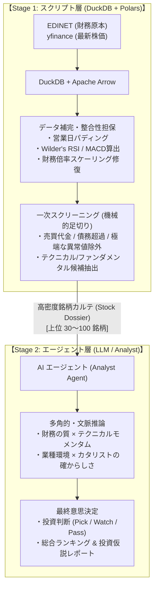

# デザインドキュメント: エージェント協調型 株式評価パイプライン
**作成日**: 2026-09-19  
**ステータス**: 設計深化完了 (Deepened / Ready for Detail)  
**対象コンポーネント**: `stock-analyzer-core` (Data Pipeline & Agent Layer)

---

## 1. 背景と課題意識

### 1.1 従来のアーキテクチャ（ルールベース完結型）
本プロジェクト発足時、AI エージェント技術はまだ発展途上であり、株式のスクリーニングから順位付けまでの全工程を Python スクリプト内の数式・決定論的ルール（`ScoringEngine`, `PolarsEngine`）で完結させる設計を採用していた。

### 1.2 直面した構造的ボトルネック
1. **演算グラフの過剰な複雑化**:
   多岐にわたる加点・減点、業種別ボーナス、理論最大値による正規化を Polars Expression で表現しようとした結果、式のネストが深くなり、Polars オプティマイザのハングアップを誘発した。
2. **硬直的なルールによる定性評価の欠落**:
   「PER < 15 で +10点」といった静的ルールでは、企業のビジネスモデルの変革、有価証券報告書の定性テキスト（リスク情報・受注高）、業界全体のモメンタムを考慮できず、投資判断としての深さに限界があった。
3. **LLM/エージェント技術の急速な進化**:
   推論能力・文脈把握力に優れたエージェントモデル（Gemini 等）が一般的となった現在、評価ロジックを無理にスクリプトで数式化し続ける必然性が失われた。

---

## 2. 設計思想と基本方針

> **「スクリプトは正確なファクトの整備と一次足切りに徹し、知的な解釈・総合評価・最終順位付けはエージェントが行う」**



---

## 3. 責務の明確な分離（Separation of Concerns）

| 領域 | 担当 | 具体的な責務 | 保証すべき不変条件 |
| :--- | :--- | :--- | :--- |
| **データ取得・補完** | **スクリプト**<br/>(DuckDB / Polars) | ・EDINET/yfinance からの Turbo 取得<br/>・休場日・取引停止日の営業日パディング<br/>・Wilder法による正確な RSI, MACD, 移動平均算出<br/>・自己資本比率・流動比率の表記ゆれ補正 | ・数値の計算誤差 0.0000%<br/>・4,400銘柄をミリ秒〜数分で捌く Zero-Copy 処理<br/>・エージェントに渡す前の確実な欠損補完 |
| **一次スクリーニング** | **スクリプト**<br/>(Polars Filter) | ・流動性不足（売買代金極小銘柄）の機械的排除<br/>・債務超過・上場廃止懸念銘柄のフィルタリング<br/>・候補銘柄（30〜100件）の抽出 | ・エージェントのトークン消費と処理時間の最適化 |
| **統合評価・順位付け** | **エージェント**<br/>(AI Agent) | ・補完された財務 × チャートの多角推論<br/>・カタリスト（好材料）とダウンサイドリスクの吟味<br/>・最終スコアリング、順位決定、推奨理由の執筆 | ・提示されたファクト数値に基づく論理的整合性<br/>・ハルシネーション（数値の勝手な捏造）の抑止 |

---

## 4. 3つの代替案の比較検討（ADR）

| 評価項目 | **案A: 二段階ファンネル型協調（採用）** | **案B: 完全オンデマンド型 (Tool Use)** | **案C: ハイブリッド合算型** |
| :--- | :--- | :--- | :--- |
| **アーキテクチャ** | スクリプトで一次足切り → エージェントで深層評価 | エージェントが自律的に DB を都度クエリ | スクリプトの quant_score に定性点を加算 |
| **計算の安定性** | ◎ スクリプトの複雑式を全廃でき極めて安定 | ◯ エージェントのクエリ生成精度に依存 | △ ハングリスクのある複雑式が残る |
| **速度・APIコスト** | ◎ 50〜100件に絞るため最速・低コスト | △ クエリ反復によりトークン・時間増大 | ◯ コストは案Aと同等 |
| **柔軟性・知性** | ◎ エージェントの推論力を最大限活用 | ◎ 自由度は最大だが毎日の定常運用に不向き | △ スクリプトの点数付けに縛られる |
| **保守性** | ◎ 責務境界が極めて明確 | ◯ プロンプト保守に集中 | ✕ 両方のロジック保守が二重化 |

### 採用・棄却の理由
- **案Aを採用**: 日次のバッチスキャン（定常運用）において「速さ・安定性・低コスト・深い推論」のバランスが最も優れているため。
- **案Bを棄却**: 毎朝の自動スキャンにおいて、プロンプトの揺らぎで意図しないクエリが走るリスクがあるため（将来の対話型分析ツールとして別途検討）。
- **案Cを棄却**: スクリプト側に複雑なスコアリング数式が残り続け、本質的な課題（オプティマイザ負荷や保守性の悪さ）が解決しないため。

---

## 5. データインターフェース（Contract）設計

### 5.1 スクリプト → エージェント: `StockDossier` (高密度銘柄カルテ)
```json
{
  "code": "7203",
  "name": "トヨタ自動車",
  "sector": "輸送用機器",
  "market": "Prime",
  "fundamentals": {
    "market_cap": 350000.0,
    "per": 10.5,
    "pbr": 1.1,
    "roe": 14.2,
    "dividend_yield": 2.8,
    "equity_ratio": 55.4,
    "operating_margin": 10.2,
    "net_profit_growth": 15.3
  },
  "technicals": {
    "price": 2850.0,
    "rsi_14": 28.5,
    "macd_status": "Golden Cross Near",
    "ma25_divergence": -4.8,
    "volume_ratio": 2.1,
    "trend_signal": 3
  },
  "trigger_reasons": [
    "RSI売られすぎ圏 (28.5)",
    "出来高急増 (2.1倍)",
    "好財務 (ROE 14.2%, 自己資本比率 55.4%)"
  ]
}
```

### 5.2 エージェント → 最終出力: `InvestmentVerdict` (投資判断結果)
```json
{
  "rank": 1,
  "code": "7203",
  "verdict": "STRONG_BUY",
  "agent_score": 92.0,
  "strategy_match": "Value Rebound (バリュー反発)",
  "investment_thesis": "良好な営業利益率と高ROEを維持しながら、RSI 28台まで売られており割安感が際立つ。出来高の急増は底打ち反転の兆候を示唆。",
  "risk_factors": [
    "為替変動リスク（円高局面での利益圧迫）",
    "サプライチェーン混乱による一時的納車遅延"
  ],
  "time_horizon": "Swing (2〜6週間)"
}
```

---

## 6. 技術的負債の管理 (Debt Registrar)

今回の設計方針転換に伴い、以下の既存コンポーネントを段階的にスリム化・非推奨化（Deprecate）する：
1. **`PolarsEngine` の過剰なボーナス加算式**:
   複雑な累積加算や理論最大値計算を廃止し、単純な指標計算＋一次スクリーニングフィルターへとスリム化。
2. **`src/calc/strategies/generic.py`**:
   旧来の 600行を超える Pandas ルールベースコードを「一次足切りルール（閾値判定）」のみに絞り、余剰な重み付け演算を整理。

---

## 7. 検証プロトコル

1. **データ補完の検証 (Script)**:
   - 欠損株価が営業日カレンダーで確実に埋まり、RSI / MACD が正しく計算されること（テストスイート既存 61 件の維持）。
2. **一次フィルターの検証 (Script)**:
   - 4,400 銘柄から指定件数（例: 30〜50件）のカルテが高速に出力されること。
3. **エージェント推論の検証 (Agent)**:
   - カルテを受け取ったエージェントが、数値ハルシネーションを起こさず、論理的な根拠に基づいた `InvestmentVerdict` を出力すること。
